# 014：远程机器 🖥️


在本节课中，我们将要学习如何使用SSH（Secure Shell）工具来连接和管理远程计算机。我们将涵盖从基础连接到高级功能，如密钥认证、文件传输、端口转发和会话管理，确保您能高效安全地操作远程系统。

---

## 连接到远程机器 🔌

上一节我们介绍了课程概述，本节中我们来看看如何建立基础的SSH连接。

您可能无法直接获得一台远程服务器，但可以在本地进行模拟。例如，您可以创建一个虚拟机（VM），该虚拟机会拥有自己的IP地址，然后通过SSH连接到它。默认情况下，Linux系统可能没有安装SSH服务器，您需要手动安装并启动一个名为`sshd`的守护进程，它会在22号端口监听连接请求。

连接时，您需要知道目标机器的IP地址。对于本地虚拟机，您可以使用`localhost`或特定的本地IP。连接命令的基本格式是：
```bash
ssh username@hostname
```
例如，连接到本地虚拟机：
```bash
ssh user@localhost
```
系统会提示您输入密码进行身份验证。成功登录后，您将进入一个完全不同的命令行环境，即远程机器的终端。

---

## 执行远程命令 📟

SSH的功能远不止打开一个交互式终端。很多时候，您可能只关心某个命令的输出结果。

您可以直接在SSH命令后指定要运行的命令。例如，以下命令会在远程机器上执行`ls`命令，并将结果返回到您的本地终端：
```bash
ssh user@hostname ls
```
这意味着SSH可以无缝集成到脚本或管道命令中。例如，您可以先在本地列出文件，然后通过管道将列表发送到远程机器进行处理：
```bash
ls | ssh user@hostname grep ".txt"
```
同样，您也可以将远程命令的输出通过管道传递给本地命令：
```bash
ssh user@hostname ls | head -5
```

---

## SSH密钥认证 🔑

每次连接都输入密码非常繁琐。现代程序通过使用SSH密钥对来解决这个问题。

如果您使用过GitHub，可能已经配置过SSH密钥。密钥对存储在用户主目录下的隐藏文件夹`.ssh`中。为了演示，我们先移除现有密钥（如果您已配置过）。通常，如果您从未设置过，可能只有一个`known_hosts`文件，它记录了您连接过的主机信息。

以下是创建SSH密钥对的步骤：

1.  使用`ssh-keygen`命令生成密钥。您可以选择算法（如RSA）和密钥长度。
    ```bash
    ssh-keygen -t rsa -b 4096
    ```
2.  命令会提示您输入保存密钥的文件路径和一個可选的**密码短语**。为密钥设置密码短语可以增加一层安全保护，这意味着每次使用密钥时都需要解密。
3.  生成后，您会得到两个文件：`id_rsa`（私钥，必须严格保密）和`id_rsa.pub`（公钥，可以分发）。

更便捷的解决方案是使用`ssh-agent`。它就像一个保险箱，您只需在会话开始时输入一次密码短语来解锁私钥，之后`ssh-agent`会替您管理，无需重复输入。

要将公钥复制到远程服务器以实现免密登录，可以使用`ssh-copy-id`工具：
```bash
ssh-copy-id user@hostname
```
这个工具会安全地将您的公钥添加到远程服务器`~/.ssh/authorized_keys`文件中。之后，您再尝试SSH连接时，就会使用密钥进行认证。

---

## 传输文件 📂

在远程服务器上工作，经常需要上传或下载文件。

一种简单的方法是结合SSH和重定向。例如，将本地文件发送到远程服务器：
```bash
cat localfile.txt | ssh user@hostname "cat > remotefile.txt"
```
但对于大量文件，这种方法效率很低。为此，有专门的工具：

*   **SCP (Secure Copy)**：语法类似于本地`cp`命令。
    ```bash
    # 复制本地文件到远程
    scp localfile.txt user@hostname:/remote/path/
    # 从远程复制文件到本地
    scp user@hostname:/remote/path/remotefile.txt ./
    # 递归复制整个目录
    scp -r localdir/ user@hostname:/remote/path/
    ```
*   **Rsync**：这是一个更强大的工具，特别适合同步大量文件或需要增量备份的场景。它只传输发生变化的文件部分，并且支持断点续传。
    ```bash
    rsync -avz localdir/ user@hostname:/remote/path/
    ```

---

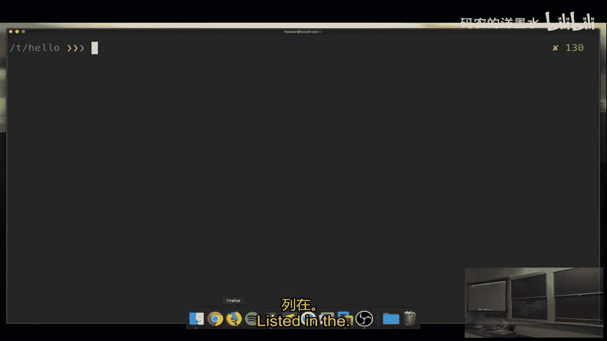

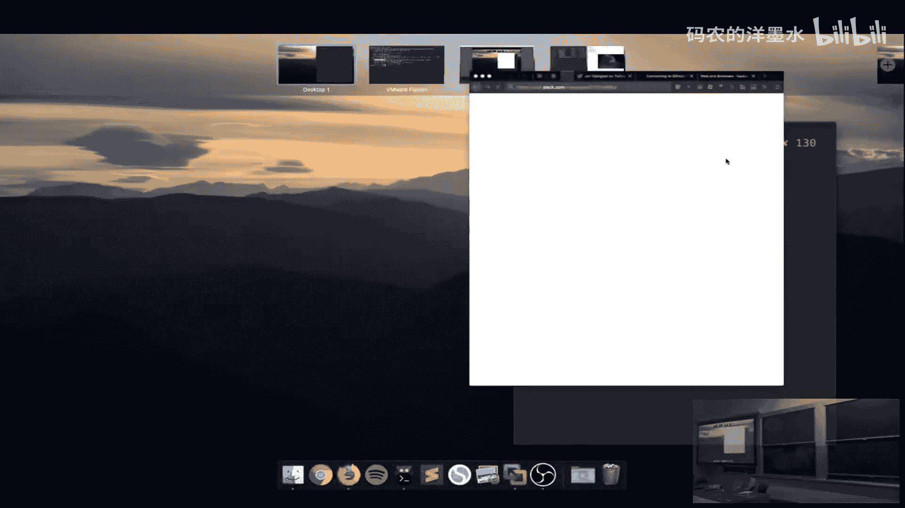


## 管理长时间运行的任务 ⏳

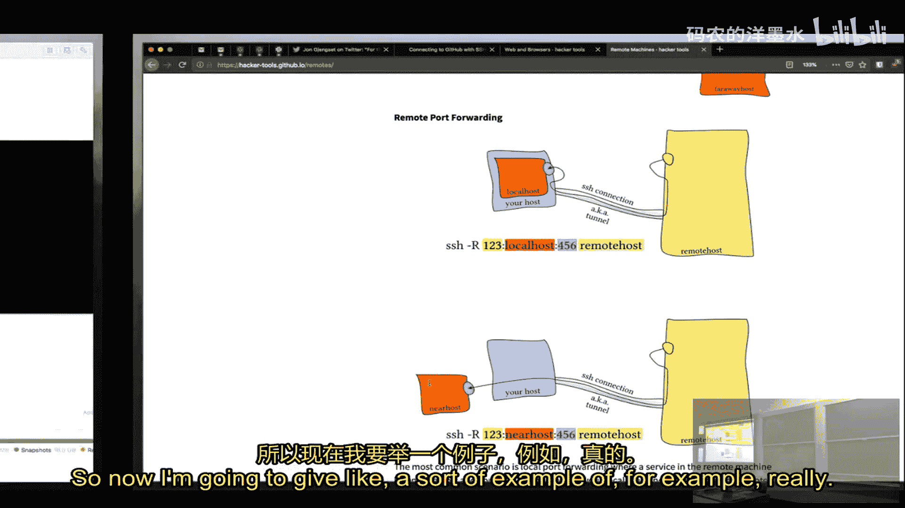

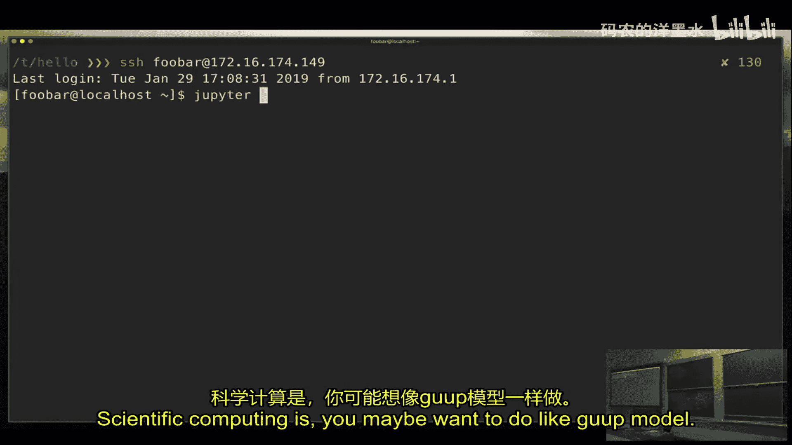

如果您在远程服务器上启动了一个长时间运行的程序（如模拟计算），然后关闭了SSH连接，该程序通常会被终止。

简单的解决方案是使用`nohup`命令，它可以让进程忽略挂断信号，并在后台运行：
```bash
nohup ./long_running_script.sh &
```
但这样您就无法再方便地查看或交互该程序的输出。

更好的方法是使用终端复用器，例如 **`screen`** 或 **`tmux`**。它们可以创建虚拟的终端会话，即使您断开SSH连接，会话中的程序也会继续运行。之后重新连接时，可以随时恢复这个会话。

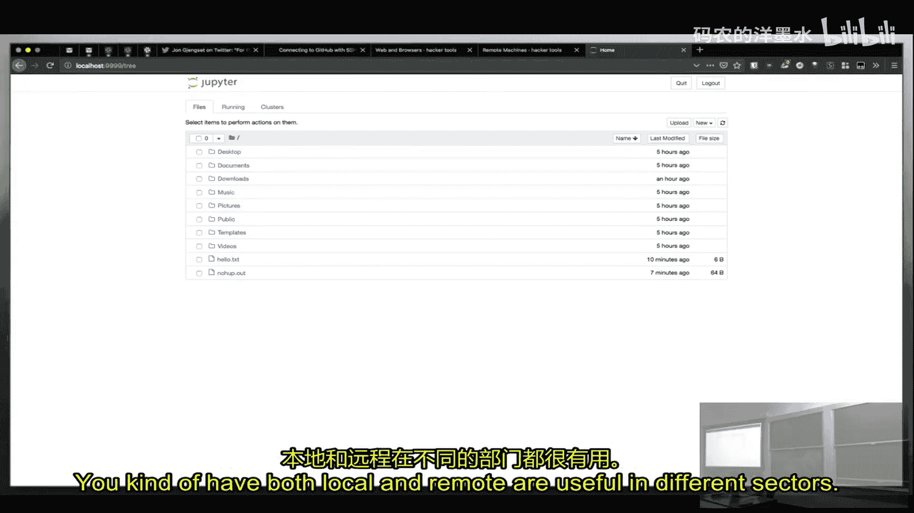

以下是`tmux`的基本用法：
```bash
# 启动一个新的tmux会话
tmux
# 在会话中运行您的程序
./my_program
# 按下 Ctrl+b，然后按 d 来分离(detach)当前会话（程序在后台继续运行）
# 重新连接后，恢复之前的会话
tmux attach
```
使用终端复用器，您还可以在单个窗口内分割多个面板，同时管理多个任务，非常高效。

---

## 端口转发 🌉

有时，远程服务器上运行的程序（如Web服务器监听8080端口）无法直接从外部互联网访问（可能由于防火墙限制）。

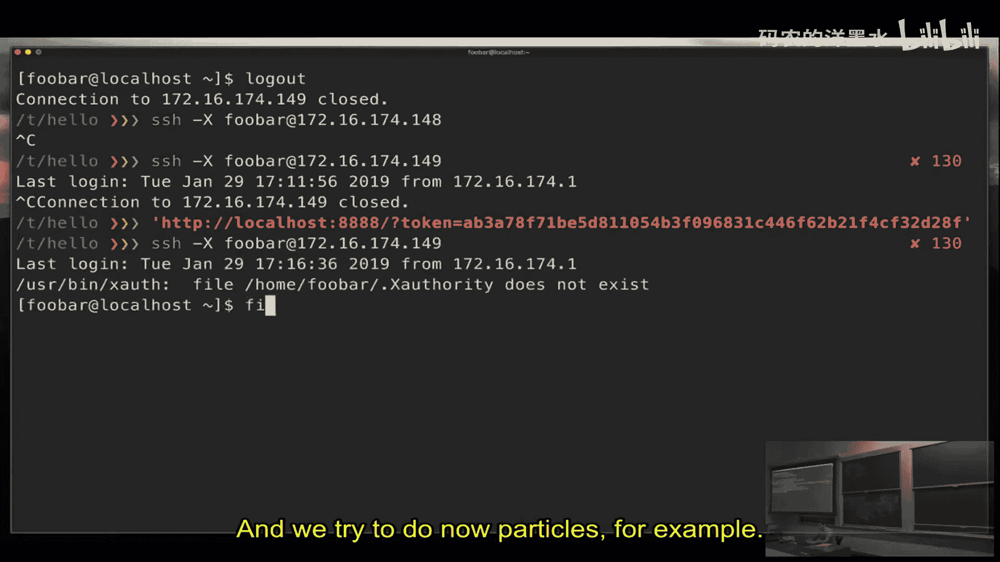

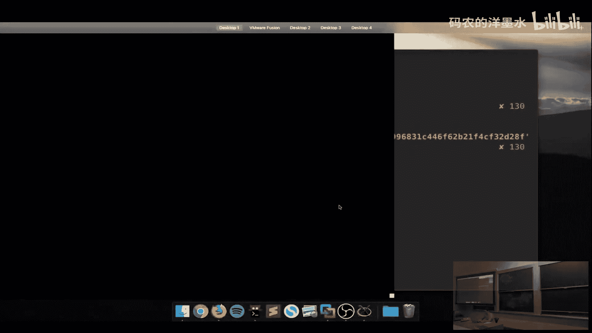

这时可以使用SSH的**端口转发**功能，它能在本地和远程机器之间建立一条安全隧道。

主要有两种类型：
1.  **本地端口转发**：将发送到本地某端口的数据，转发到远程机器的指定端口。
    ```bash
    ssh -L 9999:localhost:8080 user@hostname
    ```
    执行后，在您的本地浏览器访问 `http://localhost:9999`，流量就会通过SSH隧道转发到远程服务器的 `localhost:8080`。
2.  **远程端口转发**：将发送到远程机器某端口的数据，转发到本地机器的指定端口。这在让外部访问您本地开发的服务时很有用。
    ```bash
    ssh -R 9000:localhost:3000 user@hostname
    ```
    执行后，在远程服务器上访问 `localhost:9000`，流量会被转发到您本地机器的 `localhost:3000` 端口。

---

## 图形界面与高级功能 🖼️

对于带有图形界面的软件，可以通过SSH的X11转发功能，将远程的图形界面显示在本地。这需要远程SSH服务器支持X11转发，并在连接时加上 `-X` 或 `-Y` 参数。
```bash
ssh -X user@hostname
# 连接后，可以启动图形程序，如 Firefox
firefox
```
程序窗口将会显示在您的本地桌面上。

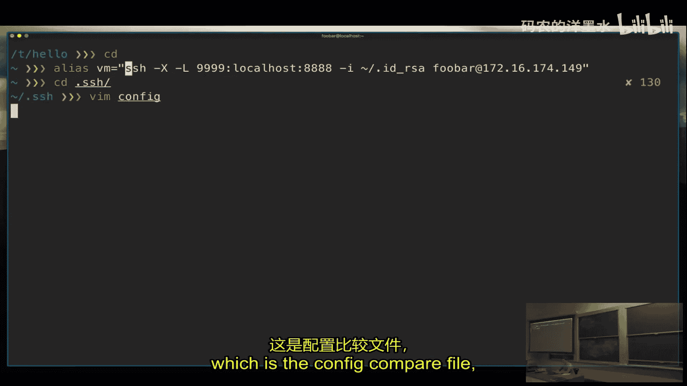

另一个强大的工具是 **`Mosh`** (Mobile Shell)。它针对移动和网络不稳定的环境做了优化，在连接断开或IP地址变更时，能更好地保持会话，体验比传统SSH更流畅。

---

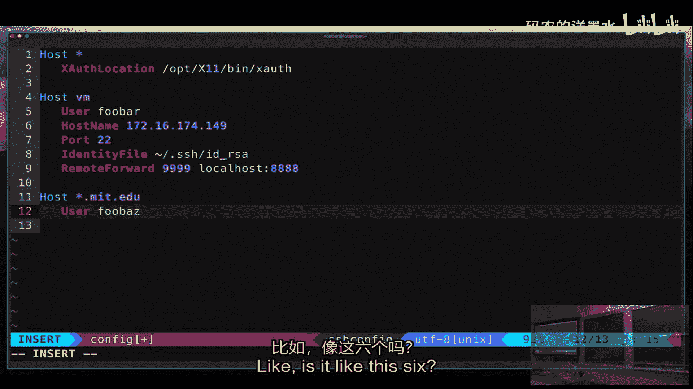

## SSH配置文件 📄

为了避免每次输入冗长的连接参数（如用户名、端口、密钥位置、端口转发规则），可以配置 `~/.ssh/config` 文件。

以下是一个配置示例：
```bash
Host myserver
    HostName server.example.com
    User myusername
    Port 2222
    IdentityFile ~/.ssh/id_rsa_custom
    LocalForward 9999 localhost:8080
    ProxyJump bastion.example.com
```
配置后，您只需输入 `ssh myserver` 即可使用所有预设选项进行连接。`ProxyJump` 指令对于需要通过跳板机（堡垒主机）访问内网机器的情况特别有用。

此外，您还可以使用 **`sshfs`** 工具将远程目录挂载到本地文件系统，像操作本地文件夹一样操作远程文件：
```bash
sshfs user@hostname:/remote/path /local/mountpoint
```

---

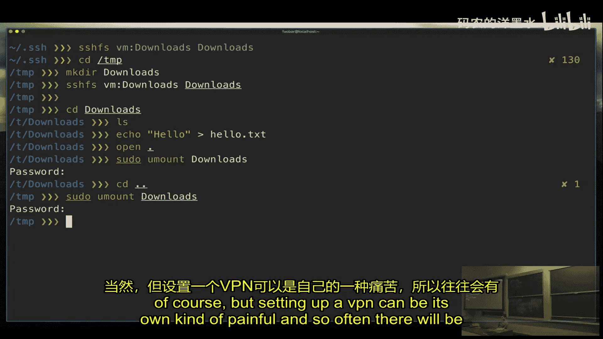

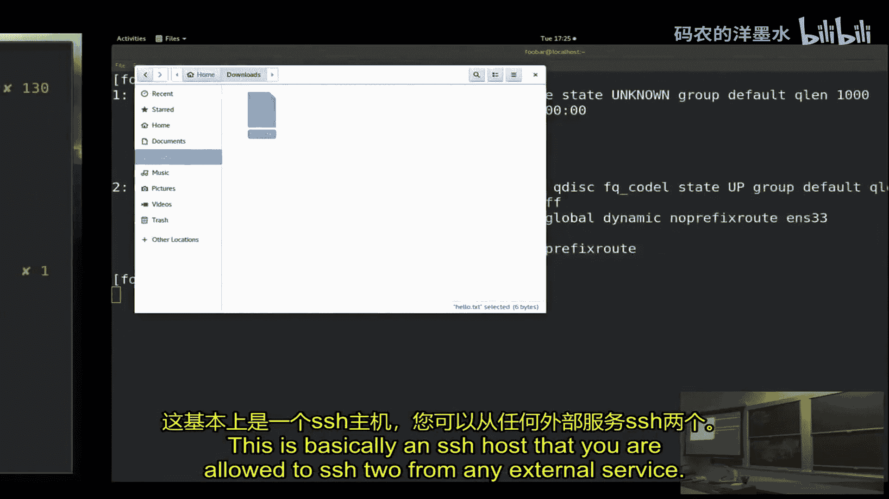

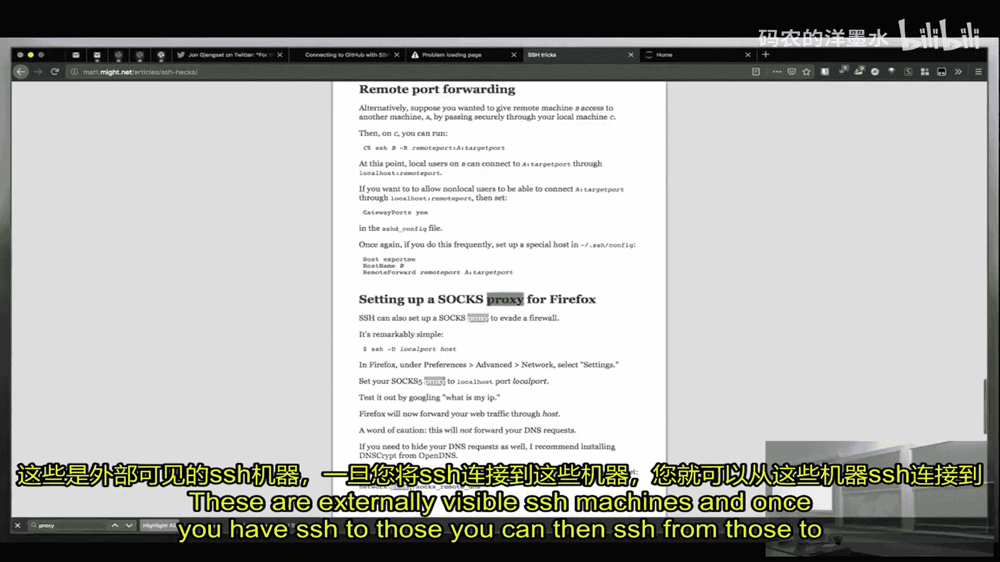

## 总结 📚

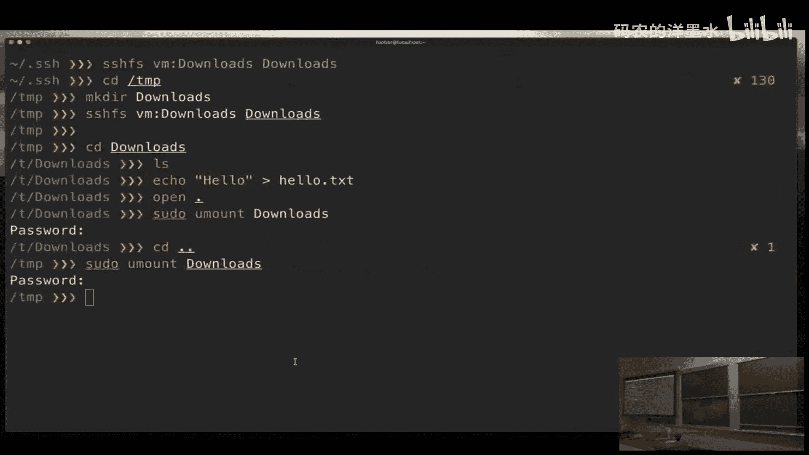

本节课中我们一起学习了SSH这一强大的远程管理工具的核心用法。我们从基本的连接和命令执行开始，逐步深入到密钥认证、安全的文件传输（SCP/rsync）、管理持久会话（tmux/screen）、通过端口转发访问受限服务，以及利用配置文件简化操作。掌握这些技能，将使您能够灵活、安全、高效地在任何远程机器上开展工作。