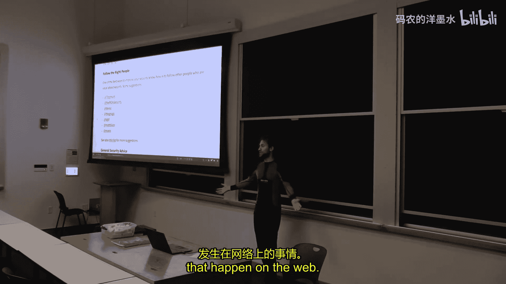

# 016：安全与隐私 🔐

在本节课中，我们将探讨计算机安全与隐私的现状。我的目标是让大家至少能意识到自己在安全和隐私方面的“足迹”。世界充满风险，但通过了解威胁模型并采取相应措施，我们可以在便利性与安全性之间找到平衡。本节课将涵盖从身份验证到安全通信、文件加密、备份以及安全浏览等一系列核心主题。

---

## 身份验证 🔑

上一节我们概述了安全与隐私的基本概念，本节中我们来看看身份验证，这是保护账户安全的第一步。

### 密码管理器

你应该使用密码管理器。你不应该自己编造密码，也不应该试图记住密码，更不应该把密码写下来。

以下是推荐的密码管理器：
*   **1Password**：易于在多设备间同步和使用。
*   **pass**：Linux 标准密码管理器，简单直接，使用 GPG 加密文件。

你应该使用这些应用为所有你关心的网站生成密码。如果你目前还没有使用密码管理器，今天就应该去更改所有重要服务的密码。

### 双因素认证 (2FA)

双因素认证能极大提升安全性。其核心思想是：除了你知道的东西（密码），还需要你拥有的东西（如手机或安全密钥）。

常见的 2FA 方案包括：
*   **短信验证码 (SMS)**：可用，但安全性很差，容易受到钓鱼攻击和 SIM 卡交换攻击。
*   **基于应用的验证器 (如 Google Authenticator, Duo)**：比短信好，但仍可能受到钓鱼攻击。
*   **U2F / FIDO 安全密钥**：这是目前最佳实践。它是一个物理设备（如 YubiKey），通过加密握手验证网站身份，能有效防御钓鱼攻击。公式可简化为：`安全登录 = 密码 (你知道的) + 安全密钥 (你拥有的)`。

当你启用双因素认证时，网站通常会提供一些恢复代码。这些代码应该被妥善保管（例如打印出来放在安全的地方），以防你丢失了第二因素设备。

---

## 私人通信 📡

在讨论了身份验证之后，我们来看看如何保护通信内容的安全。

对于私人通信，目前的最佳选择是 **Signal**。它的协议设计精良，也用于 WhatsApp 的一对一聊天。**Wire** 也是一个不错的选择。

应避免使用 **Telegram**，因为它在加密方面的记录不佳。

对于电子邮件，加密是可能的（例如使用 GPG），但设置复杂，且存在密钥分发、不具备前向保密性等问题。因此，对于敏感内容，最好避免使用电子邮件，转而使用 Signal 或 Wire。

不建议在桌面电脑上安装这些通信应用的客户端，因为笔记本电脑比手机更容易被攻破，这会扩大你的受攻击面。

---

## 文件安全 💾

保护通信安全后，我们还需要保护存储在设备上的文件。

文件安全非常困难，威胁模型至关重要。如果你只是想防御离线攻击（例如电脑关机时被偷），启用全盘加密（如 Linux 的 LUKS，Windows 的 BitLocker，macOS 的 FileVault）就足够了。

但如果攻击发生在电脑开机时（在线攻击），全盘加密就无效了。此时，你需要文件级加密。

有两种主要方法：
1.  **加密卷**：创建一个大的加密文件，使用时将其作为目录挂载。工具包括 `ecryptfs` 或 `EncFS`。代码示例：`encfs ~/.secure ~/secure_mount`。
2.  **单独加密文件**：使用如 `GPG` 等工具对单个文件进行加密。可以使用对称加密（`gpg -c file.txt`）或非对称加密。

### 可信否认性

在某些极端情况下（如过海关），你甚至希望隐藏加密文件的存在，这就是“可信否认性”。它试图通过隐写术等技术将数据隐藏在其他文件中。工具如 **VeraCrypt**（TrueCrypt 的继任者）提供了此功能，但它性能较低，数据更易丢失，且实际效果存在争议。

---

## 加密备份 ☁️

文件需要保护，备份同样需要。加密备份至关重要。

不要尝试自己组合 `tar`、`rsync` 和 `GPG` 来制作加密备份方案。推荐使用专门的服务，如 **Tarsnap**。它经过精心设计，支持加密增量备份，且密码学上是安全的。

备份时还需考虑：如果攻击者控制了你的源机器，他能否删除所有备份？理想的备份系统应提供“仅追加”权限，使攻击者只能添加新备份，无法删除旧备份。Tarsnap 对此有解决方案。

---

## 网络安全 🌐

现在让我们把视线从本地设备扩展到整个网络。互联网本身就是一个危险的环境。

### 公共 Wi-Fi

公共 Wi-Fi 网络非常危险。设备会广播曾连接过的网络名称并自动重连，攻击者可以利用“Wi-Fi 菠萝”等设备伪装成这些网络，诱使你的设备连接，从而监听所有流量。

安全建议：
*   连接公共 Wi-Fi 后，记得从设备的“已知网络”列表中删除它。
*   在不信任的网络上，考虑使用 **VPN**。但请注意，使用 VPN 只是将信任从网络提供商转移到了 VPN 提供商。免费 VPN 通常更不可信。
*   如果你技术过硬，可以在云服务器上搭建自己的 VPN。推荐使用 **WireGuard**，它配置简单，采用现代加密原语。

### 安全配置

在配置服务器或客户端软件（如 SSH）时，应使用安全的密码套件和密钥交换算法。网站 **Cipherli.st** 提供了各种软件的推荐安全配置。

对于注重隐私的用户，网站 **Privacy Tools** 列出了推荐的浏览器扩展、配置和工具。

---

## 网页浏览安全 🕵️♂️

最后，我们进入最复杂的环节：网页浏览。浏览器是一个复杂的“操作系统”，运行着来自任意网站的代码。

### 浏览器扩展

以下扩展能显著提升浏览安全：
*   **HTTPS Everywhere**：强制网站使用 HTTPS（TLS/SSL）连接。这主要加密了你与服务器之间的流量，防止窃听。
*   **uBlock Origin**：一个广谱内容拦截器。除了拦截广告，它还能阻止第三方脚本、框架等，大幅减少被攻击的风险。你可以启用“中等模式”或“困难模式”来获得更强保护，但这可能导致部分网站功能异常，需要手动调整。
*   **容器标签页 (Firefox) / 多用户配置文件 (Chrome)**：将不同用途的浏览活动（如银行、工作、社交）隔离在不同的容器或配置文件中。这能防止一个网站上的恶意脚本窃取你在另一个网站上的登录凭据或数据。

### TLS 与证书

HTTPS 的核心是 TLS 协议。它不仅能加密流量，还能通过**证书**验证服务器身份。浏览器内置了一个受信任的**证书颁发机构 (CA)** 列表。如果服务器提供的证书由这些 CA 签发，浏览器就认为连接是安全的。

攻击者可能尝试进行“降级攻击”或使用无效证书。极端偏执的做法是：清空浏览器信任的 CA 列表，然后只手动添加你访问网站所需的少数几个 CA。这能极大限制可对你发起的证书攻击类型。

### Tor 浏览器

**Tor** 通过多层路由隐藏你的 IP 地址，但它并非万能。它对于防御强大的全局攻击者（如国家行为体）效果有限，且容易受到流量分析攻击。此外，浏览器指纹（如安装的字体、窗口大小等）仍可能暴露你的身份。Tor 浏览器试图掩盖这些指纹，但并非完美。因此，Tor 主要适用于隐藏你对服务器的身份，而非提供全面匿名。

---

## 总结 📝

本节课中我们一起学习了计算机安全与隐私的多个关键方面。

核心要点是：**明确你的威胁模型**。根据你担心遭受的攻击类型（如设备丢失、网络窃听、针对性攻击），来决定需要采取哪些安全措施，并接受随之而来的便利性成本。

无论如何，你都应该立即做三件事：
1.  安装并使用**密码管理器**。
2.  为所有重要账户启用**双因素认证**，并优先使用 **U2F/FIDO 安全密钥**。
3.  保持警惕，安全是一个持续的过程，需要不断学习和更新知识。

希望本课程对你有益。保持安全，保持好奇。