# 001：简介与设置


## 概述


在本节课中，我们将要学习Git和GitHub的基本概念，了解为什么版本控制对开发者至关重要，并完成Git的安装与基础配置。我们将从一个开发者的真实故事开始，逐步理解Git如何解决代码管理中的常见痛点。

## 为什么需要Git？一个开发者的故事

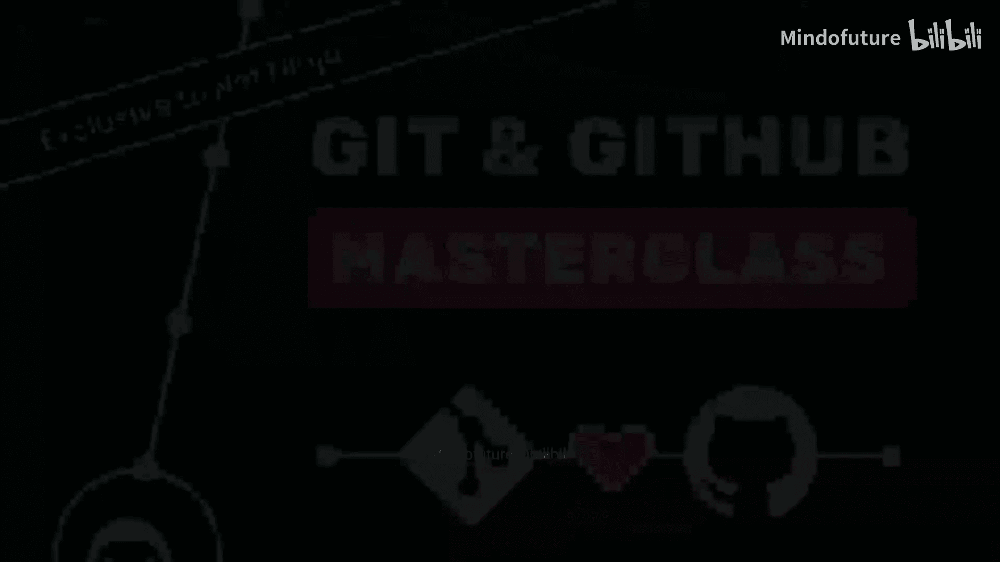

大约15年前，我刚开始作为一名自由职业的网页开发者，为咖啡馆、窗户清洁工、音乐家等小客户制作网站。当时我认为自己是一个相当称职的开发者，但我从未听说过版本控制或Git。

我遇到了一位特别挑剔的客户。他要求一轮又一轮的修改，然后更多的修改，甚至还想回到我之前做的某个版本。每次我对项目进行更改或添加新功能时，我都会在电脑上保存整个项目的一个全新副本。我的文件夹结构看起来像这样：`project_v1`, `project_v2`, `project_v3`, `project_v4`, `project_v5`……直到我认为项目完成时，我可能会有类似 `project_final` 的文件夹。但客户总是想要“最后一个”小改动，于是就有了 `project_final_2`、`project_final_final`、`project_actual_final`，以及我个人最喜欢的 `project_final_for_reals_on_wheels`。

在某个时刻，我的硬盘上可能散落着大约20个相同项目的不同版本。最糟糕的是，我永远记不清哪个版本包含了哪些更改。我需要花费大量时间打开不同的文件夹，试图找出哪个文件夹里包含了修复好的导航栏或能正常工作的联系表单。这就像在和我自己的代码玩一场扭曲的捉迷藏游戏，一点也不有趣。

几个月后，我在一个学习网站上通过视频发现了Git这个工具。我当时在想：Git到底是什么？听起来像是我会用来骂人的词。但这个视频解释说，Git实际上是一种叫做“版本控制系统”的东西。简单来说，它就像是为你代码准备的“时光机”。

有了Git，我不再需要为不同版本创建20个不同的项目文件夹，我只需要保留一个项目文件夹，然后Git会跟踪你在该文件夹中做出的每一个更改。如果你想回到三周前导航栏的样子，你只需告诉Git显示那个旧版本。你再也不需要翻找那些名字荒谬的文件夹了。

Git不仅记住了什么改变了，还准确地记住了何时改变以及你为何改变它，因为每次你保存一个新版本（称为**提交**）时，你都会写一条简短的消息来解释你做了什么。所以，你不再需要试图回忆哪个文件夹有“能正常工作的联系表单”，你只需浏览你的提交历史，找到那条写着“修复联系表单验证”的提交。

最好的部分是，你的项目文件夹保持整洁，只包含文件的当前版本。所有的历史和先前版本都由Git安全地保管，但你可以在需要时随时访问它们。这确实像是代码的时光机。

但这仅仅是开始，因为Git的功能远不止于提交。使用Git，你还可以通过一种叫做**分支**的东西，在隔离的环境中开发项目的新功能。分支，顾名思义，是从你的主代码中分叉出去的。当你对某个功能满意时，你可以将该分支**合并**回主代码库。如果你完全搞砸了这个功能，这非常有用，因为你可以直接删除这个分支，而不会影响你的主代码。

## 什么是GitHub？

还有GitHub，它就像是编码项目的“在线多人游戏模式”。你可以与同事和朋友共享一个中央代码库，然后你们可以一起在项目上工作，添加新功能，而不会互相干扰。此外，你们还可以互相审查代码修改、标记项目中的任何问题，并分配任务或Bug给对方处理。这基本上将编码变成了一种社交活动，你可以邀请世界各地的任何人加入你的项目，让他们为之做出贡献。

但这不仅仅适用于个人项目。几乎每一家严肃的开发公司或公司内的部门都在使用Git和GitHub。如果你想在这些公司中担任网页开发人员，那么你可能需要熟练使用这些工具。这不再只是一项锦上添花的技能，而是一项基础技能，就像知道如何使用浏览器一样。很多时候，公司会默认你掌握这些技能。


我认为，在AI驱动的编码助手时代，这一点将比以往任何时候都更加重要。因为如果你自己不写一些代码，并且无法确定结果，那么如果你不使用Git或某种形式的版本控制，你将陷入无尽的痛苦之中。因此，学习Git和GitHub不仅仅是为了让你自己的编码生活更轻松（尽管它确实会），更是为了能够加入任何开发团队，并在第一天就能做出实际贡献。

## 课程路线图


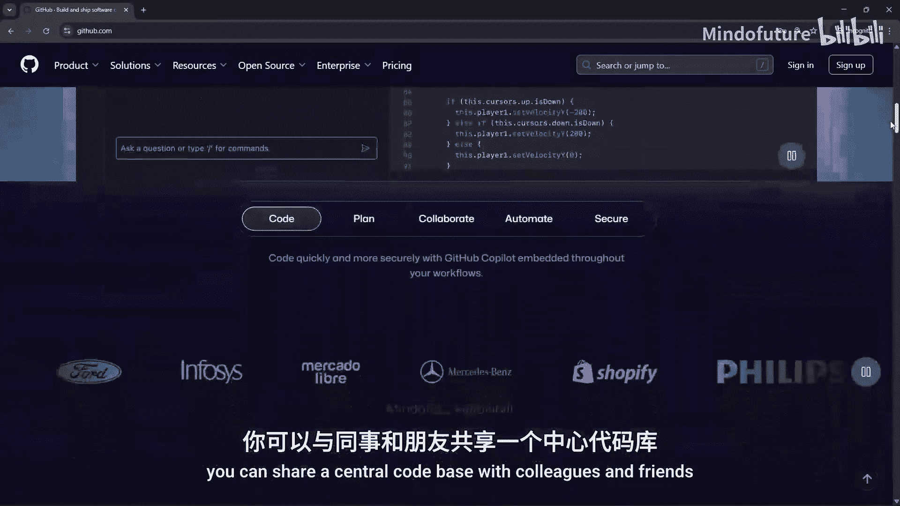

如果你和我当初一样，可能会觉得这一切听起来相当复杂，捂住耳朵继续不用Git似乎要简单得多。我不会骗你，刚开始使用Git和GitHub时，某些部分可能会有点复杂。但我们将一步一步来，我向你保证，它并不像你想象的那么可怕。一旦你掌握了它，它就会成为你的第二天性，你将无法想象没有它该如何编码。

在本课程中，我们将从绝对基础开始，逐步建立你的信心。首先，我们将在你的电脑上正确安装和设置所有内容。然后，我们将通过简单的实际例子学习Git的核心概念。我们将掌握分支和合并，这是Git真正开始大放异彩的地方。之后，我们将深入GitHub，学习如何与其他开发者协作。最后，我们将了解一些新的AI工具，它们可以让你的Git工作流程更加顺畅。

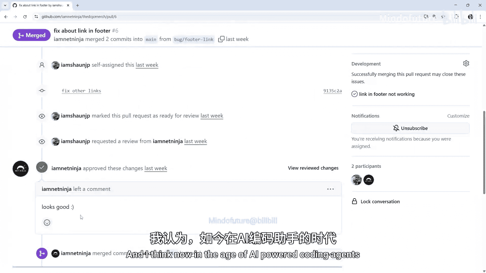

在整个过程中，我们将在我创建的几个虚拟项目上工作，这些项目我已经上传到了GitHub，稍后我会告诉你如何访问和下载它们。另外，如果你还不习惯使用命令行，请不要担心，我们将涵盖所有你需要了解的基础知识。此外，我还会向你展示一些可视化工具，它们可以在你学习时让事情变得更简单。我们的目标是让你对Git和GitHub充满信心和能力，而不是让你感到不知所措。

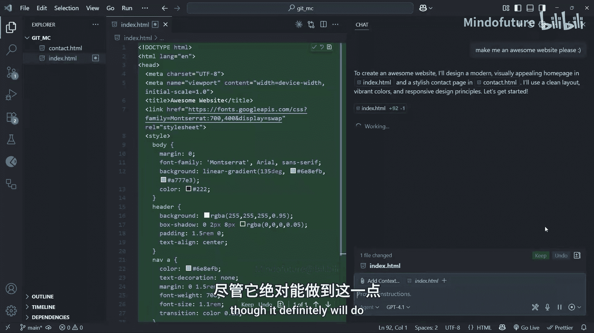

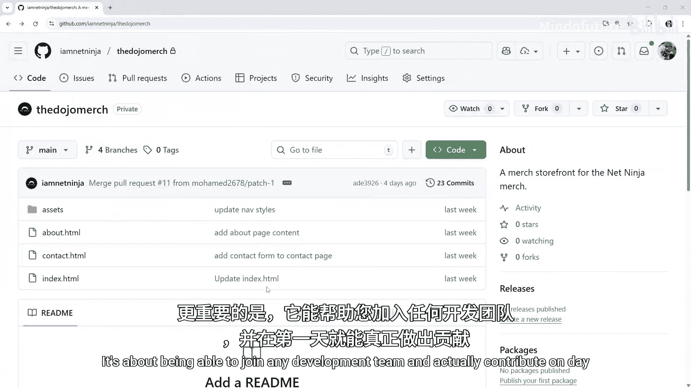

我们将在下一课中开始安装Git，并确保你拥有所有跟上课程所需的工具。

## 安装与配置Git

现在，希望你已经相信Git将如何让你的编码生活变得更好。让我们实际在电脑上安装和设置它。


首先，我们将在你使用的任何操作系统（Windows、Mac或Linux）上安装Git。然后，我们将用你的个人信息配置Git，这样它就知道是谁在进行这些提交。最后，我们将测试一切以确保其正常工作。

让我们从安装Git本身开始。安装过程会根据你使用的是Windows、Mac还是Linux而略有不同。但无论如何，你要做的第一件事是访问 `git-scm.com`，这是Git的官方网站。在主页上，你会看到一个大的下载按钮，它会自动检测你的操作系统。

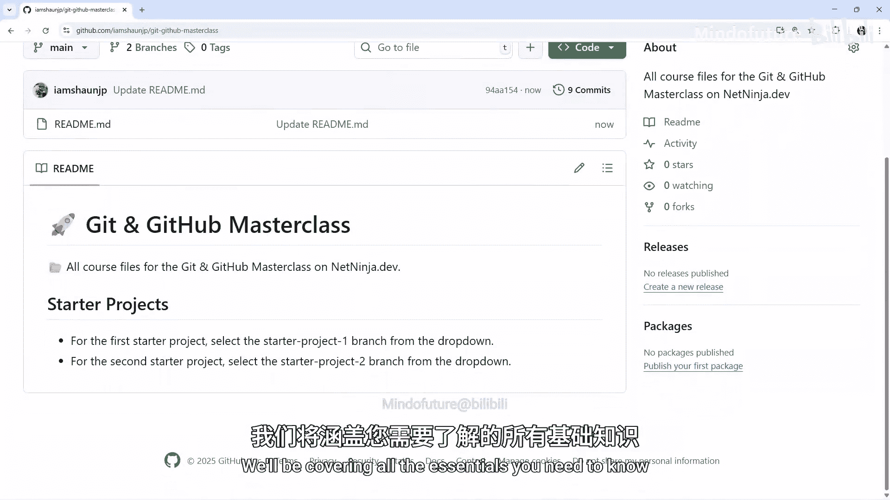


### Windows 安装步骤

如果你使用的是Windows，它会显示Windows，你将获得Windows安装程序并下载它。这实际上是一个非常好的Windows软件包，它不仅包含Git，还包含一个叫做Git Bash的东西。Bash是一个Shell，它在Windows上为你提供类似Unix的命令行体验。现在不要被这些术语困扰，我们稍后会讨论终端和Shell。

下载Windows安装程序并运行它。打开后，它会启动安装程序，我们可以点击“下一步”进入下一个屏幕。对于大多数屏幕，我们只需接受默认选项即可。

第一个选项是“添加Windows Explorer集成”。这意味着我们可以通过在桌面或任何文件夹中右键单击并选择“Open Git Bash here”或“Open Git GUI here”来使用这些工具。我们稍后会了解更多，但现在请保持选中状态，然后点击“下一步”。

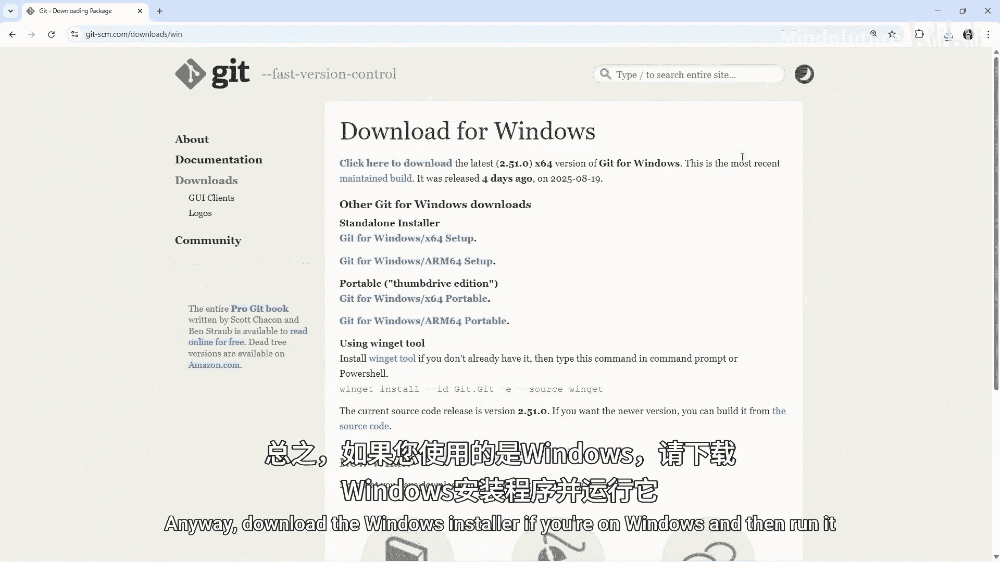

下一个屏幕我建议更改，因为默认选项通常是Vim，这对新的Git用户和新的Web开发者来说可能有点令人望而生畏。我建议将其更改为“Notepad++”（如果你有的话），或者直接选择下面的“Notepad”，或者选择“Visual Studio Code”（我用的就是这个）。然后点击“下一步”。

这里有两个关于新仓库初始分支的选项。我们还不了解分支甚至仓库是什么，所以我不想深入探讨。但几年前，我们通常会选择 `master` 作为主分支，即新仓库的初始分支。如今，大多数公司和开发者都使用 `main`。因此，我建议选择此选项并将默认分支命名为 `main`。点击“下一步”。

然后在这里，我们可以调整你的PATH环境变量。中间选中的选项是推荐的，它会向你的PATH变量添加一些Git包装器。这意味着你可以在命令提示符或Windows PowerShell等环境中使用Git。我们将使用专门的终端（Git Bash），但我建议选择此选项。然后你可以点击“下一步”。

我们将保持其余大部分为默认设置。只需参考我的选项，选择相同的，然后继续点击“下一步”。最后点击“安装”，这将在你的Windows上安装Git。

### Mac 安装步骤

如果你使用的是Mac，你有几个选择。最简单的方法可能是使用Homebrew（Mac的包管理器）来安装Git。如果你已经安装了Homebrew，只需在终端中运行 `brew install git`。如果你没有安装Homebrew，可以访问 `brew.sh` 并按照安装说明操作。或者，你也可以像Windows一样从Git网站下载安装程序。有些Mac可能预装了Git，但可能不是最新版本，你可以通过这种方式更新它。

### Linux 安装步骤

如果你使用的是Linux，你可能已经知道如何在你的系统上安装软件包了。根据你的发行版，你可以通过不同的方式安装它。关键是要确保你获得的是相对较新的版本。

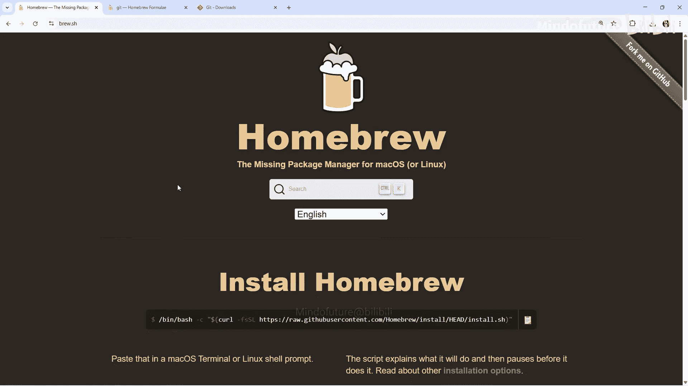

### 验证安装

你可以通过打开终端并输入 `git version` 然后按回车来查看当前安装的版本。

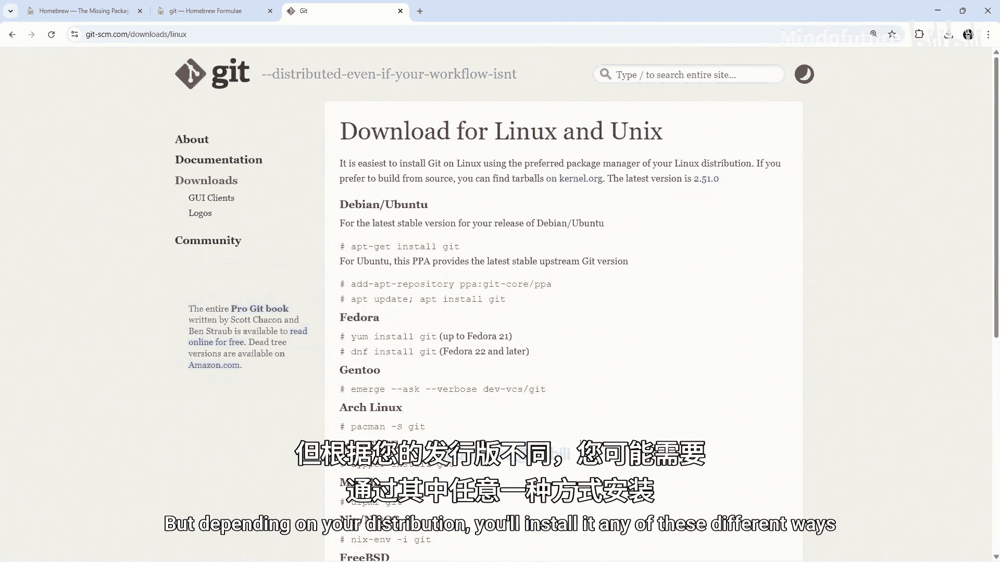

如果你在Windows上，并且安装时已将Git添加到PATH变量中，你可以使用标准的Windows终端。但我建议在本课程中使用Git Bash，它是随Git自动安装的一个Shell。Bash允许我们运行Git命令以及可以在Mac上运行的相同Unix风格命令。

要使用Git Bash，你可以在桌面或文件夹中的任何位置右键单击，然后转到“显示更多选项”并点击它，然后选择“Open Git Bash here”。这将打开一个看起来像这样的终端（外观可能略有不同，我自定义过）。现在我们可以在这里运行Git命令，因为它运行的是Bash Shell。

在Mac上，你可以直接使用常规终端，它允许你在其中运行Git和Unix命令。

现在只需输入 `git version`（小写），按回车，你应该会看到安装在电脑上的版本信息。

### 关于终端和Shell的说明

既然我们谈到了终端、Shell和其他一些术语，我想花点时间解释一下这些东西是什么，因为我知道一开始可能会让人困惑。

*   **终端** 只是我们用来输入命令的窗口。
*   **Shell** 是在终端内运行的程序，它实际读取并执行这些命令。

例如，在Windows 11上，终端叫做“Windows Terminal”，其内部运行的默认Shell是“PowerShell”。在Mac上，终端就叫“Terminal”，其内部运行的默认Shell现在是“Z shell”。刚才我打开Git Bash时，它使用的终端叫做“Mintty”，其内部的Shell是“bash”。Bash代表“Bourne Again Shell”。

我使用Bash而不是PowerShell的原因是，Bash允许我们开箱即用地运行Unix风格命令和Git命令，就像Mac上的Z Shell一样，但PowerShell不行，我们需要进行一些额外的设置才能使用所有相同的命令。所以，如果你使用带有PowerShell的Windows终端，本课程中的一些命令可能无法直接运行，这就是为什么我建议在本课程中使用Git Bash。

## 配置Git用户信息

一旦你安装了Git，接下来我们需要告诉Git你是谁。因为请记住，Git会跟踪谁进行了每次提交，所以它需要知道你的姓名和电子邮件地址。这非常重要，因为这些信息会被嵌入到你进行的每一次提交（或更改）中。如果你与其他人一起在项目上工作，当他们查看项目历史时，他们会看到这些信息，从而知道是谁进行了哪些更改。

让我们来设置一下。我们需要打开一个终端，然后输入一个Git命令。Git命令以 `git` 开头。顺便说一下，现在不要太担心我们正在写的命令，我们将在后面的教程中讨论如何使用命令行，我们也会看到很多不同的Git命令。所以现在不要太担心这个命令是如何写的，只需大致按照我的操作来设置这些不同的属性。

首先设置用户名：
```bash
git config --global user.name "你的名字"
```
例如，对我来说是：
```bash
git config --global user.name "Shaun P"
```
按回车，这将在我们的电脑上全局设置用户名。

接下来设置电子邮件地址：
```bash
git config --global user.email "你的邮箱地址"
```
例如：
```bash
git config --global user.email "shaun@example.com"
```
我们刚刚在这里运行了两个Git命令，它们都以 `git` 开头。你可能会对 `--global` 部分感到疑惑，这是一个**标志**，在这种情况下，它表示为我们电脑上创建的所有仓库全局设置这些配置。如果需要，你实际上可以基于每个项目覆盖这些设置，但对大多数人来说，全局设置就足够了。

设置完成后，你可以运行另一个命令来检查它们是否正确：
```bash
git config --global --list
```
按回车，这将显示你所有的全局Git设置，你应该能看到你刚刚添加的姓名和电子邮件地址。如果需要，你可以稍后通过使用新值再次运行相同的命令来更改它们。

## 设置Visual Studio Code

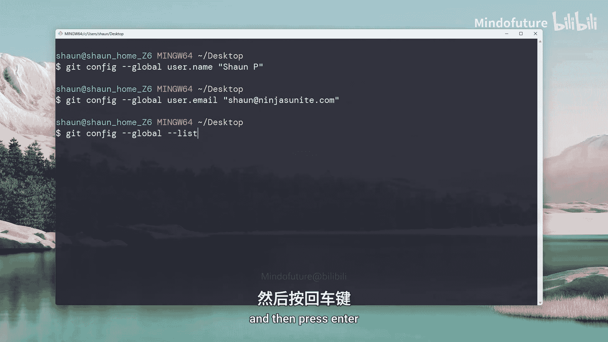


好了，朋友们。现在我们已经安装并配置好了Git。在这节课中，我们将设置Visual Studio Code作为我们的主要开发环境。

你不必非得使用VS Code，如果你更喜欢其他编辑器，可以使用任何你喜欢的。但VS Code为我们提供了Git仓库状态的直观展示，你可以看到哪些文件被更改了，更改了什么，你甚至可以不碰命令行就暂存和提交更改。我们将大量使用命令行，因为我认为学习它非常重要，但在此基础上拥有可视化布局会让一切更容易理解，尤其是对初学者而言。老实说，即使是有经验的人，当你想快速做一些更改或瞥一眼发生了什么变化时，它也非常方便。

要安装VS Code，只需访问 `code.visualstudio.com` 并点击下载按钮。它会自动检测你的操作系统，你可以下载相应的版本。

安装并打开VS Code后，你应该会看到这个欢迎标签页。从这里，你可以通过点击这里的“打开文件夹”链接来打开一个项目文件夹，或者通过转到“文件”->“打开文件夹”来做同样的事情。

我将打开 `the8bitdev` 文件夹，这是我们在本系列大部分内容中将要使用的虚拟项目。如果你想和我使用相同的项目，你可以从这个页面从GitHub下载它，我会在视频下方留下该页面的链接。这是你第一次接触GitHub，但我们唯一需要做的就是下载这个虚拟项目，这非常简单。

首先，确保你从这个下拉列表中选择“start-project”，这被称为一个分支，我们稍后会学习分支。现在只需选择“start-project-one”。其次，点击“Code”按钮，然后选择“Download ZIP”。这将在你的电脑上下载一个包含该项目的ZIP文件夹。下载后，你需要先解压该文件夹，然后就可以像我展示的那样，在VS Code中打开其中的项目。

一旦你打开了一个文件夹，我们就可以开始使用Git来跟踪项目中的更改了。我们将在下一章中做这件事，但现在，我只想向你展示几件事。

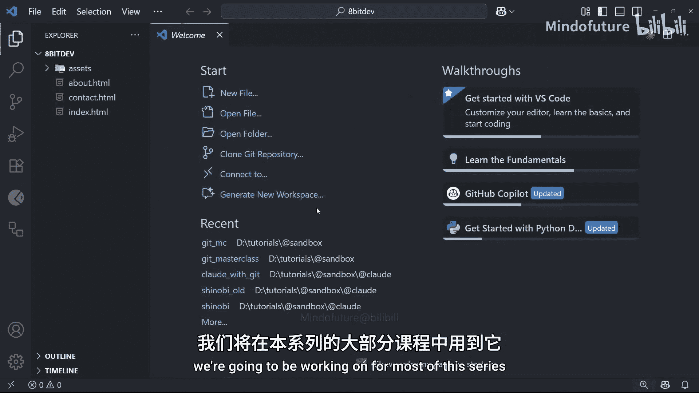

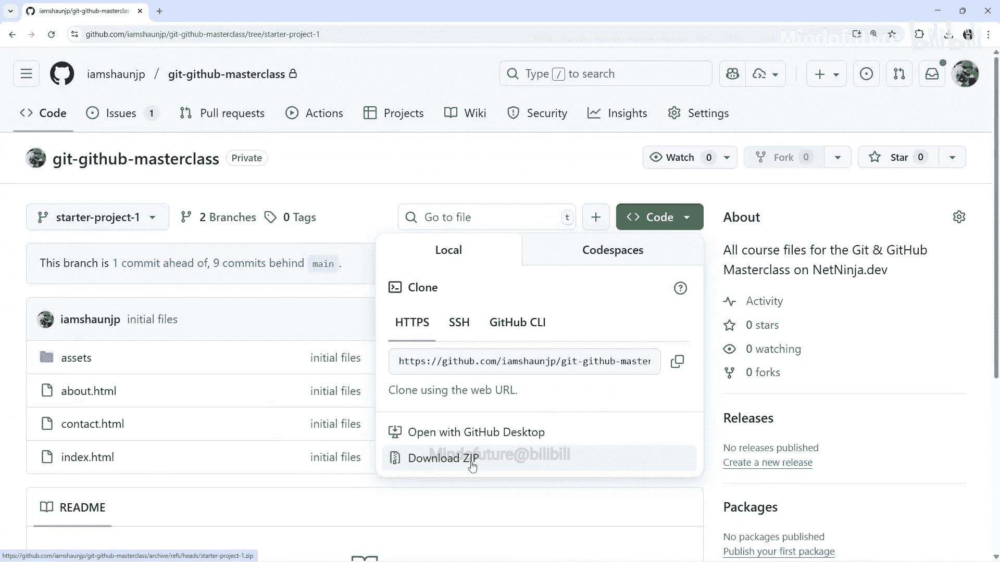

首先，VS Code带有一个集成终端，你可以通过点击顶部的“终端”->“新建终端”来打开它。选择该选项后，终端应该在底部打开，并且应该已经在你的项目目录中了。因此，稍后我们运行的任何Git命令都将从这个集成到VS Code的终端中运行。你也可以通过点击右上角的面板图标来切换这个终端面板，我认为其键盘快捷键是 `Ctrl+J`（在Mac上是 `Cmd+J`）。

其次，你应该能在左侧看到一堆图标。这个图标是VS Code内置的Git工具。如果你现在点击它，可能看不到太多内容，但稍后我们会看看这个并了解它能做什么。

最后，我们可以通过点击这里四个小方块的图标来打开扩展面板。从这里，我们可以安装任何我们想要的扩展。现在，我还不建议安装任何特定的Git扩展，但我想在本课程后面，我们会安装几个不同的东西，用一些额外的Git功能来增强VS Code。这些扩展很可能是“Git Graph”和“GitLens”。我们稍后会看到这两个。

不过，在我们用Git做任何工作之前，我想花几分钟时间让你熟悉命令行。没什么疯狂或复杂的，别担心，只是基础知识和足够让你入门的内容。

## 总结

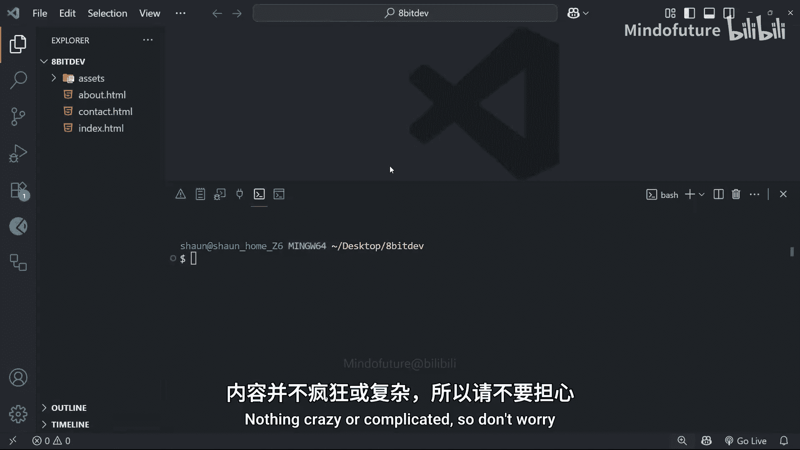

在本节课中，我们一起学习了Git和GitHub的基本概念，了解了版本控制在现代开发中的核心价值。我们从一个开发者的亲身经历出发，看到了没有版本控制时管理代码的混乱与低效，并理解了Git如何通过跟踪更改、管理分支和提交历史来解决这些问题。我们还完成了Git在不同操作系统上的安装与基础配置，设置了用户信息，并准备好了Visual Studio Code作为我们的开发环境。现在，我们已经为深入学习Git的核心操作打下了坚实的基础。