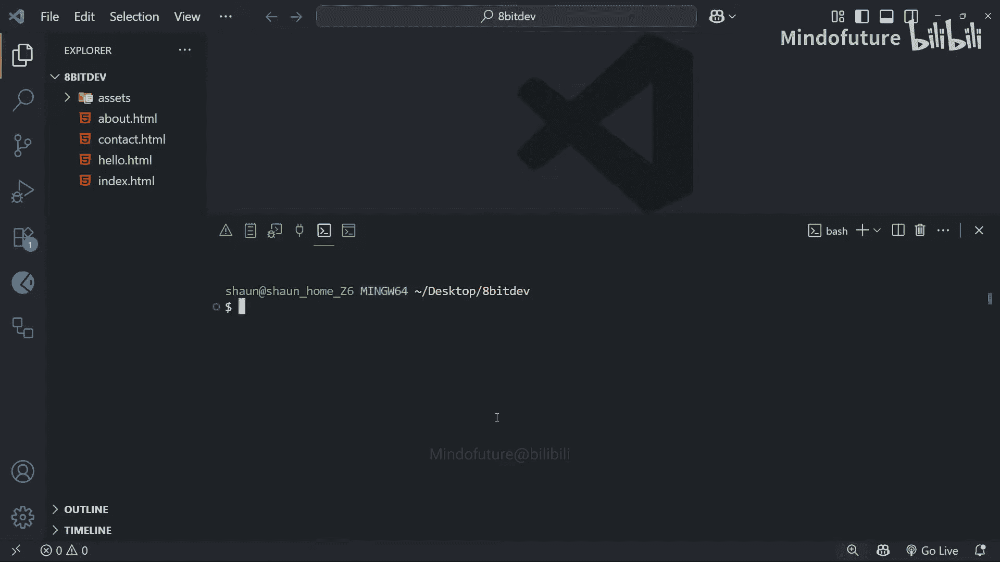

# 002：命令行基础 🖥️

在本节课中，我们将学习命令行（终端）的基础知识。这是有效使用Git的关键技能，因为Git最初就是为命令行设计的。掌握命令行不仅能帮助你更好地使用Git，也是一项通用的、可迁移的重要技能。

## 为什么需要学习命令行？🤔

上一节我们介绍了课程概览，本节中我们来看看学习Git前的一个重要工具——命令行。许多新手甚至一些有经验的开发者对命令行感到紧张，这是可以理解的。它看起来可能有些令人生畏：一个黑色的屏幕，一个闪烁的光标，等待你输入指令。

然而，命令行实际上是你的朋友。一旦掌握了基础，剩下的部分就不会那么可怕了。为了有效地使用Git，熟悉命令行是绝对必要的。虽然也有图形界面工具（GUI）可以操作Git，但要真正精通它，我建议你熟悉你的终端。此外，命令行技能是通用的，无论你在另一台电脑上还是使用不同的工具，这项技能都很有用。

## 本课目标 🎯


本课的目标不是让你一夜之间成为命令行高手，而是希望为你提供开始使用Git命令时可能需要的**基本导航和文件管理技能**。我们将从基础开始，逐步建立你的信心。如果你已经熟悉命令行，可以自由地跳到下一课。对于其他人，让我们开始吧。

## 启动与基本概念

尽管我们之后会在VS Code中使用其内置终端来操作Git和命令行，但为了减少干扰，专注于我们运行的命令，本课我将直接使用Git Bash。在本课结束时，我也会在VS Code终端中运行几个命令，向你展示其工作原理。

要打开Git Bash，只需在桌面或任何文件夹中右键单击，选择“更多选项”，然后选择“Git Bash Here”。（Mac用户使用系统自带的终端即可。）

让我们从命令行最基本的概念开始：**你在文件系统中的当前位置**。当你打开一个终端时，你总是位于计算机上的某个位置，即某个文件夹内。终端中你当前所在的位置被称为**当前工作目录**。

你可以通过输入你的第一个命令来确认当前位置：

```bash
pwd
```

这个命令代表 **print working directory**（打印工作目录）。按下回车后，你会看到当前文件夹的完整路径被打印在终端中。

## 查看目录内容

现在我们知道自己在哪了，那么如何导航到计算机上的不同文件夹呢？我们首先需要知道当前工作目录中有哪些文件夹可以进入。

要找出答案，我们可以使用另一个命令：

```bash
ls
```

这个命令代表 **list**（列表），它会列出当前目录中的所有子文件夹和文件。文件夹名称后面会有一个斜杠 `/`。

## 使用命令标志（Flags）

当我们使用像 `ls` 这样的命令时，很多时候可以添加所谓的**标志**。标志有点像可以附加到命令上的选项，用来改变命令的行为方式。

标志以单个短横线 `-` 或双短横线 `--` 开头。通常，单个短横线用于短选项（通常由单个字母表示），双短横线用于长选项（使用完整的单词）。

例如，对于 `ls` 命令，我们可以使用标志 `--all`（长选项格式），表示我们希望列出**所有**文件和文件夹，包括隐藏的文件。因为默认情况下，隐藏文件不会被列出。

```bash
ls --all
```

这个标志的短选项版本是 `-a`（单个字母），效果相同：

```bash
ls -a
```

长选项格式更易于人类阅读，但短选项输入更快，有时还可以让我们一次性组合多个选项。

另一个标志是 `-l`，它表示我们希望看到文件和文件夹的**长列表**，包含额外信息，如文件大小和最后修改时间。

```bash
ls -l
```

我可能想同时使用 `a` 和 `l` 两个标志。我可以这样做来组合它们：

```bash
ls -la
```

要查看像 `ls` 这样的命令可以使用的所有标志列表，我们可以输入命令，然后使用帮助标志 `--help` 或 `-h`。

```bash
ls --help
```

你会看到一些标志有仅使用单个字母的短版本，一些则有更长、更易读的版本。有时可能没有某个标志的长版本可用。

## 清理屏幕与导航

接下来我想展示的命令是 `clear`。输入它并回车，可以清空终端屏幕，给我们一个干净的工作区。我喜欢时不时这样做，以获得更多空白空间，感觉更清爽。

我们已经看到了如何列出当前工作目录中的内容，那么如何导航到不同的文件夹呢？

为此，我们可以使用 `cd` 命令，它代表 **change directory**（更改目录）。

假设我知道在我的当前工作目录中有一个名为 `docs` 的文件夹，我想导航进去。我可以输入：

```bash
cd docs
```

按下回车后，我就会进入那个文件夹。我可以再次输入 `pwd` 来证明这一点。

如果要导航的文件夹名称中包含空格，你需要用反斜杠 `\` 转义空格，或者将整个文件夹名用双引号括起来。

例如，如果我想进入一个名为 `PDF files` 的文件夹：

```bash
cd "PDF files"
```

## 返回上级目录

那么如何返回到父文件夹呢？例如，我想从 `PDF files` 导航回 `docs` 文件夹。

我可以输入 `cd`，然后一个空格，接着是 `..`。这两个点 `..` 表示**返回上一级目录**。

```bash
cd ..
```

如果我再次运行相同的命令，我将继续向上返回。

## 使用相对路径

如果我想从当前位置直接一步进入 `PDF files` 文件夹，该怎么做呢？

我们再次以 `cd` 开头，然后可以输入到那个文件夹的完整**相对路径**。同样，如果路径中有空格，需要转义或用双引号括起来。

```bash
cd "docs/PDF files"
```

你也可以类似地向上穿越多个父目录。例如，我想向上返回两级父目录：

```bash
cd ../..
```

这将带我回到最初的位置。

## 创建与管理文件和文件夹

现在我们知道如何移动了，让我们学习如何从命令行实际创建和管理文件和文件夹。

我将首先在当前工作目录中创建一个新目录，可以使用 `mkdir` 命令，它代表 **make directory**（创建目录）。

```bash
mkdir test
```

按下回车后，将创建文件夹。我可以输入 `ls` 来查看新的 `test` 文件夹。

现在我们可以导航进入这个文件夹：

```bash
cd test
```

在这个文件夹里，我们可能想创建一个新文件，可以使用 `touch` 命令。

```bash
touch hello.txt
```

这将为我们创建一个文件。我可以再次输入 `ls` 来查看该文件。

在Windows上，我可以通过指定要使用的程序（如记事本）后跟文件名来打开这个文件：

```bash
notepad hello.txt
```

在Mac上，你会使用 `open` 命令后跟文件名。打开后，你可以编辑、保存文件，然后关闭它。

现在，我可以使用 `rm` 命令删除一个文件，它代表 **remove**（删除）。

```bash
rm hello.txt
```

这将删除该文件。如果我们输入 `ls`，就看不到那个文件了。

让我们使用 `cd ..` 退出这个文件夹。现在，假设我们想删除那个 `test` 文件夹。

我们可以使用 `rmdir` 命令（**remove directory**）后跟文件夹名。但这**仅当文件夹为空时**才会删除它。如果文件夹不为空，这个命令不会起作用。

```bash
rmdir test
```

## 实用小技巧：命令历史

这是命令行的一些非常基础的内容，足以让我们开始了。在本课程其余部分，当我们遇到新的命令时，我都会解释。

最后再分享一个非常实用的小技巧：你可以使用**上下箭头键**循环浏览之前运行过的命令。我在使用Git时经常这样做，因为我发现自己会快速连续多次运行某些命令。

## 在VS Code中使用终端

现在你知道了这些，让我们转到VS Code，我们将在其集成终端中做最后几个示例，可能与启动项目进行交互。

要切换VS Code中的终端面板，可以点击底部面板的这个图标。这样做会打开它，并将我们置于该项目文件夹根目录的新终端会话中。

对于Windows用户，默认情况下，当我们在VS Code中打开新终端时，它会使用PowerShell。但本课程中，我们希望使用Git Bash。

我们可以通过点击加号旁边的小箭头，选择启动一个运行Bash的新终端会话来做到这一点。完成后，你将自动进入该会话。你可以使用右侧的这些图标切换回其他终端会话。这个小竖线旁边的图标显示你当前所在的活跃终端。

如果你不想每次停止VS Code并切换终端面板时都手动这样做，可以将Bash设置为默认shell。

要这样做，使用快捷键 `Ctrl+Shift+P` 打开命令面板，然后开始输入“terminal profile”，你会看到“选择默认配置文件”这个选项。点击它，然后选择Git Bash作为默认配置文件。

现在，如果我们通过点击每个终端的垃圾桶图标来关闭所有打开的终端，终端面板会关闭。然后如果我们再次切换面板，它将自动使用Bash而不是PowerShell启动。

在这个终端内部，我们可以使用之前所有相同的命令。例如，我可以使用 `pwd` 打印当前工作目录（默认应该是我们在VS Code中打开的项目目录）。我们可以使用 `ls` 命令列出所有文件和文件夹，也能看到它们。我们还可以通过输入 `touch` 后跟文件名（例如 `hello.html`）来创建一个新文件。这样做之后，我们应该能在左侧的文件树中看到这个新文件。

最后，我将输入 `clear` 然后回车来清空我的终端。

## 总结 📝

本节课中我们一起学习了命令行（终端）的基础知识。我们了解了为什么命令行对使用Git至关重要，学习了如何查看当前目录（`pwd`）、列出内容（`ls`）、使用命令标志、在目录间导航（`cd`）、创建目录和文件（`mkdir`, `touch`）、以及删除它们（`rm`, `rmdir`）。我们还介绍了如何在VS Code中设置和使用集成终端。

希望现在你对终端感觉更自在一些。正如我所说，当你开始更多地使用它时（我们将在本课程中大量使用），它会很快变得像第二天性一样自然。



接下来，我们将真正开始使用Git。