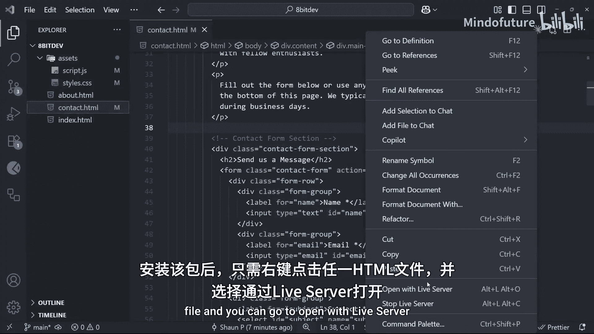
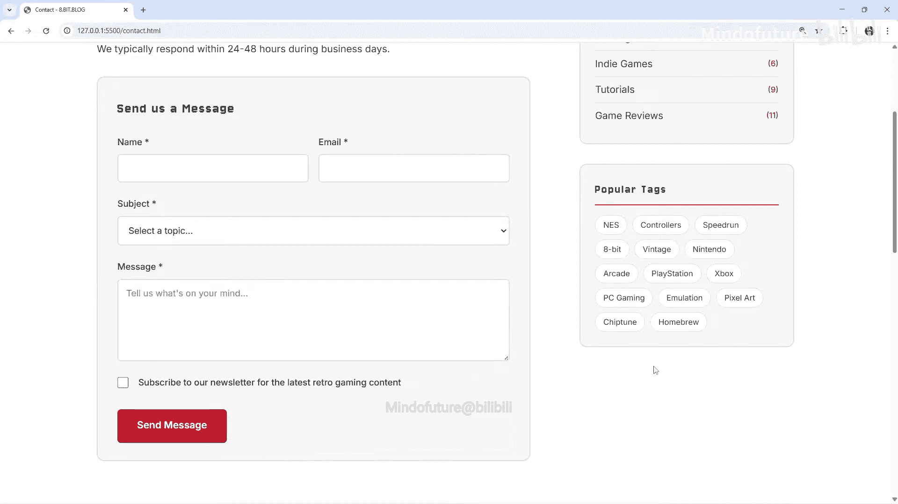
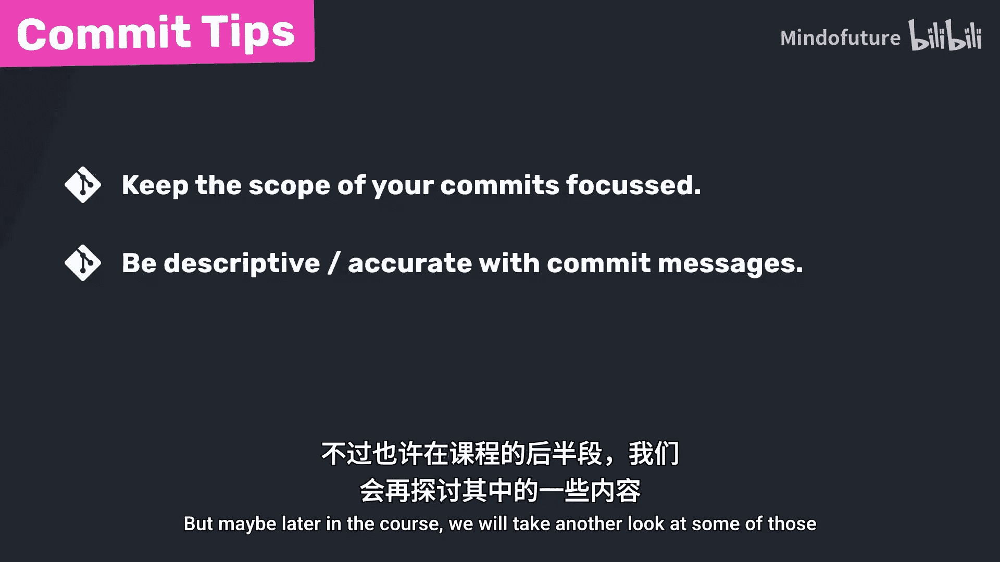

# 005：首次提交 🚀


在本节课中，我们将学习Git的核心操作之一：提交（Commit）。提交是将暂存区中的更改永久保存到项目历史记录中的关键步骤。我们将了解提交的概念、如何创建提交，以及如何利用暂存区来组织相关的更改。

## 理解提交

上一节我们介绍了如何将文件添加到暂存区。本节中，我们来看看如何将这些暂存的更改提交到仓库历史中。

提交是使用Git的核心。每次提交都代表项目在特定时间点的一个**快照**。我们可以将提交理解为项目的“保存点”。

*   初始提交代表项目的起点，即存储在历史中的第一个版本。
*   之后，当我们添加新功能或进行修改后，可以暂存这些更改并创建另一个提交，保存项目在那一刻的状态。
*   我们可以不断重复这个过程，创建多个提交。每个提交都代表项目的一个不同版本或快照。

在我们的项目中，我们已经将所有新文件添加到了暂存区。现在，我们需要创建一个提交将它们保存到历史中。

## 创建第一个提交

首先，我们使用 `git status` 命令确认所有文件都已暂存（显示为绿色）。接下来，我们使用 `git commit` 命令进行提交。这个命令会告诉Git将暂存区的所有内容保存到提交历史中，就像为项目当前状态拍一张快照。

在运行提交命令前，我们需要为提交添加一条消息。提交消息非常重要，它解释了这次快照或提交代表了什么，例如，项目做了哪些更改以及为什么更改。

以下是创建提交的命令格式：
```bash
git commit -m "提交消息"
```
其中，`-m` 标志代表“消息”（message），后面用双引号包裹具体的描述信息。

对于我们的第一个提交，可以使用类似“添加初始网站结构和页面”这样的描述性消息。运行命令后，我们就完成了在仓库中的第一次正式提交。

再次运行 `git status`，可以看到工作目录是干净的，没有未跟踪的文件，暂存区也是空的，因为所有更改都已提交到历史中。文件树中之前绿色的文件也恢复为默认颜色。

## 查看提交历史

提交完成后，我们可以使用 `git log` 命令查看项目的历史记录。目前，我们可以看到一次提交，其中包含几个信息：

*   **提交哈希值**：一长串字母和数字，是提交的唯一标识符。
*   **作者**：提交者。
*   **日期和时间**：提交创建的时间。
*   **提交消息**：我们添加的描述。

这个提交现在已存储在提交历史中，可以将其视为代表项目此刻状态的快照。



## 实践：创建更多提交

现在，让我们尝试进行一些更改并创建更多提交，以熟悉这个流程。

首先，我们在 `assets` 文件夹的 `script.js` 文件中添加一些代码，为联系页面的表单提交功能添加模态框。同时，我们也在 `styles.css` 文件中添加相应的样式，并修改 `contact.html` 文件以链接脚本并添加模态框的HTML结构。



完成这些更改后，我们在工作目录中修改了三个文件。此时，运行 `git status` 命令，会看到这三个文件以红色列在“Changes not staged for commit”标题下。

现在，我们需要遵循三步流程：
1.  在工作目录中进行更改（已完成）。
2.  将想要提交的更改添加到暂存区。
3.  创建提交，将暂存的更改提交到历史。

我们使用 `git add .` 命令将所有更改的文件添加到暂存区（`.` 代表当前目录下的所有更改）。然后，再次运行 `git status` 确认更改已暂存（显示为绿色）。

接下来，我们创建第二次提交：
```bash
git commit -m “为联系表单添加模态框”
```
运行 `git log` 命令，现在可以看到历史记录中有两次提交：初始提交和最新的模态框提交。

## 暂存区的优势：拆分提交

现在，我们通过一个例子来展示使用暂存区将多个更改拆分为独立提交的好处。

假设我们同时做了两个不相关的修改：
1.  在CSS文件中更新了导航栏的样式。
2.  在主页（`index.html`）上更新了欢迎文本。

我们希望为导航栏的样式更改创建一个单独的提交，再为主页的内容更改创建另一个提交。由于两个更改是同时在工作目录中完成的，我们该如何操作？

这正是暂存区发挥作用的地方。因为只有添加到暂存区的更改才会在我们运行提交命令时被提交。

我们可以这样做：
1.  首先，只将CSS文件的更改添加到暂存区：
    ```bash
    git add assets/styles.css
    ```
2.  运行 `git status`，确认只有样式文件被暂存，主页的更改仍未暂存。
3.  为这个更改创建提交：
    ```bash
    git commit -m “更新导航栏样式”
    ```
4.  运行 `git log`，可以看到第三次提交。
5.  现在，处理主页的更改。首先将其添加到暂存区（使用 `git add .` 或指定文件名）。
6.  最后，为这个更改创建另一个提交：
    ```bash
    git commit -m “更新主页标题”
    ```

这样，我们就利用暂存区将两个不相关的更改分别提交，保持了提交历史的清晰和逻辑性。这是暂存区的主要优势之一，允许我们一次一个地创建提交，将相关的更改分组在一起。

## 提交的最佳实践

我们已经学习了如何初始化新仓库、将文件添加到暂存区以及创建提交。这是使用Git时最基础也是必须掌握的工作流程。

在结束之前，这里有一些关于创建提交的最终建议：

**首先，注意提交的范围。** 尽量保持每次提交的更改集中且精确，确保所有更改彼此相关。例如，如果你要修复三个不同的错误，并且修复这些错误的更改涉及不同的文件，那么最好将每个修复作为单独的提交，而不是将它们全部集中在一个提交中。

**其次，确保提交信息的准确性。** 与其写“修复错误”这样模糊的信息（我们很多人都犯过这个错误），不如尝试写一些更具描述性的内容，例如“修复联系表单上阻止提交的错误”。

关于提交信息还有很多可以探讨的内容，但目前我们暂时不深入，以免偏离当前更重要的学习重点。也许在课程后面我们会再回顾其中的一些内容。

## 总结



本节课中，我们一起学习了Git提交的核心操作。我们理解了提交是项目历史的快照，掌握了使用 `git commit -m “消息”` 命令创建提交的方法，并通过实践熟悉了从更改、暂存到提交的完整流程。我们还探讨了利用暂存区拆分不相关更改、创建清晰提交历史的优势，并了解了一些提交时的最佳实践。掌握这些是有效使用Git的基础，在接下来的课程中我们将获得更多练习。