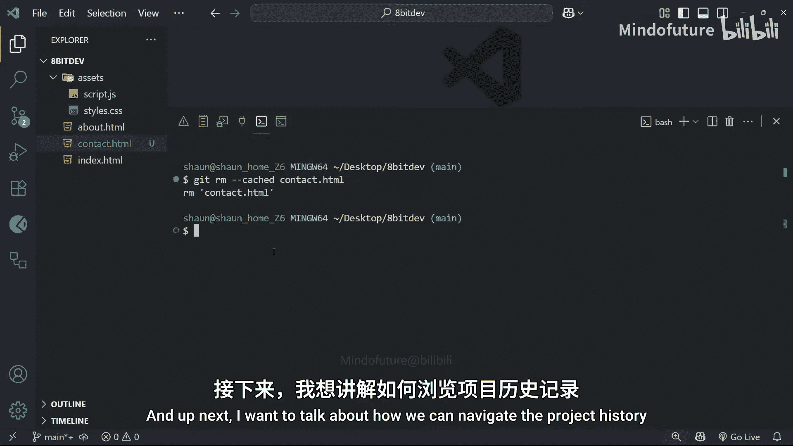

# 006：删除与取消跟踪文件

在本节课中，我们将学习如何在Git中管理文件的删除、从暂存区移除更改，以及如何让Git停止跟踪特定文件。这些操作是日常版本控制工作流中的重要组成部分。

## 删除已跟踪的文件

上一节我们学习了如何添加和提交新文件。本节中我们来看看如何删除一个已被Git跟踪的文件。

删除文件的操作流程与添加或修改文件类似。首先，你需要在文件系统中手动删除文件（例如，右键点击并删除）。然后，这个删除操作需要被Git记录。

删除文件后，运行 `git status` 命令，你会看到该文件被列为“未暂存的更改”。这意味着你需要将这个删除操作添加到暂存区。

无论文件是被删除、新增还是修改，我们使用相同的命令来暂存更改。以下是具体步骤：

1.  使用 `git add <文件名>` 或 `git add .` 来暂存删除操作。
2.  使用 `git commit -m “提交信息”` 来提交这次删除。

提交后，你可以通过 `git log` 命令查看提交历史，确认删除操作已被记录。

## 从暂存区移除更改

有时，你可能不小心将更改添加到了暂存区。以下是将其移回工作目录的方法。

首先，你需要一个已暂存的更改。对任意文件进行修改并保存，然后运行 `git add .` 将其暂存。运行 `git status` 可以确认更改已处于暂存状态。

要从暂存区移除这个更改，使用 `git restore --staged <文件名>` 命令。这个命令会将指定文件的更改从暂存区移回工作目录，使其恢复为“未暂存”状态。

运行 `git status` 可以验证更改已不再位于暂存区。

## 丢弃工作目录中的更改

如果你对文件做了一些修改，但后来决定放弃这些修改，希望将文件恢复到最近一次提交时的状态，可以使用 `git restore` 命令。

这个操作会直接覆盖工作目录中未提交的更改，且**无法撤销**，请谨慎使用。

命令格式为 `git restore <文件名>`。执行后，该文件在工作目录中的所有未暂存更改都将被丢弃，文件内容会回退到上一次提交的版本。

运行 `git status` 可以确认工作目录现在是干净的，没有待处理的更改。

## 让Git停止跟踪文件

最后，我们学习如何让Git**停止跟踪**一个文件，同时保留该文件在你的项目文件夹中。这适用于你误提交了某些文件（如配置文件、日志文件），现在希望Git忽略它们，但又不希望从磁盘上删除的情况。

实现此功能的命令是 `git rm --cached <文件名>`。其中 `--cached` 参数是关键，它告诉Git：“从版本库的跟踪列表中移除这个文件，但把它保留在我的工作目录里。”

执行此命令后，该文件在你的编辑器中可能会显示为新的未跟踪文件（颜色可能变绿）。此后，Git将不再追踪此文件的任何变化。

请注意：
*   如果后续你再次使用 `git add` 和 `git commit` 添加了这个文件，Git会重新开始跟踪它。
*   如果不加 `--cached` 参数，`git rm <文件名>` 会同时从Git跟踪列表和你的工作目录中删除该文件，效果等同于手动删除文件后执行 `git add`。

---

本节课中我们一起学习了Git中关于文件删除与管理的几个核心操作：提交文件删除、从暂存区撤销更改、丢弃工作区的修改，以及让Git停止跟踪特定文件。掌握这些命令能帮助你更灵活地管理项目版本。下一节，我们将学习如何浏览项目的提交历史。