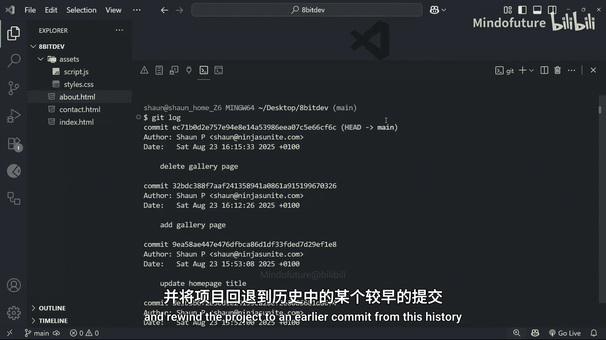

# 007：查看项目历史 📜

在本节课中，我们将学习如何查看和管理项目的提交历史。这对于回顾代码变更、追踪问题或回退到旧版本至关重要。

## 概述


上一节我们学习了如何提交更改。本节中，我们将深入了解如何查看项目的提交历史，包括查看详细变更、比较不同提交以及理解日志中的关键信息。

## 查看完整提交历史

要查看项目的完整提交历史，可以使用 `git log` 命令。该命令会按时间顺序列出所有提交，最新的提交显示在最上方。

```bash
git log
```

每个提交条目都包含以下信息：
*   一个唯一的提交哈希值（ID）。
*   提交的日期和时间。
*   提交者的信息。
*   提交时填写的提交信息。

## 查看简洁历史记录

如果你需要快速浏览历史记录，可以使用 `--oneline` 标志来获得一个简洁的视图。这个命令将每个提交压缩为一行显示。

```bash
git log --oneline
```

以下是简洁日志的特点：
*   只显示每个提交哈希值的前几个字符。
*   仅显示提交信息，不包含作者和日期。
*   这种格式更紧凑，便于快速扫描。

## 查看特定提交的详细信息

当你在历史记录中找到感兴趣的提交时，可以使用 `git show` 命令查看该提交的详细信息。你需要提供该提交的哈希值。

```bash
git show <commit-hash>
```

运行此命令后，你将看到：
*   提交的完整信息（作者、日期、提交信息）。
*   该提交引入的**差异（diff）**。

差异（diff）显示了在该次提交中具体哪些行被添加或删除：
*   以 **+** 开头的行表示被添加。
*   以 **-** 开头的行表示被删除。
*   在大多数终端主题中，新增行显示为绿色，删除行显示为红色。

**注意**：`git show` 的输出通常通过**分页器（pager）**显示。你可以按 `Enter` 键逐行查看，按 `Space` 键翻页，查看完毕后按 **`q`** 键退出。

## 查看包含统计信息的日志

另一种查看历史的方式是使用 `git log` 的 `--stat` 标志。这会显示每次提交的统计信息。

```bash
git log --stat
```

此命令提供以下额外信息：
*   在每次提交中，哪些文件被更改。
*   每个文件增加或删除了多少行代码。
*   输出同样使用分页器，操作方式与 `git show` 相同。

## 比较两个提交之间的差异

`git diff` 命令可以直接比较任意两个提交之间的差异。你需要提供两个提交的哈希值。

```bash
git diff <commit-hash-1> <commit-hash-2>
```

运行此命令将显示两个指定提交之间的所有代码差异。输出会清晰地标出哪些内容被添加或删除，帮助你理解项目在两个时间点之间的变化。

## 理解 HEAD 指针

当你运行 `git log` 时，可能会在最新的提交旁看到 `(HEAD -> main)` 的标记。

*   **HEAD** 是一个指针，它代表**你当前所在的位置**。
*   它通常指向你当前所处的分支（例如 `main` 分支）。
*   而分支本身又指向该分支上的最新提交。

简单来说，`HEAD -> main` 表示：“你当前位于 `main` 分支上，并且正在查看该分支最新的提交”。随着你在该分支上不断进行新的提交，`HEAD` 指针会随之移动到最新的提交上。

## 总结



本节课中我们一起学习了如何有效地查看 Git 项目历史。我们掌握了使用 `git log` 浏览提交列表，用 `git show` 查看详细变更，用 `git diff` 比较不同版本，并理解了 `HEAD` 指针的基本概念。这些技能是进行版本控制、代码审查和问题排查的基础。下一节课，我们将学习如何利用历史记录，将项目回退到之前的某个提交状态。