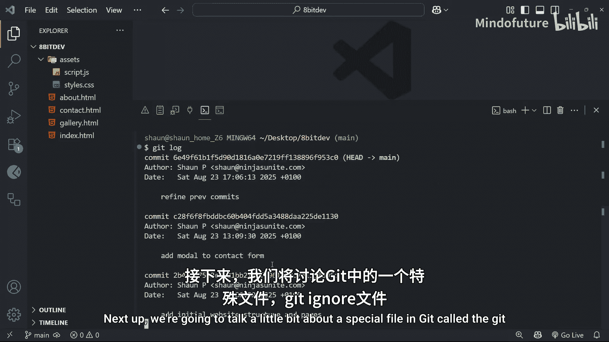

# 008：撤销更改 🔄

在本节课中，我们将学习Git中两个用于撤销更改的核心命令：`git revert` 和 `git reset`。它们允许你“回退”项目的历史，但实现方式和影响截然不同。我们将通过实例演示它们的具体用法和适用场景。


## 概述

我们已经为项目创建了一些提交历史，并学会了如何查看这些历史。现在，我们将探讨如何撤销已做出的更改。`git revert` 通过创建一个新的提交来安全地撤销某个旧提交的更改；而 `git reset` 则直接将项目状态“重置”回历史上的某个特定提交点，就像时间旅行一样。理解两者的区别对于管理项目历史至关重要。

## Git Revert：安全撤销提交

`git revert` 命令用于撤销一个已存在的提交。它的工作方式是：分析你想要撤销的那个提交所做的所有更改，然后创建一个全新的提交来反向应用这些更改（即删除原提交添加的内容，或添加原提交删除的内容）。这意味着它**不会删除历史记录**，而是通过增加一个新的提交来修正历史。

以下是使用 `git revert` 的基本步骤：

1.  首先，使用 `git log --oneline` 查看提交历史，并找到你想要撤销的提交的哈希值（hash）。
2.  执行命令 `git revert <commit-hash>`。
3.  Git会尝试自动创建反向更改。通常，它会打开一个编辑器让你为这个新的“撤销提交”编写提交信息。
4.  保存并关闭编辑器后，Git会完成新提交的创建。

运行 `git log --oneline` 再次查看，你会发现历史记录顶端多了一个新的提交，其信息通常为“Revert ‘原提交信息’”。原来的提交依然保留在历史中。

**核心概念公式**：
`git revert` = 历史记录 + 新的反向提交

**需要注意**：如果你尝试撤销一个较旧的提交，而这个提交的更改被后续的提交所依赖或修改，就可能引发**冲突（conflict）**。例如，提交A将按钮改为蓝色，提交B又将同一个按钮改为绿色。此时撤销提交A，Git无法自动决定按钮最终应该是绿色（遵循B）还是移除蓝色规则（撤销A）。我们将在后续课程中详细学习如何解决冲突。

上一节我们介绍了通过增加新提交来安全撤销更改的 `git revert`。本节中我们来看看一个更“强力”的工具——`git reset`，它可以直接将项目状态回退到过去的某个时间点。

## Git Reset：重置项目状态

`git reset` 命令用于将当前分支的指针移动到指定的提交，从而“重置”项目状态。根据使用的选项不同，它对工作目录和暂存区的影响也不同。主要有两种模式：`--hard` 和 默认模式（即 `--mixed`，通常省略）。

### 硬重置（Hard Reset）

使用 `git reset --hard <commit-hash>` 会执行一次彻底的“硬重置”。它将：
1.  移动分支指针到目标提交。
2.  重置**暂存区（Staging Area）**，使其与目标提交一致。
3.  重置**工作目录（Working Directory）**，使其与目标提交一致。

**这意味着**：目标提交之后的所有提交都会从当前分支的历史中消失，并且你工作目录中所有未提交的更改（包括已暂存和未暂存的）都将被永久丢弃，完全回到目标提交时的项目状态。

**操作非常危险**，请务必确认你真的不需要那些更改后再执行。

如果不慎执行了硬重置，还有一个安全网：**引用日志（Reflog）**。使用 `git reflog` 命令可以查看HEAD和分支引用在本地仓库中的所有移动记录。你可以找到重置前的提交哈希，然后再次执行 `git reset --hard <old-commit-hash>` 跳转回去。但请注意，Git会定期清理旧的reflog记录，所以它并非永久保险。

### 混合重置（默认，Mixed Reset）

使用 `git reset <commit-hash>`（不带 `--hard` 标志）执行的是默认的“混合重置”。它的行为是：
1.  移动分支指针到目标提交。
2.  重置**暂存区**，使其与目标提交一致。
3.  **但不会改变工作目录**。

**这意味着**：目标提交之后的所有提交也会从历史中消失，但这些提交所带来的代码更改并不会丢失。相反，它们会变成**未暂存的修改（Unstaged Changes）** 保留在你的工作目录中。

以下是使用混合重置后可能进行的操作：

*   你可以重新审查这些更改，使用 `git add` 有选择地将部分修改加入暂存区。
*   然后，你可以用新的提交信息重新提交它们，从而整理或重写项目历史。

**核心概念代码对比**：
```bash
# 硬重置：彻底回退，丢弃所有后续更改
git reset --hard a1b2c3d

# 混合重置：回退历史，但保留后续更改作为未暂存的修改
git reset a1b2c3d
```

## 总结

本节课中我们一起学习了Git中撤销更改的两种主要方法：
*   **`git revert`**：通过创建一个新的提交来安全地撤销指定提交的更改。这是**公开历史**（如推送到远程仓库后）中撤销更改的推荐方式，因为它保留了完整的历史记录。
*   **`git reset`**：将分支指针直接移动到历史中的某个提交点，用于**本地历史**的重写。根据是否使用 `--hard` 标志，它可以选择是彻底丢弃后续所有更改（`--hard`），还是将这些更改保留为未暂存的修改（默认）。



理解 `revert` 与 `reset` 的区别，以及 `reset --hard` 的风险，是掌握Git版本控制能力的关键一步。在下一节课中，我们将介绍一个特殊的文件——`.gitignore`，它可以帮助我们自动排除不需要版本控制的文件。