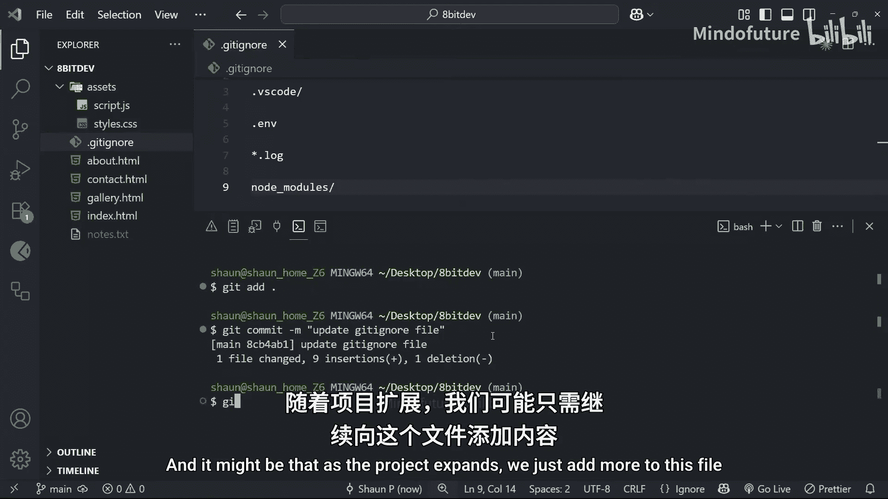
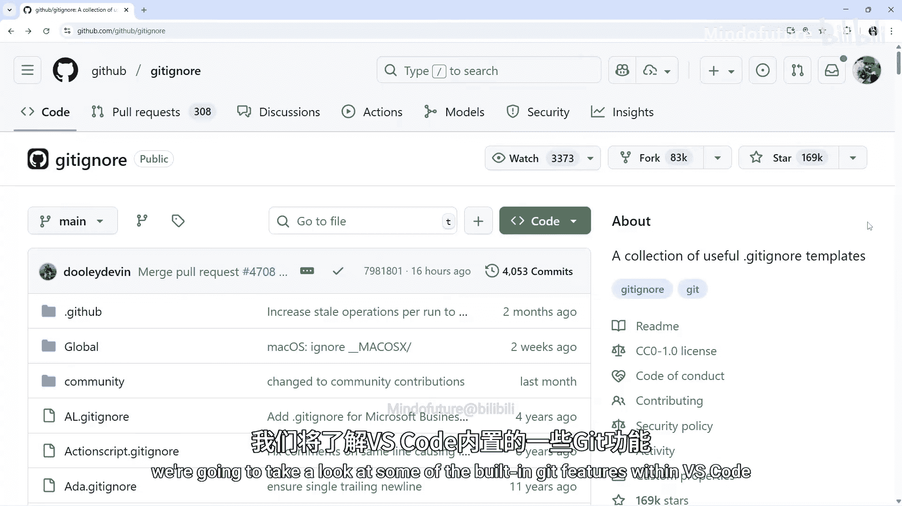

# 009：.gitignore文件 📝

在本节课中，我们将要学习一个非常重要的Git工具：`.gitignore`文件。我们将了解它的作用、如何创建它，以及如何使用它来告诉Git忽略项目中不需要跟踪的文件或文件夹。

## 概述

到目前为止，我们一直在提交更改并跟踪项目文件。但有时，我们不希望Git跟踪项目文件夹中的某些内容。这正是`.gitignore`文件发挥作用的地方。

## 什么是.gitignore文件？

想象一下，你正在一个项目上工作，并且使用了像VS Code这样的代码编辑器。VS Code会创建自己的`.vscode`文件夹来存储你的个人设置。这些文件实际上并不是你项目的一部分，它们只是VS Code自动生成的“杂物”。如果Git跟踪它们，你的提交记录中就会充满不相关的文件，这对项目中的其他协作者和你自己来说都很烦人。

对于像`node_modules`这样的文件夹也是如此。我们不希望Git跟踪此类文件夹，因为它们也只是“杂物”。

更糟糕的是，你可能会不小心提交敏感信息，例如`.env`文件中的API密钥、密码或数据库凭证。如果你将来使用GitHub等平台将此仓库发布到网上，就会暴露这些信息。

因此，有些情况下你并不希望Git跟踪某些内容。我们将把这些内容写在`.gitignore`文件中。`.gitignore`文件就是一个特殊的文件，Git可以读取它，并被告知要完全忽略哪些文件和文件夹。

## 创建并使用.gitignore文件

让我们首先在项目中添加一个名为`notes.txt`的新文件。假设这只是我为项目做的一些笔记，我并不真的希望Git跟踪这个文件，它仅供我个人使用。

目前，如果我们运行`git status`，你会看到Git检测到了这个文件，但尚未跟踪它。然而，如果我们在对项目进行更改后运行`git add .`命令，那将把所有更改和新文件（包括我们刚创建的`notes.txt`）添加到暂存区。

但正如我所说，我不希望Git跟踪那个文件。所以，让我们在项目的根目录下创建一个`.gitignore`文件，用它来告诉Git不要跟踪那个文件。请注意，文件名以点开头，不要忘记这一点。

现在，我再次运行`git status`，会看到两个新的未跟踪文件等待被暂存。然而，我将在`.gitignore`文件中添加`notes.txt`，就像这样，然后保存它。

完成之后，你会注意到该文件在文件树中不再高亮显示。而且，如果我们再次运行`git status`，可以看到它已完全从列表中移除，现在我们只看到刚刚创建的`.gitignore`文件。

接下来，我将运行`git add .`将所有更改添加到暂存区。完成后，我会再次运行`git status`以确保只添加了`.gitignore`文件，而没有添加`notes.txt`文件。

最后，我将通过运行`git commit`来为此更改创建一个提交。我们将使用`-m`标志来添加一条提交信息，例如“add .gitignore file”。

现在，我们将这个`.gitignore`文件提交到历史记录中，而该文件本身告诉Git完全忽略`notes.txt`文件。因此，现在对该文件所做的任何更改都不会被跟踪。

## 在.gitignore中添加更多规则

我们可以在`.gitignore`文件中添加许多不同的文件路径，也可以添加文件夹。

例如，假设我们想忽略整个`.vscode`文件夹（它有时由VS Code生成以存储某些设置）。这不需要提交到项目历史记录中，只是“杂物”。我们可以通过添加`.vscode/`来将该文件夹添加到`.gitignore`文件中。末尾的斜杠表示这是一个文件夹，其内部的所有内容都应被忽略。

你也可以添加`.env`到这个文件中（虽然我们实际上没有这个文件），但万一我们有，Git也不会跟踪它。

常见的你可能不想跟踪的文件还有`.log`文件，即任何以`.log`扩展名结尾的文件。我们可以通过添加`*.log`来告诉Git忽略它们。这里的星号`*`本质上是一个通配符，可以匹配任何文件名，只要它以`.log`扩展名结尾。所以，现在每个以`.log`结尾的文件都会被忽略。

你还可以添加像`node_modules`这样的包文件夹，以及其他内容。

现在我们已经添加了一些规则，让我们在项目历史中做一个提交。首先，我们通过运行`git add .`来暂存文件（我通常使用点号，因为它写起来更快）。接下来，我们通过运行`git commit -m`命令来创建一个提交，提交信息可以是“updated .gitignore file”。

现在，我们为这个项目设置了一个`.gitignore`文件。随着项目的扩展，我们可能只需要向这个文件添加更多内容。

## 使用现成的.gitignore模板

实际上，你可以在网上的个人编程网站以及GitHub本身上找到针对各种不同类型项目的`.gitignore`模板。

例如，GitHub本身就创建了大量的不同模板。你可以向下滚动，看到他们在这里创建了一个Flutter模板。点击它，你会看到该文件包含了你在进行提交时可能不想添加到项目历史记录中的所有内容。你基本上可以直接复制这个`.gitignore`文件并粘贴到你自己的项目中。

此外，当你使用某种CI工具通过像Flutter、Vue或Next这样的框架来搭建新项目时，很多时候它会自动为你生成一个预填充的`.gitignore`文件。虽然不总是如此，但有时确实如此。然后你就可以根据需要随时添加内容。

## 总结

本节课中，我们一起学习了`.gitignore`文件。我们了解了它的核心作用是**告诉Git忽略项目中特定的文件或文件夹**，从而避免将无关的“杂物”或敏感信息提交到版本历史中。我们学习了如何创建该文件，并通过添加如`notes.txt`、`.vscode/`、`*.log`等规则来配置它。最后，我们还了解到可以利用GitHub等平台提供的现成模板来快速为特定类型的项目配置`.gitignore`文件。

在下一课中，我们将看看VS Code内部一些内置的Git功能，这些功能可以让我们的Git工作流程更加顺畅。