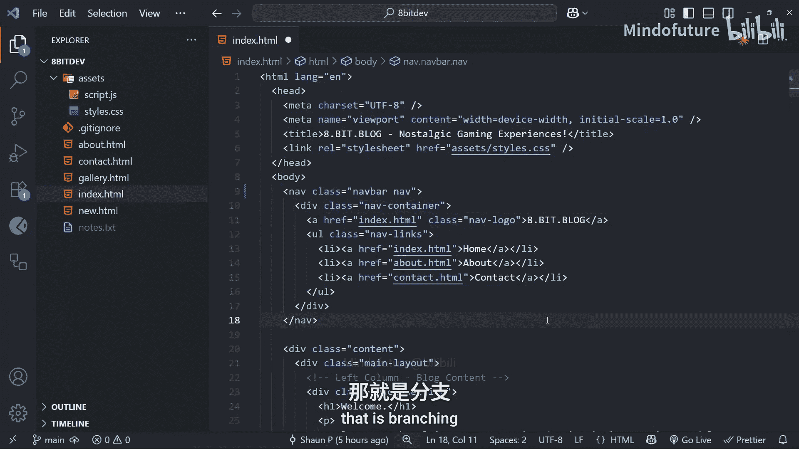

# 010：VS Code中的Git功能

在本节课中，我们将学习如何在VS Code中使用其内置的Git功能。之前我们一直在终端中使用`git add`、`git commit`等命令进行Git操作，这对于理解Git的工作原理非常有帮助。然而，VS Code提供了一系列直观的Git工具，可以让我们的工作流程更加顺畅。由于我们大部分时间都会在VS Code中工作，了解这些工具的使用方法很有意义。

## 文件树高亮显示

上一节我们介绍了终端中的Git命令，本节中我们来看看VS Code如何通过视觉提示来展示文件状态。首先，我们来快速了解一下文件树中的高亮显示，它能告诉我们哪些文件发生了更改。

当工作目录中没有未提交的更改时，所有文件和文件夹都显示为标准白色。一旦我们对文件进行修改，例如在`index.html`文件中更改一个字母并保存，该文件名在文件资源管理器中的颜色就会改变。

以下是不同颜色代表的含义：
*   **蓝色（或橙色/黄色，取决于主题）**：表示已修改的现有文件（未暂存的更改）。
*   **绿色**：表示项目中新增的、尚未被Git跟踪的文件。
*   **淡橙色**：表示文件已修改并已添加到暂存区。

如果你在终端运行`git add .`命令将所有更改暂存，已修改的文件会变为淡橙色，而新文件仍保持绿色。运行`git commit -m "提交信息"`提交后，所有颜色将恢复为正常的白色。这是一种无需频繁运行`git status`命令即可了解项目状态的便捷视觉指示器。

## 源代码管理面板

了解了文件树的高亮后，接下来我们深入看看源代码管理面板。点击侧边栏中类似地铁线路图（带有三个圆圈）的图标即可打开此面板。

在这个面板中，顶部列出了仓库名称和当前分支（例如`main`）。下方是“更改”部分，列出了工作目录中所有未暂存的更改，其作用类似于运行`git status`命令。

以下是面板中的主要操作：
*   将鼠标悬停在某个文件上，点击出现的 **+** 图标，可以将该单个文件添加到暂存区（相当于 `git add <文件名>`）。
*   面板顶部有一个 **+** 图标，点击它可以添加所有更改到暂存区（相当于 `git add .`）。
*   文件被暂存后，会移动到“暂存的更改”标题下。点击文件旁的 **-** 图标可以将其从暂存区移除。
*   在顶部的文本输入框中输入提交信息，然后点击“提交”按钮，即可完成提交（相当于 `git commit -m "提交信息"`）。

面板底部还有一个“图”部分，按顺序列出了所有的提交记录。将鼠标悬停在某个提交上，可以查看其提交哈希值、作者和提交信息等详细信息。

这个源代码管理面板非常实用，我有时会用它来查看更改和进行提交。不过在本课程中，90%的时间我们仍将使用命令行，因为对于初学者而言，使用命令行练习能帮助你更好地理解Git的底层机制。当然，在后续章节中，我们也会偶尔使用这个面板。

## 文件内更改对比

最后，让我们看看VS Code中我最喜欢的一个功能：如何在文件内部精确显示更改。

当你打开一个文件并开始修改时，会注意到编辑器左侧的装订线（gutter）会出现彩色高亮条。这些条状标记精确地指出了哪些行被更改了。

以下是不同颜色的含义：
*   **蓝色线条**：表示该行代码已被编辑。
*   **绿色线条**：表示该行是新增的代码。
*   **红色三角形**：表示该行代码已被完全删除。

点击任何这些标记，都会在一个弹出框中显示具体被更改、添加或删除的内容。这在提交前审查自己的更改时非常有用，因为你可以快速浏览文件并查看所有修改。另一个贴心的设计是，右侧的滚动条上也会显示这些彩色线条，让你一眼就能看出文件中所有更改的位置。

请注意，这些高亮显示仅在你处理未提交的更改时出现，一旦提交，它们就会消失。

## 总结

本节课中我们一起学习了VS Code为Git工作流提供的几个实用视觉工具。我们了解了文件树中的颜色高亮如何指示文件状态，探索了源代码管理面板如何让我们可视化地暂存文件和提交更改，最后还学习了如何在文件内部精确查看每一行的修改内容。

这些工具可以根据你的喜好选择使用。我个人习惯使用Git面板进行简单的提交操作，而对于更复杂的任务则回到命令行。文件内更改对比的高亮功能也让我非常受用。

接下来，我们将讨论Git最强大的功能之一：分支。