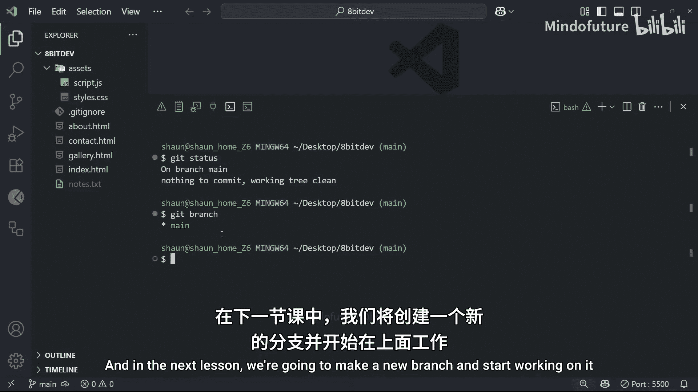

# 011：理解分支 🌿


在本节课中，我们将要学习Git中一个极其重要的概念——**分支**。到目前为止，我们的操作都像是在一条直线上进行。但实际开发中，项目往往需要同时进行多种尝试或开发多个功能。分支就是帮助我们实现这一点的强大工具。

## 什么是分支？

上一节我们介绍了提交历史，本节中我们来看看如何让历史“分叉”。

分支，顾名思义，就是允许你的代码历史从一个点开始，向不同方向发展的机制。你可以把它想象成游戏中的存档点或平行宇宙。

在Git中，**分支本质上是一个指向一系列提交历史的可移动标签**。

## 为什么需要分支？

以下是使用分支的几个核心原因：

1.  **安全开发新功能**：你可以在一个独立的分支上开发新功能，而不会影响主线上稳定运行的代码。
2.  **尝试与实验**：如果某个新想法效果不佳，你可以直接丢弃整个分支，轻松回到起点。
3.  **保持主线整洁**：只有经过测试、确认可用的功能才会被合并回主线，这使得主分支的历史清晰、稳定。
4.  **团队协作**：团队成员可以同时在各自的分支上工作，互不干扰，最后再将完成的工作合并。

## 分支的工作流程

想象一下，你正在主分支（`main`）上开发一个网站。现在你需要添加一个“邮件注册”功能。

**不推荐的做法**是直接在 `main` 分支上修改代码。如果你中途发现代码有问题，开始回退、修补，很容易把提交历史弄得一团糟。

**推荐的做法**遵循以下步骤：

1.  **创建新分支**：从 `main` 分支的当前状态创建一个新的分支，例如 `feature-email-signup`。
    ```bash
    git branch feature-email-signup
    ```
2.  **切换到新分支**：在这个新分支上进行所有关于该功能的开发工作。
    ```bash
    git checkout feature-email-signup
    ```
3.  **自由开发与提交**：在新分支上修改文件、进行提交。所有这些更改都只存在于 `feature-email-signup` 分支上，`main` 分支完全不受影响。
4.  **完成与合并**：当功能开发完毕并测试通过后，将该分支合并回 `main` 分支。
    ```bash
    git checkout main
    git merge feature-email-signup
    ```
5.  **（可选）删除分支**：功能合并后，可以安全地删除这个特性分支。
    ```bash
    git branch -d feature-email-signup
    ```

## 查看当前分支

在开始操作前，了解你当前位于哪个分支非常重要。

*   使用 `git status` 命令，输出信息的第一行会显示当前所在分支。
    ```bash
    $ git status
    On branch main
    Your branch is up to date with 'origin/main'.
    ...
    ```
*   使用 `git branch` 命令，可以列出仓库中的所有分支。当前所在分支前会有一个星号（`*`）标记。
    ```bash
    $ git branch
    * main
      feature-email-signup
    ```

## 总结



本节课中我们一起学习了Git分支的核心概念。我们了解到分支是一个指向提交历史的标签，它允许我们从开发主线分离出去，在独立的环境中进行安全的开发、测试和实验。通过创建新分支来开发功能，最后再合并回主分支（`main`）的工作流，是保持项目代码整洁、稳定和便于团队协作的标准实践。在下一课，我们将动手创建并操作我们的第一个分支。