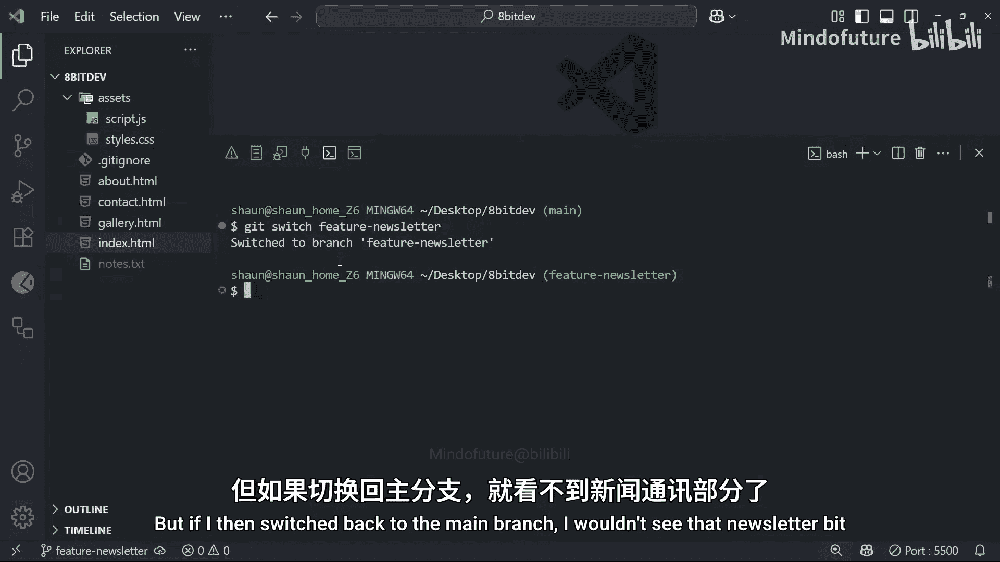
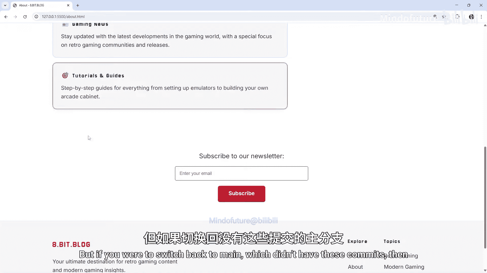
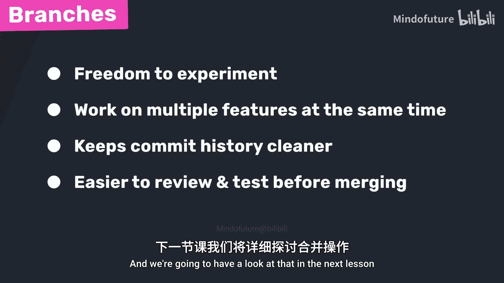

# 012：切换分支 🪢


在本节课中，我们将学习如何创建新的Git分支，以及如何在不同的分支之间进行切换。这是实现并行开发和功能隔离的核心操作。

## 概述

上一节我们介绍了分支的概念及其重要性。本节中，我们来看看如何实际操作分支：创建新分支、在不同分支间切换，并理解分支如何形成独立的历史线。

## 查看当前分支

在开始创建新分支前，我们需要知道当前处于哪个分支。可以使用以下两个命令之一：

*   `git status`
*   `git branch`

我们使用 `git branch` 命令。该命令会列出仓库中的所有分支，并在当前所在分支旁用星号（`*`）标记，通常还会高亮显示。

```bash
git branch
```

运行后，你会看到类似输出，表示当前只有一个名为 `main`（或 `master`）的默认分支。

## 创建新分支

要创建一个新分支，我们再次使用 `git branch` 命令，但这次需要跟上你想要创建的分支名称。

以下是创建分支的命令格式：
```bash
git branch <新分支名称>
```

例如，创建一个名为 `my-new-branch` 的分支：
```bash
git branch my-new-branch
```

执行此命令后，新分支即被创建。此时再次运行 `git branch`，你会看到列表中多了一个 `my-new-branch`，但星号仍然在 `main` 分支旁，表示你尚未切换到新分支。

## 切换到指定分支

创建分支后，通常需要立即切换到该分支开始工作。使用 `git switch` 命令可以切换到指定分支。

以下是切换分支的命令格式：
```bash
git switch <分支名称>
```

例如，切换到我们刚创建的 `my-new-branch`：
```bash
git switch my-new-branch
```

现在运行 `git branch`，你会发现星号已经移动到了 `my-new-branch` 旁边。

**重要概念**：新分支在创建时，是源分支（此处是 `main`）在那一刻的完整副本，包含了截至分支点所有的提交历史。因此，在做出新提交之前，两个分支的代码和提交历史是完全相同的。

## 创建并立即切换分支

由于我们经常在创建分支后立即切换过去，Git 提供了一个更快捷的命令，可以一步完成创建和切换操作。

使用 `git switch` 命令并加上 `-c`（代表 create）标志，即可创建新分支并立即切换到它。

以下是创建并切换分支的命令格式：
```bash
git switch -c <新分支名称>
```

例如，创建一个更合理的功能分支 `feature-newsletter`：
```bash
git switch -c feature-newsletter
```

执行后，系统会创建该分支并自动切换过去。运行 `git branch` 可以确认当前已位于新分支上。

**关于 `git checkout`**：你可能会看到有人使用 `git checkout <分支名>` 来切换分支。这个命令仍然有效，但 `checkout` 功能较多，不仅用于切换分支。从 Git 2.23 版本开始引入了更直观的 `switch` 命令专门用于分支切换。本教程将使用 `switch` 命令。

## 在不同分支上独立工作

现在我们有三个分支：`main`、`my-new-branch` 和 `feature-newsletter`。后两个目前是 `main` 的副本。

分支的强大之处在于隔离性。当你在某个分支（例如 `feature-newsletter`）上修改代码并提交时，这些更改**只会**记录在该分支的历史中，完全不会影响 `main` 或其他分支。

让我们在 `feature-newsletter` 分支上模拟一些工作：
1.  确认当前分支：`git branch`
2.  修改项目文件（例如，添加一个新闻通讯表单的HTML、CSS，并在主页添加链接）。
3.  将这些更改分次提交：
    ```bash
    # 第一次提交：添加HTML表单
    git add .
    git commit -m "add newsletter html form"

    # 第二次提交：添加CSS样式
    git add .
    git commit -m "add styles for newsletter"

    # 第三次提交：在主页添加链接
    git add .
    git commit -m "add link to newsletter"
    ```

现在，使用 `git log --oneline` 查看提交历史，你会发现最新的三次提交只出现在 `feature-newsletter` 分支的历史记录中。同时，`HEAD` 指针（代表你当前的位置）指向 `feature-newsletter`。



## 验证分支间的独立性

要验证分支间的独立性，我们可以切换回 `main` 分支查看。

1.  切换回主分支：
    ```bash
    git switch main
    ```
2.  查看 `main` 分支的提交历史：
    ```bash
    git log --oneline
    ```
    你会发现，刚才在 `feature-newsletter` 上做的三次提交**消失了**。`HEAD` 指针现在指向一个更早的提交，`main` 分支的历史线里没有那些新功能提交。
3.  检查工作目录：你在 `feature-newsletter` 上修改的代码文件，在 `main` 分支的视图下会恢复成修改前的状态。新添加的新闻通讯部分将不可见。
4.  切换回功能分支以查看更改：
    ```bash
    git switch feature-newsletter
    ```
    一切又都回来了。

**直观演示**：如果你在 `feature-newsletter` 分支运行时在浏览器中预览项目，可以看到新闻通讯功能。但如果在 `main` 分支预览，则看不到该功能，因为它尚未被合并到主分支中。

## 理解分支工作流的意义



到目前为止，我们创建了**分叉的历史**。想象一棵树，树干是共享的提交历史（`main` 分支），在某个点分出一个树枝（`feature-newsletter`），这个树枝独立生长，拥有了自己额外的提交。

这种工作流非常有用，原因如下：

以下是使用分支的主要优势：
*   **安全实验**：你可以在新分支上自由尝试新功能，即使彻底搞砸了，只需删除该分支即可，主分支代码安然无恙。
*   **并行开发**：团队成员可以同时在不同的分支上开发不同的功能，互不干扰。这在后续使用 GitHub 协作时尤为重要。
*   **历史清晰**：保持主分支提交历史的整洁和有序，每个功能或修复都有自己独立的历史线。
*   **便于测试与审查**：可以在独立的分支上完整地开发、测试一个功能。只有当功能完善并通过测试后，才决定是否将其整合到主代码库中。

## 总结

本节课中我们一起学习了 Git 分支的核心操作。我们掌握了如何使用 `git branch` 查看和创建分支，以及如何使用 `git switch`（和 `git switch -c`）在不同分支间切换。我们实践了在独立分支上开发功能并提交更改，验证了分支间的隔离性。最后，我们探讨了基于分支进行开发的工作流程为何如此强大，它能保障代码安全、支持并行协作并保持项目历史清晰。



当我们决定将一个分支上完成的功能整合回主分支时，这个过程被称为**合并**，这将是下一节课的主题。