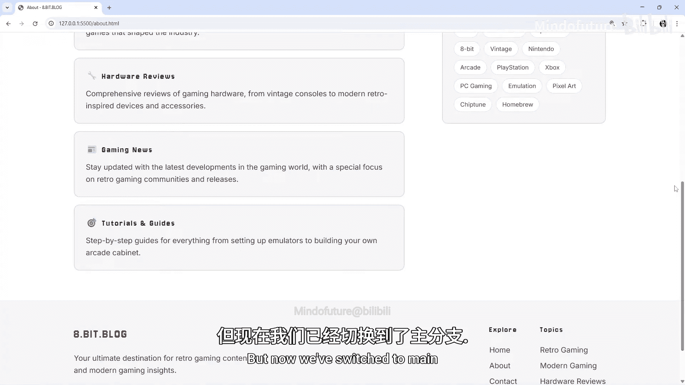
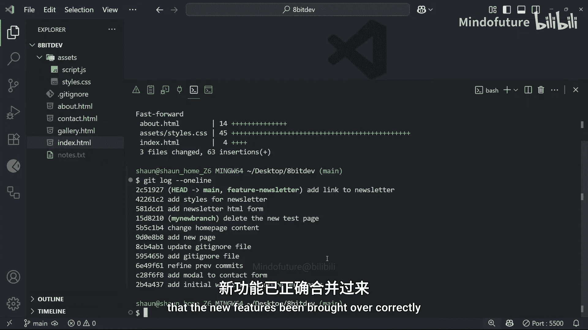
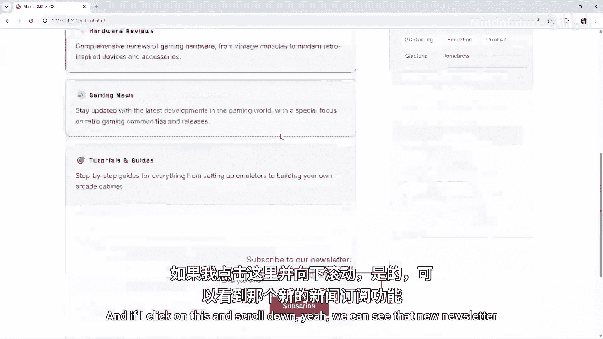
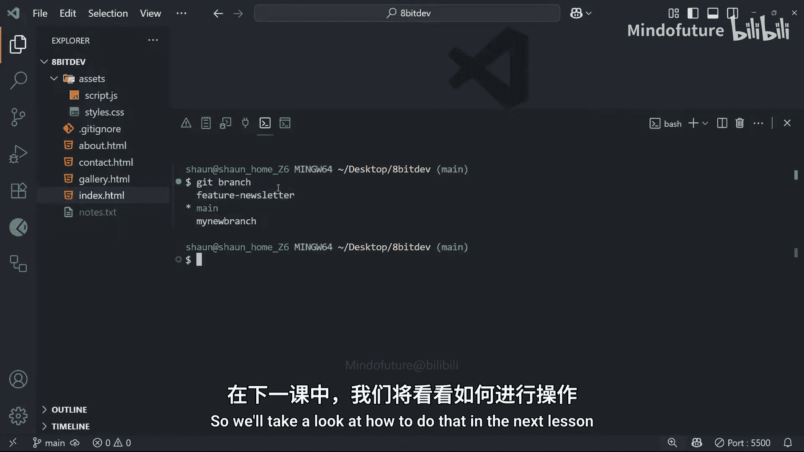

# 013：合并分支 🔀

在本节课中，我们将要学习Git中一个核心操作：**合并分支**。我们将了解如何将一个分支上的工作成果整合到另一个分支（通常是主分支）上，并重点介绍最简单、最常见的合并类型——**快进合并**。

---

上一节我们学习了如何创建和切换分支，并在独立的分支上开展工作。本节中我们来看看，当对一个功能分支上的工作感到满意，并希望将其作为核心项目的一部分时，如何将这些更改带回主分支。因为主分支通常代表你准备部署的主要代码库，所以合并操作至关重要。

**合并**本质上是Git将来自一个分支的更改整合到另一个分支的方式。例如，我们一直在 `feature-newsletter` 分支上工作并提交了一些更改。当我们认为该功能已经完成并经过测试，希望将其纳入主代码库时，就需要将这个功能分支合并回主分支。合并操作会将该功能分支上的所有提交都集成到主分支上，使我们在功能分支上添加和更新的代码同样出现在主分支中。

Git中有不同类型的合并，我们将在课程后续部分介绍。在本例中，我们将关注最简单也最常见的一种：**快进合并**。当目标分支（通常是主分支）自你创建功能分支以来，**没有进行过任何新的提交**时，就会发生快进合并。这在个人开发中非常常见，因为在你开发功能时，没有其他开发者对主分支进行修改。本质上，这种场景下，主分支只是“快进”到功能分支当前所在的位置。

以下是执行合并的基本步骤：

1.  **确保你位于目标分支**：在合并前，你需要切换到接收更改的分支，通常是 `main` 分支。
2.  **执行合并命令**：使用 `git merge <branch-name>` 命令，将指定的分支合并到当前分支。

让我们通过一个具体的例子来演示这个过程。

首先，我们查看功能分支的提交历史，确认它领先于主分支。然后，我们切换回主分支，并查看其提交历史，会发现它缺少功能分支上的最新提交。接着，我们在主分支上运行合并命令 `git merge feature-newsletter`。由于主分支自功能分支创建后没有新提交，Git执行了一次快进合并，直接将主分支的指针移动到功能分支最新的提交上。

合并完成后，再次查看主分支的日志，会发现它现在包含了功能分支的所有提交。此时，两个分支指向了同一个最新的提交。我们可以通过预览项目来验证新功能（例如新闻通讯表单）是否已成功整合到主分支中。

最后，虽然功能分支的内容已被合并，但分支本身仍然存在。良好的Git工作流习惯是，在合并完成后，删除那些不再需要的功能分支以保持仓库的整洁。我们将在下一课中学习如何删除分支。

---

本节课中我们一起学习了Git合并分支的基础知识，特别是快进合并的操作流程。我们了解到，合并是将不同分支的开发线重新组合的关键步骤，而快进合并则是在目标分支没有并行开发时最高效的合并方式。记住，合并后，原功能分支仍然存在，通常建议在合并后将其删除。