# 001：为MS-DOS街机游戏制作参考代码 🎮


在本节课中，我们将学习如何为MS-DOS环境下的街机游戏项目编写参考实现代码。我们将重点探讨x86汇编语言编程、DOSBox调试环境配置、以及一个图形化编辑器工具中按钮交互功能的实现。

## 概述

本节内容基于一个实际的开发流，旨在为后续的教育视频系列构建一个功能完整的参考实现。我们将看到开发者如何设置开发环境、重构代码以提升可维护性，并实现核心的鼠标交互逻辑。整个过程涉及DOS下的汇编编程、内存管理、图形渲染和输入处理。


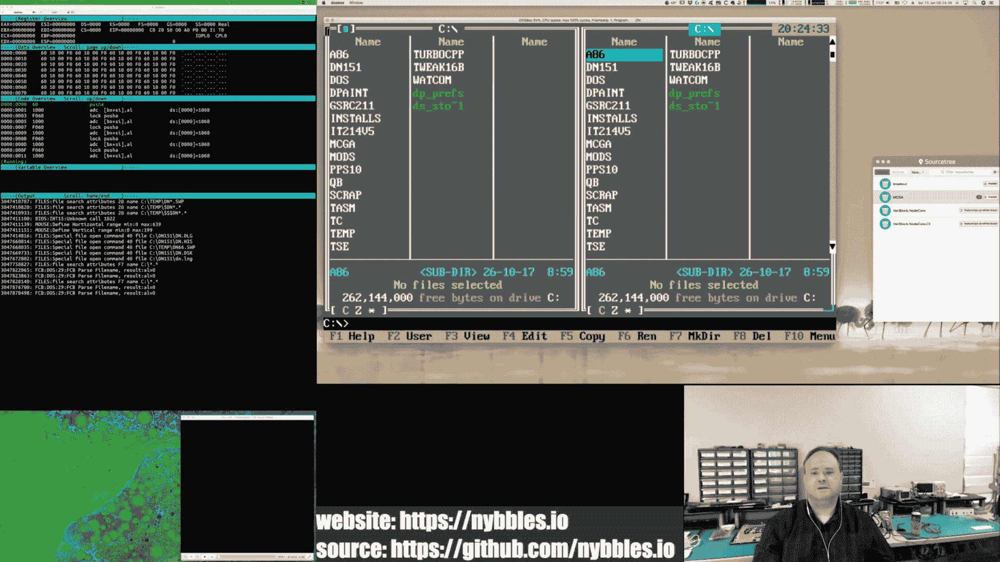

## 开发环境与工具链 🛠️

上一节我们介绍了项目的背景，本节中我们来看看开发所使用的具体环境和工具。

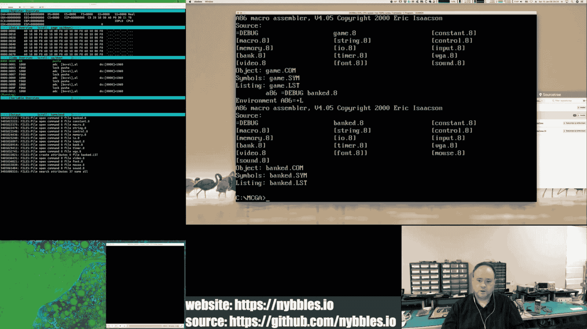

为了在MS-DOS环境下进行开发，我使用了一套定制的工具链：

*   **DOSBox**： 主要的开发和测试环境。我使用了一个自定义编译版本，集成了社区修复补丁的调试器，这对于底层调试至关重要。
*   **文本编辑器**： 使用TSE Pro（原Q编辑器），这是我长期在DOS下使用的编辑器。
*   **汇编器**： 主要使用A86/D86汇编器。它语法简洁高效，远胜于当时的其他商业汇编器。
*   **编译器/调试器**： 安装了Turbo C++和Open Watcom，用于可能的C语言模块和调试。
*   **辅助工具**： 包括Deluxe Paint（图形编辑）、DN（文件管理器）和一些音乐追踪器（Mod Tracker）。

选择DOSBox是因为它在VGA硬件模拟方面非常出色，尽管其性能并非完美。对于需要精确计时的音频任务，可能需要VirtualBox或Parallels等虚拟机。

## 项目结构与内存模型 💾

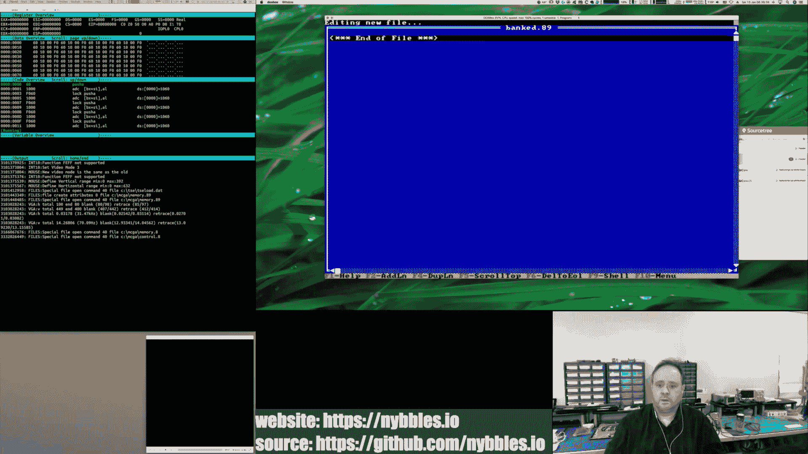

在深入代码细节之前，理解项目的整体结构和所采用的内存模型非常重要。

整个项目（游戏及其配套编辑器工具）都采用`.COM`文件格式。这种格式虽然简单，但在实模式下提供了极大的灵活性。MS-DOS将机器的控制权几乎完全交给程序，开发者可以自由使用640KB基本内存中的各个段。

*   **代码段**： 一个64KB的段存放程序代码和一些内联数据。目前游戏引擎约4-5KB，编辑器约5KB，其中相当一部分是数据结构。
*   **数据段**： 其他内存段用于存放游戏资源，如使用一个完整的段（64KB）存放图块（Tile），精灵控制表等。渲染器使用的数据格式紧凑高效。
*   **显存与缓冲**： 在常规内存中分配了一个64KB块作为后备缓冲区（Back Buffer）。所有绘图操作先在此进行，然后在垂直消隐期间通过“翻页”操作快速复制到VGA显存。

这种模型下，即使最终的游戏，其`.COM`文件大小也不太可能超过32KB，留有充足的内存空间存放资源。

## 按钮系统的实现 🖱️

上一节我们介绍了项目的内存布局，本节中我们来看看编辑器工具中用户界面按钮的具体实现。

按钮是编辑器GUI的核心交互元素。其功能包括绘制自身和处理鼠标点击。

### 按钮数据结构

首先，我们定义了一个结构体来描述按钮的所有属性。在汇编中，我们使用标签和宏来构建这个结构。

```assembly
; 按钮结构体定义
STRUC Button
    .flags   dw ?    ; 状态标志位（如是否启用、是否最后一个）
    .text    dw ?    ; 指向按钮文本字符串的指针
    .textPos dw ?    ; 文本在按钮内的坐标 (Y, X)
    .pos     dw ?    ; 按钮左上角坐标 (Y, X)
    .size    dw ?    ; 按钮尺寸 (高度, 宽度)
    .func    dw ?    ; 点击回调函数的指针
ENDSTRUC
```

以下是初始化按钮数组的示例代码：
```assembly
; 使用宏初始化按钮数组
buttons:
    ButtonDef <ENABLED_BIT, offset txt_new, (5<<8)|10, (10<<8)|20, (20<<8)|60, 0>
    ButtonDef <ENABLED_BIT, offset txt_load, (5<<8)|90, (10<<8)|20, (20<<8)|60, 0>
    ButtonDef <ENABLED_BIT|LAST_BIT, offset txt_exit, (5<<8)|170, (10<<8)|20, (20<<8)|60, offset exit_callback>
```

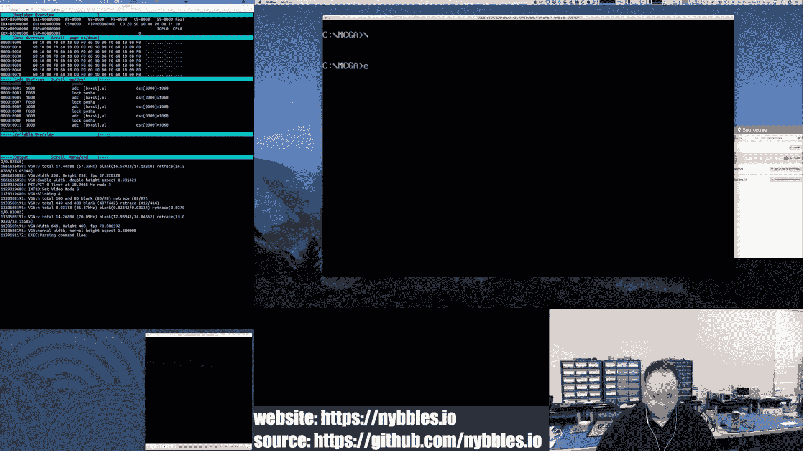

### 绘制按钮


按钮的绘制被重构到一个独立的函数 `draw_buttons` 中，使主绘制循环更清晰。绘制过程包括：
1.  遍历按钮数组。
2.  检查是否启用，未启用则跳过。
3.  绘制一个填充矩形作为按钮背景。
4.  在矩形顶部和底部各画一条黑线作为边框。
5.  在指定位置绘制按钮文本，并可以微调字符间距。


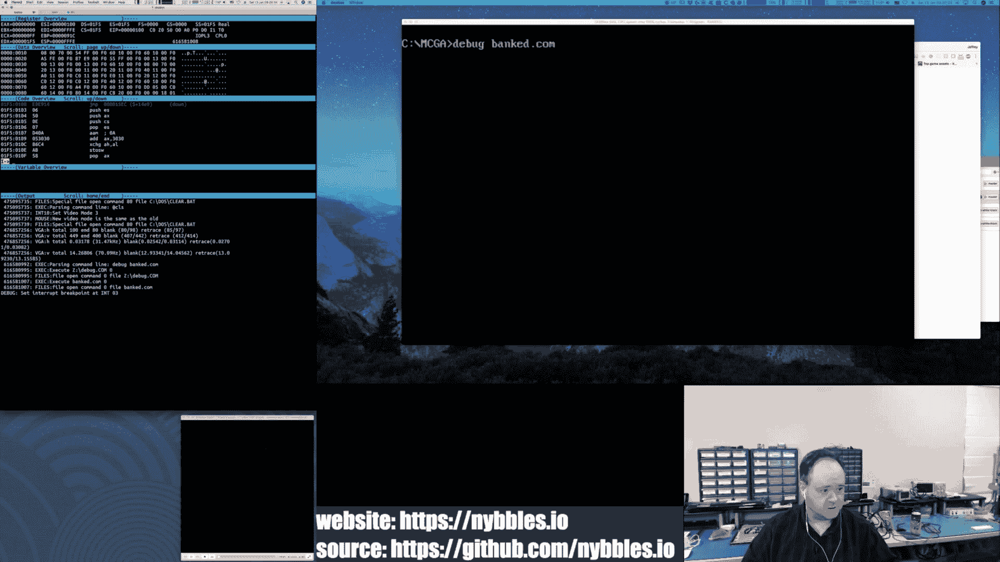


### 处理鼠标点击


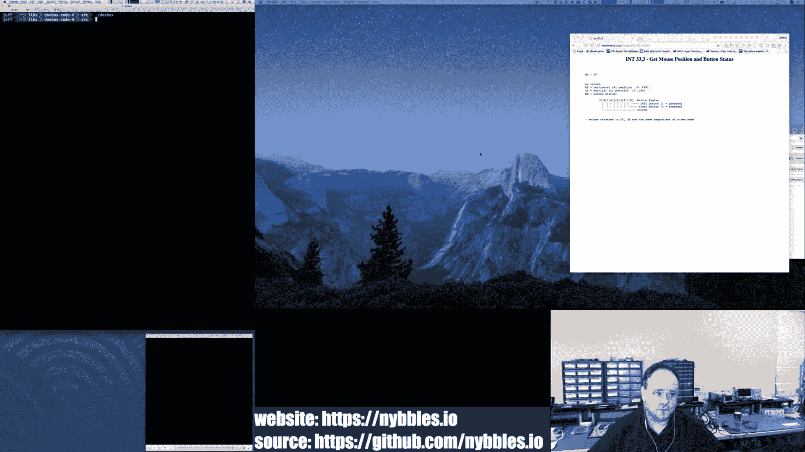

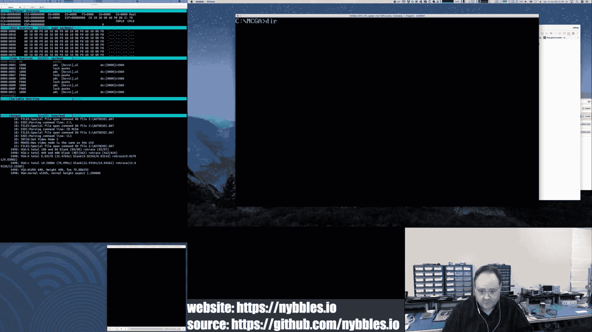


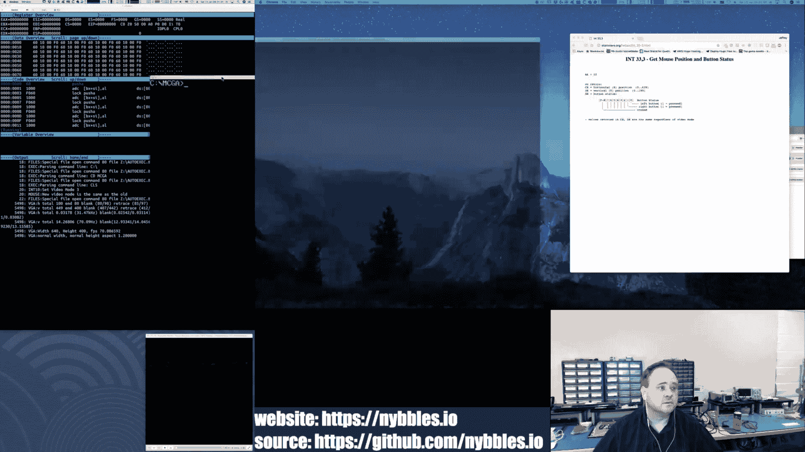


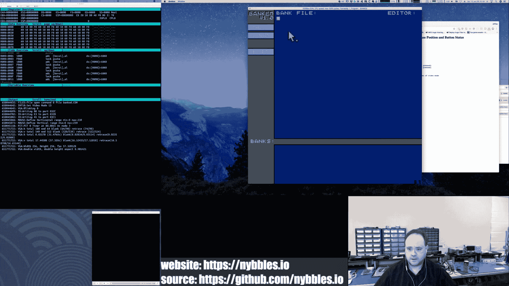

鼠标点击检测在 `fire_buttons` 函数中实现。其逻辑如下：
1.  首先检查鼠标左键是否被按下，如果没有则直接返回。
2.  遍历按钮数组，同样跳过未启用的按钮。
3.  对于每个启用的按钮，获取鼠标位置（考虑热点偏移）和按钮的矩形区域。
4.  进行边界检查，判断鼠标是否在按钮范围内。核心比较公式为：
    *   `mouse_x >= button_x` 且 `mouse_x <= (button_x + button_width)`
    *   `mouse_y >= button_y` 且 `mouse_y <= (button_y + button_height)`
5.  如果点击在按钮内，且该按钮有回调函数（`func` 指针非空），则调用该函数。


在实现过程中，需要特别注意坐标系统。由于使用的视频模式（Mode Q）特性，屏幕坐标通常以 `(Y, X)` 的顺序打包在一个字（word）中，高低字节分别代表Y和X，这可以避免乘法运算，提升性能。但在比较时需要确保顺序一致。

## 调试技巧 🐛

在实现复杂逻辑时，调试是必不可少的。DOSBox的内置调试器在此发挥了关键作用。


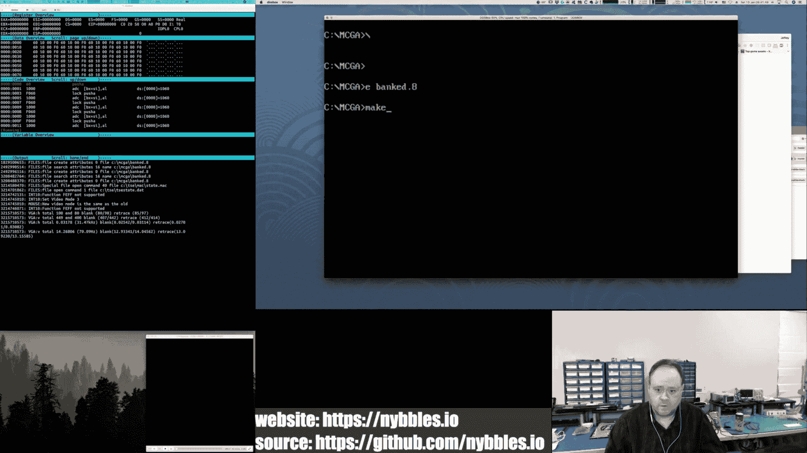


我定义了一个 `BRK` 宏，它在代码中插入 `INT 3` 指令。在DOSBox调试器中，可以设置断点在这个中断上。例如，在鼠标点击检测的开始处插入 `BRK`，运行程序后点击鼠标，调试器就会中断，允许开发者单步执行并检查寄存器、内存状态，从而验证逻辑是否正确。

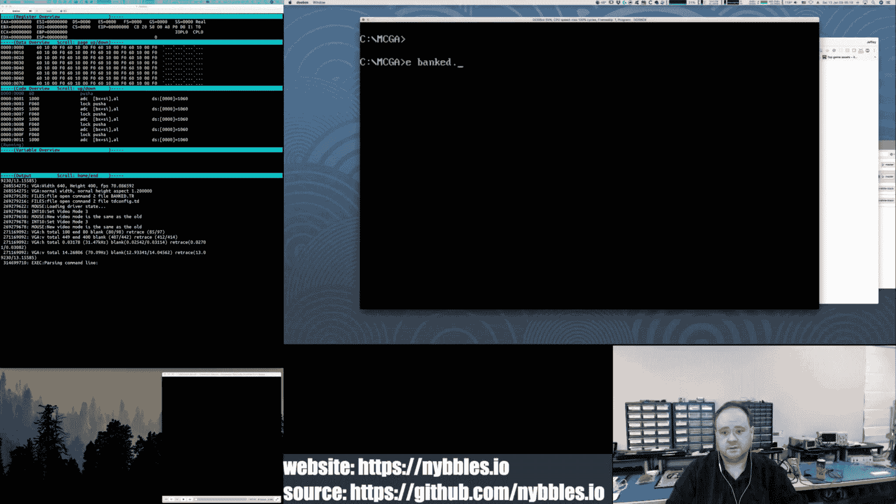

例如，可以检查 `AX` 寄存器中是否包含了正确的按钮坐标，或者 `BX` 寄存器中的鼠标位置是否在预期的范围内。

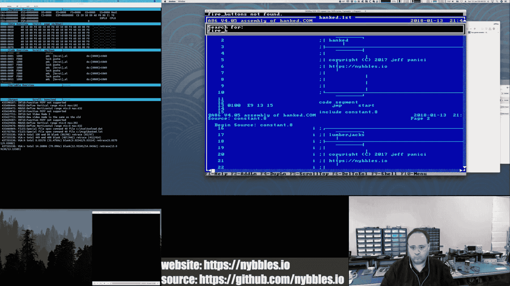

## 总结


本节课中我们一起学习了为MS-DOS街机游戏项目构建参考实现代码的实践过程。我们从配置开发环境（DOSBox、A86汇编器）开始，了解了`.COM`格式程序的内存模型优势。然后，我们深入探讨了编辑器工具中一个核心功能——按钮交互系统的实现，包括其数据结构的定义、绘制流程以及鼠标点击检测的逻辑。最后，我们还介绍了如何使用DOSBox调试器来辅助开发和验证代码逻辑。

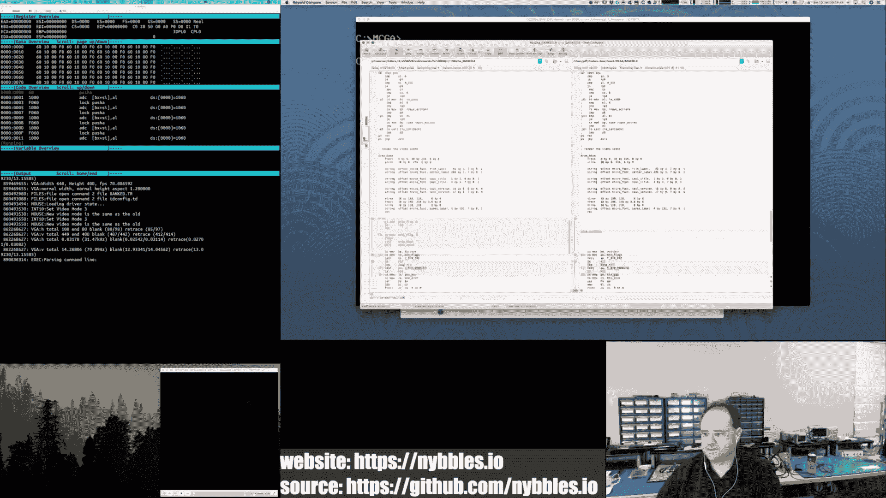

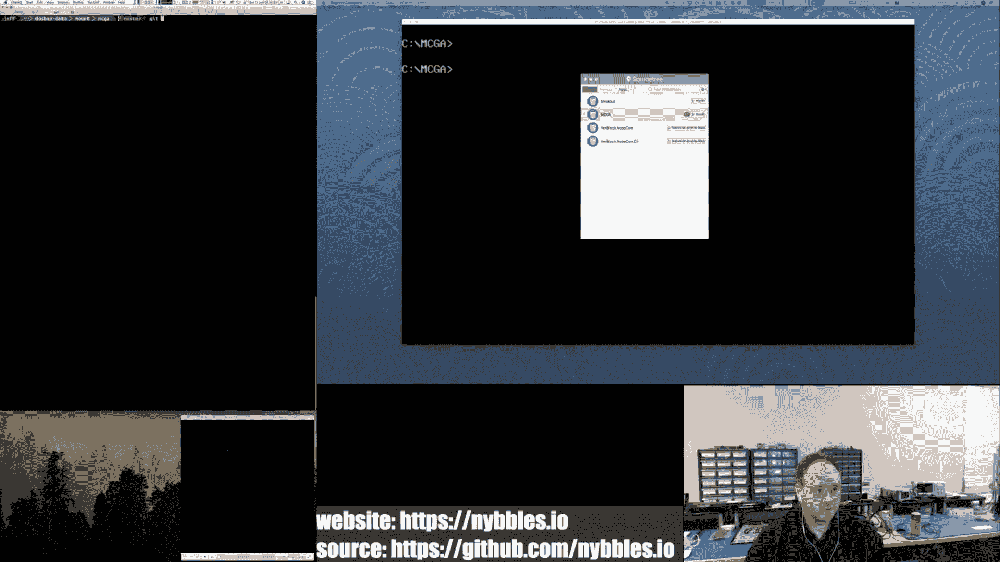


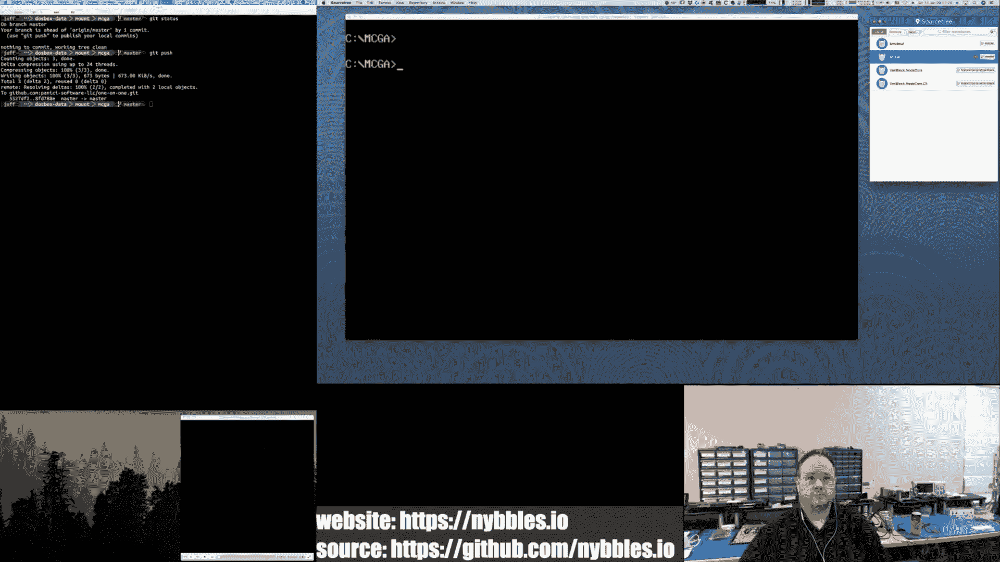

这个过程展示了如何在有限的硬件环境下进行高效的系统级编程，将图形渲染、输入处理和内存管理紧密结合，为开发完整的街机游戏奠定了坚实的基础。