# 002：构建MS-DOS游戏编辑器工具

## 概述

在本节课中，我们将学习如何为一个MS-DOS下的复古街机游戏项目构建一个数据编辑器工具。这个工具名为“BankEd”，用于创建和编辑游戏资源，如背景图块、精灵和声音数据。我们将深入探讨其x86汇编语言实现，涵盖从程序启动、内存管理、图形模式设置到用户界面交互（如按钮和文本输入）的完整流程。课程将重点解析代码结构、数据组织以及核心功能的实现原理。

---

## 程序启动与初始化

首先，我们的程序是一个MS-DOS的COM文件。COM文件是一个可以直接加载到内存中执行的64K内存映像。操作系统将控制权完全交给我们的程序。

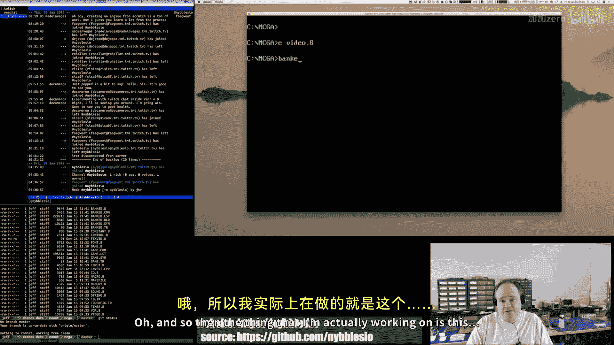

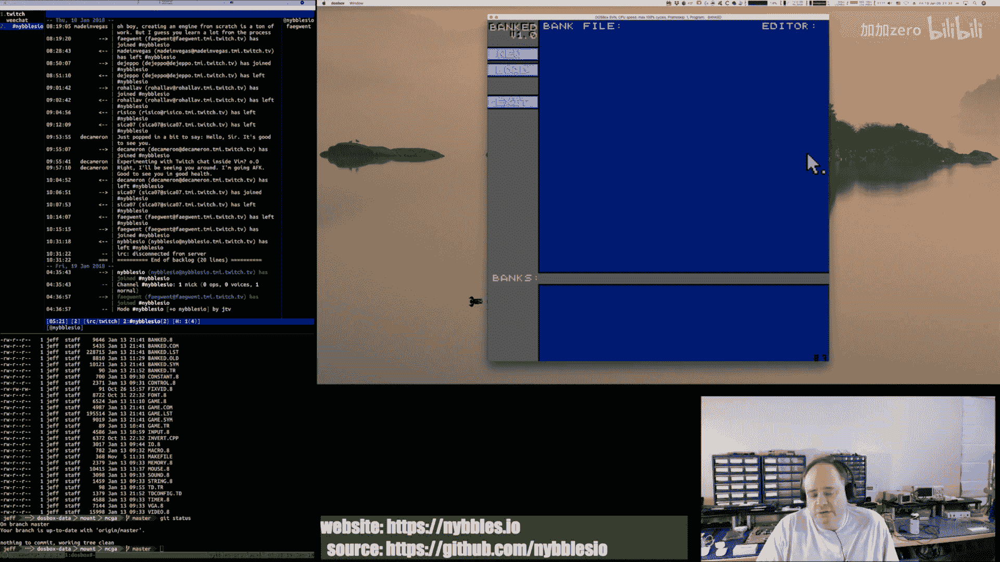

程序入口点首先需要跳过数据区，跳转到真正的启动代码。

```assembly
    jmp start
```

`start`标签是我们的程序起点。接下来，我们需要初始化内存。我们使用的是分段内存模型，虽然理解起来需要一些功夫，但一旦掌握，使用起来并不复杂。

我们首先为控制RAM分配内存。控制RAM是一个特殊的内存区域，用于存储游戏引擎的核心数据结构和指针。

```assembly
allocate_control_ram:
    ; 宏调用，分配下一个内存段作为控制RAM
    allocate_to_next_segment_for_size control_ram
    ; 将分配的内存清零
    clear_with_zeros
    ; 设置扩展段寄存器指向控制RAM
    mov es, control_ram_pointer
    ; 设置基址指针以便访问结构
    mov bp, 0
```

控制RAM结构体包含了指向各种游戏资源（如精灵图块、背景图块）的指针，以及精灵、图块、背景地图和定时器的元数据。

---

## 图形模式设置

我们的游戏使用VGA图形模式。我们并非使用标准的Mode 13h（320x200，256色），而是通过修改VGA寄存器，将其设置为一种特殊的“链式”模式，我们称之为Mode Q（256x256，256色）。

这种模式的优点是，由于屏幕是正方形，我们可以用一个字（word）寄存器来存储像素地址：高字节是Y坐标，低字节是X坐标。这样，我们无需进行乘法运算即可定位像素，非常方便。


```assembly
set_mode_q:
    ; 进入标准VGA Mode 13h
    mov ax, 13h
    int 10h
    ; 应用Mode Q的寄存器参数
    mov si, offset mode_q_registers
    call program_vga_mode
```

`program_vga_mode`函数接收一个指向寄存器-值对数组的指针，并循环将其写入对应的VGA控制寄存器。

我们使用一个64K的后台缓冲区（back buffer）在常规RAM中进行所有绘制操作，然后通过一个函数将这个缓冲区的内容复制到实际的VRAM中。

---

## 输入系统

为了获得高效的游戏输入，我们需要接管DOS的键盘中断服务例程（ISR）。这允许我们实时获取按键的按下和释放事件。

```assembly
init_keyboard_isr:
    ; 保存原始键盘中断向量
    ; 安装我们自己的键盘中断处理程序
    ; 新的ISR将扫描码放入一个队列
```

我们的输入系统将扫描码队列转换为更高级别的“输入事件”。我们定义了一个输入事件数组，每个事件对应一个特定的操作（如退出、移动）。还有一个“绑定”数组，将输入事件映射到具体的回调函数。


```assembly
; 定义输入事件
def_input_event KEY, ESCAPE
def_input_event KEY, LEFT
; ... 其他事件

; 定义绑定
def_binding QUIT, exit_callback
def_binding MOVE_LEFT, move_left_callback
```

主循环会调用`update_input`来处理队列，更新事件状态，然后调用`fire_bindings`来触发相应的回调。

---

## 用户界面：按钮

编辑器工具包含一个按钮界面。每个按钮由一个数据结构定义，包含其状态、文本、位置、大小和点击回调函数。

```assembly
; 按钮结构示例
button_new:
    db BUTTON_ENABLED          ; 标志位
    dw offset label_new        ; 文本标签指针
    dw 0, 20                   ; 文本在按钮内的偏移 (x, y)
    dw 0, 20                   ; 按钮位置 (x, y)
    dw 38, 10                  ; 按钮大小 (宽, 高)
    dw offset new_callback     ; 回调函数指针
```

绘制按钮的代码会遍历按钮数组，检查其是否启用，然后根据其位置和大小在屏幕上绘制矩形和文本。

处理鼠标点击的逻辑（`fire_buttons`）会检查鼠标位置是否在任意启用按钮的边界框内。如果是，则调用该按钮的回调函数。我们最初尝试用字（word）比较来同时检查X和Y坐标，但这种方法行不通，必须分别对X和Y坐标进行独立的无符号比较。

```assembly
fire_buttons:
    ; 检查鼠标左键是否按下
    ; 遍历按钮数组
    .for_each_button:
        ; 检查按钮是否启用
        ; 分别比较鼠标Y坐标与按钮顶部和底部
        ; 分别比较鼠标X坐标与按钮左侧和右侧
        ; 如果都在范围内，则调用回调函数
```

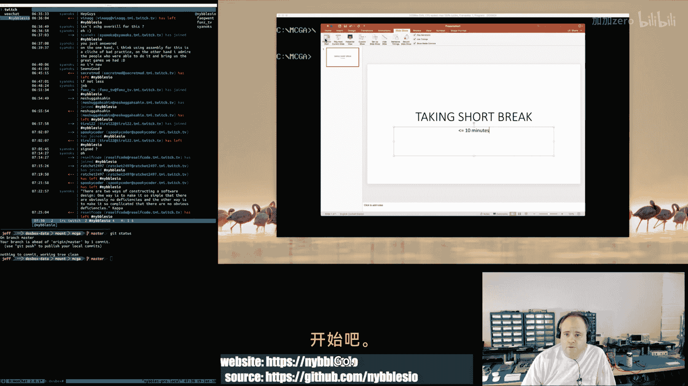

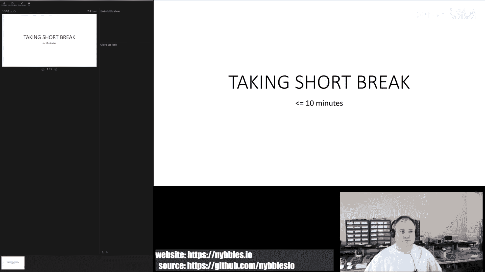


---

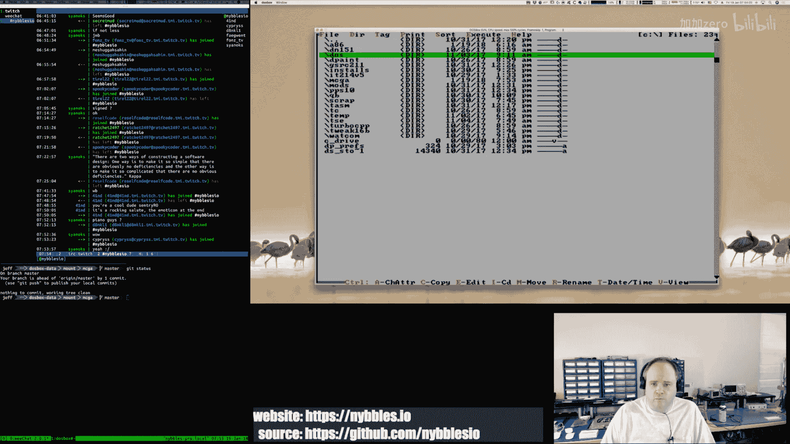

## 状态管理

工具的操作被建模为一系列状态，例如“无文件状态”、“新建文件状态”、“加载文件状态”。我们有一个状态数组，每个状态包含一个处理函数（回调）。

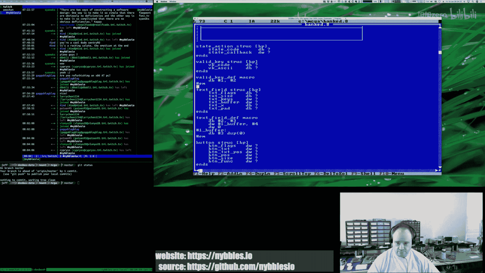

```assembly
; 状态定义宏
def_state NO_FILE, no_file_state_callback
def_state NEW_FILE, new_file_state_callback
def_state LOAD_FILE, load_file_state_callback
```

一个全局变量`current_state`指向当前活跃的状态。主循环的`update`函数会调用当前状态的处理函数。这允许每个状态拥有不同的行为。例如，在“无文件状态”下，按钮是可点击的；而在“新建文件状态”下，我们可能进入文本输入模式，按钮暂时失效。


状态转换通常由按钮回调触发，它们简单地改变`current_state`指针的值。

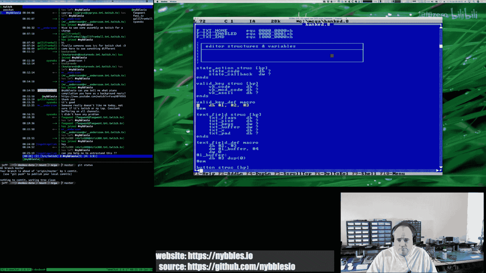


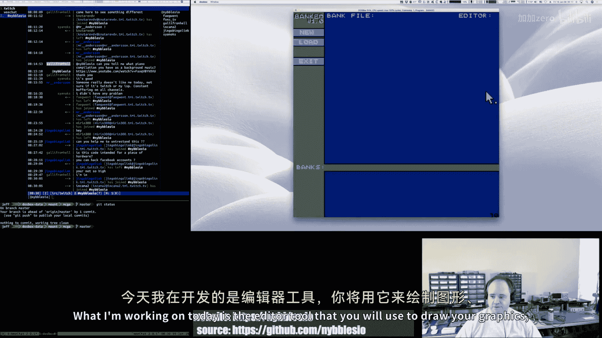

---


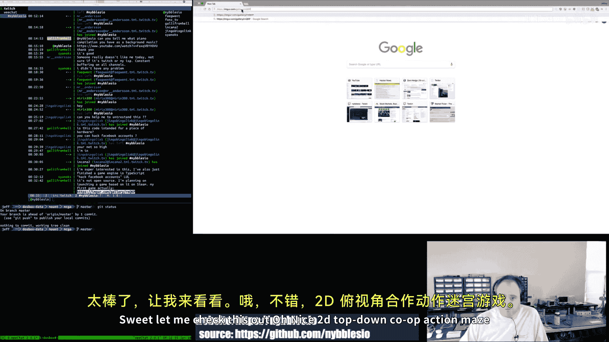


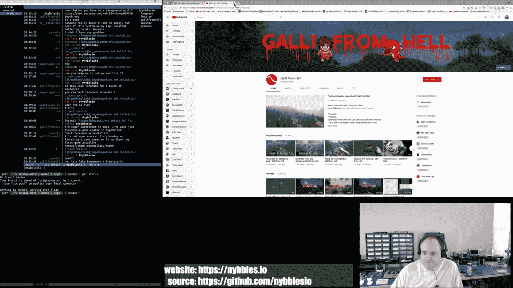

## 文本输入系统

我们需要一个文本输入系统来处理像输入文件名这样的操作。我们定义了一个文本字段数据结构。

```assembly
; 文本字段结构
; 标志位（启用、只读等）
; 最大字符数
; 屏幕位置 (x, y)
; 指向有效字符键列表的指针
; 指向文本缓冲区的指针
; 当前光标索引
```


我们使用宏来方便地定义文本字段及其关联的缓冲区。

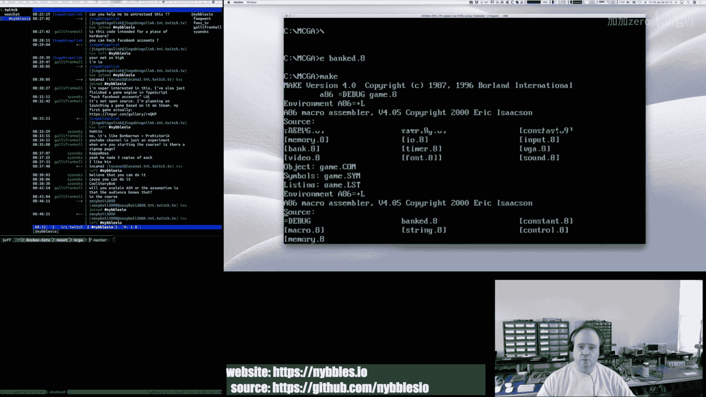

```assembly
; 定义文本字段宏
def_text_field BANK_FILENAME, 11, 0, 20, offset valid_filename_keys
```


有效键列表定义了该字段允许输入的字符（例如，对于文件名，是字母、数字和点）。列表中的每个条目包含扫描码和对应的ASCII字符。

文本输入处理函数将：
1.  检查是否有活动的文本字段。
2.  从键盘缓冲区读取输入。
3.  验证按键是否在有效键列表中。
4.  根据按键更新缓冲区（插入字符、移动光标、删除等）。
5.  处理回车（确认）和ESC（取消）键，并调用文本字段的回调函数。

光标（一个闪烁的插入符）的绘制是独立的，其位置由活动文本字段的当前光标索引决定。

---

## 核心游戏引擎功能


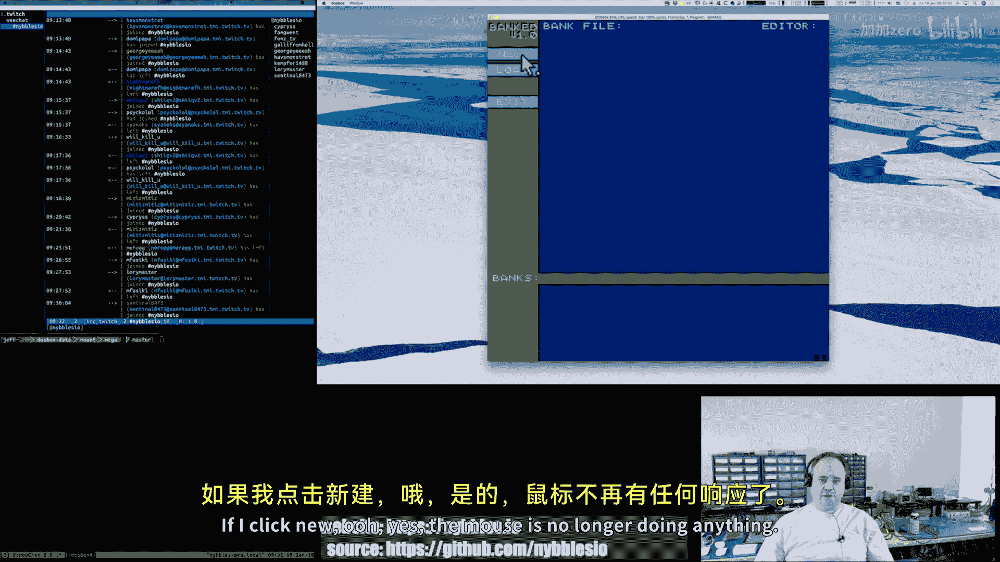

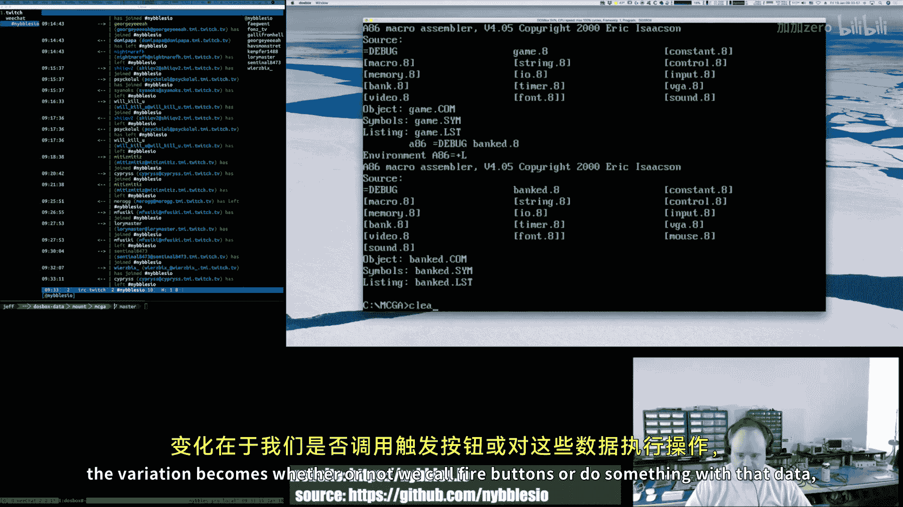


虽然本课重点在编辑器工具，但工具和游戏共享同一个底层引擎。引擎已实现的功能包括：


*   **视频系统**：支持两层背景（带透明度）、精灵（带透明度和调色板）、字体、线条和矩形的绘制。渲染目标是后台缓冲区，然后快速翻页（flip）到VRAM。
*   **输入系统**：键盘和鼠标输入已集成，游戏手柄支持待完成。
*   **定时器系统**：基于回调的定时器，用于控制帧率计数、光标闪烁等。
*   **声音系统**：Adlib音乐和Sound Blaster波形输出支持已部分完成。

引擎被设计为既可运行在DOSBox（用于开发/教学），也可移植到真实的复古硬件或我们正在设计的街机板上。


---


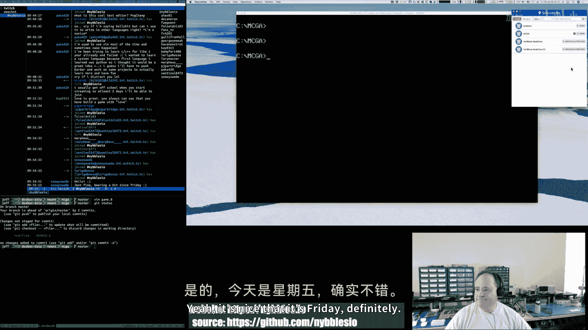

## 总结


本节课中，我们一起探索了一个用x86汇编语言编写的MS-DOS游戏编辑器工具的构建过程。我们从程序启动、分段内存管理和VGA图形模式设置开始，逐步深入到输入系统、用户界面按钮的实现、基于状态机的程序流程控制，以及文本输入系统的设计。

我们学习了如何通过直接操作硬件（如VGA寄存器、键盘中断）来获得高性能，同时也看到了如何组织数据结构和代码来构建一个模块化、可扩展的系统。虽然汇编语言需要关注更多底层细节，但它提供了对机器的完全控制，并且其概念——CPU指令、内存访问、I/O——是理解所有现代软件基础的宝贵知识。


这个“BankEd”工具是通往创建完整复古街机游戏道路上的关键一步，它使我们能够将美术、音乐和关卡数据整合到游戏中。在接下来的课程中，我们将继续完善这个工具，并最终使用它来构建我们的游戏。