# 003：回顾、TODO与BANKED工具编码 🛠️

## 概述

在本节课中，我们将回顾一个正在进行的x86汇编语言项目，该项目旨在为MS-DOS环境开发一款街机游戏。我们将重点讨论项目结构、内存管理、以及一个名为“BANKED”的数据编辑工具的编码实现。该工具用于管理游戏资源（如图块、精灵、声音等），并将其组织成称为“银行”的逻辑单元。


---

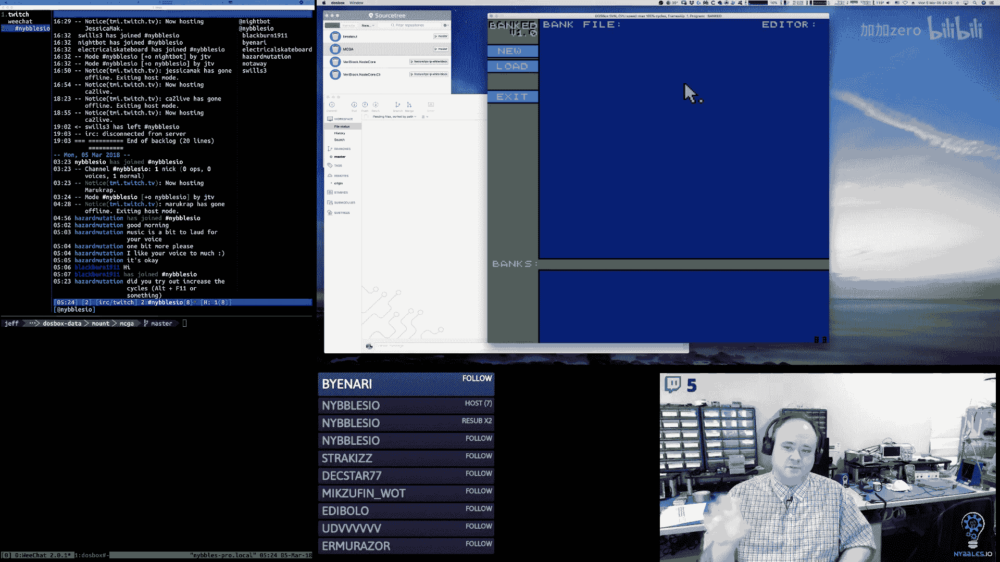


## 项目背景与目标

上一节我们介绍了项目的基本情况。本节中，我们来看看项目的核心目标：创建一个教育性的视频系列，从零开始教授汇编语言编程，并以一个完整的街机游戏作为实践项目。


这个项目使用DOSBox作为运行环境，并采用VGA的13H模式（256x256分辨率，256色）。游戏引擎已经具备了背景控制、精灵显示、输入处理和帧率显示等基础功能。

目前，游戏引擎主要缺少声音部分，但更紧迫的需求是**游戏数据**。我们需要一个工具来创建和编辑这些数据，这就是“BANKED”工具的作用。

---

## 内存管理模型

在深入工具之前，我们需要理解MS-DOS下`.COM`程序的内存模型，这是数据存储和加载的基础。

一个`.COM`程序从地址 `100h`（即十进制256）开始加载。从 `0` 到 `100h` 的区域称为**程序段前缀（PSP）**。这意味着我们的代码和数据初始时被限制在大约64KB的空间内。

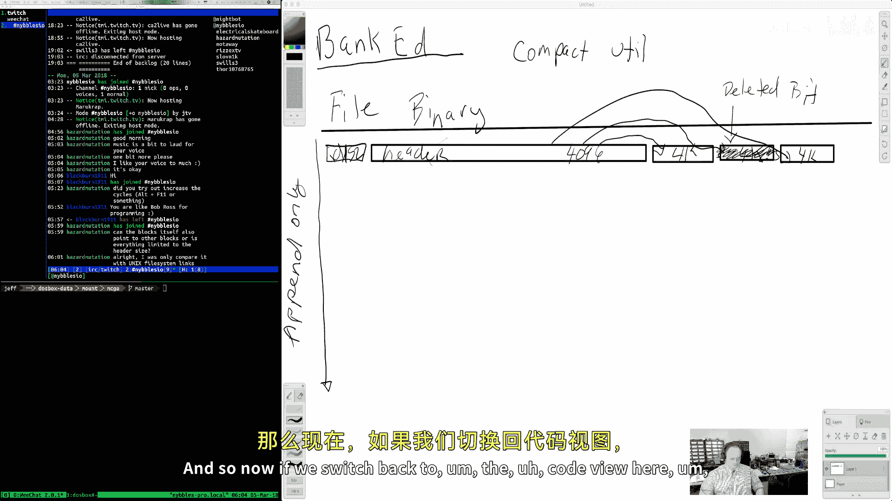

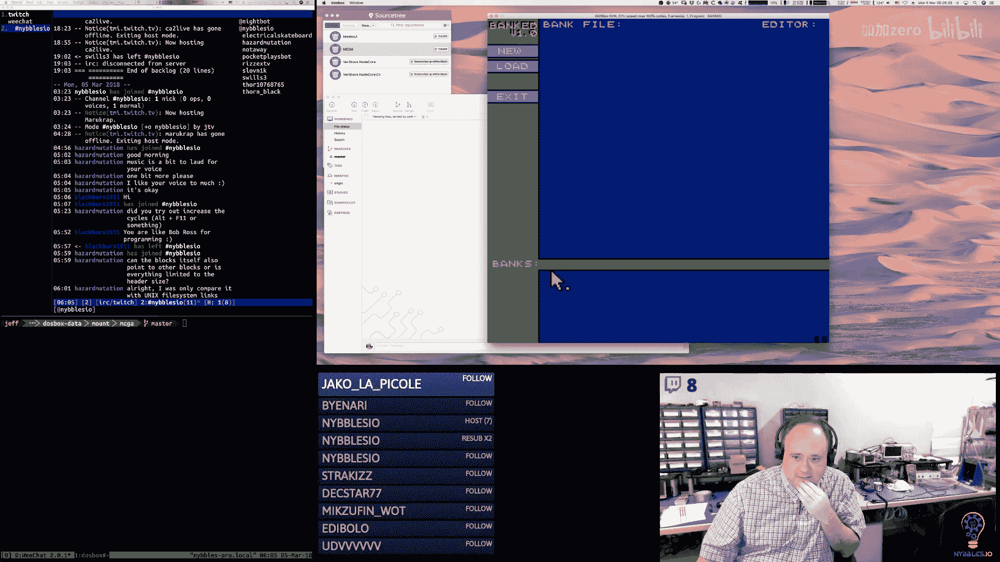

**公式**：`可用内存 ≈ 64KB - 256字节`

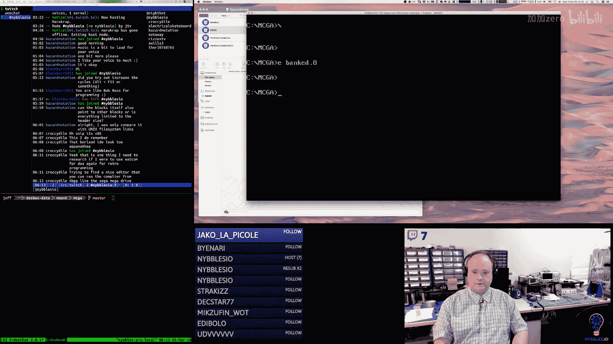

然而，DOS会将控制权完全交给程序，允许我们访问全部的**1MB常规内存**。虽然采用的是分段内存模型，但一旦理解，管理起来并不复杂。

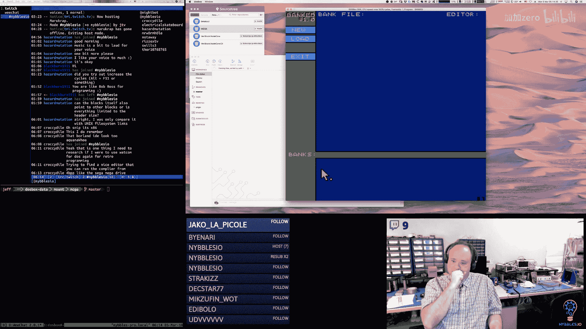

我们可以分配额外的内存段来存储数据。例如，游戏引擎已经分配了以下几个段：
*   **一个段**用于代码和少量控制数据（初始的64KB内）。
*   **一个段**作为**后缓冲区**，用于绘图（因为特定的VGA模式无法直接写入）。
*   **一个段**作为**控制RAM**，存放游戏状态、指针和定时器。
*   **额外的段**用于存储**图块数据**和**精灵数据**。

通过调用自定义的 `allocate` 函数（基于DOS内存分配中断），我们可以动态地在常规内存中预留出这些段。

**代码示例：内存分配**
```assembly
; 假设我们有一个控制RAM指针
control_ram_seg dw ?

; 分配一个16KB的段作为控制RAM
allocate 1024 ; 1024 paragraphs = 16KB
mov [control_ram_seg], ax ; ax返回段地址
```

---

## BANKED工具的设计

现在，我们来看看用于创建游戏资源的“BANKED”工具的核心设计。

### 核心概念：银行与块

工具围绕两个核心概念构建：
1.  **银行**：一个逻辑上的数据集合，例如“所有背景图块”或“所有玩家精灵”。
2.  **块**：银行中固定大小的数据存储单元。我们设计每个块的大小为**4096字节**。


**设计决策**：选择4096字节是为了与x86分段内存模型良好契合。一个内存段是64KB，恰好可以容纳16个这样的块（16 * 4096 = 65536）。这使得将整个银行加载到一个内存段中变得非常高效。

### 文件结构

BANKED工具生成的文件是一个二进制文件，具有以下结构：

1.  **文件头**：一个很小的头部，包含魔数（用于文件识别）和块大小信息。
2.  **银行头块**：一种特殊类型的块，包含银行的元数据。
    *   银行ID和类型。
    *   银行名称。
    *   一个包含16个偏移量的数组，指向属于该银行的**数据块**。
    *   其他标志位（如“脏”标志表示未保存，“删除”标志表示逻辑删除）。
3.  **数据块**：存储实际资源数据（如图块像素、精灵像素）的块。每个块有一个很小的头部（包含类型、ID和标志），后面是有效载荷数据。

**文件布局可视化**：
```
[文件头]
[银行A的头块] -> 指向 [数据块1] [数据块2] ...
[银行B的头块] -> 指向 [数据块3] ...
[数据块1]
[数据块2]
[数据块3]
...
```
*文件是追加式的。编辑现有块时原地更新，添加新数据时追加新块，删除数据时只标记而不立即清理。*

### 工具与游戏的数据加载差异

这是设计中的一个关键点：
*   **在BANKED工具中**：我们需要加载完整的文件结构，包括所有银行头和数据块头，以便进行编辑和管理。
*   **在游戏引擎中**：我们只需要纯数据。游戏会调用一个特殊的加载函数，指定银行ID和目标缓冲区。该函数会定位到相应的银行，然后仅将其数据块的有效载荷部分连续地读入目标缓冲区，忽略所有头信息。这样，游戏内存中得到的就是紧密排列的、可直接索引的图块或精灵数组。

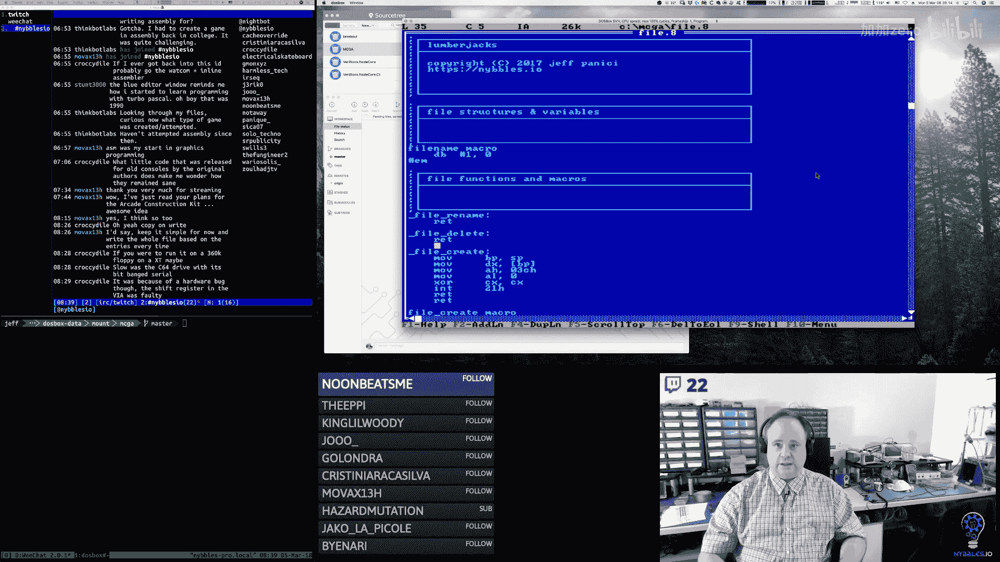


---

## 当前进展与TODO列表

在本次编码会话中，我们主要实现了BANKED工具的基础框架。以下是完成的工作和接下来的任务。

### 已实现的功能

1.  **定义了数据结构**：在汇编代码中定义了银行头块、数据块、文件头的结构体。
2.  **实现了基础内存分配**：为工具本身分配了用于存储银行头信息的内存段。
3.  **创建了文件I/O模块**：封装了DOS中断调用，实现了文件的创建、打开、关闭、读取、写入、定位、重命名和删除。
4.  **实现了银行查找函数**：可以通过银行ID在内存中的银行头段里快速定位到特定的银行头。
5.  **实现了`bank_new`函数**：在工具中创建新银行。它会分配一个完整的64KB段用于存放该银行的未来数据块，并在银行头段中初始化一个银行头记录。
6.  **实现了`bank_file_create`函数**：创建新的银行文件并写入初始文件头。

### 接下来的任务（TODO）

为了使BANKED工具可用，我们需要继续完成以下核心功能：


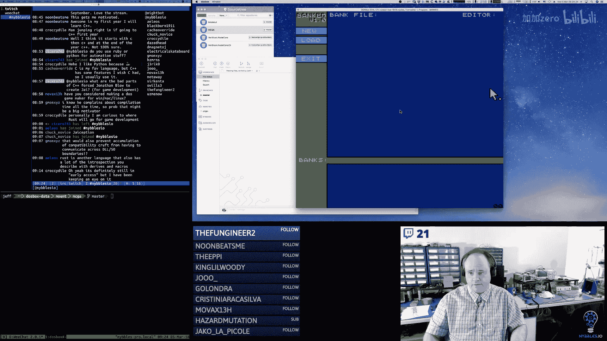

以下是需要实现的功能列表：
*   **错误处理系统**：创建一个查找表，将DOS返回的错误代码转换为可读的字符串，并在工具界面中显示。
*   **文件加载**：实现从磁盘加载现有银行文件到内存结构的逻辑。
*   **文件保存**：实现将内存中的银行数据保存到文件。策略是：写入一个临时文件，遍历所有银行头和数据块，跳过已删除的，然后删除原文件并将临时文件重命名。这同时实现了“压缩”功能。
*   **数据块管理**：实现函数，用于为当前编辑的银行获取或分配新的数据块。
*   **用户界面联动**：将“新建”、“加载”、“保存”按钮与后台的文件操作函数连接起来。完善文本输入框的处理逻辑，用于输入文件名。
*   **实现编辑器视图**：调整工具底部的显示区域，使其能够完整显示一个数据块的内容（例如，128个8x8图块或32个16x16精灵）。实现分页浏览不同数据块的功能。

---

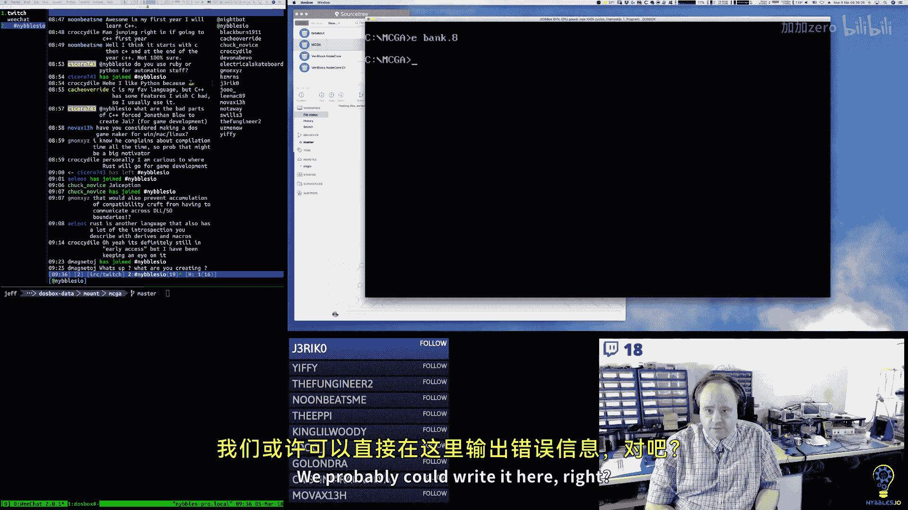

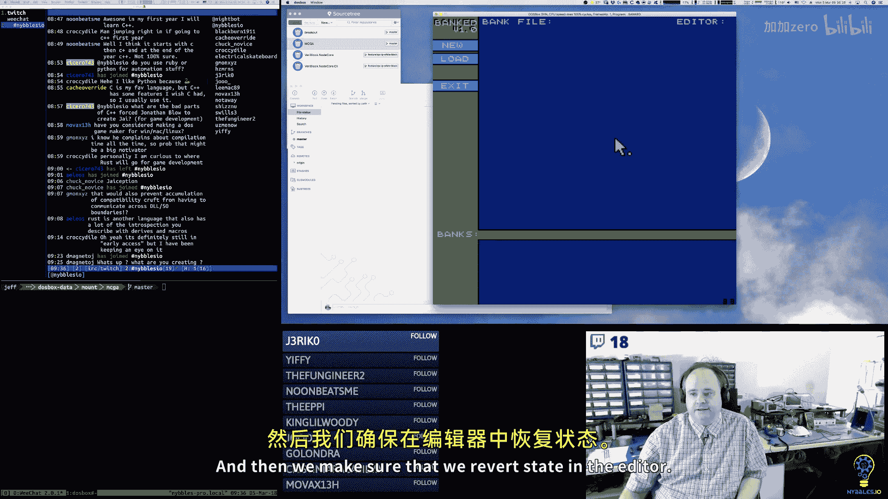


## 总结

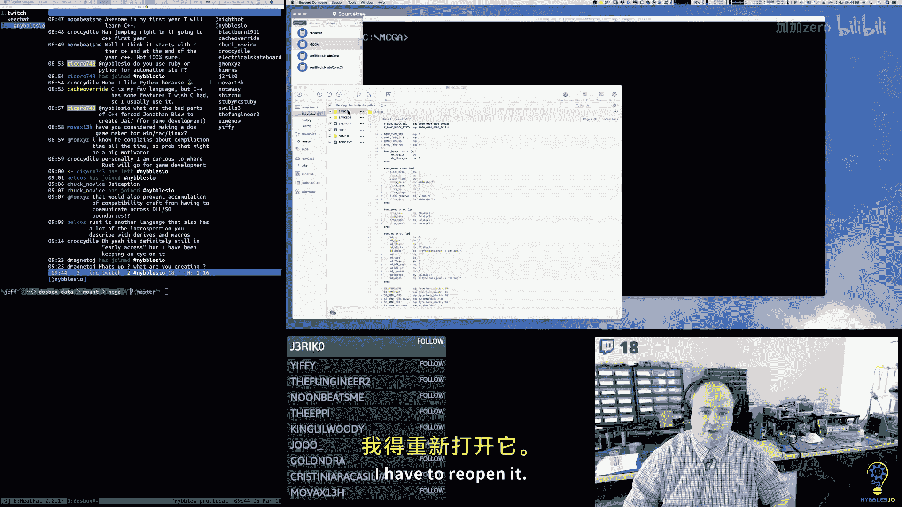


本节课中我们一起学习了如何为一个实际的MS-DOS汇编语言游戏项目设计和实现数据管理工具。我们深入探讨了分段内存模型的实际应用，设计了基于“银行”和“块”的资源管理系统，并开始了BANKED工具的编码工作。

我们完成了数据结构的定义、基础文件操作和银行创建逻辑。接下来的工作将集中在完成文件的加载/保存闭环、错误处理以及用户界面的完善上。一旦工具完成，我们就可以开始创建游戏所需的图形和音频资源，从而推动游戏开发进入下一个阶段。

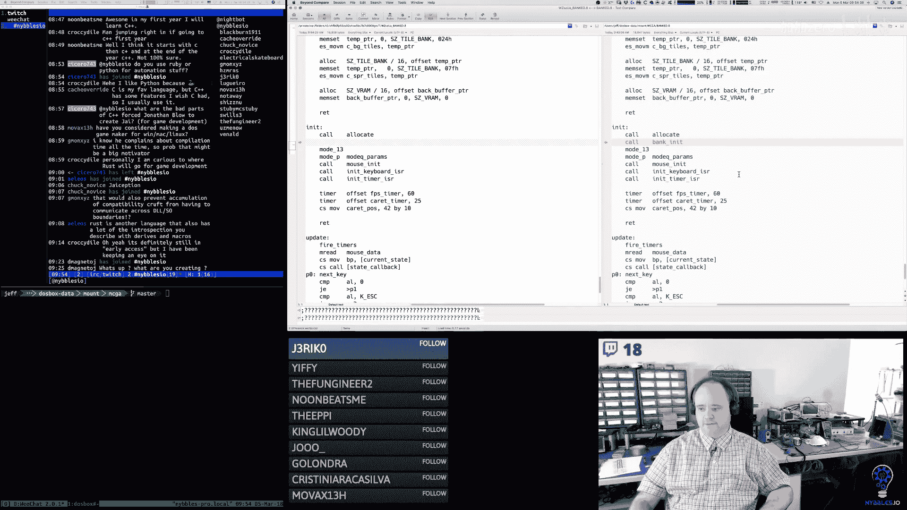


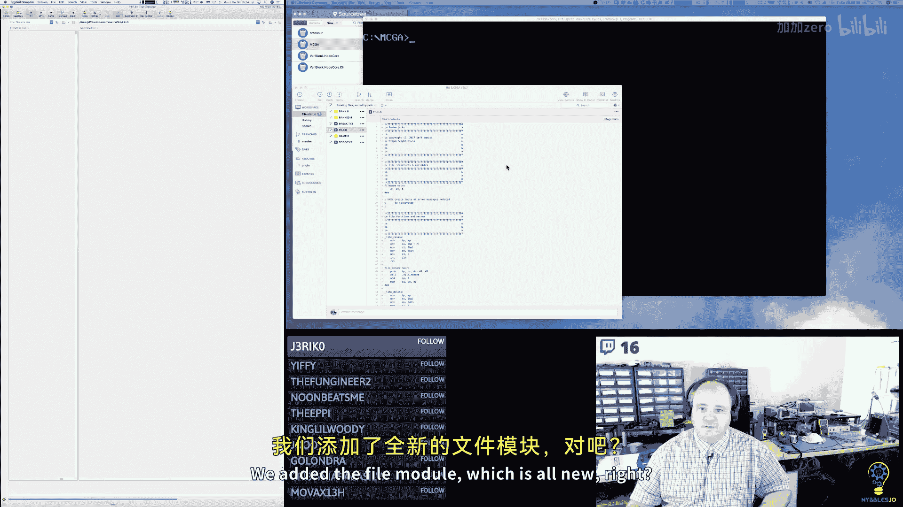


---
*教程内容翻译整理自 nybbles.io 的编程实况流“p03 p2 x86 Assembly： Review, TODO, and BANKED tool coding”。*