# 005：实现更多编辑器状态机


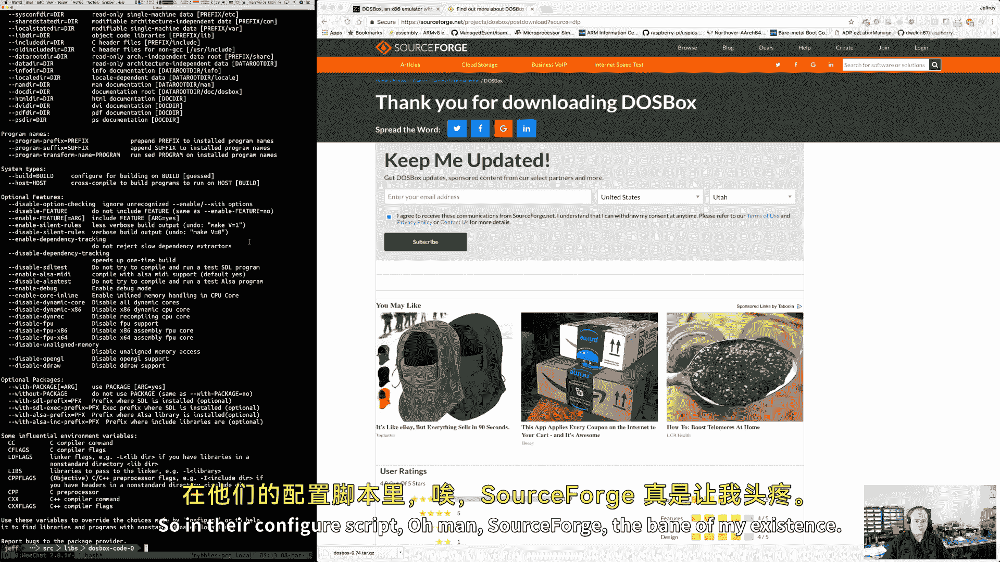

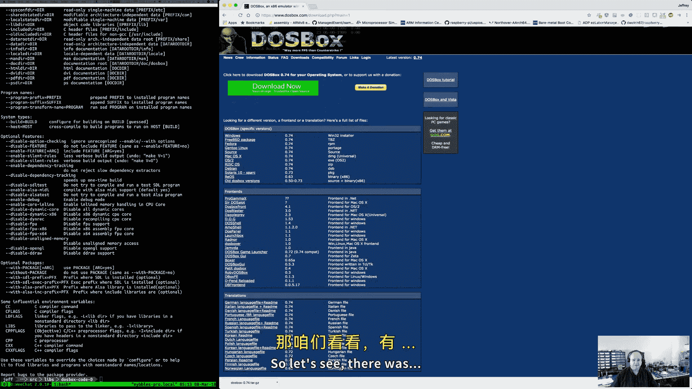

## 概述
在本节课中，我们将继续构建x86汇编语言编辑器。我们将配置DOSBox环境，重构代码以提升模块化，并设计编辑器用户界面的核心布局与交互逻辑。课程将涵盖开发环境设置、代码结构优化以及UI组件的初步实现。


## DOSBox环境配置与构建

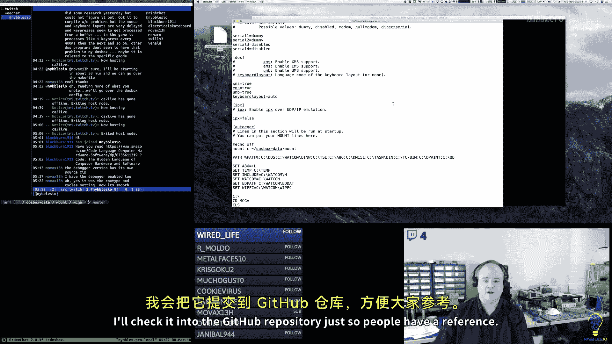

上一节我们介绍了项目背景，本节中我们来看看开发环境的搭建细节。

我使用的DOSBox版本是从其官网下载源代码后自行构建的。构建时启用了内置调试器选项，虽然它功能较为基础，但在项目早期阶段用于调试中断有一定帮助。需要注意的是，标准构建的调试器在中断处理上存在缺陷，我应用了一个社区补丁来修复此问题。

以下是我的DOSBox配置文件（`dosbox.conf`）的核心设置：
```ini
fullscreen=false
fulldouble=false
windowresolution=1920x1280
output=opengl
machine=svga_s3
memsize=16
frameskip=1
aspect=false
scaler=normal2x
core=auto
cputype=pentium_slow
cycles=max
cycleup=10
cycledown=20
```
这些设置旨在模拟接近原始Pentium的环境，并确保图形显示的稳定性。

## 项目结构与构建系统

配置好环境后，我们来看看项目的代码组织方式。

我使用A86汇编器，并通过Makefile管理构建过程。项目主要生成两个.COM文件：游戏引擎和编辑器工具。Makefile利用A86的特性，通过命令行定义条件编译常量。

以下是Makefile的简化结构：
```makefile
# 定义目标和源文件
GAME_SRC = game.8
TOOL_SRC = tool.8


# 使用A86汇编，并定义DEBUG常量
all: game.com tool.com

game.com: $(GAME_SRC)
    a86 $(GAME_SRC) =debug game.com


tool.com: $(TOOL_SRC)
    a86 $(TOOL_SRC) =debug tool.com
```
通过`=debug`这样的语法，我们可以在汇编代码中使用`#if debug`来进行条件编译。

## 代码重构与模块化

在理解了构建系统后，我们开始优化代码结构。之前的代码都集中在主程序文件中，显得臃肿。我将其拆分为多个模块，每个模块负责特定功能，并使用统一的两字符前缀命名规范。

以下是重构后的模块概览：
*   **定时器模块 (`ct_`)**: 处理计时器和回调函数。
*   **按钮模块 (`bt_`)**: 管理按钮的绘制、状态检测和触发逻辑。
*   **文本框模块 (`tf_`)**: 处理文本输入、验证和编辑。
*   **状态机模块 (`st_`)**: 提供状态栈的推送、弹出和检查功能。
*   **消息框模块 (`mb_`)**: 负责消息提示框的显示。

每个模块将内部函数标记为“私有”（以下划线开头），并通过宏提供简洁的公共接口。这种结构提升了代码的可读性和可维护性。

## 状态管理与按钮交互修复

重构代码后，我们遇到了一个具体的交互问题需要解决。


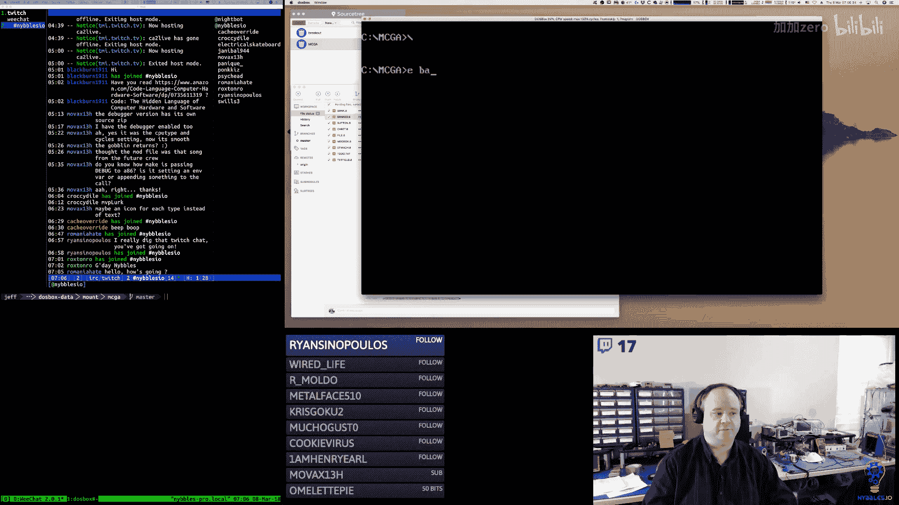

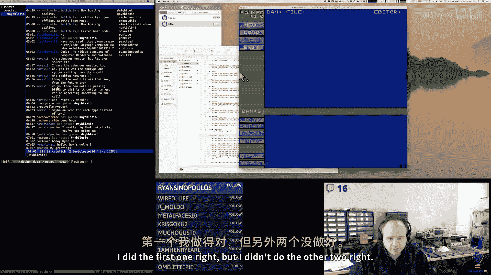


在测试时，点击“加载”按钮会导致程序锁死。问题根源在于鼠标状态轮询与按钮回调之间的时序冲突。按钮按下事件会在多个帧中被反复触发，导致状态函数被递归调用，最终栈溢出。

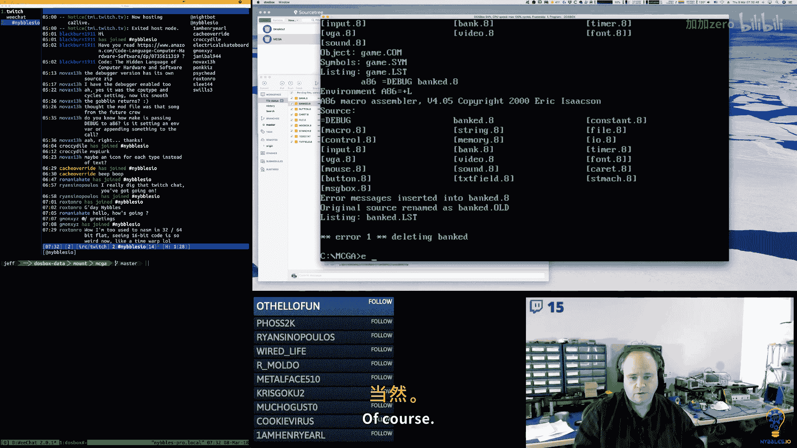

我们通过两个修改解决了这个问题：
1.  **立即禁用按钮**: 在按钮回调函数中，首先将按钮设置为禁用状态，防止其在同一操作中被多次触发。
2.  **添加状态检查**: 在进入新状态前，先检查当前是否已处于该状态。如果是，则不再执行状态推送操作。

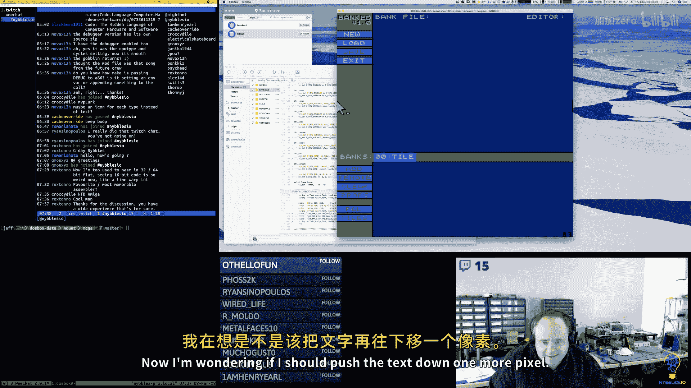

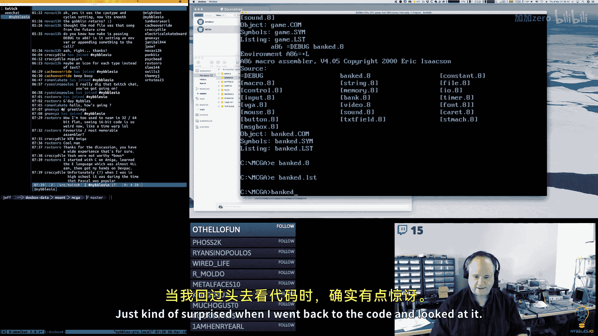

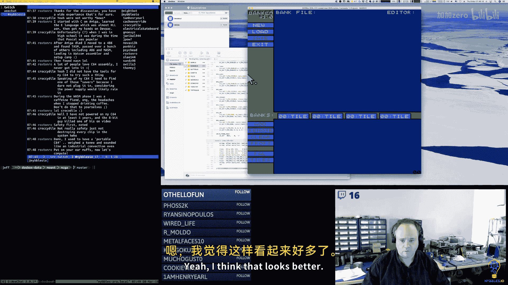

状态检查的宏实现如下：
```assembly
; ST_CHECK 宏：检查栈顶是否为指定状态
; 输入：state - 要检查的状态值
; 输出：AL = 1 (是) 或 0 (否)
ST_CHECK MACRO state
    push bp
    mov bp, sp
    mov al, [st_stack_top]  ; 假设 st_stack_top 指向栈顶
    cmp al, state
    je @is_same
    mov al, 0
    jmp @check_done
@is_same:
    mov al, 1
@check_done:
    pop bp
ENDM
```
这个模式确保了状态转换的稳定性。


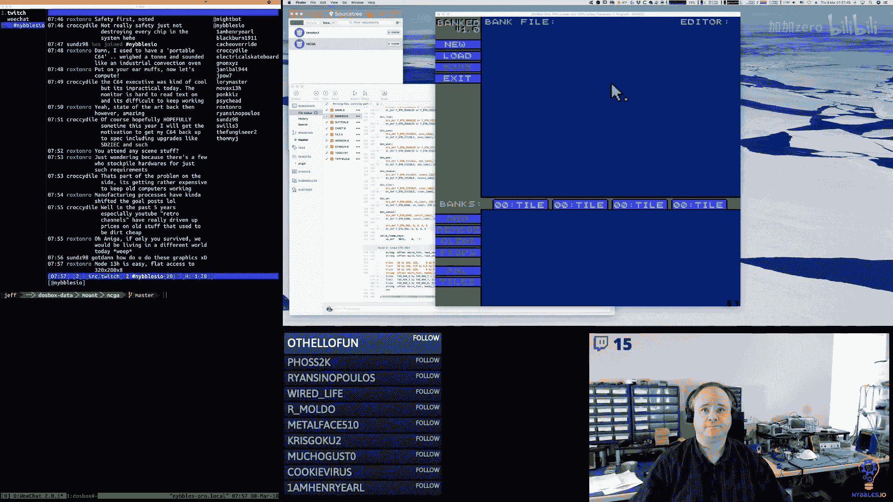


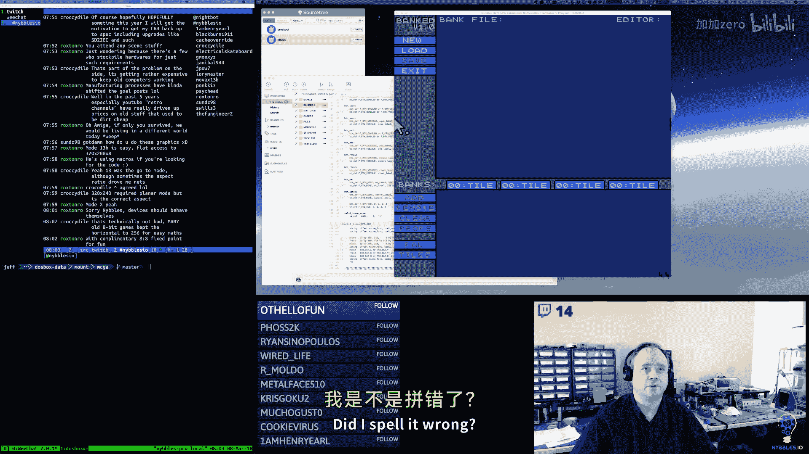


## 编辑器用户界面设计


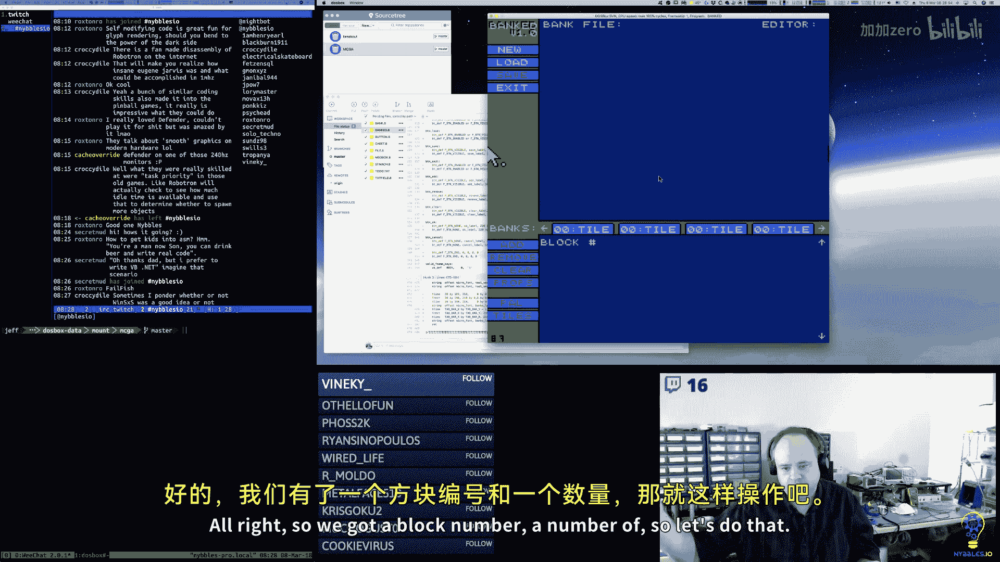

解决了底层交互问题，现在我们可以专注于编辑器的视觉布局和交互设计。

我重新规划了编辑器主界面的布局，以容纳更多功能：
*   **顶部标签栏**: 显示已创建的数据块（如精灵、图块、调色板）标签，支持左右翻页。
*   **中央编辑区**: 根据所选数据类型，显示放大编辑视图（例如像素网格）。
*   **底部面板**: 显示数据块的缩略图网格，并提供块间导航按钮。
*   **侧边控制区**: 放置“添加”、“移除”、“清除”等银行级操作按钮，以及上下文相关的按钮（如“选择调色板”、“选择图块集”）。

我编写了原型代码来绘制标签、导航箭头和编辑网格，以确定合适的尺寸和布局。例如，图块编辑网格可以放大显示8x8像素，而精灵编辑网格则显示16x16像素。

## 数据块管理逻辑设计

界面布局确定后，我们需要设计其背后数据管理的核心逻辑。

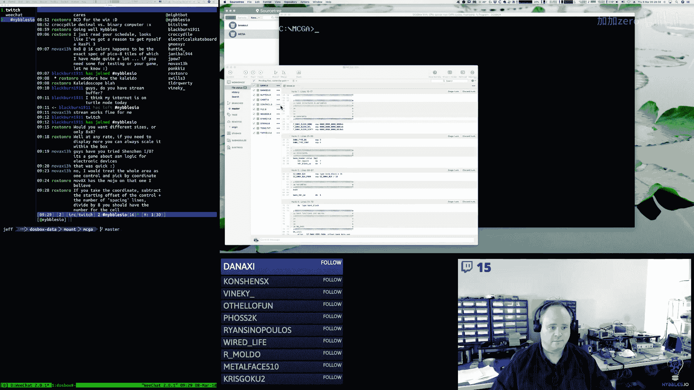

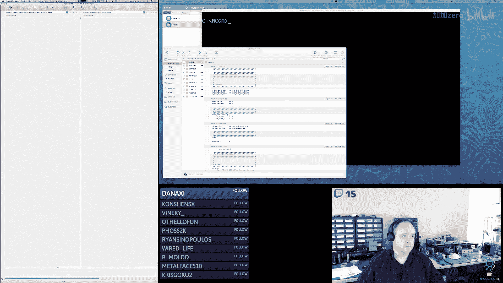

我重新考虑了数据块（Bank）的内存分配策略。最初计划为每个数据块分配完整的64KB段，但这对于调色板（约1KB）或背景（约4KB）等小型数据会造成浪费。

新的方案是：在创建数据块时，根据其类型指定所需的最大块数（每块4KB）。例如，精灵和图块库可能需要16块，而调色板只需1块，背景可能需要2块。

此外，为了处理数据块删除可能产生的内存碎片，我们采用了一种“压缩”策略：当删除一个数据块时，程序会在内存中将剩余有效数据块重新紧凑排列，模拟垃圾回收的效果，以保持内存使用的连续性。

## 下一步行动计划

基于以上设计和原型，我们制定了接下来的实现步骤：
1.  **扩展按钮结构**: 支持背景色、边框色定义，以及“仅文本”、“无渲染”等标志，用于导航箭头等特殊按钮。
2.  **实现网格选择逻辑**: 创建新的数据结构，用于处理在缩略图网格上的鼠标点击，计算对应的行、列索引。
3.  **修改数据块头结构**: 在头信息中存储该数据块分配的最大块数。
4.  **实现用户界面联动**: 完成“新建”、“添加”按钮的完整流程，使点击后能创建数据块并更新标签栏显示。
5.  **完善编辑器视图**: 根据所选数据块类型，切换并渲染对应的编辑界面（像素编辑器、调色板编辑器等）。


## 总结
本节课中我们一起学习了如何配置和优化x86汇编开发环境，通过重构代码提升了项目的模块化程度，并深入设计了编辑器工具的用户界面与核心数据管理逻辑。我们解决了状态机中的交互缺陷，规划了内存分配策略，并绘制了UI原型。下一步将着手实现这些设计，逐步构建出一个功能完整的图形化资源编辑器。