# 006：将数据块连接到用户界面


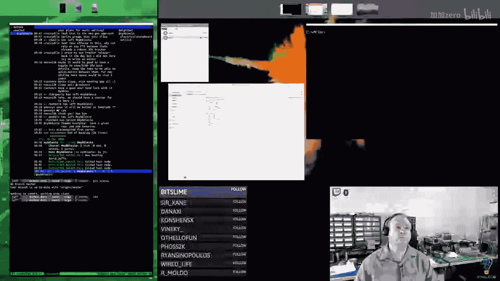


在本节课中，我们将继续为MS-DOS街机项目编写x86汇编代码。我们将重构原型代码，创建状态回调函数，并将功能模块化，以便更清晰地管理不同的数据块（如瓦片、精灵、字体）的编辑状态。核心任务包括：将标签栏和查看器分离，实现基于状态的动态回调机制，以及为按钮系统添加更多自定义功能。


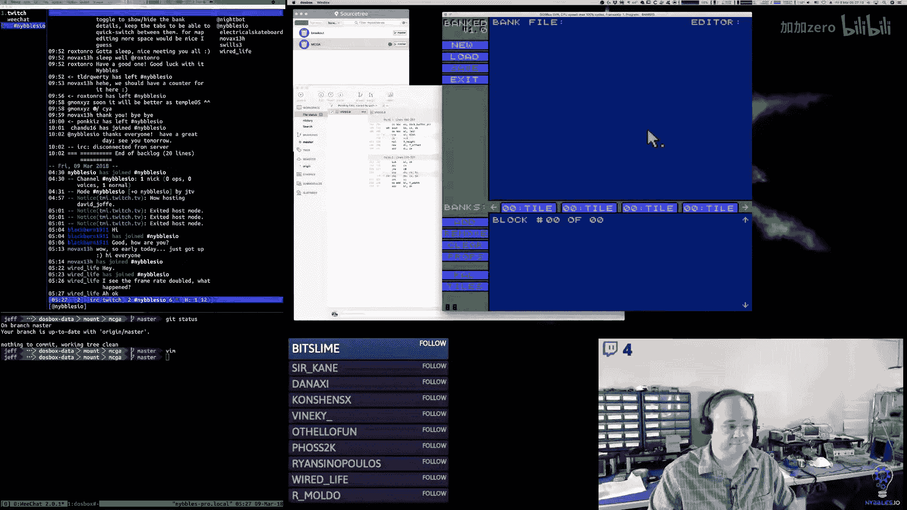


## 概述

上一节我们完成了用户界面的基础框架。本节中，我们将重点重构代码，将标签栏、数据块查看器和编辑器逻辑分离。我们将创建一个状态系统，根据用户选择的标签（如瓦片、精灵、字体）动态调用相应的绘图和处理器函数。同时，我们还将增强按钮系统，支持仅显示文本的按钮和自定义背景/边框颜色。

## 重构标签栏与查看器

首先，我们需要将绘制标签栏和下方查看器区域的代码从主绘制函数中分离出来，形成独立的函数和宏。

### 创建标签绘制函数


我们创建了 `draw_tab` 函数来绘制单个标签，以及 `draw_tabs` 宏来循环绘制所有标签。标签现在可以显示为激活或非激活状态，颜色会相应变化。

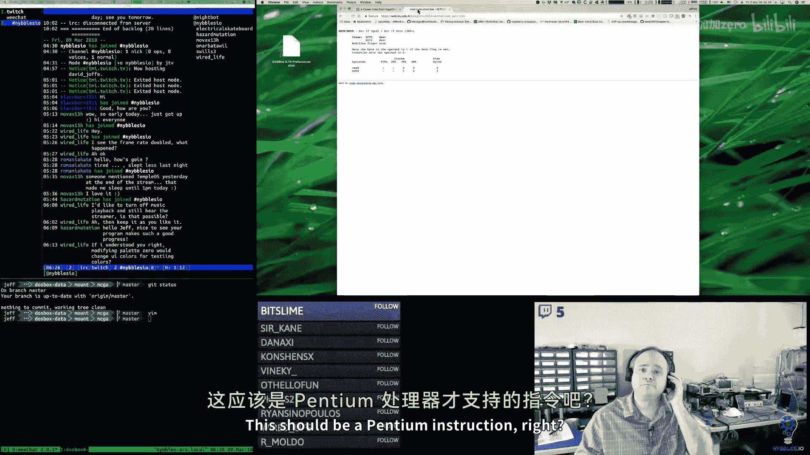

```assembly
; 伪代码示例：绘制标签的逻辑
draw_tab:
    ; 从栈中获取标签编号和位置
    ; 比较标签编号与当前选中的标签变量
    setz_m al, selected_tab  ; 自定义宏：如果相等，al=1，否则al=0
    ; 根据al的值设置背景色和文字颜色
    ; 绘制标签矩形和文字
    ret
```

### 实现查看器回调机制

我们引入了一个函数指针变量 `viewer_callback`。根据当前所处的状态（如瓦片编辑状态、精灵编辑状态），我们将该指针设置为对应的绘图函数。主循环中的查看器绘制代码会检查这个指针，如果不为空，则调用它来绘制特定内容。


```assembly
; 伪代码示例：查看器绘制逻辑
draw_viewer:
    ; 绘制公共的控制元素（如上下箭头、区块标签）
    ; 检查 viewer_callback 是否为空
    cmp [viewer_callback], 0
    je .skip_callback
    call [viewer_callback] ; 调用状态特定的绘图函数
.skip_callback:
    ret
```

## 参数化通用编辑器

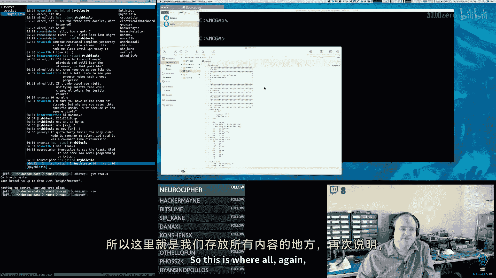


由于瓦片、精灵和字体本质上都是基于网格的图形，我们可以使用同一个编辑器，只需传入不同的参数（如单元尺寸、放大像素尺寸）进行配置。


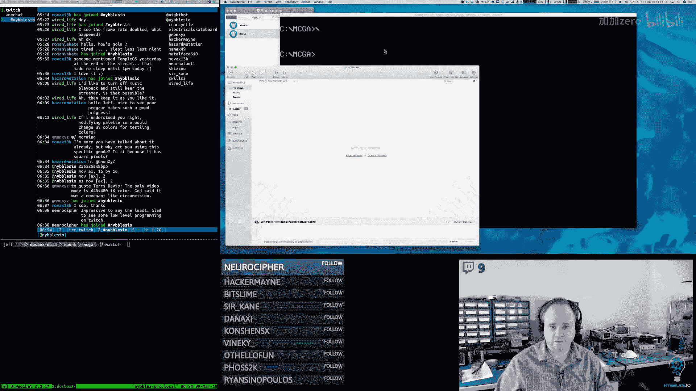

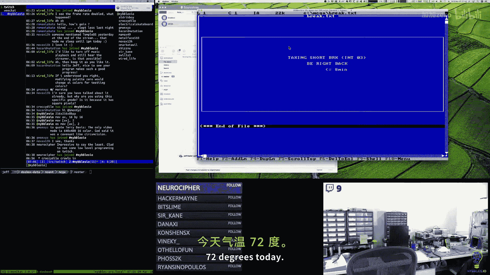

我们创建了 `tile_ed_draw` 函数，它接受尺寸参数，从而能够绘制8x8、16x16等不同规格的网格。

```assembly
; 伪代码示例：参数化绘图调用
; 对于瓦片库：尺寸为8，放大像素为15
push 15
push 8
call tile_ed_draw
; 对于精灵库：尺寸为16，放大像素为8
push 8
push 16
call tile_ed_draw
```

## 增强按钮系统

为了支持更灵活的UI，我们改进了按钮系统。


### 添加“仅文本”按钮标志

我们为按钮数据添加了一个 `BUTTON_TEXT_ONLY` 标志。当设置此标志时，按钮只绘制文本，不绘制背景框和边框。这使得我们可以创建看起来像普通标签但具有按钮功能的控件（如翻页箭头）。

### 支持自定义背景和边框颜色

按钮宏现在接受独立的背景色和边框颜色参数，允许我们为不同类型的按钮（如数据块类型选择按钮）设置不同的视觉样式，使其更突出。

```assembly
; 更新后的按钮宏示例
button_def BUTTON_PREV, BUTTON_ENABLED|BUTTON_TEXT_ONLY, "<", (248<<8)|85, 6, 6, 0, 0, prev_callback
```

### 按钮绘制逻辑重构

绘制函数被重写，首先检查 `BUTTON_TEXT_ONLY` 标志。如果是仅文本按钮，则跳过绘制背景和边框的步骤，直接绘制文本。否则，按照常规流程先绘制带颜色的矩形框，再绘制文本。

## 实现数据块类型选择界面

我们设计了一个弹出式小窗口，用于在添加新数据块时选择类型（瓦片、精灵、字体、调色板等）。这个窗口本身由按钮构成，点击任一按钮将触发创建对应类型数据块的回调函数。

我们创建了 `pick_box_draw` 函数来绘制这个选择框，并为其内部的每个类型选项创建了对应的按钮。


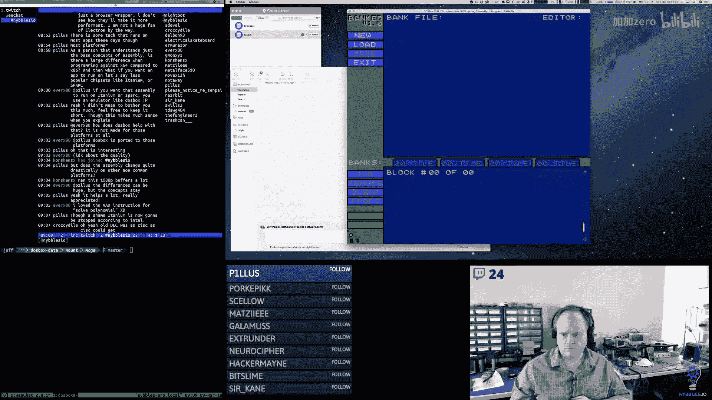

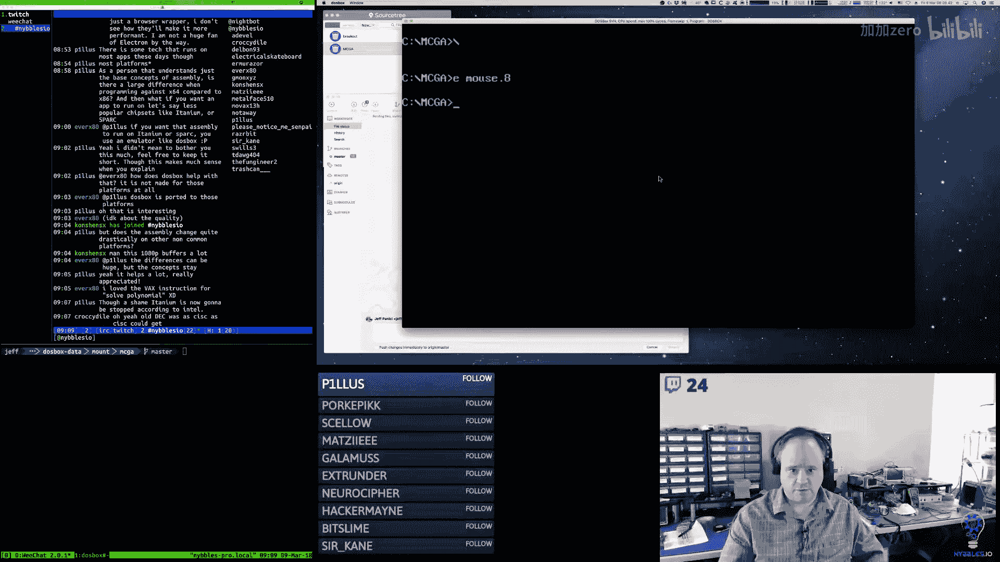


## 修复鼠标光标裁剪问题


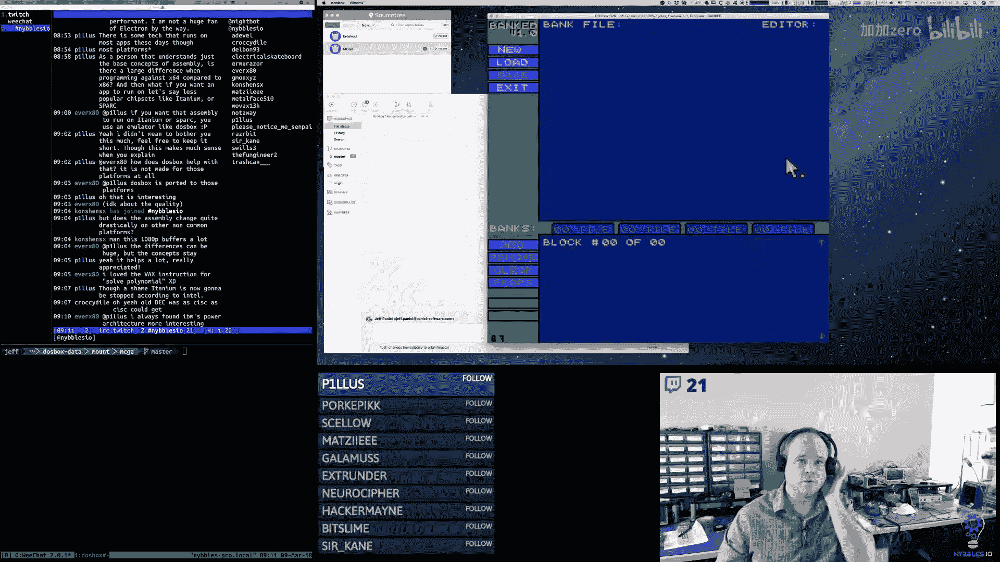


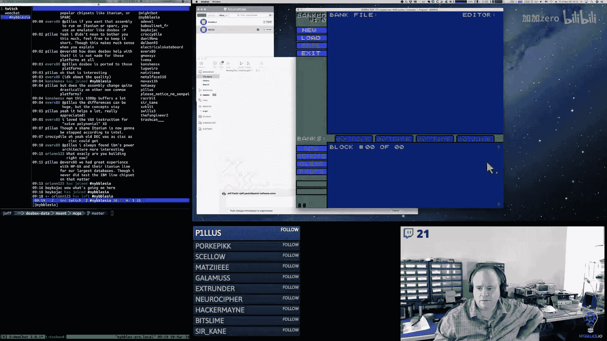

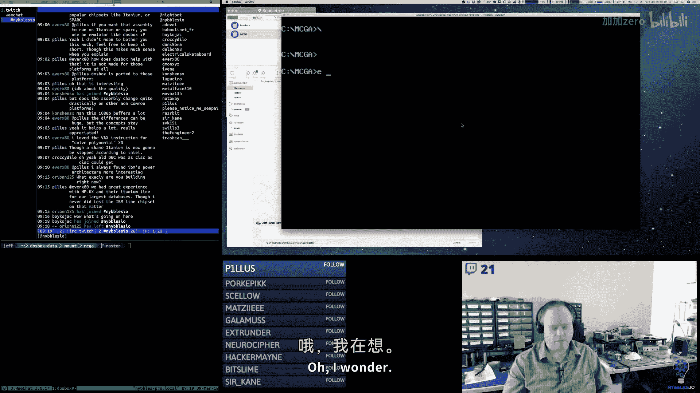

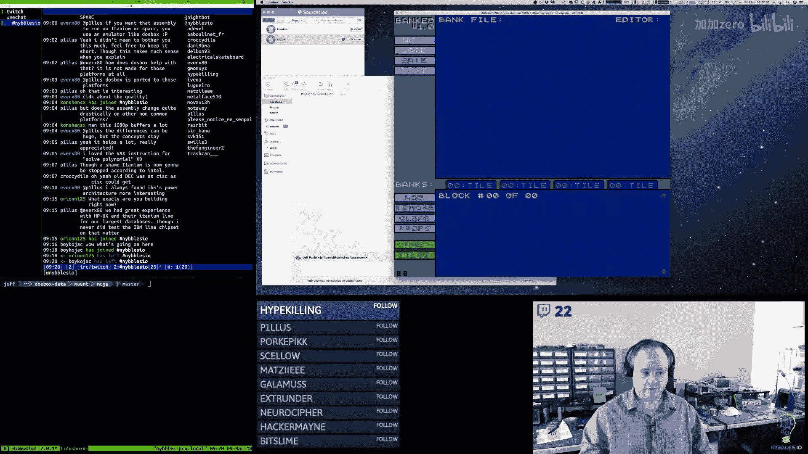

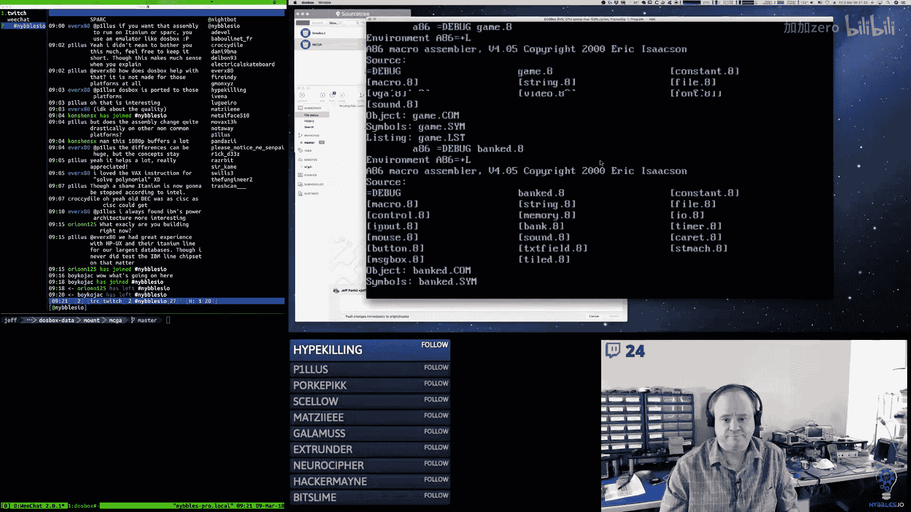


在完善UI的过程中，我们发现鼠标光标在屏幕边缘绘制时会出现裁剪错误。我们修改了鼠标绘制代码，添加了对Y轴和X轴的边界检查，确保光标不会绘制到屏幕可视区域之外。

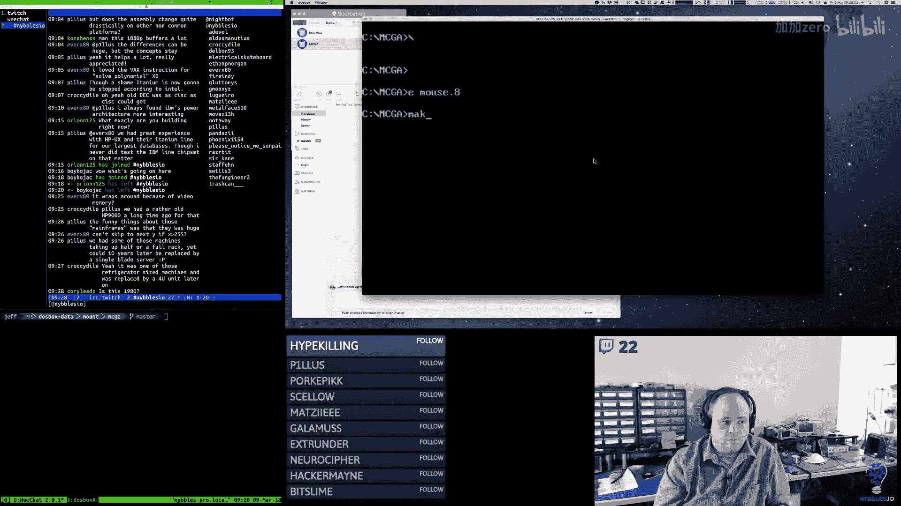


核心思路是在绘制每个像素前，检查其坐标是否超出屏幕边界（对于256x256的图形模式，边界是255）。如果超出，则跳过该像素的绘制。


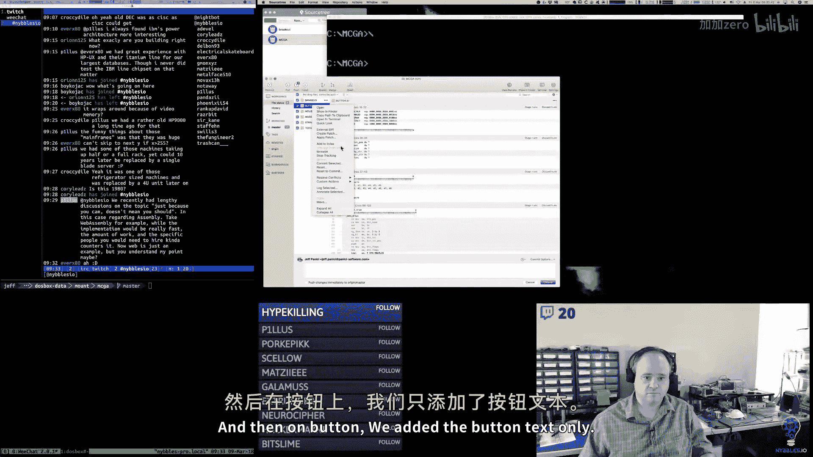

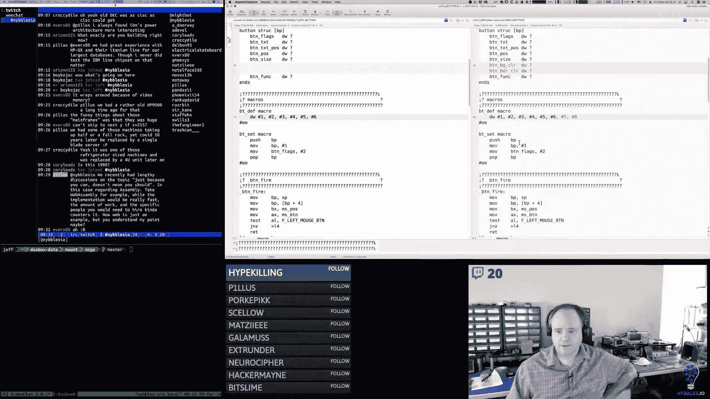

```assembly
; 伪代码示例：鼠标绘制的裁剪逻辑
draw_mouse:
    ; 获取鼠标位置 (X, Y)
    ; 检查 Y+16 是否 > 255
    ; 检查 X+16 是否 > 255
    ; 在循环内部，如果当前行或列的像素坐标超出边界，则调整循环或跳过绘制
    ret
```


## 添加字符串复制功能

为了方便UI中的文本处理，我们添加了一个 `string_copy` 函数和对应的宏。它允许我们将一个字符串复制到另一个内存位置，这在填充对话框或消息时非常有用。

```assembly
; 字符串复制宏示例
string_copy length, source, destination
```

## 总结

本节课中我们一起学习了如何将用户界面与底层数据块管理连接起来。我们通过重构代码，建立了清晰的状态回调机制，使得标签选择能够动态切换不同的编辑视图。我们增强了按钮系统，使其支持更丰富的视觉样式和功能。此外，我们还开始构建数据块类型选择界面，并解决了鼠标绘制的边缘裁剪问题。

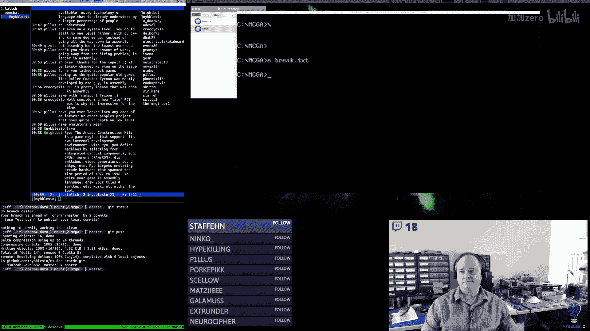

这些工作为工具的核心功能——创建、查看和编辑不同的图形数据块——奠定了坚实的基础。下一节，我们将继续完善数据块的创建和文件操作逻辑。