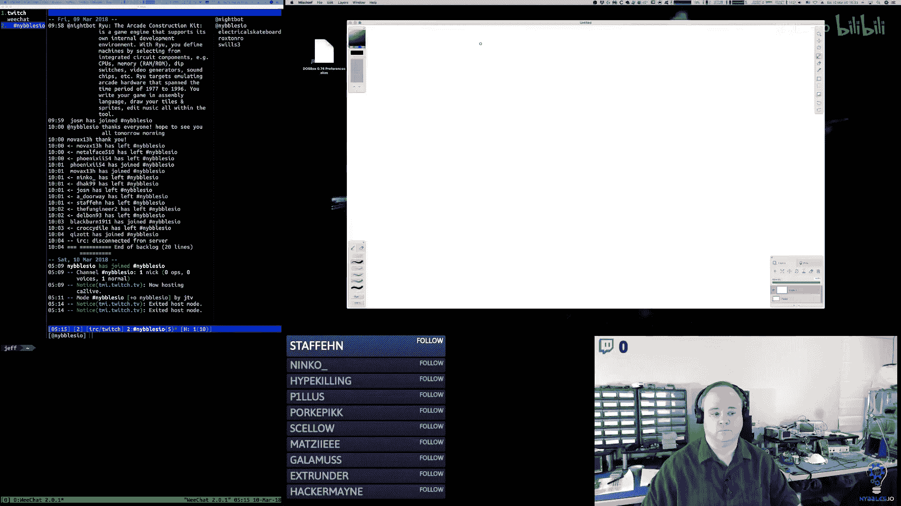
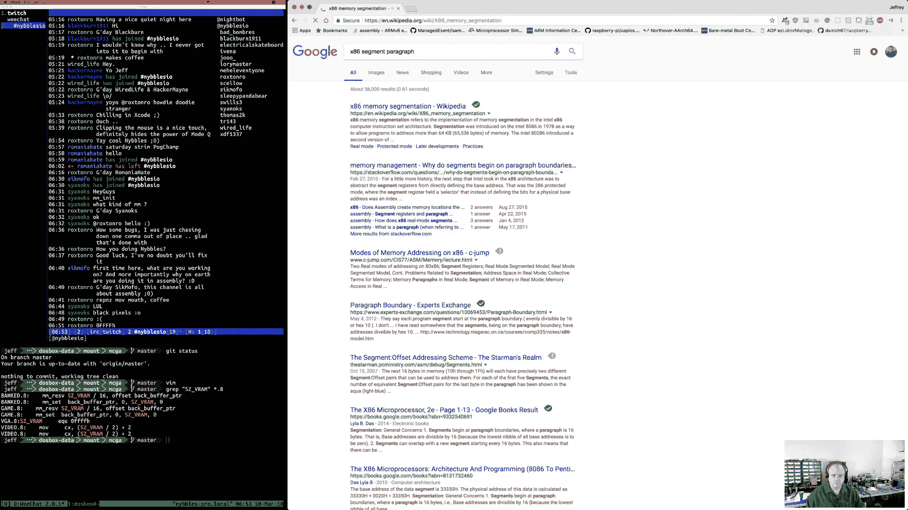
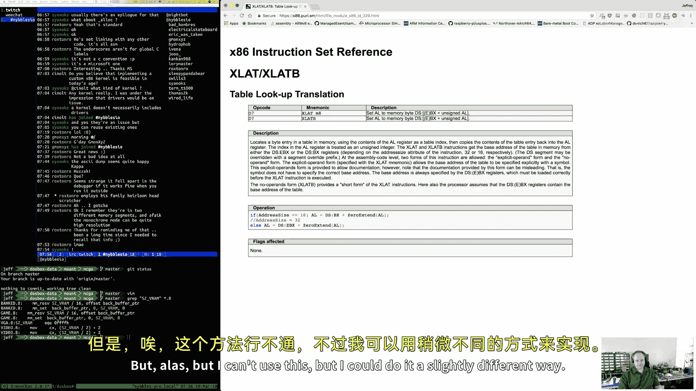
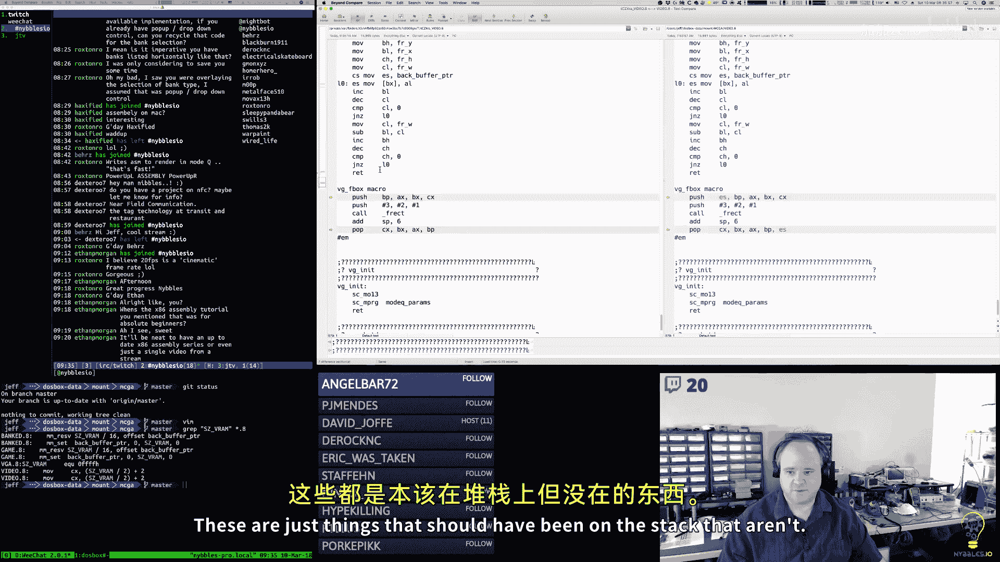
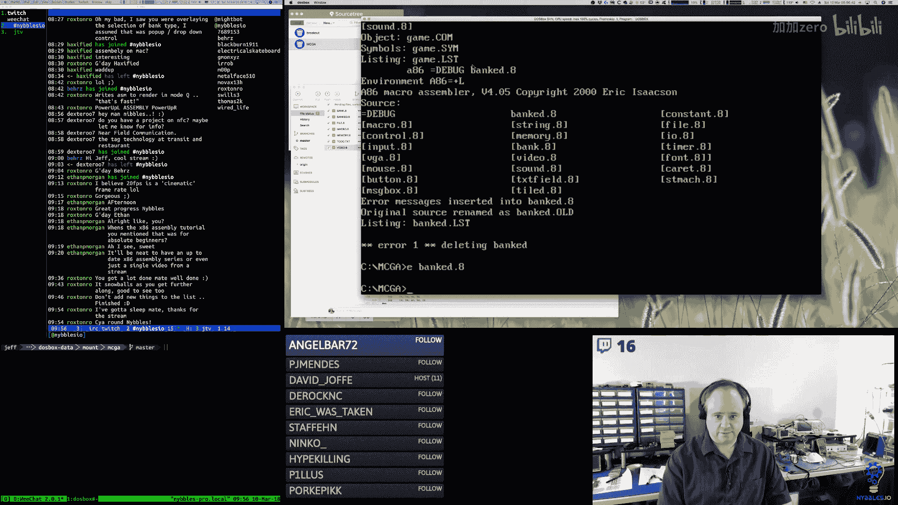
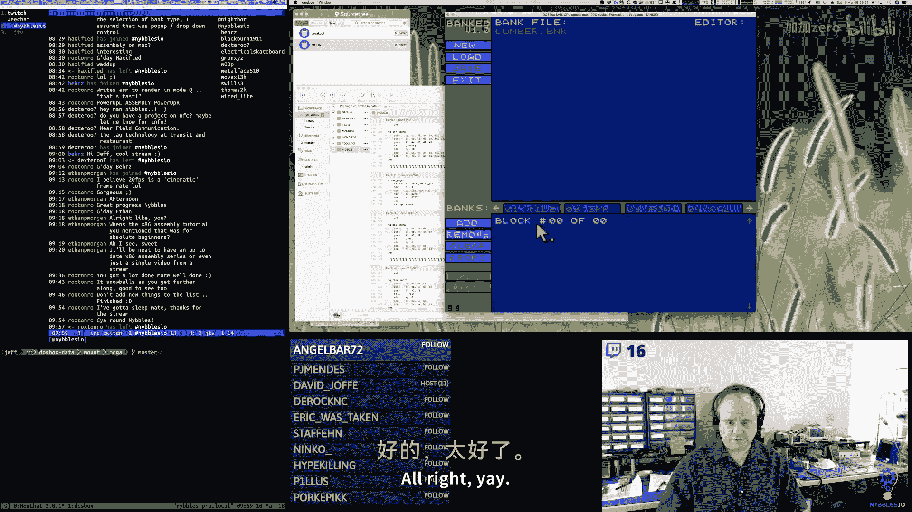
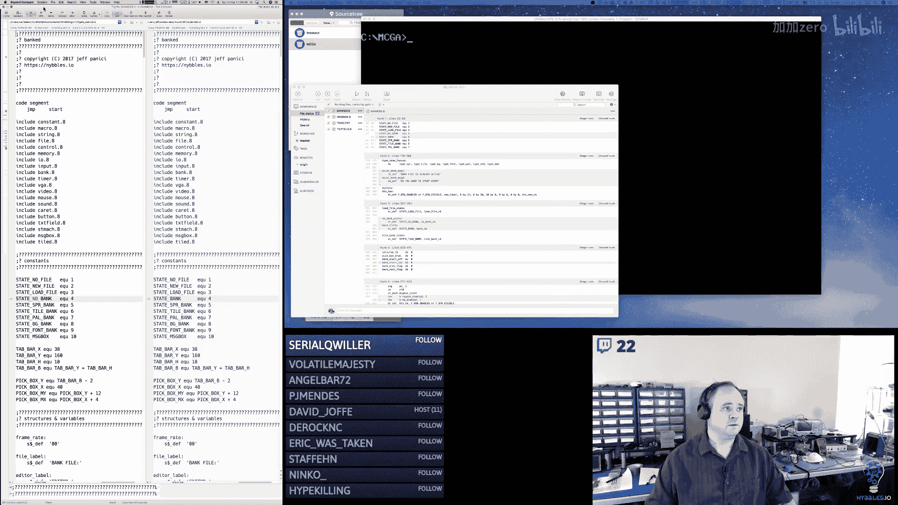
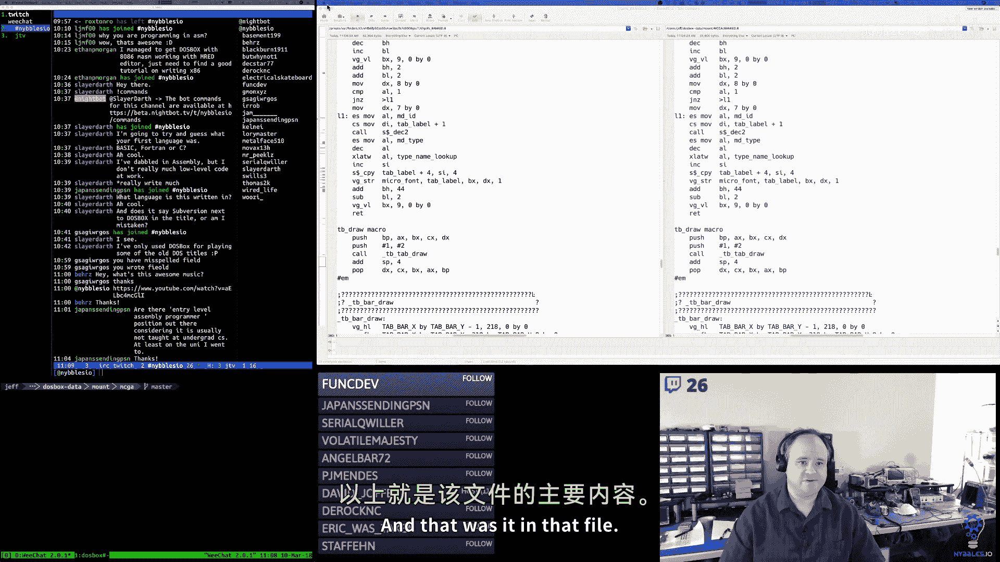
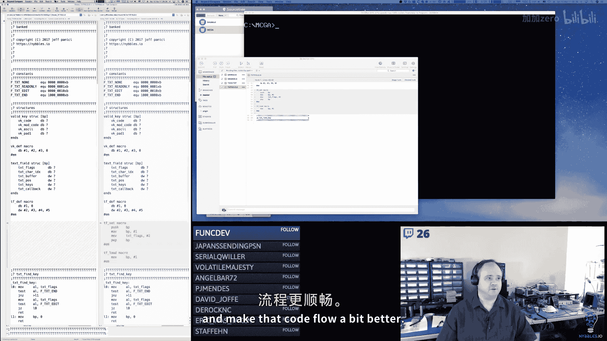
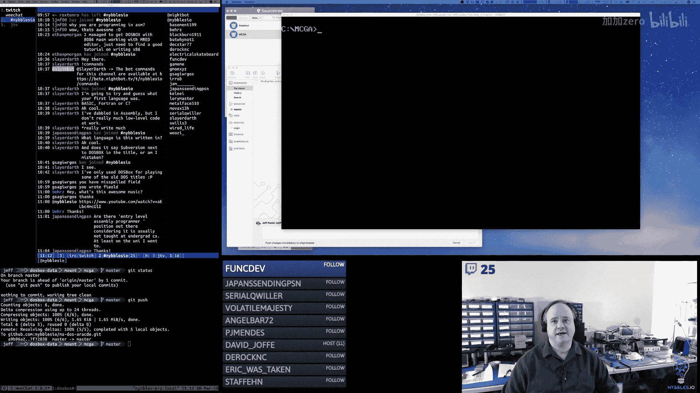

# 007：将存储库连接到用户界面（第二部分）




## 概述
在本节课中，我们将继续学习如何将存储库（banks）系统连接到用户界面。我们将实现标签页的滚动、选择逻辑，并处理创建新文件时的用户确认流程。课程内容涉及内存管理、状态机处理和用户交互。

---

## 上一节回顾与本节目标
上一节我们介绍了存储库系统的基本结构和初始连接。本节中，我们来看看如何实现标签页的滚动浏览、正确的标签选择，以及如何处理用户尝试创建新文件时的确认对话框。

### 核心概念：内存段与偏移量
在x86实模式下，内存访问通过**段寄存器**和**偏移量**的组合来实现。一个段的大小是64KB，起始地址是16字节（一个段落）的倍数。

**公式**：
`物理地址 = 段寄存器值 * 16 + 偏移量`

例如，如果 `ES = 0x3CBE`，`DI = 0x0100`，那么访问的物理地址是：
`0x3CBE0 + 0x0100 = 0x3CCE0`


### 核心概念：状态机
用户界面使用一个简单的**状态机**来管理不同的屏幕和模式（例如，主界面、文件命名、消息框）。状态被压入一个栈中，当前活动的状态是栈顶的状态。




**代码示例**（状态检查）：
```assembly
; 检查当前是否处于“bank”状态
mov ax, [state_current]
cmp ax, STATE_BANK
je .in_bank_state
```

---

## 实现标签页滚动与选择

### 滚动偏移量管理
为了实现标签页的左右滚动，我们引入了一个变量 `bank_start_offset`。它表示当前显示的第一个存储库头在内存块中的偏移量。

**代码示例**（更新滚动偏移量）：
```assembly
; “上一个”按钮回调（向左滚动）
bank_previous:
    push ax
    mov ax, [bank_start_offset]
    cmp ax, 0
    je .done                  ; 如果已经在开头，则不做任何操作
    sub ax, SIZE_BANK_BLOCK  ; 减去一个存储库块的大小
    mov [bank_start_offset], ax
.done:
    pop ax
    ret


; “下一个”按钮回调（向右滚动）
bank_next:
    push ax
    mov ax, [bank_start_offset]
    mov bx, [bank_headers_offset] ; 已使用的存储库头总偏移量
    sub bx, SIZE_BANK_BLOCK       ; 指向最后一个有效块
    cmp ax, bx
    jae .done                     ; 如果已经到达末尾，则不做任何操作
    add ax, SIZE_BANK_BLOCK       ; 增加一个存储库块的大小
    mov [bank_start_offset], ax
.done:
    pop ax
    ret
```



### 标签选择逻辑修正
当用户点击一个标签时，我们需要计算出该标签对应的实际存储库索引。这需要将标签的序号（1-4）与当前的滚动起始索引相加。

**代码示例**（处理标签点击）：
```assembly
; 假设按钮回调传递了标签号（1-4）在 AL 中
handle_tab_click:
    mov bl, al                     ; BL = 标签号 (1-4)
    dec bl                         ; 转换为0基 (0-3)
    mov al, [bank_start_index]     ; 获取当前滚动起始索引
    add al, bl                     ; AL = 实际存储库索引
    mov [selected_bank], al        ; 存储选中的存储库
    ; ... 后续更新UI逻辑 ...
```

### 绘图例程的调整
在绘制标签时，绘图函数需要知道从哪个存储库头开始绘制，以及当前选中的是哪一个。

**代码示例**（标签绘图循环）：
```assembly
draw_tabs:
    mov es, [bank_headers_seg] ; ES 指向存储库头段
    mov bp, [bank_start_offset] ; BP 作为当前绘制偏移量
    mov cx, 4                   ; 最多绘制4个标签
.draw_loop:
    ; 检查是否到达有效存储库头的末尾
    cmp byte [es:bp], 0         ; ID为0表示空槽位
    je .exit
    ; 调用绘制单个标签的例程，传递 BP（偏移量）和 CX（标签序号）
    call draw_single_tab
    add bp, SIZE_BANK_BLOCK     ; 移动到下一个存储库头
    loop .draw_loop
.exit:
    ret
```

---

## 处理新文件创建的确认流程

### 消息框全局状态
为了避免状态栈的复杂操作，我们使用全局变量来处理消息框的结果。

**定义全局变量**：
```assembly
mb_action_flag db 0    ; 0=无动作，1=有动作发生
mb_result_flag db 0    ; 0=取消，1=确定
```


### 消息框检查宏
我们创建一个宏，供其他状态函数检查是否有待处理的消息框操作。

**代码示例**（MB_CHECK 宏）：
```assembly
; 宏：检查消息框动作
; 输出：AL = 0（无动作），1（取消），2（确定）
%macro MB_CHECK 0
    mov al, 0
    cmp byte [mb_action_flag], 0
    je %%no_action
    ; 有动作发生，检查结果
    cmp byte [mb_result_flag], 0
    je %%was_cancel
    mov al, 2                   ; 动作为“确定”
    jmp %%clear_flag
%%was_cancel:
    mov al, 1                   ; 动作为“取消”
%%clear_flag:
    mov byte [mb_action_flag], 0 ; 清除标志
%%no_action:
%endmacro
```

### 新文件回调中的逻辑
当用户点击“新建”按钮时，如果已经有一个文件处于活动状态，我们需要弹出确认对话框。

**代码示例**（新文件回调）：
```assembly
new_file_callback:
    ; 首先，无论何种情况，都进入文件命名编辑状态
    push STATE_EDIT_FILENAME

    ; 检查当前是否已处于 BANK 状态（即有文件已打开）
    call state_check
    cmp al, STATE_BANK
    jne .proceed_normal         ; 如果不是，直接继续

    ; 如果是，则需要警告用户。设置并显示消息框。
    ; 复制警告信息到消息框缓冲区...
    ; ...
    push STATE_MESSAGE_BOX      ; 将消息框状态压栈
    ret                         ; 状态机将切换到消息框


.proceed_normal:
    ; 正常的文件命名流程...
    ; 启用文本输入框等...
```




### 消息框按钮回调
消息框的“确定”和“取消”按钮需要设置全局状态标志。



**代码示例**（消息框按钮回调）：
```assembly
; “确定”按钮回调
msgbox_ok_callback:
    mov byte [mb_action_flag], 1
    mov byte [mb_result_flag], 1 ; 1 代表“确定”
    ; 隐藏消息框，弹出其状态
    ; ...
    ret



; “取消”按钮回调
msgbox_cancel_callback:
    mov byte [mb_action_flag], 1
    mov byte [mb_result_flag], 0 ; 0 代表“取消”
    ; 隐藏消息框，弹出其状态
    ; ...
    ret
```

### 返回编辑状态后的处理
当从消息框返回到文件命名编辑状态后，该状态需要检查消息框的结果。

**代码示例**（编辑状态检查消息框）：
```assembly
edit_filename_state_callback:
    MB_CHECK                    ; 检查消息框动作
    cmp al, 1                   ; AL=1 表示用户点击了“取消”
    jne .continue_edit
    ; 用户取消了操作
    pop_state                   ; 弹出当前的编辑状态
    ; 重置UI，将“新建”按钮重新启用等...
    ret
.continue_edit:
    ; 正常的编辑逻辑...
    ; 处理键盘输入，更新文本字段...
```

---

## 用户界面辅助工具

### 文本字段标志设置宏
为了简化代码，我们创建了类似于按钮设置的宏来操作文本字段。

**代码示例**（TF_SET 宏）：
```assembly
; 宏：设置文本字段标志
; 参数1：文本字段ID
; 参数2：标志值（如 TF_READONLY）
%macro TF_SET 2
    push bp
    mov bp, %1                  ; 文本字段结构地址
    or [bp+field.flags], %2     ; 设置标志位
    pop bp
%endmacro
```




---



## 总结
本节课中我们一起学习了如何完善存储库系统的用户界面。我们实现了：
1.  **标签页滚动**：通过管理 `bank_start_offset` 变量，使用“上一个/下一个”按钮控制显示哪些存储库。
2.  **正确的标签选择**：将标签序号与滚动偏移量结合，确保点击标签时能选中正确的存储库。
3.  **用户确认流程**：使用全局状态变量 (`mb_action_flag`, `mb_result_flag`) 和 `MB_CHECK` 宏，优雅地处理了创建新文件时的覆盖警告，避免了复杂的状态栈操作。
4.  **代码优化**：引入了 `TF_SET` 等宏，使UI控件的管理更加清晰简洁。






通过这些工作，工具的核心导航和基础交互已基本完成，为下一步实现具体的存储库编辑器（如图块、精灵编辑器）打下了坚实的基础。