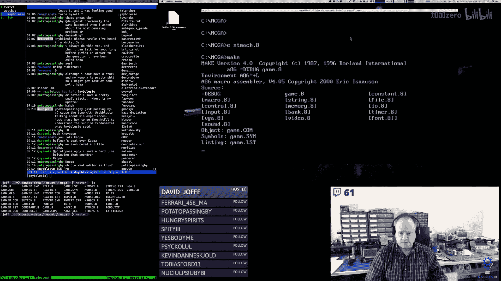
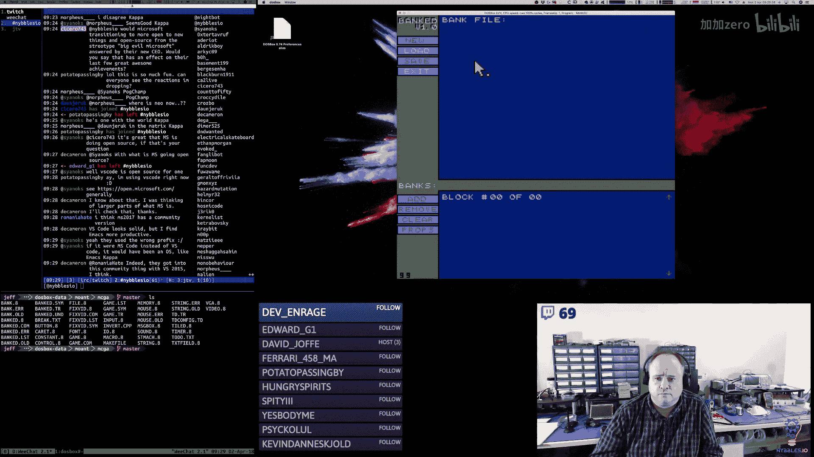
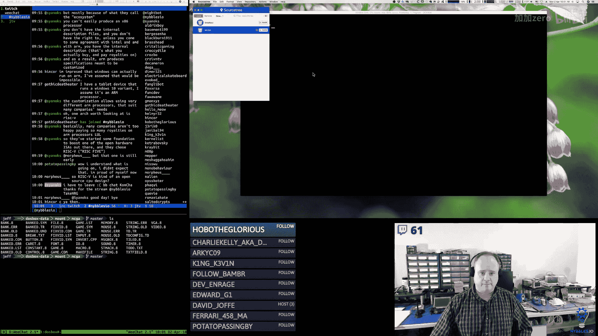
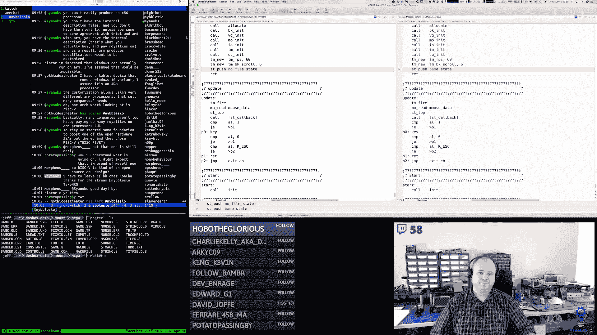
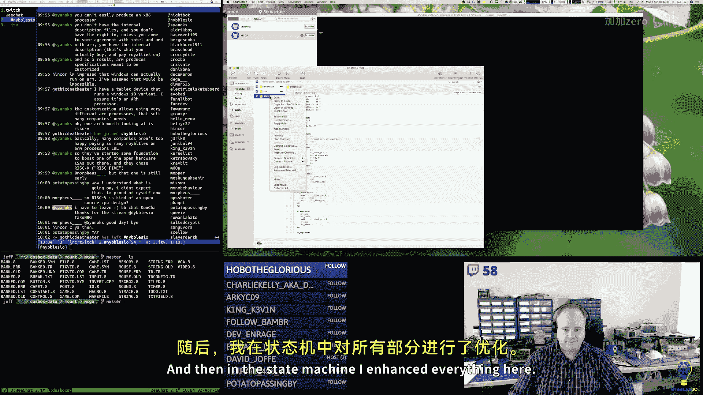
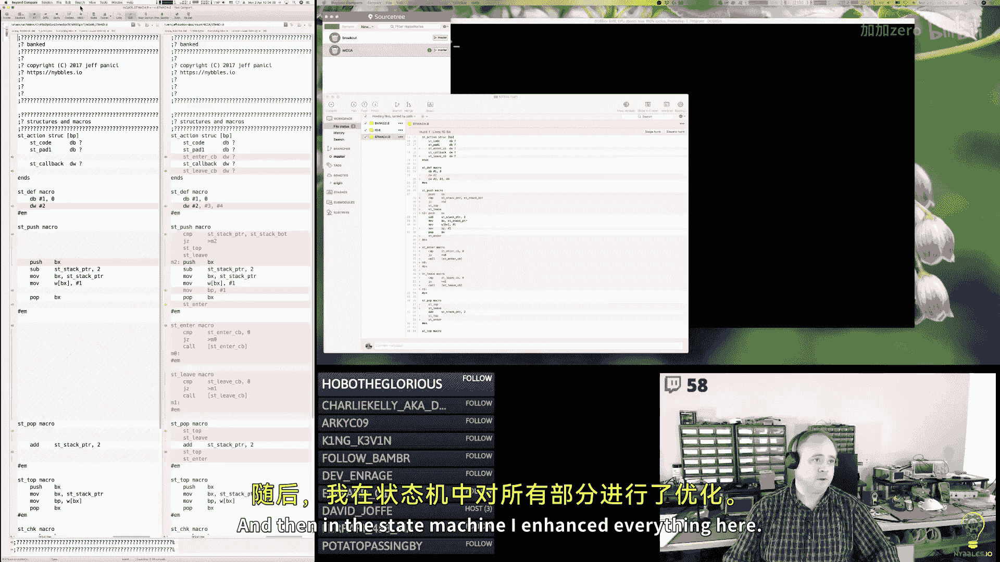
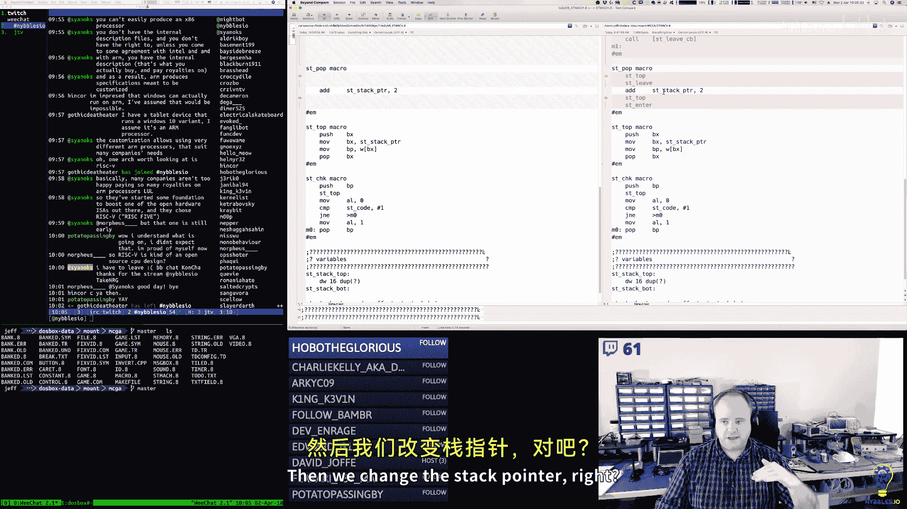
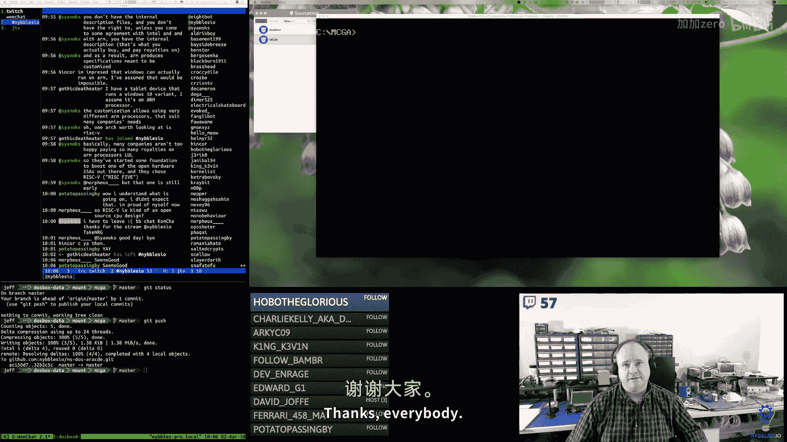

# 008：增强状态机以包含进入、离开和更新回调

## 概述

在本节课中，我们将学习如何增强一个x86汇编语言项目中的状态机，为其添加`enter`（进入）、`leave`（离开）和`update`（更新）回调函数。我们将通过修改现有的MS-DOS银行工具项目来实现这一改进，使状态转换的逻辑更加清晰和模块化。

## 项目背景与计划调整

本节将介绍当前项目的背景，以及主播对未来直播内容和项目安排的思考。

这个项目是MS-DOS街机游戏参考实现的一部分。主播正在制作一个非直播的、结构更严谨的x86汇编语言教育系列视频，而当前直播的项目是为那个系列所做的背景研究和参考材料。这有助于在录制有固定时长和进度的教育视频时，提前规划好内容。


主播计划调整未来的直播项目安排。当前MS-DOS参考实现项目将在本周结束后暂时从直播日程中移除，以便将更多时间投入到核心项目`ReU`（一个游戏开发工具）上，目标是赶在10月的波特兰复古游戏博览会上展示。同时，主播也对构建一个面向“无聊商业应用”的编译器和平台有着浓厚的兴趣。

## 修复键盘中断服务程序

上一节我们介绍了项目的背景，本节中我们来看看在真实硬件上测试时遇到的一个具体问题及其解决方案。

在真实的Packard Bell Pentium II硬件上测试时，发现键盘中断服务程序存在一个问题：键盘缓冲区会很快被填满。经过排查，问题在于原来的ISR（中断服务程序）错误地“链式调用”了旧的BIOS键盘ISR。

**解决方案**：不再调用旧的ISR，而是直接替换它，并在程序结束时重置回原来的ISR。同时，需要在ISR中正确地清除中断标志以防止递归中断，并在结束时重新设置。

以下是修复后的键盘ISR代码框架：
```assembly
keyboard_isr:
    cli                 ; 清除中断标志，防止递归中断
    ; ... 处理键盘扫描码 ...
    ; 不再调用旧的 int 09h
    ; 发送EOI（中断结束）信号给键盘控制器
    mov al, 20h
    out 20h, al
    sti                 ; 重新设置中断标志
    iret
```

## 增强状态机设计

上一节我们修复了一个硬件兼容性问题，本节中我们来看看本次教程的核心内容：增强状态机的设计。

原有的状态机结构在状态转换时逻辑分散，不够清晰。受Rust和ARM汇编中类似实现的启发，我们计划为每个状态添加三个回调函数：
*   `enter`: 当进入该状态时调用。
*   `leave`: 当离开该状态时调用。
*   `update`: 在该状态处于激活时，每帧调用。

**状态数据结构**：
我们扩展了状态的数据结构，使其包含三个函数指针。
```assembly
; 状态结构体定义
struc state
    .enter  resw 1  ; 进入状态回调函数指针
    .update resw 1  ; 状态更新回调函数指针
    .leave  resw 1  ; 离开状态回调函数指针
endstruc
```

## 实现状态机宏与回调

上一节我们设计了新的状态机结构，本节中我们来看看如何用汇编宏和代码实现它。

我们需要创建或修改几个关键的宏来管理状态栈和回调调用。

**状态定义宏**：
这个宏用于方便地定义一个新的状态实例。
```assembly
%macro DEF_STATE 3    ; %1=状态名, %2=enter回调, %3=update回调, %4=leave回调
state_%1:
    dw %2             ; enter回调
    dw %3             ; update回调
    dw %4             ; leave回调
%endmacro
```

**状态栈操作宏**：
以下是`ST_PUSH`（状态压栈）和`ST_POP`（状态出栈）宏的实现逻辑。

`ST_PUSH`宏的伪代码逻辑：
1.  检查当前栈顶是否有状态。如果有，则调用其`leave`回调。
2.  将新状态的指针压入状态栈。
3.  调用新状态的`enter`回调。

`ST_POP`宏的伪代码逻辑：
1.  调用当前栈顶状态的`leave`回调。
2.  将状态指针从栈中弹出。
3.  调用新的栈顶状态的`enter`回调。

在实现这些宏时，需要特别注意边界情况，例如当栈为空时进行第一次压栈操作，不应尝试调用`leave`回调。

## 整合到银行工具项目

上一节我们实现了状态机的核心宏，本节中我们来看看如何将这些改动整合到具体的MS-DOS银行工具项目中。

我们将重构工具的状态逻辑。首先，引入一个`base`（基础）状态作为初始状态和状态转换的枢纽，它负责根据是否有文件加载来决定下一步进入`no_file`（无文件）状态还是`bank`（银行数据）状态。


以下是整合步骤：
1.  **创建回调函数**：为`no_file`、`new_file`（新建文件）、`bank`等状态编写`enter`、`update`、`leave`回调函数。例如，`no_file`状态的`enter`回调负责启用“新建”按钮并将文本字段设置为只读。
2.  **使用新状态机**：将原来的状态切换代码（如按钮处理）改为使用新的`ST_PUSH`和`ST_POP`宏。
3.  **初始状态设置**：程序启动时，将`base`状态压入状态栈。



通过这样的重构，原来分散在更新循环中的状态转换逻辑（如显示消息框、启用/禁用按钮）被清晰地归纳到了各个状态的`enter`和`leave`回调中，使得代码更易于理解和维护。




## 总结













本节课中我们一起学习了如何增强一个x86汇编项目中的状态机。我们首先了解了项目的背景和未来的计划。然后，我们解决了一个在真实硬件上出现的键盘ISR问题。接着，我们设计了为状态添加`enter`、`leave`和`update`回调的新结构，并用汇编宏实现了状态栈的管理逻辑。最后，我们将这套新机制成功整合到了MS-DOS银行工具项目中，使状态管理的代码变得更加模块化和清晰。这次重构为项目后续的功能扩展奠定了良好的基础。