# 009：银行编辑器状态机实现

## 概述

在本节课中，我们将学习如何为MS-DOS下的x86汇编语言游戏引擎实现一个银行编辑器。我们将重点构建一个状态机，用于管理编辑器在不同模式（如瓦片编辑、精灵编辑）之间的切换。课程将涵盖状态栈管理、按钮去抖动、以及通过跳转表实现状态转换等核心概念。

---

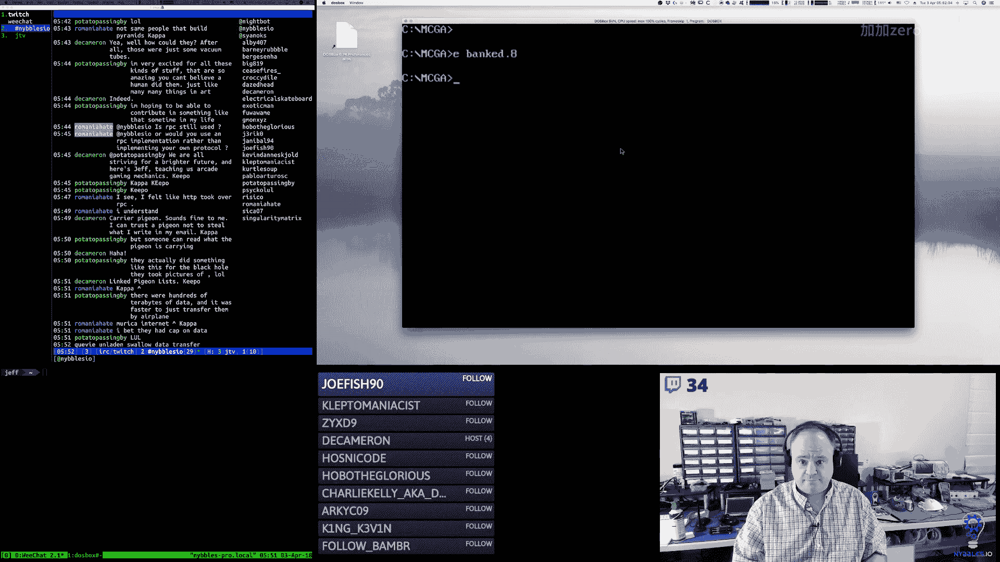

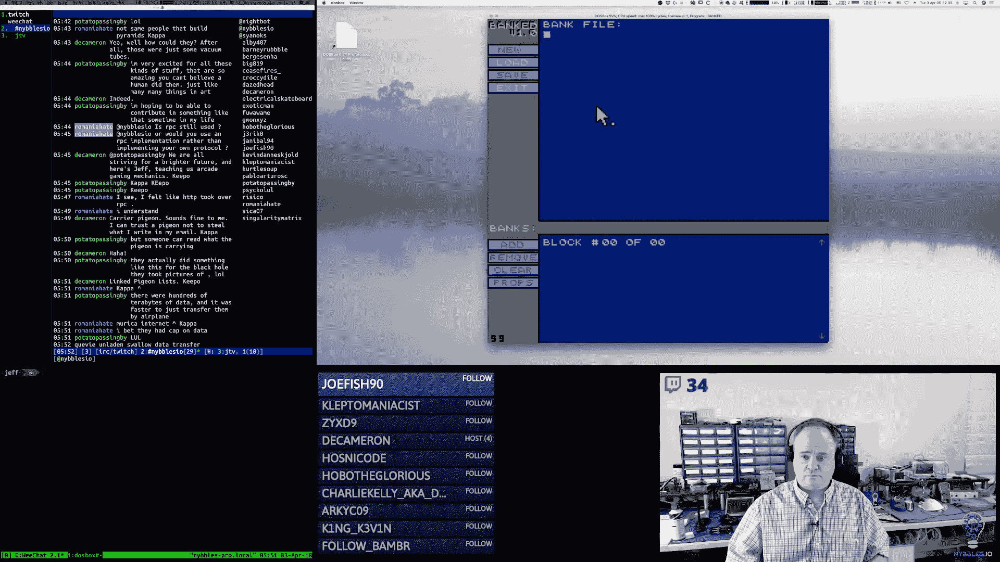


## 状态机基础结构

上一节我们介绍了银行编辑器的整体概念。本节中，我们来看看状态机是如何在汇编层面组织和运行的。

状态机由一系列状态构成，每个状态对应编辑器的一种模式（如“无文件”、“银行总览”、“瓦片编辑”）。我们使用一个数据结构来定义每个状态的行为。

**状态结构定义：**
```assembly
; 状态结构体
struc state_action
    .code       resw 1  ; 状态代码
    .pad        resb 1  ; 填充字节，用于对齐
    .enter_cb   resw 1  ; 进入状态时的回调函数指针
    .update_cb  resw 1  ; 状态运行时的更新回调函数指针
    .leave_cb   resw 1  ; 离开状态时的回调函数指针
endstruc
```

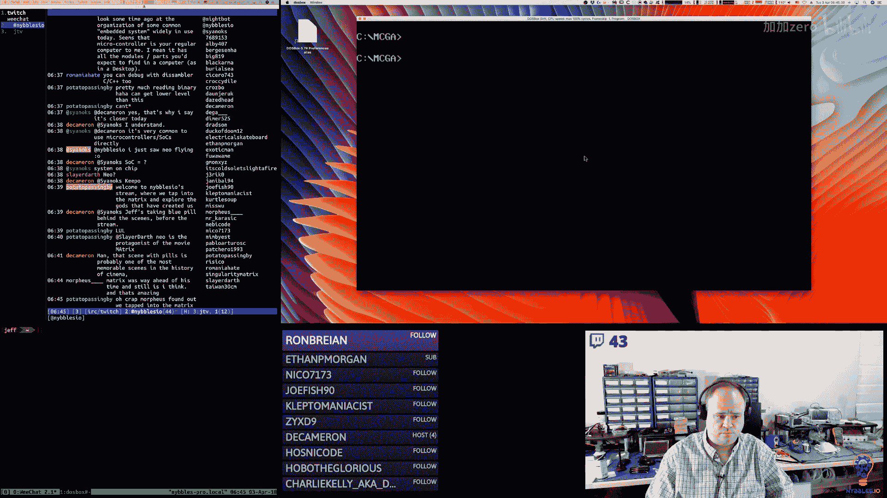


**状态栈管理：**
状态栈是一个包含16个字的数组（32字节），用于存储当前活跃的状态序列。栈指针（`state_stack_ptr`）初始指向栈底。当推入新状态时，指针减2；弹出状态时，指针加2。

**状态切换宏：**
我们使用宏来封装状态栈的推入（`push`）、弹出（`pop`）和检查（`check`）操作。例如，`push`宏会将新状态的地址放入栈中，并调用其`enter`回调函数。

---

## 银行选择与状态转换

在实现了基础状态机后，我们需要将编辑器的标签页（Tab）点击与具体的编辑状态关联起来。

以下是实现此功能的关键步骤：

1.  **获取银行指针**：当用户点击一个标签页时，我们需要获取对应银行数据结构的指针。这通过`bank_pointer`宏完成，它根据传入的索引计算银行头在内存段中的偏移量。
    **公式：** `bank_address = bank_header_segment_base + (index * bank_block_size)`

2.  **确定银行类型**：从银行头数据结构中读取类型字段（例如，1=精灵，2=瓦片）。


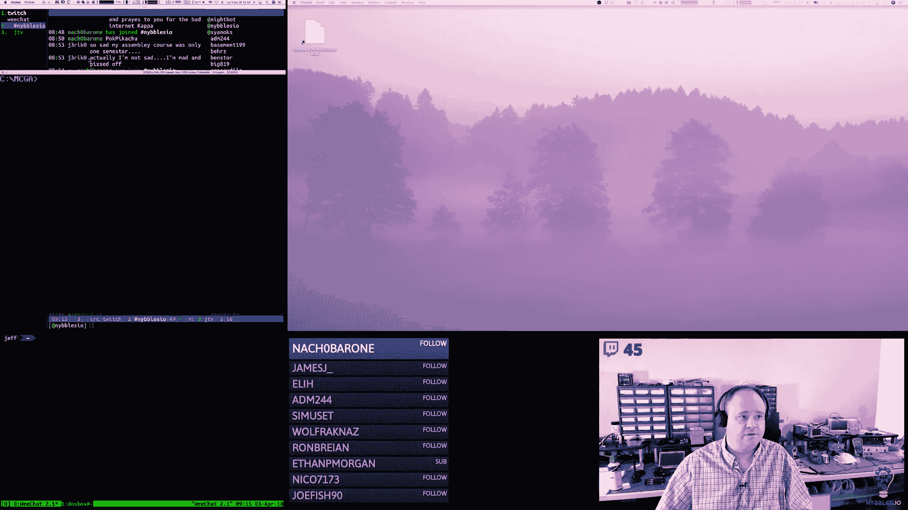

3.  **使用跳转表进行状态分发**：根据银行类型，通过一个跳转表（Jump Table）调用相应的状态初始化函数。这模拟了高级语言中的`switch`语句。
    **代码示例：**
    ```assembly
    ; 跳转表定义
    bank_select_jumps:
        dw sprite_bank_selected
        dw tile_bank_selected
        dw background_bank_selected
        ; ... 其他类型
    ```
    通过将类型值（转换为零基索引并乘以2）与跳转表基地址相加，我们可以获取到目标函数的地址并跳转过去。


4.  **状态栈管理**：在进入新的编辑状态前，需要管理状态栈：
    *   如果当前处于基础的“银行”状态，则直接推入新状态。
    *   如果已处于某个编辑状态，则需要先弹出当前状态（调用其`leave`回调），再推入新状态。这确保了状态栈不会无限增长。

---

## 按钮系统与去抖动

状态转换由界面上的按钮触发。由于程序运行速度极快（超过100帧/秒），一次物理点击可能会在多个连续帧中被检测到，导致状态被多次切换。因此，我们需要为按钮系统实现去抖动（Debouncing）逻辑。

以下是按钮处理的流程：

1.  **按钮按下检测**：在每一帧中，检查鼠标左键是否按下。
2.  **命中测试**：如果按下，则遍历所有按钮，检查鼠标坐标是否在按钮的矩形区域内。
3.  **去抖动标志**：每个按钮数据结构中有一个去抖动标志位。当检测到有效的点击时：
    *   如果该按钮的去抖动标志**未设置**，则设置该标志，并调用按钮关联的回调函数（触发状态切换）。
    *   如果该标志**已设置**，则忽略此次点击，直到标志被清除。
4.  **标志重置**：当鼠标左键被释放（未按下）时，遍历所有按钮，清除那些设置了去抖动标志的按钮的标志位。这样，按钮就准备好响应下一次点击了。

这个机制确保了即使鼠标驱动程序报告了多次连续的“按下”状态，每个按钮点击也只触发一次动作。

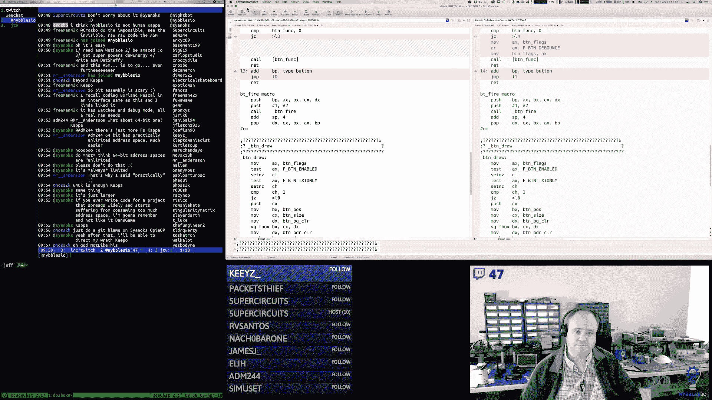

---

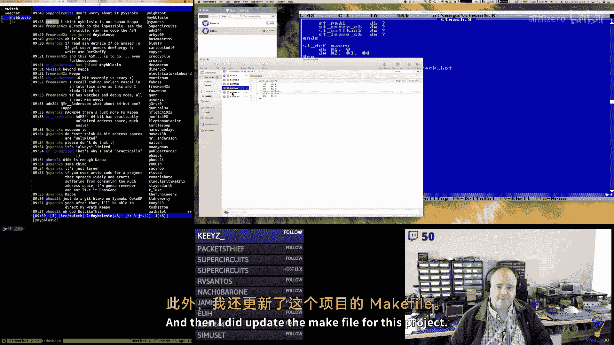

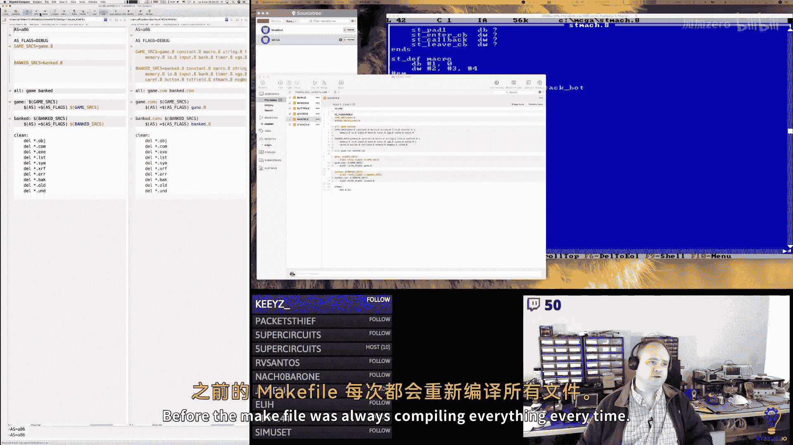

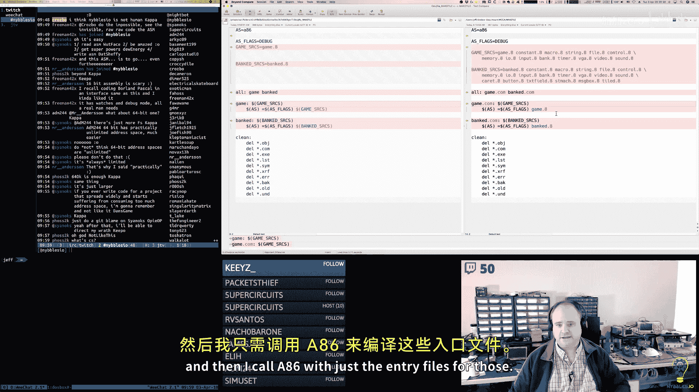


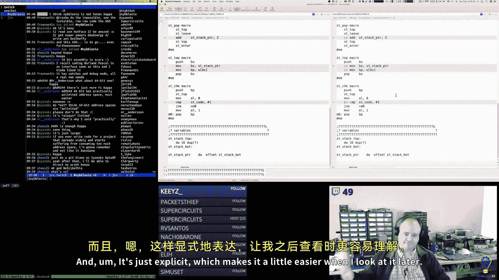

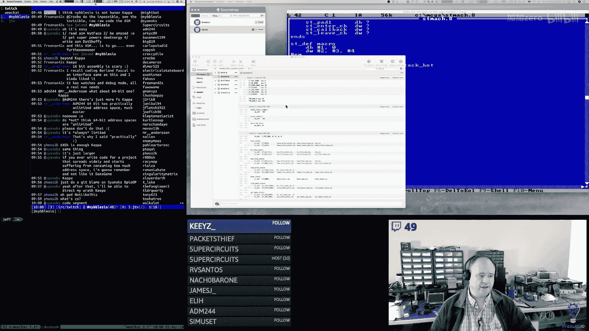

## 总结


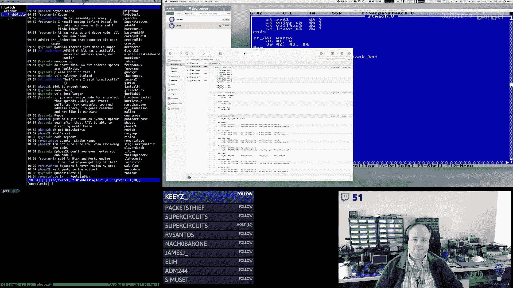

本节课中我们一起学习了x86汇编语言下银行编辑器状态机的完整实现。我们构建了一个支持进入、更新和离开回调的状态机框架，并通过跳转表将银行类型映射到具体的编辑状态。同时，我们为按钮系统实现了去抖动逻辑，确保了用户交互的准确性和可靠性。这些核心机制为后续实现具体的瓦片、精灵等编辑器功能奠定了坚实的基础。下一节，我们将开始深入各个编辑状态，实现具体的绘制和交互逻辑。