# 010：调色板库编辑器

在本节课中，我们将学习如何为MS-DOS下的游戏开发工具实现一个调色板编辑器。我们将重点讲解如何管理调色板数据块、渲染调色板选择界面，以及处理用户交互。课程内容基于x86汇编语言，适合希望深入了解底层图形编程的初学者。

## 概述与准备工作


上一节我们完成了工具中状态机与标签页的集成。本节中，我们将专注于调色板编辑器的实现。调色板是图形编程中的核心概念，它定义了屏幕上可以显示的颜色集合。在VGA图形模式下，一个调色板通常包含256个颜色条目，每个条目由红、绿、蓝（RGB）三个分量组成。


我们的目标是创建一个界面，允许用户从16个调色板块中选择一个，然后编辑该调色块中的16种颜色。界面上方将显示当前选中的调色板及其RGB值，下方则显示所有可选的调色板块。

## 调色板数据结构与初始化

首先，我们需要理解调色板在内存中是如何组织的。当我们创建一个新的调色板库时，会调用 `bank_new` 函数。该函数会为调色板数据分配内存块。

以下是分配和初始化调色板库的关键代码逻辑：
```assembly
; 假设我们请求创建包含2个块的调色板库
; bank_type = palette, num_blocks = 2
call bank_new
```
函数内部会通过 `MM_Reserve` 分配内存段，并设置库头信息，包括最大块数（`max_blocks`）。对于调色板，每个数据块对应一个包含16种颜色的调色板。

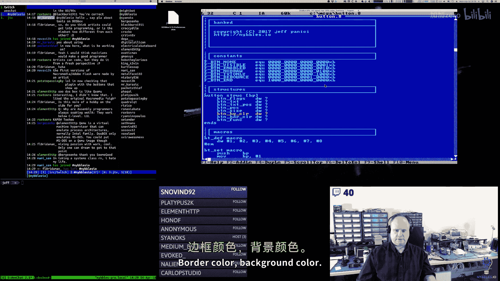

## 实现调色板查看器回调

工具的核心是状态机，每个状态（如调色板模式、瓦片模式）都有一个对应的“查看器回调函数”。这个函数负责绘制该状态下的主界面。

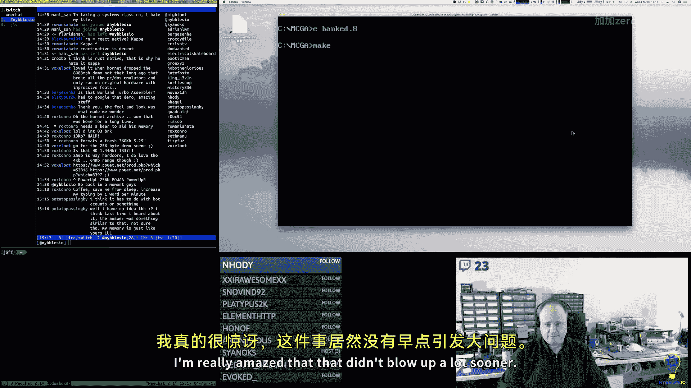

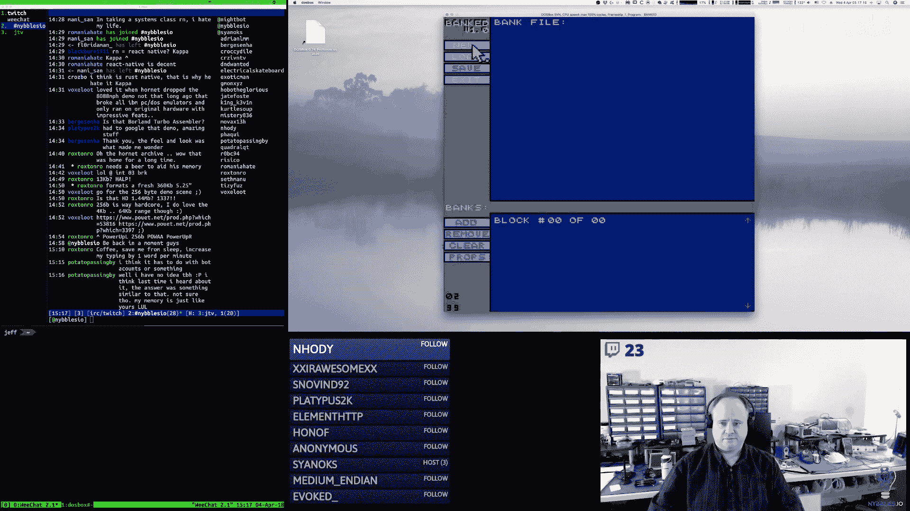

当我们进入调色板库状态时，需要执行以下步骤：
1.  将查看器回调函数设置为 `palette_viewer`。
2.  根据选中的标签页，获取对应的库头指针。
3.  重置当前块索引为0。
4.  更新界面显示的“总块数”和“当前块号”字符串。
5.  启用“上一个块”和“下一个块”的导航按钮。

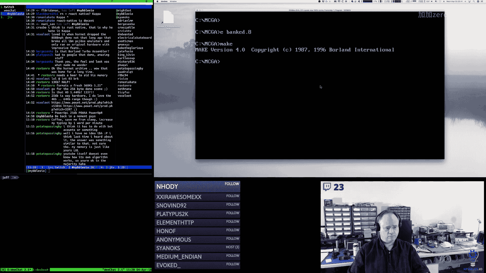

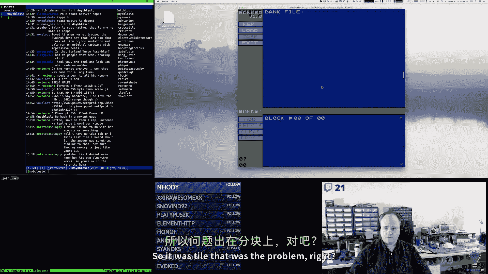

以下是进入调色板状态时的代码框架：
```assembly
enter_palette_bank:
    ; 设置回调函数
    mov [viewer_callback], offset palette_viewer
    ; 获取当前标签页对应的库指针到BP
    tab_block_macro
    ; 重置块索引
    mov [block_index], 0
    ; 更新界面字符串
    call update_block_total_string
    call update_block_number_string
    ; 启用导航按钮
    call btn_enable_block_prev
    call btn_enable_block_next
    ret
```
离开该状态时，我们需要清除回调并禁用导航按钮。

## 绘制调色板选择界面

`palette_viewer` 函数的主要任务是在屏幕下方绘制16个调色板块的选择区域。每个块用一个16x16像素的色块表示，并标有编号（0-15）。

绘制逻辑如下：
*   计算每个色块在屏幕上的位置（X, Y坐标）。
*   使用 `set_palette_index` 和 `set_palette_rgb` 宏来设置VGA调色板寄存器，以显示正确的颜色。
*   在色块旁边绘制其编号。

我们计划将16个色块排列成两行，每行8个，以确保它们能适应屏幕。色块的颜色来自当前加载的调色板数据。

## 连接交互与状态更新

当用户点击下方的某个调色板块时，我们需要：
1.  捕获鼠标点击事件。
2.  计算点击发生在哪个色块上。
3.  将选中的调色板索引（0-15）存储到状态变量中。
4.  触发界面刷新，使上方的颜色编辑区域显示新选中调色板的16种颜色及其RGB值。

RGB值将以文本输入框的形式显示在每种颜色旁边，允许用户直接修改。修改值会实时调用 `set_palette_rgb` 宏来更新硬件调色板，从而实现即时预览。

## 调试与代码优化

在开发过程中，我们遇到并修复了几个问题：
1.  **栈指针错误**：在 `bank_new` 函数中，向栈压入一个值后，错误地调整了栈指针（SP），这可能导致后续程序崩溃。修正为正确的调整量。
2.  **变量访问错误**：在渲染代码中，错误地访问了结构体中的变量，导致显示异常。修正了源操作数。
3.  **宏的改进**：将频繁使用的十进制数字转字符串代码封装成了宏 `S$dec2`，使调用处的代码更清晰。
4.  **调色板设置拆分**：将设置调色板的操作拆分为 `set_palette_index` 和 `set_palette_rgb` 两个宏，这样更便于批量加载整个调色板。

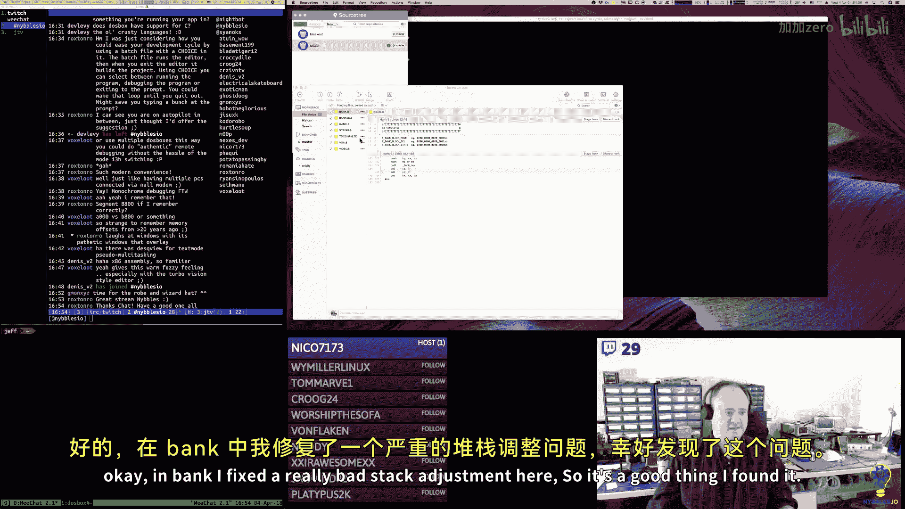


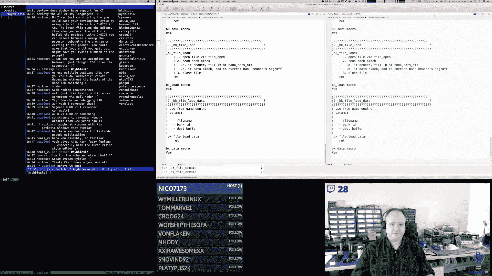

## 总结与后续工作

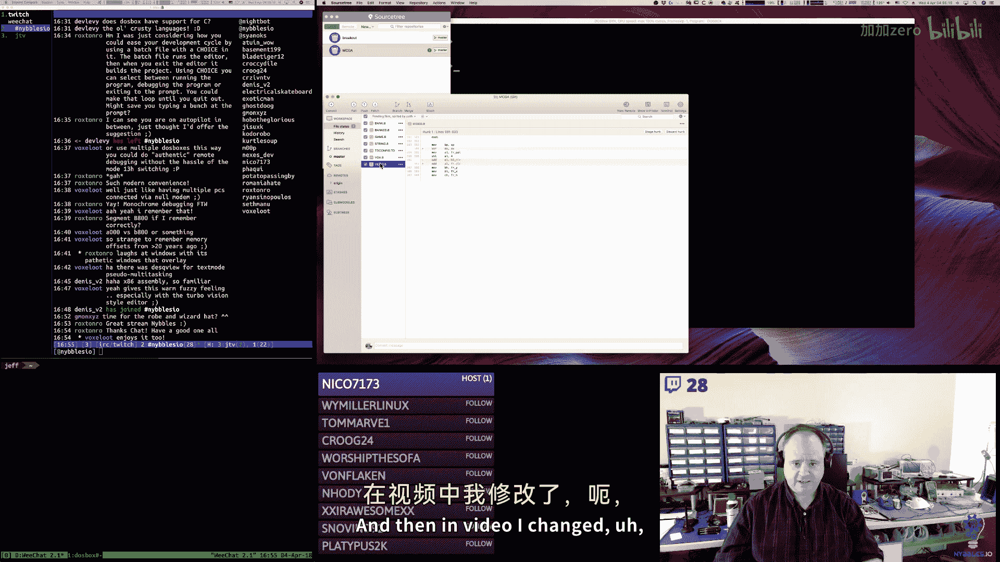


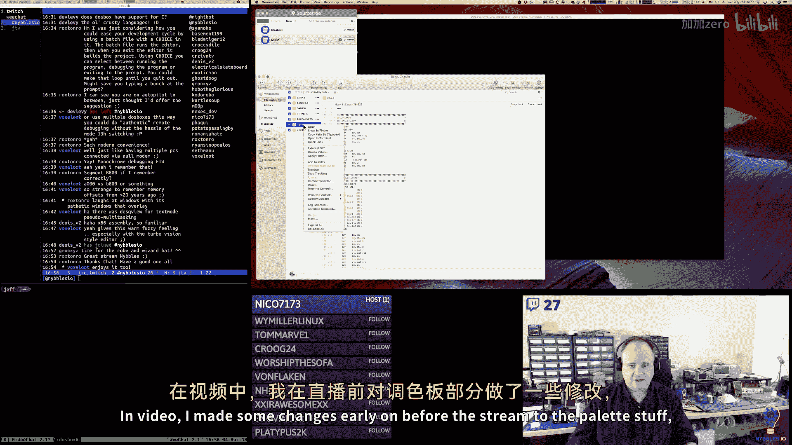


本节课中我们一起学习了如何为汇编语言工具实现一个调色板编辑器。我们完成了以下核心工作：
*   理解了调色板库的数据结构及其初始化过程。
*   实现了状态机的回调机制，将调色板查看器集成到工具中。
*   绘制了调色板选择界面，并规划了交互逻辑。
*   修复了开发过程中遇到的几个关键错误，并优化了代码结构。


目前，调色板选择界面的绘制已基本完成。接下来的工作是：
1.  在界面右侧为每种颜色添加R、G、B三个文本输入框。
2.  完成第二列色块的绘制，以显示全部16个调色板块。
3.  将文本输入框的数据结构与事件处理代码连接起来，实现完整的颜色编辑功能。

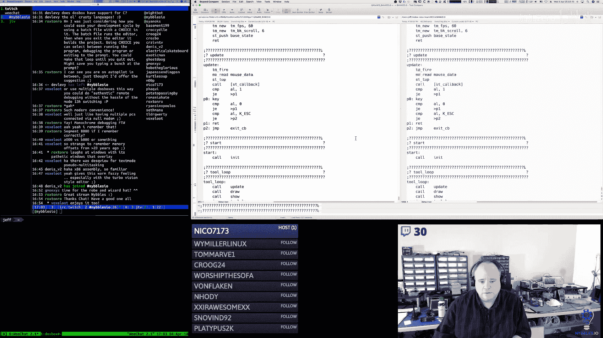

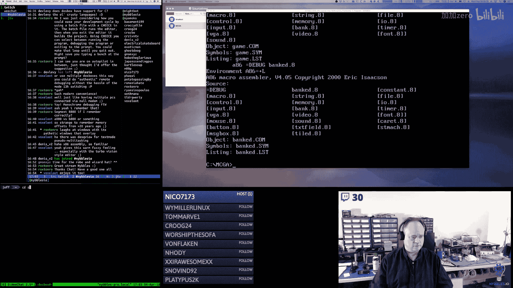

通过本节课，你不仅看到了一个具体功能的实现过程，也体会到了在汇编层进行系统编程时，对数据结构和状态管理的细致考量。这些概念是底层软件开发的基础。