# 011：调色板库编辑器（第二部分）📊

## 概述
在本节课中，我们将继续学习如何为MS-DOS下的游戏引擎开发工具。具体来说，我们将深入探讨调色板库编辑器的实现，包括如何在汇编语言中创建和管理数据块（block），以及如何从VGA硬件读取调色板数据并填充到我们自定义的数据结构中。我们还将学习如何通过宏（macro）来优化重复的键盘处理代码，使程序结构更清晰、更易于维护。

---

## 调色板库与数据块结构

上一节我们介绍了调色板库的基本概念和头信息。本节中，我们来看看如何为库创建具体的数据块。

一个调色板库（bank）可以包含多个数据块（block）。每个块都有一个小的头部，用于存储类型、ID和标志等信息，后面跟着实际的数据。对于调色板数据，一个块就足够了，因为它可以容纳768字节（256种颜色，每种颜色由红、绿、蓝3个字节组成）。

### 创建新数据块
为了管理块，我们需要一个函数来在已选中的库中创建新块。以下是创建新块的核心步骤：

1.  **获取当前库的块偏移量**：每个库的头部都记录了下一次可用块的起始内存位置。
2.  **更新库头部**：将块偏移量增加一个块的大小（4096字节），并标记库为“脏”（表示已修改，需要保存）。
3.  **初始化块头部**：在新块的位置写入块类型、唯一的块ID和初始标志。
4.  **设置寄存器**：函数返回时，段寄存器`ES`和基址指针`BP`将指向新创建的块，方便后续直接操作数据。

以下是`block_new`函数的核心逻辑框架：

```assembly
; 假设已通过 bank_pointer 宏选中了一个库
block_new:
    push es
    push bp
    ; 1. 从库头部获取当前块偏移量到 BX
    mov bx, [es:bank_block_offset]
    ; 2. 更新库头部的偏移量，并标记为脏
    add bx, size_of_block
    mov [es:bank_block_offset], bx
    mov al, [es:bank_flags]
    or al, FLAG_BANK_DIRTY
    mov [es:bank_flags], al
    ; 3. 切换ES到块的段，BP指向新块
    mov es, [bank_block_segment]
    mov bp, bx
    ; 4. 初始化块头部
    mov byte [es:bp+block_type], BLOCK_TYPE_DATA
    mov al, [bank_block_id_counter]
    mov [es:bp+block_id], al
    inc byte [bank_block_id_counter]
    mov byte [es:bp+block_flags], FLAG_BLOCK_DIRTY
    ; 5. 清理并返回
    pop bp ; 恢复原来的BP（指向库头部）
    ; ES:BP 现在指向新块的数据区
    ret
```

---

## 从VGA硬件读取调色板

创建了空的调色板块后，我们需要用当前VGA硬件的调色板数据来填充它。VGA调色板有256个条目，每个条目是一个RGB三元组。

### 与VGA硬件交互
我们需要通过特定的I/O端口来读取调色板数据。以下是两个关键的宏：

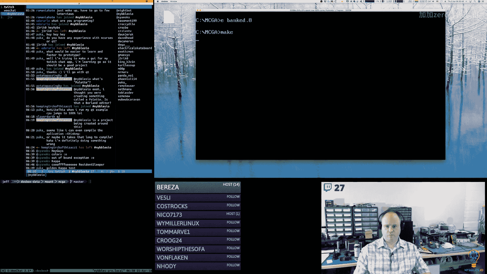

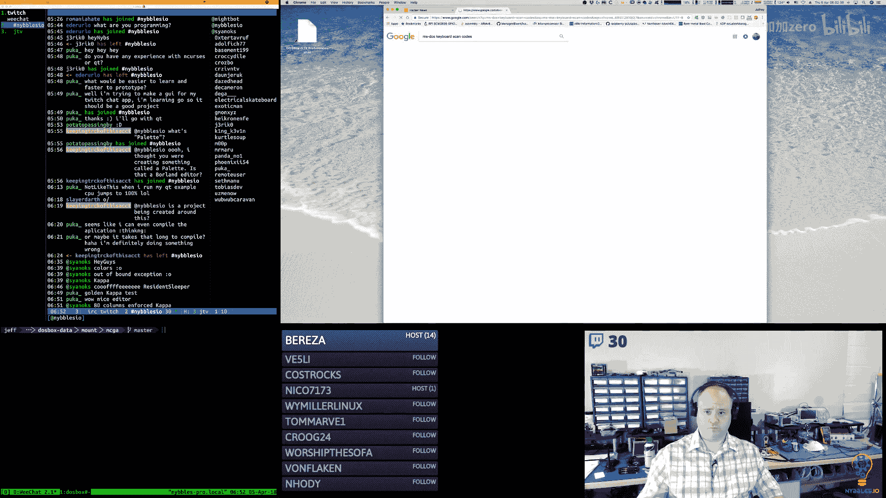

1.  **`sc_pal_r`**：设置要读取的调色板索引（0-255）。
2.  **`sc_rgb_r`**：读取当前选定索引的RGB值，并存储到一个三字节的结构中。

以下是填充调色板块的代码流程：

```assembly
; DI 指向块内数据区的开始（跳过头部）
mov di, bp
add di, block_data_offset
; CX 作为计数器，设置为256（颜色数）
mov cx, 256
.fill_palette_loop:
    ; 1. 设置要读取的调色板索引
    sc_pal_r cx ; 假设CX是当前索引（0-255）
    ; 2. 读取RGB到临时结构
    sc_rgb_r color_temp_struct ; color_temp_struct 定义为 resb 3
    ; 3. 将RGB值存入块中
    mov al, [color_temp_struct + red]
    stosb ; 存储红色分量，并递增DI
    mov al, [color_temp_struct + green]
    stosb ; 存储绿色分量
    mov al, [color_temp_struct + blue]
    stosb ; 存储蓝色分量
    ; 4. 循环
    loop .fill_palette_loop
```

这段代码循环256次，将整个VGA调色板复制到我们创建的数据块中，作为编辑的起点。

---

## 优化键盘处理：使用宏生成跳转表

在编辑器的不同视图（如调色板、图块、精灵）中，键盘处理逻辑（如方向键移动选择框、翻页）非常相似。为了避免编写大量重复的代码，我们可以创建一个宏来动态生成跳转表（jump table）。


### 宏的工作原理
这个宏（例如叫`key_common`）接受参数（如状态名、索引变量名、最大值等），然后在编译时生成一段代码和一个跳转表。跳转表将扫描码（scan code）映射到对应的处理函数地址。


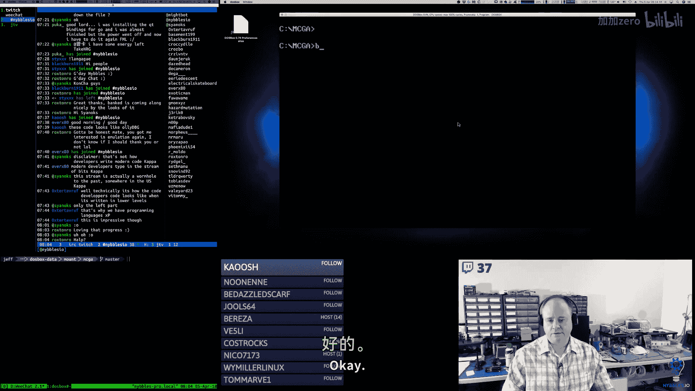

以下是宏生成的代码结构示例：


```assembly
; 生成的跳转表数据
key_table_state:
    db SCANCODE_UP
    dw callback_up
    db SCANCODE_DOWN
    dw callback_down
    db SCANCODE_LEFT
    dw callback_left
    db SCANCODE_RIGHT
    dw callback_right
    db SCANCODE_PGUP
    dw callback_pgup
    db SCANCODE_PGDN
    dw callback_pgdw
    db 0 ; 结束标记

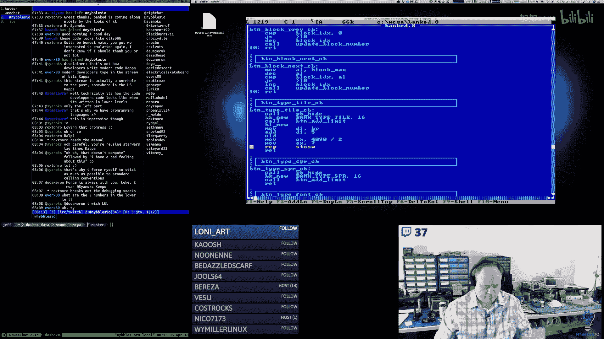


; 生成的键盘处理逻辑
handle_keys_state:
    mov bp, key_table_state ; BP指向跳转表
    call key_get ; 获取按键扫描码到AL
    cmp al, 0
    je .done
.search_loop:
    cmp al, [bp] ; 与表中的扫描码比较
    je .found
    add bp, 3 ; 跳到下一个表项（1字节扫描码 + 2字节地址）
    cmp byte [bp], 0 ; 是否到表尾？
    jne .search_loop
    jmp .done
.found:
    mov bx, [bp+1] ; 获取处理函数地址
    call bx ; 调用对应的处理函数
    mov al, 1 ; 设置已处理标志
.done:
    ret
```


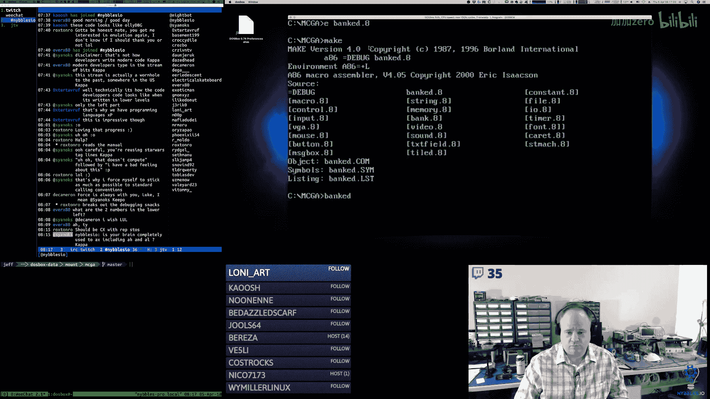

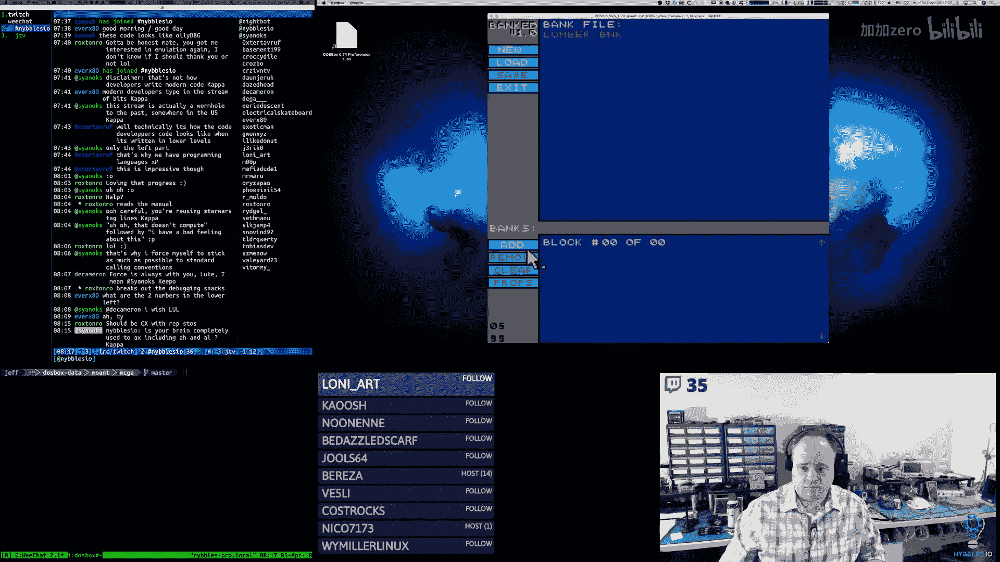


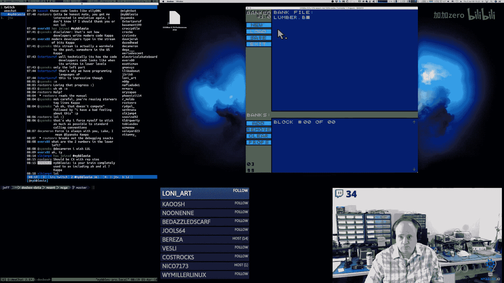


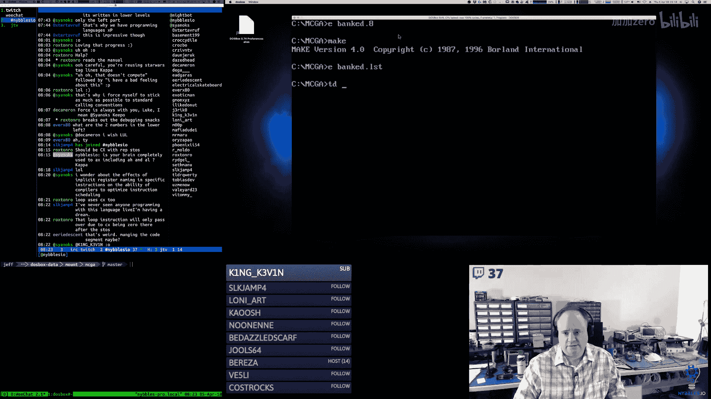

### 使用宏的好处
*   **代码复用**：不同的编辑器状态只需调用同一个宏并传入不同参数。
*   **避免分支限制**：x86汇编中条件跳转（`jcc`）有距离限制，而通过`call`指令调用跳转表中的函数则没有这个问题。
*   **结构清晰**：将按键逻辑集中管理，易于调试和扩展。


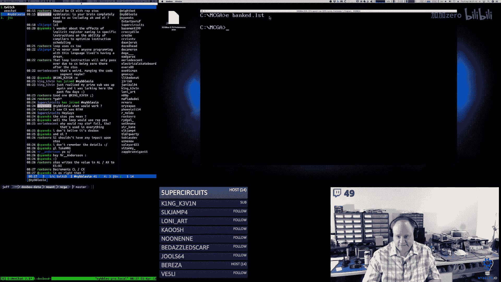


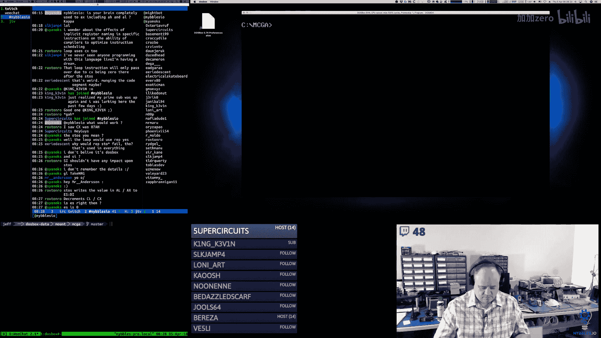

在调色板、图块和精灵编辑器的更新函数中，我们现在可以这样简洁地调用：


```assembly
update_tile_bank:
    key_common tile, tile_index, 132, 22
    ; ... 其他更新逻辑
    ret

update_sprite_bank:
    key_common sprite, sprite_index, 36, 12
    ; ... 其他更新逻辑
    ret
```

---

## 渲染图块数据

对于图块库，我们不仅需要管理数据，还需要将其渲染到屏幕上。图块数据通常以半字节（nibble，4位）打包的形式存储，每个半字节代表一个像素的颜色索引（0-15）。


### 渲染逻辑
渲染函数需要：
1.  从数据块中读取打包的像素数据。
2.  将每个半字节解包，并根据指定的调色板获取实际颜色。
3.  在屏幕上绘制一个“大像素”（一个矩形），因为我们的编辑器视图是放大显示的。

以下是渲染一个图块行的简化逻辑：

```assembly
; 输入：SI指向源数据，BH/BL为起始坐标，DX为“大像素”尺寸，CL为调色板号
draw_tile_row:
    mov ch, TILE_WIDTH ; 每行像素数
.row_loop:
    lodsb ; 从[DS:SI]加载一个字节到AL，SI++
    ; 解包高4位和低4位
    mov ah, al
    shr ah, 4 ; AH = 高4位（第一个像素）
    and al, 0x0F ; AL = 低4位（第二个像素）
    ; 绘制第一个大像素（使用AH中的颜色索引）
    push cx
    mov ch, ah ; 颜色索引
    ; 调用绘制矩形函数，使用(BH,BL)为左上角，DX为尺寸，(CH,CL)为颜色信息
    call draw_filled_rect
    add bh, dl ; X坐标增加一个像素宽度
    ; 绘制第二个大像素（使用AL中的颜色索引）
    mov ch, al
    call draw_filled_rect
    add bh, dl ; X坐标再增加
    pop cx
    sub ch, 2 ; 已处理两个像素
    jnz .row_loop ; 继续处理此行
    ret
```

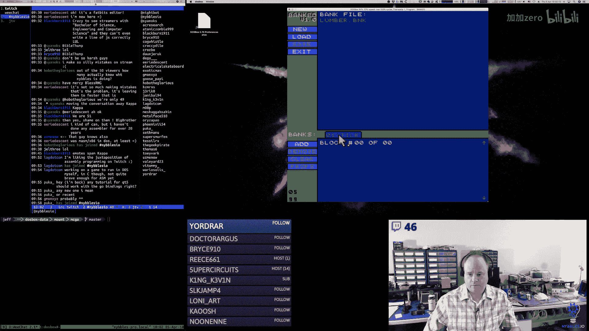

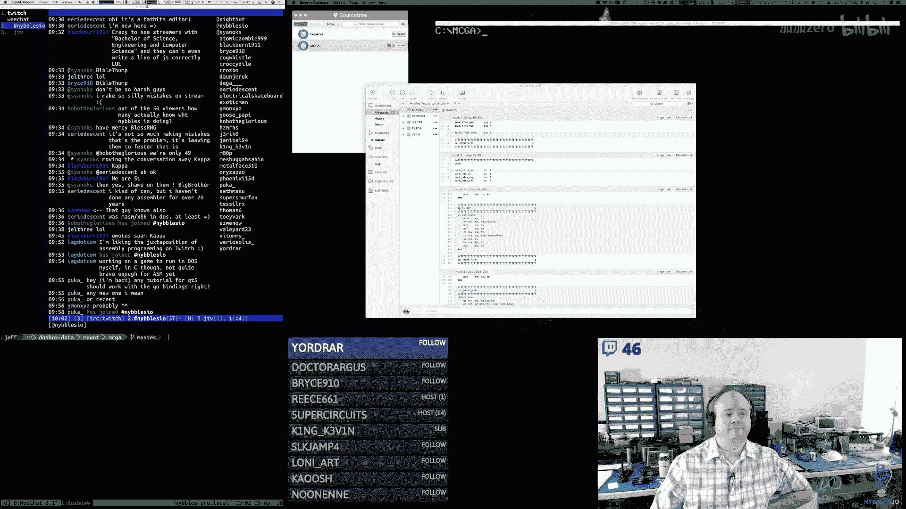

在视图的回调函数中，我们遍历当前块中的所有图块数据，为每个图块调用此渲染逻辑，从而在编辑器网格中显示出来。

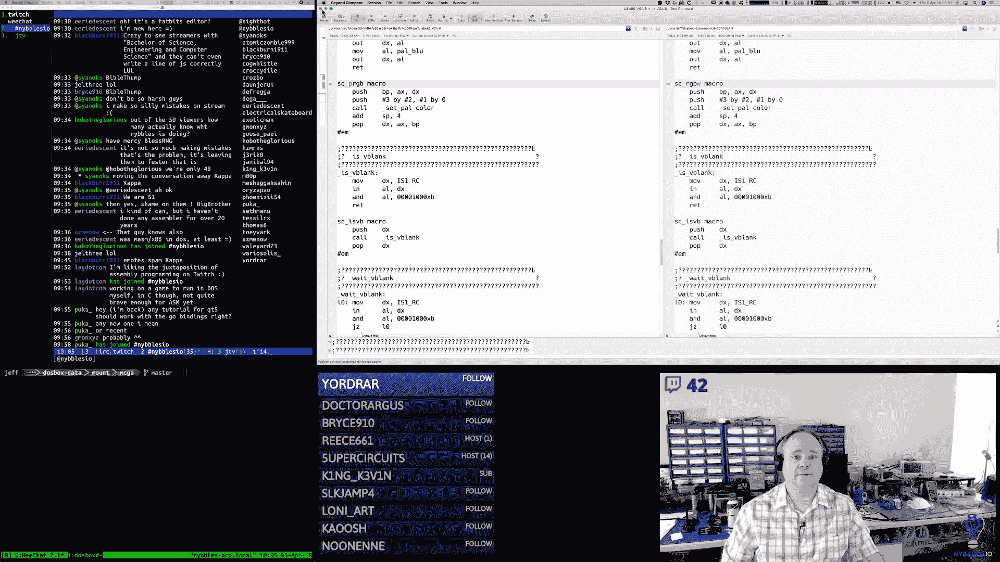

---

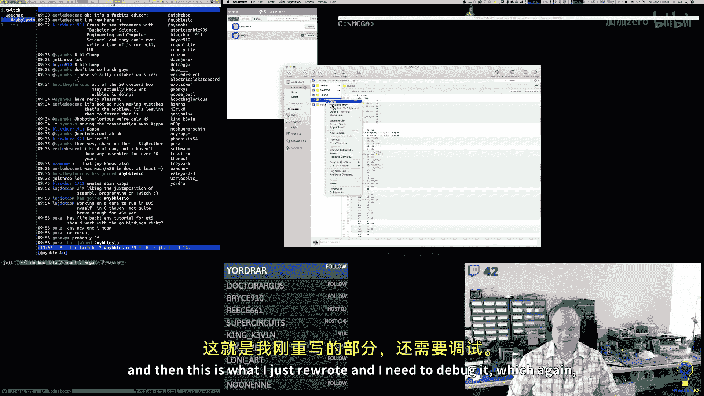

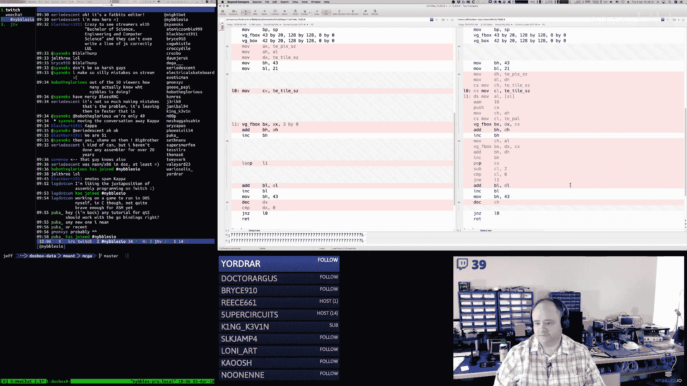


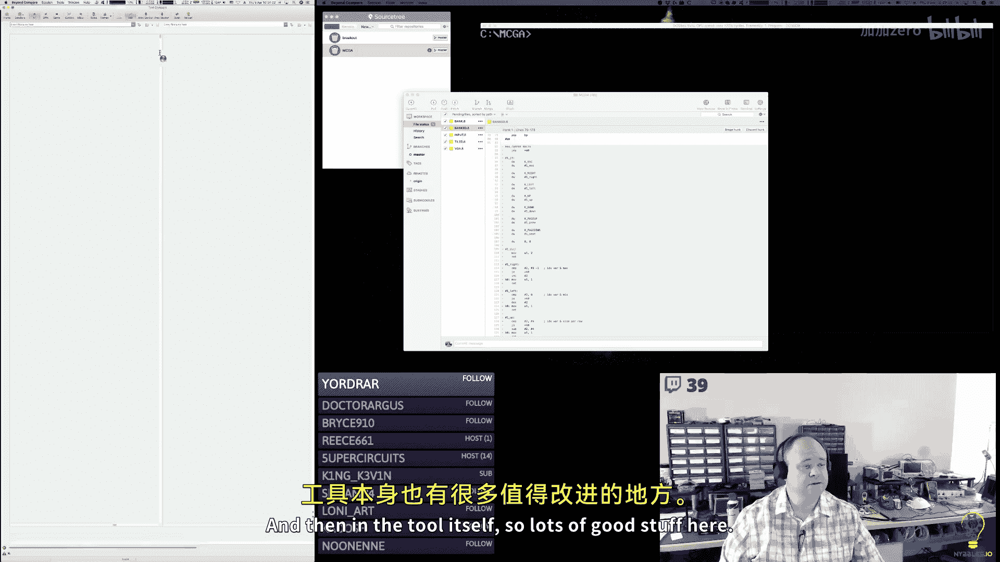

## 总结
本节课中我们一起学习了x86汇编语言游戏工具开发的几个核心进阶主题：

1.  **数据块管理**：我们实现了在内存库中动态创建和初始化数据块的功能，这是构建复杂数据编辑器的基础。
2.  **硬件交互**：学习了如何通过I/O端口与VGA硬件通信，读取当前的调色板数据，并将其集成到我们自己的数据模型中。
3.  **代码优化技巧**：我们创建了一个强大的宏，用于生成键盘处理的跳转表，极大地减少了重复代码，提高了项目的可维护性和清晰度。
4.  **数据渲染**：探讨了如何将存储的图块数据（半字节打包格式）解包并渲染到屏幕上，实现了编辑器的可视化部分。

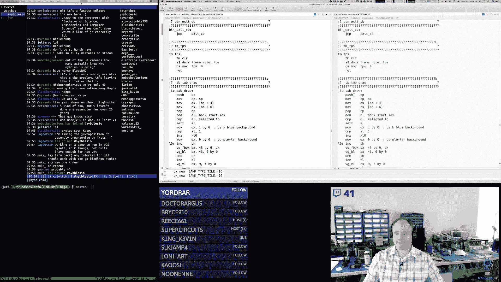


通过这些实践，我们不仅加深了对x86汇编和MS-DOS环境下编程的理解，也掌握了构建实用工具所需的系统化思维和代码组织方法。在接下来的课程中，我们将在此基础上，为精灵和字体编辑器添加类似的功能，并最终完成整个银行编辑工具。