# 012：鼠标区域选择、粗位网格、调色板与背景

## 概述

在本节课中，我们将学习如何在x86汇编语言中实现一个图形编辑工具的核心功能。具体内容包括：通过鼠标在矩形区域内进行选择、处理粗位网格（fat-bit grids）数据、管理调色板（palettes）以及处理背景（backgrounds）。我们将从修复内存初始化问题开始，逐步实现鼠标交互和图形数据的编辑。

---

## 12.1：项目背景与本周目标

上一节我们介绍了项目的基本框架。本节中，我们来看看本周的具体工作安排。

我目前正在为我的街机游戏引擎开发一个参考实现，这个实现将用于指导我即将制作的教育视频系列。本周，我们将在直播中完成这个MS-DOS参考实现的主要部分。

昨天，我在直播之外修复了一些问题，现在**图块（tiles）**、**精灵（sprites）** 和**调色板（palettes）** 的显示已经基本正常。不同的数据块（banks）都能正确显示，粗位编辑器也能展示其中的数据。

接下来的核心任务是：
1.  实现一个通用的函数，用于处理鼠标在指定矩形网格区域内的点击选择。
2.  完善数据块（bank）的初始化过程，确保所有块（blocks）都被正确初始化为预设模式（如棋盘格），而不仅仅是分配和清零内存。

---

## 12.2：实现鼠标网格选择功能

上一节我们明确了需要通用的鼠标选择功能。本节中，我们来实现这个核心的 `grid_select` 函数。

这个函数的目标是：给定一个屏幕上的矩形区域、网格的列数和每个网格单元的像素尺寸，当用户在此区域内按下鼠标左键时，函数能计算出鼠标点击所在网格的线性索引（linear index）。

以下是该函数的关键步骤：

1.  **检查鼠标状态**：首先检测鼠标左键是否被按下。如果没有，则直接返回。
2.  **计算相对坐标**：获取鼠标坐标，减去矩形区域的左上角坐标，得到相对于区域左上角(0,0)的坐标。
3.  **转换为网格索引**：将相对坐标的X和Y值分别除以每个网格单元的宽度和高度（需考虑网格间的间隔），得到网格内的`(x, y)`坐标。
4.  **计算线性索引**：使用公式 `index = y * columns + x` 将网格坐标转换为线性索引。
5.  **返回结果**：通过寄存器`AX`返回结果。`AH`用于指示是否发生有效选择（1为是，0为否），`AL`则存储计算出的线性索引值。

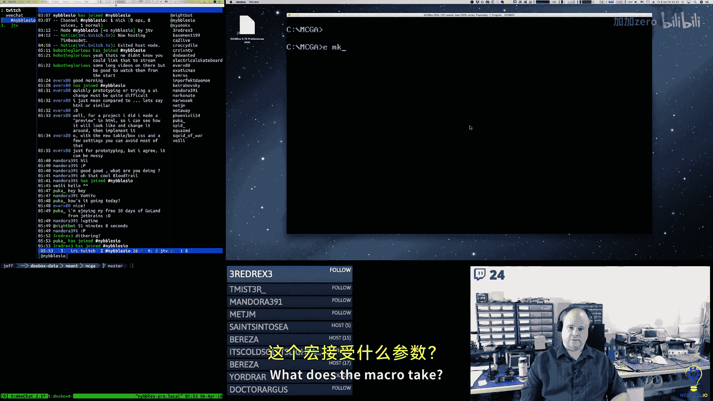

为了让调用更简洁，我创建了一个宏 `mouse_grid_select` 来封装参数传递和函数调用。

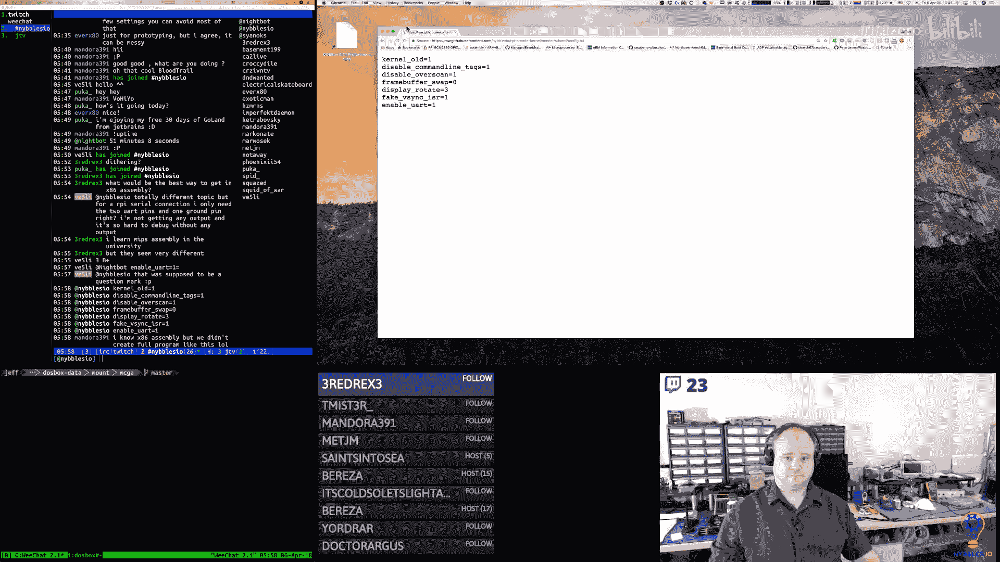

```assembly
; 伪代码示例：grid_select 函数核心逻辑
; 输入：栈上传递参数 (x, y, width, height, columns, cell_size)
; 输出：AH=选择状态，AL=网格索引
grid_select:
    test_left_mouse_button
    jz no_selection
    calculate_relative_coords
    divide_by_cell_size      ; 得到 grid_x, grid_y
    linear_index = grid_y * columns + grid_x
    mov ah, 1
    mov al, linear_index
    ret
no_selection:
    mov ax, 0
    ret
```

这个通用函数随后被应用到图块编辑器、精灵编辑器和调色板选择器中，只需传入不同的区域参数和网格大小即可。

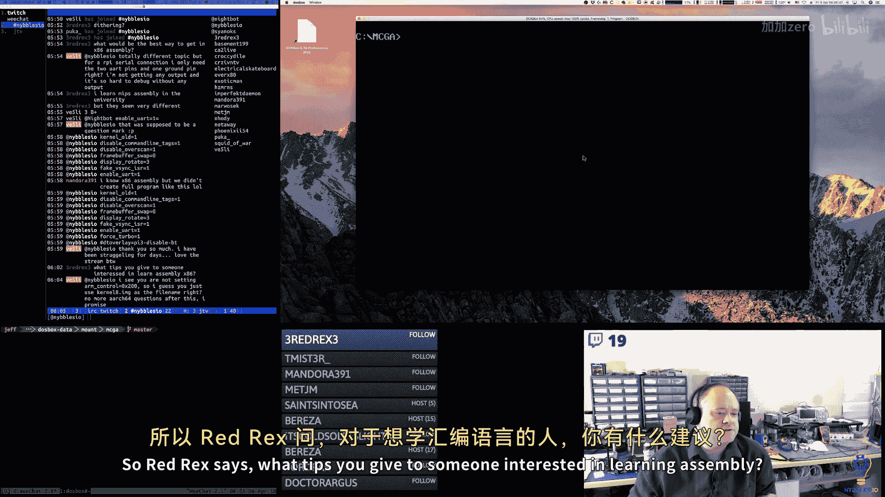


---

## 12.3：完善数据块初始化机制

在实现了鼠标交互后，我们发现数据块的初始化机制有待完善。之前，`bank_new` 函数只分配内存段并将其清零，但并未初始化每个块（block）的头部信息和数据内容。

理想情况下，不同类型的资源库应有不同的初始化模式：
*   **图块库（Tile Bank）** 和**精灵库（Sprite Bank）**：每个块应初始化为一个棋盘格图案，表示尚未编辑。
*   **调色板库（Palette Bank）**：应加载默认的VGA调色板。

为了更灵活，我决定扩展 `bank_new` 函数。现在，它在创建库时会接受一个回调函数指针。该函数会为每个块（对于图块和精灵是16次，调色板是1次）被调用，并将`ES:BP`设置为指向当前块的正确位置。这样，回调函数就可以执行特定的初始化操作，例如写入块头或填充默认数据。

```assembly
; 伪代码示例：改进后的 bank_new 初始化循环
bank_new:
    mov cx, max_blocks       ; 例如，图块库为16
init_loop:
    setup_block_frame        ; 设置 ES:BP 指向当前块
    call user_callback       ; 调用传入的回调函数进行初始化
    loop init_loop
```

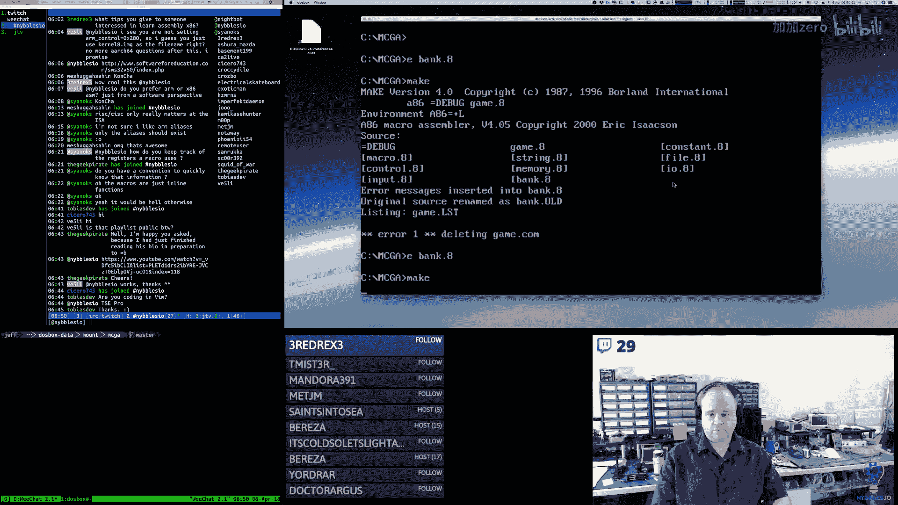

通过这种方式，我们确保了所有库在创建时都处于完全初始化的就绪状态，为后续的编辑操作打下了坚实的基础。

---

## 12.4：集成调色板选择与键盘快捷键

上一节我们完善了底层的数据管理。本节中，我们来看看如何提升用户交互体验，特别是集成调色板选择和键盘快捷键。

**调色板选择**：在编辑图块或精灵时，艺术家可能需要预览同一图形在不同调色板下的效果。因此，我在编辑器界面添加了调色板显示和切换控件。
*   在界面左上角添加了“Pal”标签和当前调色板编号显示。
*   添加了“上一个（<）”和“下一个（>）”按钮，用于切换调色板。
*   同时，增加了键盘快捷键：**左括号 `[`** 和 **右括号 `]`** 也可以循环切换调色板索引。

**颜色选择快捷键**：在编辑器的颜色选择区域（通常显示16种颜色），除了用鼠标点击，我还添加了键盘快捷键以提高效率。
*   按键 **0** 到 **9** 可以直接选择前10种颜色。
*   （后续计划）使用 **Ctrl+0** 到 **Ctrl+5** 来选择剩下的6种颜色。

这些交互改进使得编辑工作流更加流畅，用户可以根据习惯选择鼠标或键盘进行操作。

---

## 12.5：编辑器的数据流与联动更新


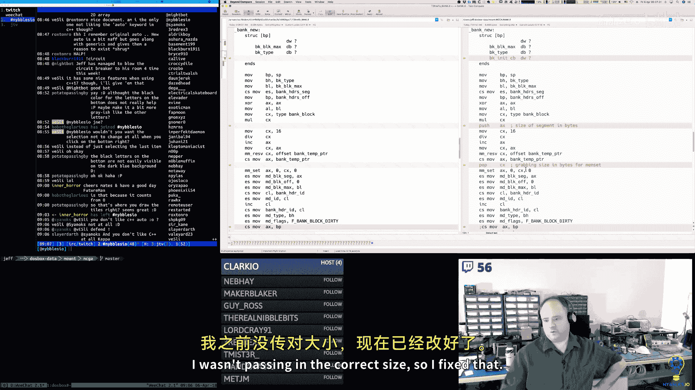

现在，让我们将各个部分连接起来，理解整个编辑器的数据流。


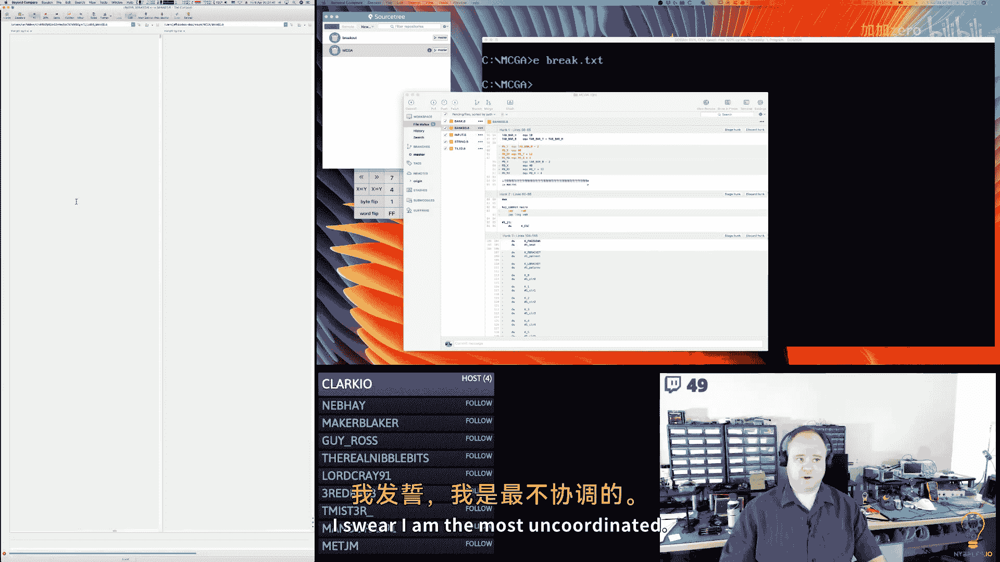

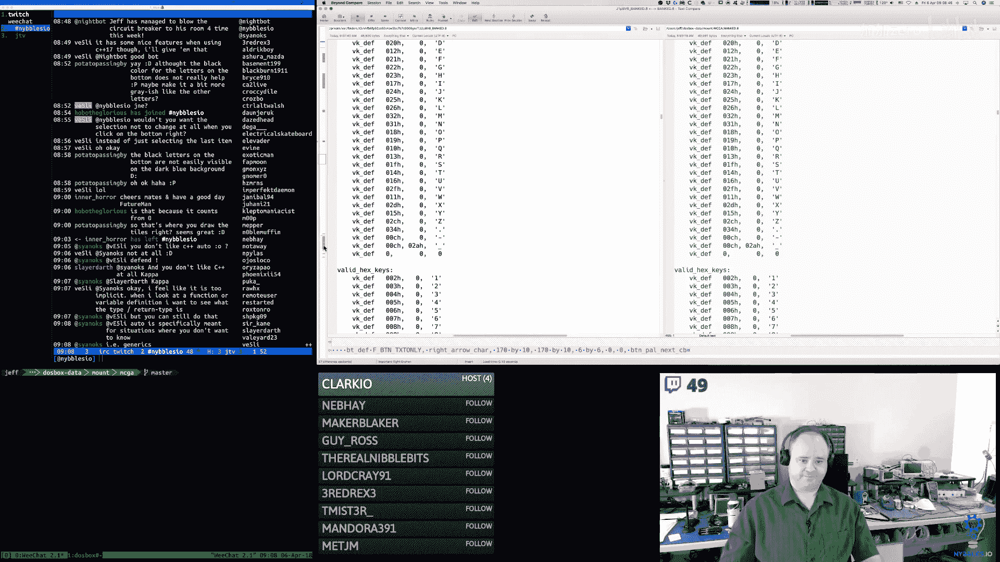


当用户在颜色选择区（通过鼠标或键盘）选中一个颜色索引后，这个索引值被存储为“当前活动颜色”。随后，当用户在主要的图块/精灵编辑网格中点击某个像素时：
1.  通过 `grid_select` 函数计算出被点击像素的线性索引。
2.  根据当前活动颜色，计算出需要修改的目标内存地址。对于4色（2bpp）的图块，每个像素由2个位表示，可能需要修改一个字节中的高半字节或低半字节。
3.  直接修改`ES:BP`指向的块数据内存中的相应字节。
4.  由于显示逻辑每一帧都会从相同的内存地址读取数据并重绘屏幕，所以修改会立即反映在右侧的放大编辑视图和左侧的缩略图列表中。

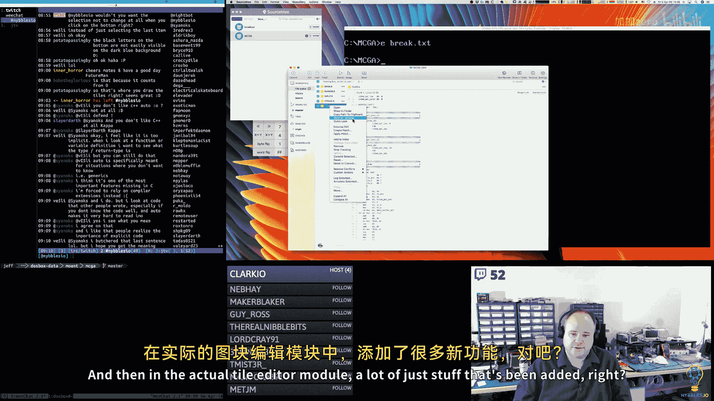


这样就实现了一个完整的、双向联动的编辑循环。内存是唯一的事实来源，所有视图都是它的实时反映。

---

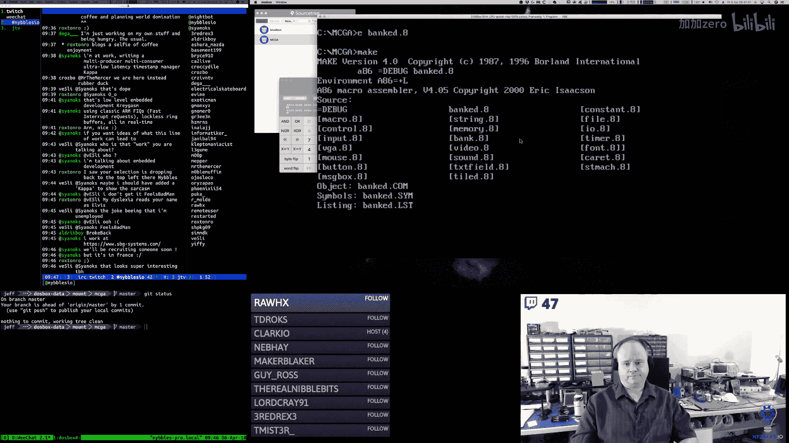

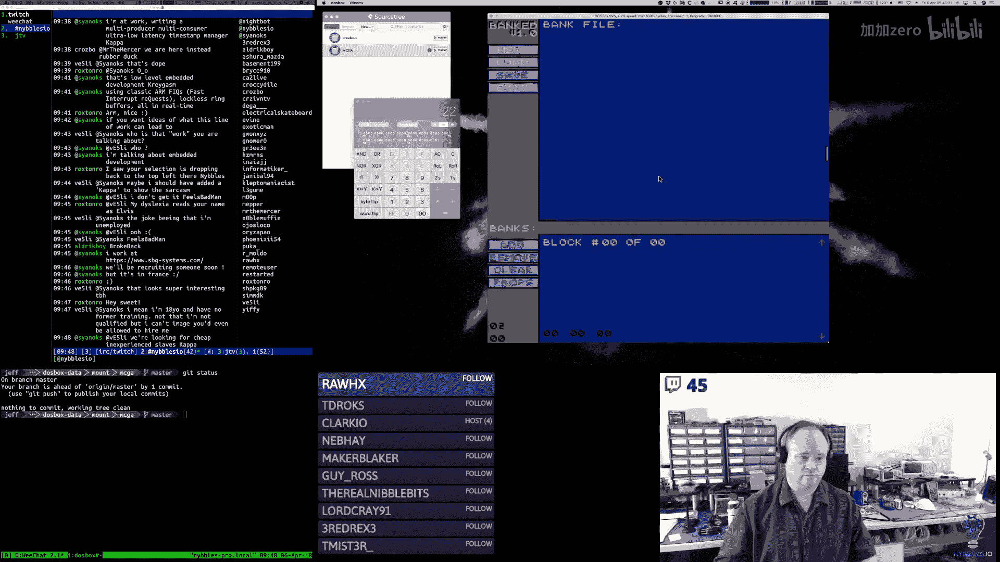


## 12.6：未解决的问题与未来计划

虽然我们已经取得了显著进展，但仍有一些问题需要解决，并为下周的工作制定了计划。


**当前问题**：
1.  **调色板数据输入**：如何优雅地编辑调色板中每个颜色的RGB值？是弹出一个对话框，还是在界面上创建48个（16色×3通道）输入字段？这需要实现文本框之间的Tab切换等额外功能。
2.  **背景编辑器**：背景编辑器需要关联一个特定的图块库。我考虑在编辑器界面添加一个“图块集”按钮或下拉选择器，用于选择当前文件中的哪个图块库作为背景的源。
3.  **文件I/O**：目前所有编辑都在内存中进行，尚未实现将数据保存到磁盘文件（.BANK文件）的功能。

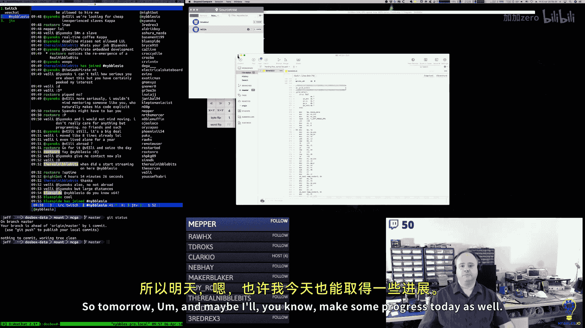

**下周计划**：
下周将是MS-DOS版本工具开发的最后一周。目标是：
*   完成**图块**、**精灵**和**字体**编辑器的功能，确保它们的行为一致且完善。
*   尽可能推进**调色板**编辑器的数据输入界面。
*   开始着手**背景**编辑器的基本框架，至少实现图块集的选择和基础编辑。

完成这些后，这个参考实现将告一段落。接下来的视频课程制作将基于这个原型，但可能会为了教学清晰度而进行重构或简化。

---

## 总结

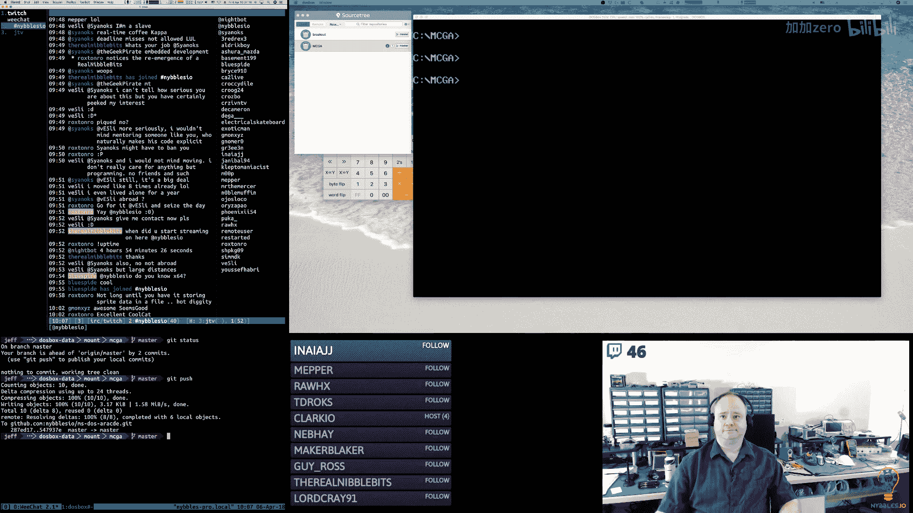

本节课中，我们一起学习了如何为一个图形编辑工具实现核心的交互与数据管理功能。我们创建了通用的 `grid_select` 函数来处理鼠标网格选择，重构了 `bank_new` 的初始化过程以支持可定制的回调，增加了调色板切换和键盘快捷键来改善用户体验，并理解了编辑器内部数据联动更新的原理。尽管在调色板编辑和背景编辑等方面仍有工作要做，但我们已经为图块和精灵的像素级编辑建立了一个强大且可扩展的基础。