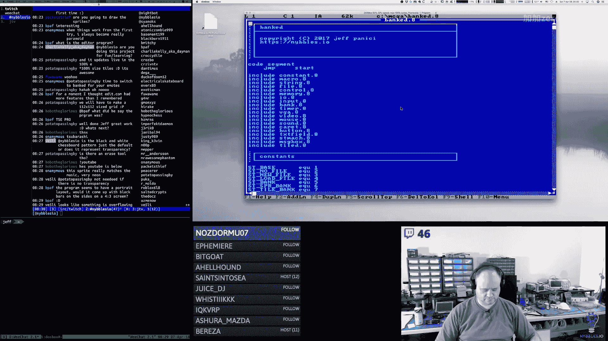
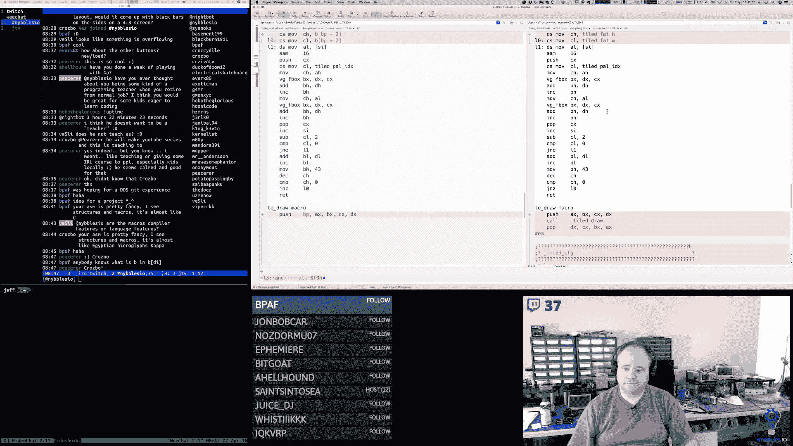

# 013：精灵、瓦片与字体编辑器收尾 🎮

在本节课中，我们将学习如何完成一个用于游戏开发的精灵、瓦片和字体编辑器。我们将重点重构网格选择功能，使其更加通用，并集成到各个编辑模块中。同时，我们会处理半字节编码的像素数据，并修复一些界面和内存相关的错误。


---

## 概述

上一节我们实现了基础的网格选择功能。本节中，我们将对其进行重构，使其成为一个可复用的组件，并集成到瓦片、精灵和字体编辑器中。我们还将实现半字节编码的像素绘制逻辑，并解决编辑器界面中的一些交互问题。

## 重构网格选择模块

首先，我们需要将网格选择逻辑从主模块移动到专门的瓦片编辑器模块中，使其更加通用。以下是重构的核心步骤：

1.  **创建通用配置结构**：我们定义了一个配置结构，用于存储每个编辑器网格的特定参数，如像素放大尺寸、网格宽高和最大索引值。
    ```assembly
    ; 伪代码示例：配置结构
    TileEditorConfig:
        .fatWidth:   db ?  ; 放大网格宽度
        .fatHeight:  db ?  ; 放大网格高度
        .maxIndex:   dw ?  ; 最大索引值
    ```

2.  **更新网格选择函数**：修改网格选择函数，使其接收一个指向索引变量的指针和最大索引值作为参数。这样，函数可以直接更新内存中的索引值，而无需通过寄存器传递。
    ```assembly
    ; 函数原型：更新网格选择
    ; 输入：指向索引变量的指针，最大索引值
    ; 输出：更新内存中的索引值
    ```

3.  **集成到各编辑器**：为瓦片、精灵和字体编辑器分别创建更新函数，这些函数调用通用的网格选择逻辑，并传入各自的配置参数。

## 实现半字节编码绘制

在编辑器中，像素数据以半字节形式编码存储。这意味着每个字节包含两个像素的信息（高4位和低4位）。绘制时需要根据点击位置修改正确的半字节。

以下是处理半字节编码的核心逻辑：

1.  **计算字节索引**：将网格中的点击索引除以2，得到对应的字节在数据块中的位置。
    ```assembly
    mov ax, [tileFatIndex] ; 获取点击索引
    shr ax, 1              ; 除以2，得到字节索引
    ```

2.  **判断高低半字节**：检查原始索引的最低有效位，以确定需要修改的是字节的高半字节还是低半字节。
    ```assembly
    test byte [tileFatIndex], 1 ; 测试最低位
    jnz .isOdd                  ; 如果为1，是奇数索引（低半字节）
    ; 否则为偶数索引（高半字节）
    ```



3.  **更新像素数据**：
    *   对于**高半字节**，将新的颜色值左移4位，然后与原始字节的低半字节进行逻辑或操作。
    *   对于**低半字节**，保留原始字节的高半字节，将新的颜色值与低4位进行逻辑或操作。
    ```assembly
    ; 更新高半字节示例
    mov cl, [selectedColor]
    shl cl, 4           ; 左移4位到高半字节
    and byte [si], 0x0F ; 清除目标字节的高半字节
    or  byte [si], cl   ; 设置新的高半字节颜色值

    ; 更新低半字节示例
    mov cl, [selectedColor]
    and cl, 0x0F        ; 确保颜色值在低4位
    and byte [si], 0xF0 ; 清除目标字节的低半字节
    or  byte [si], cl   ; 设置新的低半字节颜色值
    ```


## 修复界面与交互问题

在开发过程中，我们发现了一些需要修复的问题：



1.  **选择框遮挡像素**：调整选择框的绘制逻辑，使其绘制在瓦片或精灵的外部边缘，而不是覆盖在像素上。
2.  **按钮误触**：将“退出”等关键按钮移动到编辑区域之外，防止在绘制时意外点击。
3.  **调色板内存错误**：修复调色板编辑器在写入时错误覆盖其他内存区域的问题。这通常是由于内存地址计算错误或银行切换逻辑有误导致的。


## 总结

本节课中我们一起学习了如何完成精灵、瓦片和字体编辑器的核心功能。通过重构网格选择模块，我们实现了代码的复用和模块化。通过处理半字节编码，我们掌握了在内存中高效存储和修改像素数据的方法。最后，通过修复界面和内存问题，我们提升了编辑器的稳定性和用户体验。


这个编辑器工具是构建完整游戏资产管线的重要一步，为后续的游戏开发打下了坚实的基础。