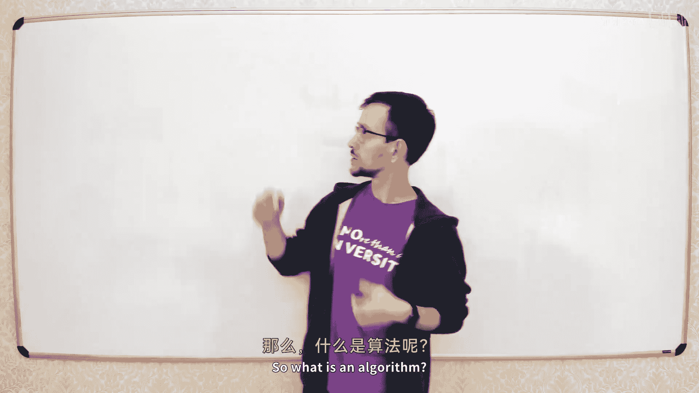
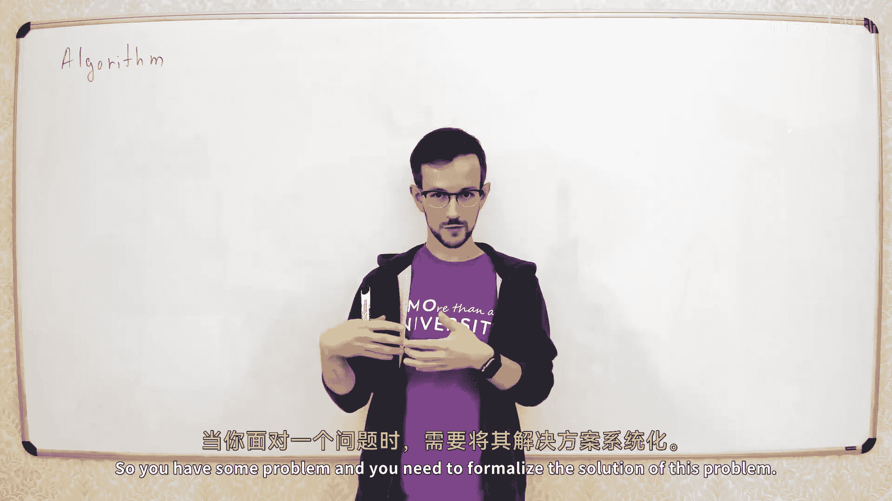

# 001：算法、时间复杂度和归并排序 🚀








在本节课中，我们将学习算法的基础概念，了解如何衡量算法的效率（时间复杂度），并通过一个经典算法——归并排序，来实践这些理论。

## 什么是算法？🤔

算法是解决特定问题的一系列形式化步骤。它将问题的解决方案分解为一系列基本操作。在本课程中，我们主要讨论数据处理算法。这类算法通常的工作流程是：接收输入数据，经过一系列处理，最终产生输出结果。

例如，计算一个整数数组中所有元素的和。我们可以用伪代码描述这个算法：
```python
S = 0
for i from 0 to n-1:
    S = S + A[i]
output S
```

## 如何衡量算法效率？⏱️

衡量算法效率的一个核心指标是**时间复杂度**。它衡量的是算法解决问题所需的时间。然而，我们通常不用“秒”来直接衡量，因为不同计算机的处理速度不同。因此，我们转而计算算法执行的**基本操作数量**。

为了统一计算操作数，我们需要一个计算模型。最常用的模型是**RAM模型**。在这个模型中：
*   内存被看作一个大数组，可以在常数时间内访问或修改任意位置的元素。
*   算法可以执行常规的算术运算、循环、条件判断等操作。

## 大O符号：描述增长趋势 📈

回到计算数组和的例子。如果我们仔细计算，其操作数可能是一个类似 `2 + 5n` 的函数。当 `n` 很大时，常数项 `2` 和系数 `5` 变得不那么重要，真正决定算法快慢的是 `n` 本身。我们用**大O符号**来描述这种渐近增长的上界。

**定义**：如果存在常数 `C` 和 `n0`，使得对于所有 `n ≥ n0`，都有 `f(n) ≤ C * g(n)`，则称 `f(n)` 是 `O(g(n))`。

例如，我们可以证明 `2 + 5n` 是 `O(n)`。只需取 `C = 6`, `n0 = 2`，即可满足条件。

大O符号表示的是时间复杂度的**上界**。与之对应的还有表示下界的**大Ω符号**和表示紧确界的**大Θ符号**。在本课程中，为简化起见，我们主要使用大O符号来证明算法的“足够快”。

## 计算时间复杂度：几种常见情况 🧮

以下是计算时间复杂度时常见的几种模式：

*   **简单循环**：如果有一个从 `0` 到 `n-1` 的循环，其时间复杂度通常是 `O(n)`。
*   **嵌套循环**：如果有一个双重嵌套循环，每层都运行 `n` 次，那么时间复杂度是 `O(n²)`。
*   **循环变量倍增**：在 `while i < n: i = i * 2` 这样的循环中，循环次数约为 `log₂ n`，因此时间复杂度是 `O(log n)`。我们通常省略对数的底数，因为不同底数之间只差一个常数倍。
*   **递归算法**：计算递归算法的时间复杂度，需要分析递归调用次数和每次调用的工作量。

## 排序算法初探：插入排序 🔢

排序算法是算法的经典案例。**插入排序**的工作原理是：维护一个已排序的前缀，依次将后续元素插入到前缀的正确位置。

其伪代码如下：
```python
for i from 0 to n-1:
    j = i
    while j > 0 and A[j] < A[j-1]:
        swap A[j] and A[j-1]
        j = j - 1
```

插入排序的**时间复杂度取决于输入**：
*   **最好情况**（数组已排序）：`O(n)`。
*   **最坏情况**（数组逆序）：`O(n²)`。
在算法分析中，若无特别说明，我们讨论的通常是**最坏情况时间复杂度**。因此，插入排序的时间复杂度是 `O(n²)`。

## 更高效的排序：归并排序 🧬

有没有比 `O(n²)` 更快的排序算法？有，**归并排序**就是一个 `O(n log n)` 的算法。它基于**分治**思想。

归并排序的核心操作是**合并**：将两个**已经排序**的数组合并成一个大的有序数组。合并过程如下：
1.  比较两个数组当前的最小元素。
2.  将较小的元素放入结果数组。
3.  重复步骤1和2，直到所有元素都被取出。


合并两个长度分别为 `n` 和 `m` 的数组，时间复杂度为 `O(n + m)`。

## 归并排序的分治过程 ⚙️

完整的归并排序算法是递归的：
1.  **分**：将数组分成左右两半。
2.  **治**：递归地对左右两半分别进行归并排序。
3.  **合**：将两个已排序的半边数组合并起来。

其递归结构可以表示为：
```
T(n) = 2 * T(n/2) + O(n)
```
其中 `T(n)` 是排序长度为 `n` 的数组所需的时间，`O(n)` 是合并操作的时间。

## 分析归并排序的时间复杂度 📊

我们可以通过递归树来分析这个复杂度：
*   递归树共有 `log₂ n` 层。
*   每一层所有子问题需要处理的元素总数加起来都是 `n`。
*   因此，总时间复杂度 = 层数 × 每层工作量 = `O(n log n)`。

这符合**主定理**的结论。主定理是解决形如 `T(n) = a * T(n/b) + f(n)` 的递归式时间复杂度的通用方法。在归并排序中，`a = 2, b = 2, f(n) = O(n)`，属于主定理的第三种情况，结果正是 `O(n log n)`。

## 总结 🎯

本节课我们一起学习了：
1.  **算法**是解决问题的形式化步骤序列。
2.  使用**时间复杂度**（通常用大O符号表示）来衡量算法效率，它关注的是操作数量随输入规模的增长趋势。
3.  分析了**插入排序**，其最坏情况时间复杂度为 `O(n²)`。
4.  深入探讨了基于分治思想的**归并排序**，通过递归和合并操作，实现了 `O(n log n)` 的更优时间复杂度。
5.  简要介绍了用于分析递归算法复杂度的**主定理**。

理解这些基础概念是学习更复杂算法与数据结构的基石。下节课我们将继续探索更多精彩内容。