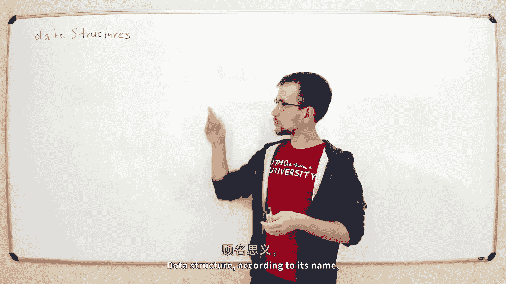
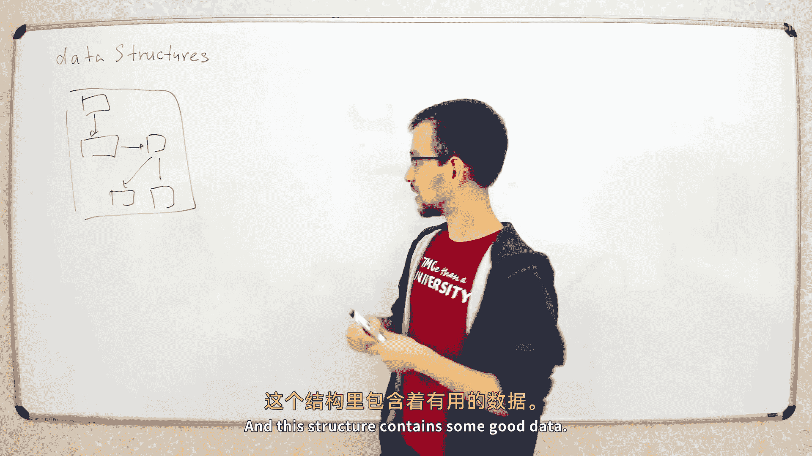
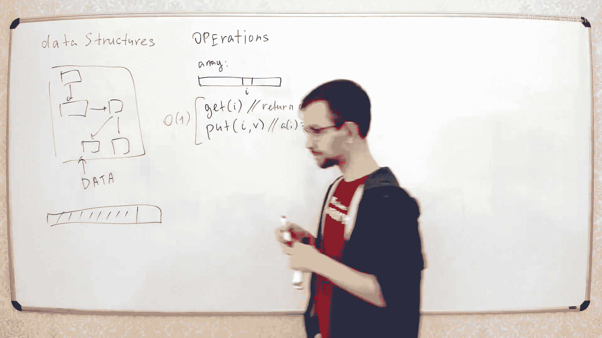

# 002：数据结构、二叉堆与堆排序 🧠








在本节课中，我们将要学习数据结构的基本概念，并深入探讨一种名为“二叉堆”的具体数据结构。我们将了解它的工作原理、如何实现插入和删除最小元素的操作，以及如何利用它来实现一个高效的排序算法——堆排序。

---



## 什么是数据结构？🏗️

数据结构，顾名思义，是一种用于存储数据的结构。它不仅仅是简单地将数据堆放在一起，而是以一种特定的方式组织数据，以便高效地执行某些操作。

为什么需要数据结构？为什么不直接把所有数据放进一个大数组里？原因在于，我们通常希望对数据进行访问和操作。例如，在数据库中查找特定记录，或计算某项统计数据。这些操作定义了我们需要什么样的数据结构。因此，在选择数据结构之前，首先要明确需要支持哪些操作。

每个数据结构都有一组特定的操作，并且我们需要分析每个操作的时间复杂度。例如，一个简单的数组支持两种基本操作：
*   **获取元素**：`a[i]`
*   **设置元素**：`a[i] = x`

这两种操作的时间复杂度都是常数时间 O(1)。

数据结构和算法紧密相连。设计算法时，合适的数据结构可以使其更高效；而实现数据结构本身，也需要用到算法。

---

## 二叉堆（优先队列）介绍 🌳

上一节我们介绍了数据结构的基本概念，本节中我们来看看一种名为“二叉堆”（也称为优先队列）的具体数据结构。

二叉堆属于“优先队列”这一类数据结构。它支持以下两个核心操作：
1.  **插入**：向堆中添加一个新元素。
2.  **删除最小元素**：从堆中移除并返回当前最小的元素（假设元素可以相互比较）。

在深入二叉堆之前，我们先尝试用简单数组来实现这两个操作，以理解其挑战所在。

### 简单数组的两种实现尝试

**第一种尝试：无序数组**
*   **插入**：直接将新元素放在数组末尾，时间复杂度为 O(1)。
*   **删除最小元素**：需要遍历整个数组以找到最小元素，然后将其与最后一个元素交换并移除，时间复杂度为 O(n)。

**第二种尝试：有序数组**
*   **删除最小元素**：由于数组已排序，最小元素在末尾，直接移除即可，时间复杂度为 O(1)。
*   **插入**：为了保持数组有序，需要为新元素找到正确位置并移动其他元素，时间复杂度为 O(n)。

可以看到，两种简单实现都无法同时让两个操作都高效。如果算法中需要频繁进行插入和删除，总时间复杂度会很高（O(n²)）。而二叉堆的目标是让**两个操作的时间复杂度都达到 O(log n)**。

---

## 二叉堆的结构与性质 🌲

现在，我们来学习真正的二叉堆。二叉堆在逻辑上是一棵“完全二叉树”（或近似完全二叉树）。这意味着除了最后一层，其他层都是满的，并且最后一层的节点尽可能靠左排列。

这棵树有一个关键性质：**堆性质**。对于最大堆，每个节点的值都大于或等于其子节点的值；对于最小堆（我们讨论的），每个节点的值都**小于或等于**其子节点的值。因此，最小堆的根节点总是整个堆中的最小元素。

我们如何存储这棵树？由于它的结构是固定的（由元素个数决定），我们可以使用一个简单的数组来存储，无需复杂的指针。
*   将树的节点按层、从左到右依次编号（从0开始）。
*   数组的第 `i` 个位置就存储编号为 `i` 的节点上的元素。

通过简单的公式，我们可以在数组中找到任意节点的父节点或子节点：
*   节点 `i` 的**左子节点**索引：`2*i + 1`
*   节点 `i` 的**右子节点**索引：`2*i + 2`
*   节点 `i` 的**父节点**索引：`(i - 1) // 2` （整数除法）

---

## 二叉堆的操作：上浮与下沉 ⬆️⬇️

理解了堆的存储方式后，我们来看看如何实现插入和删除操作。这两个操作的核心是维护堆性质的两种辅助操作：“上浮”和“下沉”。

### 插入与上浮操作

当插入一个新元素 `x` 时：
1.  将 `x` 放在数组的末尾（即树的最后一个位置）。
2.  此时，堆性质可能被破坏（新元素可能比它的父节点小）。
3.  进行“上浮”操作：不断将新元素与其父节点比较。如果它比父节点小，则交换它们的位置。重复此过程，直到它不再小于父节点，或者到达根节点。


这个过程最多需要从树的最底层移动到根节点，层数为树的高度，即 O(log n)。

以下是上浮操作的伪代码描述：
```
function insert(x):
    heap.append(x)          // 将x放入数组末尾
    i = heap.size() - 1     // i是x的当前位置
    while i > 0 and heap[i] < heap[(i-1)//2]:
        swap(heap[i], heap[(i-1)//2]) // 与父节点交换
        i = (i-1)//2                  // 更新当前位置为父节点位置
```

### 删除最小元素与下沉操作

要删除最小元素（即根节点元素）：
1.  根节点就是最小元素。但我们不能直接删除根节点，否则树会分裂。
2.  将数组的**最后一个元素**移动到根节点的位置。
3.  此时，根节点的堆性质几乎肯定被破坏（新上来的元素可能比子节点大）。
4.  进行“下沉”操作：从根节点开始，将其与它的两个子节点中**较小的那个**比较。如果它比这个较小的子节点大，则交换它们的位置。重复此过程，直到它不大于任何子节点，或者到达叶子节点。

这个过程同样最多需要从根节点移动到叶子节点，时间复杂度为 O(log n)。

以下是下沉操作的伪代码描述：
```
function extract_min():
    min_value = heap[0]          // 保存根节点（最小值）
    heap[0] = heap.last()        // 将最后一个元素移到根节点
    heap.remove_last()           // 删除最后一个元素
    i = 0
    while (2*i + 1) < heap.size(): // 当左子节点存在时
        j = 2*i + 1               // j先设为左子节点
        // 如果右子节点存在且更小，则j更新为右子节点
        if (2*i + 2) < heap.size() and heap[2*i + 2] < heap[j]:
            j = 2*i + 2
        // 如果当前节点已经小于等于最小子节点，则停止
        if heap[i] <= heap[j]:
            break
        swap(heap[i], heap[j])   // 否则，与较小子节点交换
        i = j                    // 继续向下检查
    return min_value
```

---

## 堆排序算法 🚀

掌握了二叉堆后，我们可以用它来实现一个非常优雅的排序算法——堆排序。其思路非常简单直观：

1.  **建堆**：将待排序的数组构建成一个最小堆。
2.  **依次提取**：重复从堆中提取最小元素。由于每次提取的都是当前剩余元素中的最小值，按提取顺序排列就得到了有序序列。

一个朴素的实现需要额外一个数组来存放堆。但我们可以优化，实现“原地”堆排序，只使用原始数组的空间：

1.  **原地建堆**：从数组的中间位置开始，向前遍历每个元素，并对每个元素执行“下沉”操作。这样可以线性时间复杂度（O(n)）地将整个数组调整成堆结构。
2.  **排序**：此时数组第一个元素（`a[0]`）是最小值。我们将它与数组的最后一个元素交换，这样最小值就放在了最终位置。然后，将堆的大小减1（忽略最后一个位置），并对新的根节点（刚才交换上来的元素）执行“下沉”操作以恢复堆性质。重复此过程，直到堆中只剩一个元素。

最终，数组就按升序排列好了。堆排序的时间复杂度是 O(n log n)，并且是原地排序，空间复杂度为 O(1)。

---

## 总结 📚

本节课中我们一起学习了：
1.  **数据结构**的意义：为了高效操作数据而组织数据的方式。
2.  **二叉堆（最小堆）**：一种基于完全二叉树、能同时支持 O(log n) 时间插入和删除最小元素的数据结构。
3.  堆的核心操作：**上浮**（用于插入后维护堆性质）和**下沉**（用于删除根节点后维护堆性质）。
4.  **堆排序**：利用二叉堆实现的、时间复杂度为 O(n log n) 的高效原地排序算法。

二叉堆是优先队列的一种简单高效实现，在调度算法、图算法（如Dijkstra最短路径）等领域有广泛应用。理解它有助于你掌握更多高级数据结构和算法。