# 004：排序下界、基数排序与排序网络

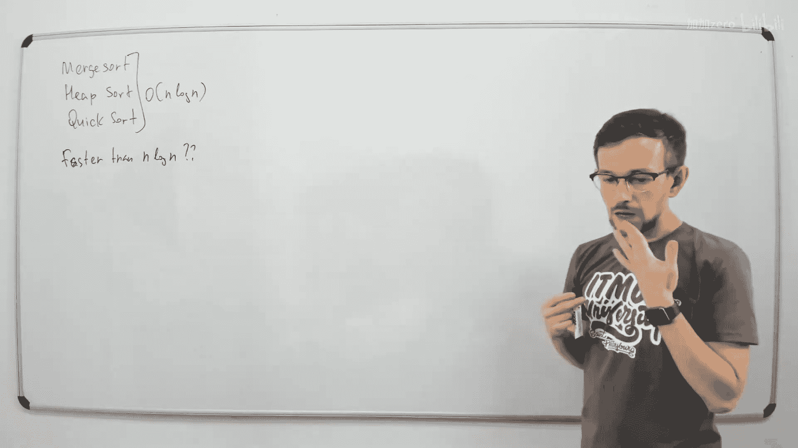

在本节课中，我们将要学习排序算法的理论下界，以及如何通过基数排序在线性时间内对特定类型的数据进行排序。最后，我们还将探讨一种特殊的并行计算模型——排序网络。

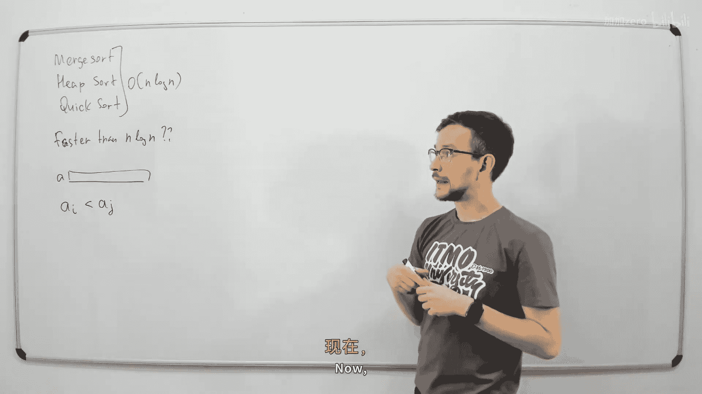

## 排序算法的下界

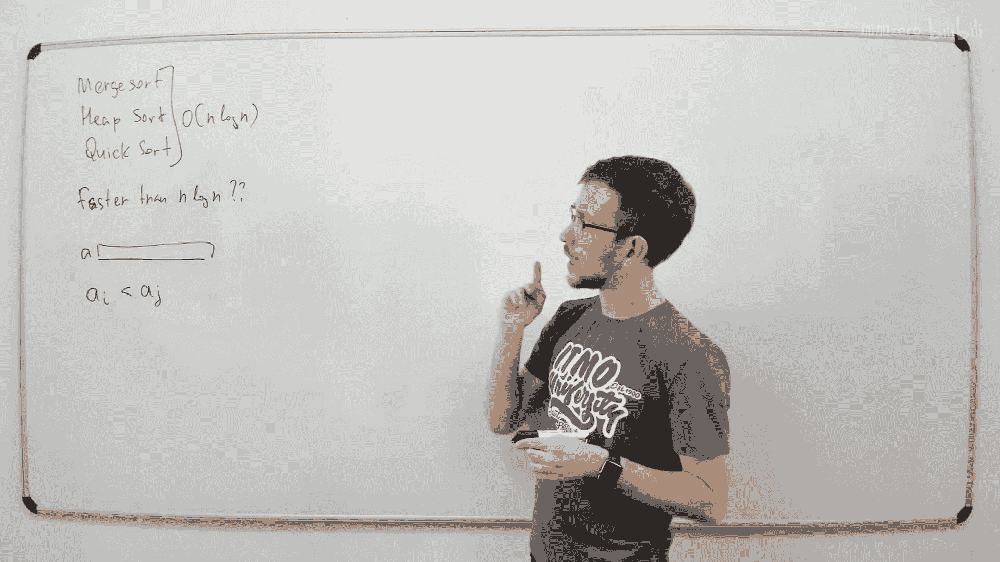

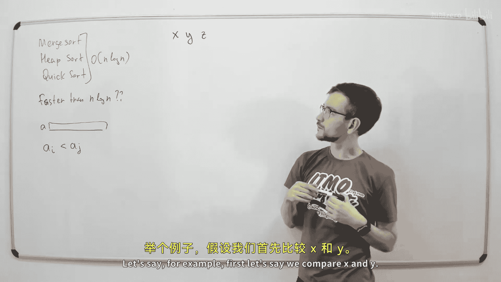

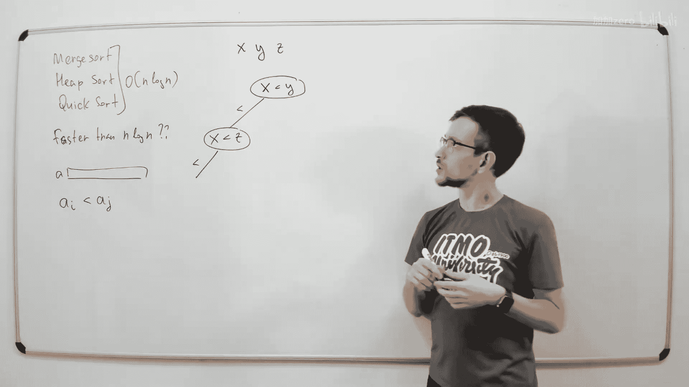

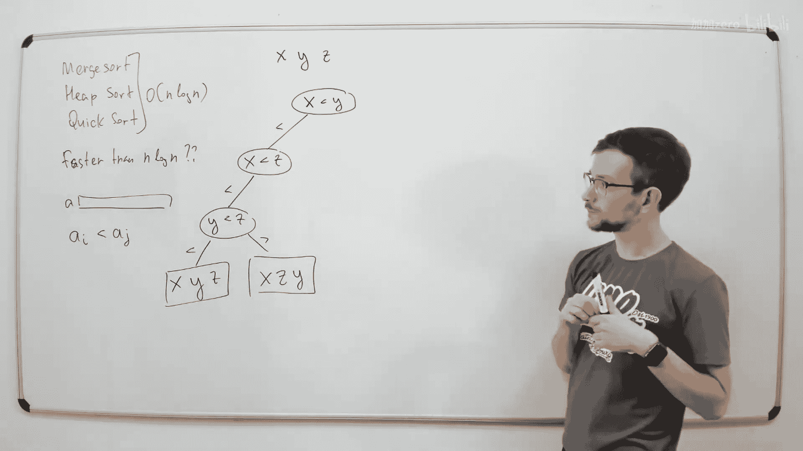

上一节我们介绍了归并排序、堆排序和快速排序。虽然这些算法使用了不同的思想和技术，但它们的时间复杂度都是 **O(n log n)**。

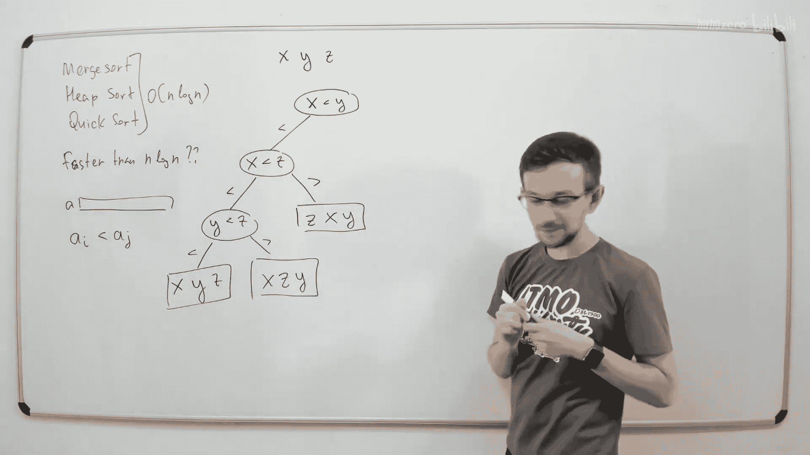

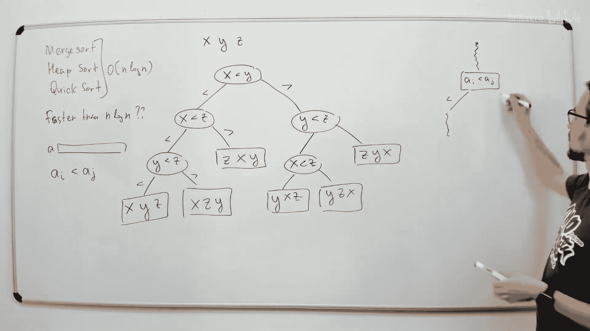

一个自然的问题是：是否存在比 **O(n log n)** 更快的排序算法？一个有趣的事实是，对于基于比较的排序算法，这是不可能的。让我们来探讨其原因。

为了证明这一点，我们需要限定算法能对数组元素进行的操作。在创建这些排序算法时，我们唯一需要的操作是**比较两个元素**。例如，在归并排序中，我们比较两个数组的首元素以获取最小值；在堆排序中，我们比较元素与其父节点来决定是否交换。

因此，如果我们规定算法只能通过比较两个元素来获取信息，那么任何此类排序算法在最坏情况下都需要至少 **Ω(n log n)** 次比较。

### 决策树模型证明

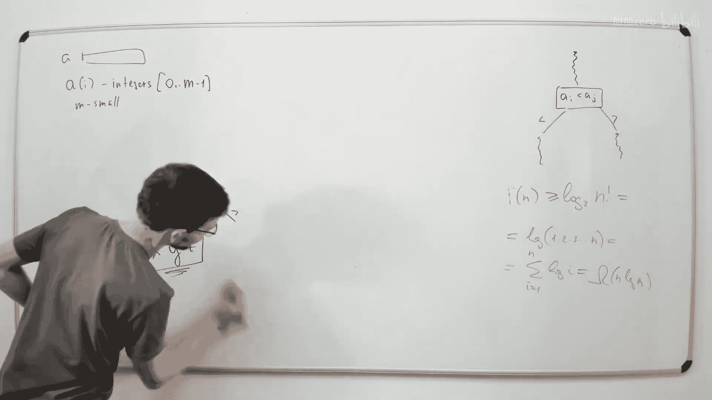

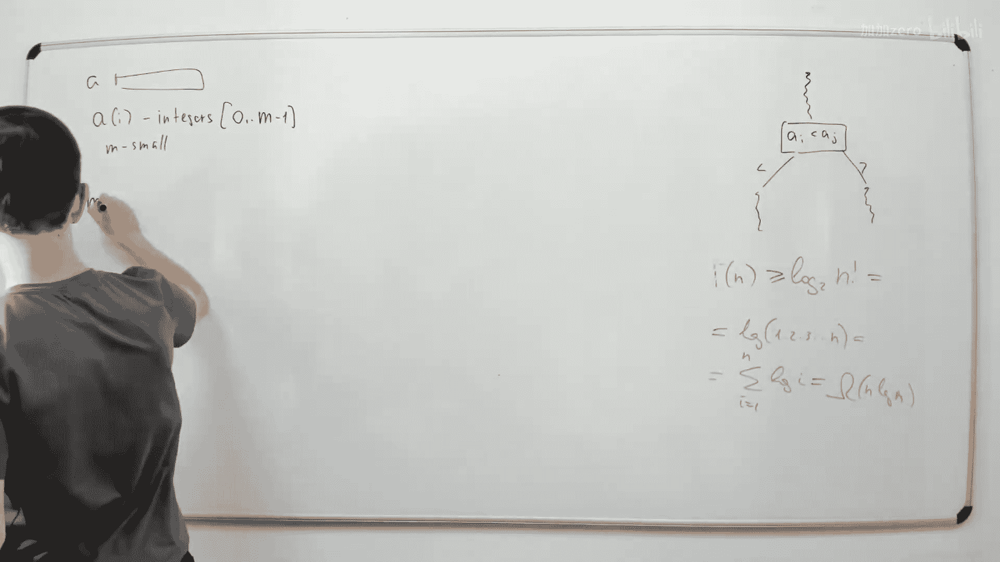

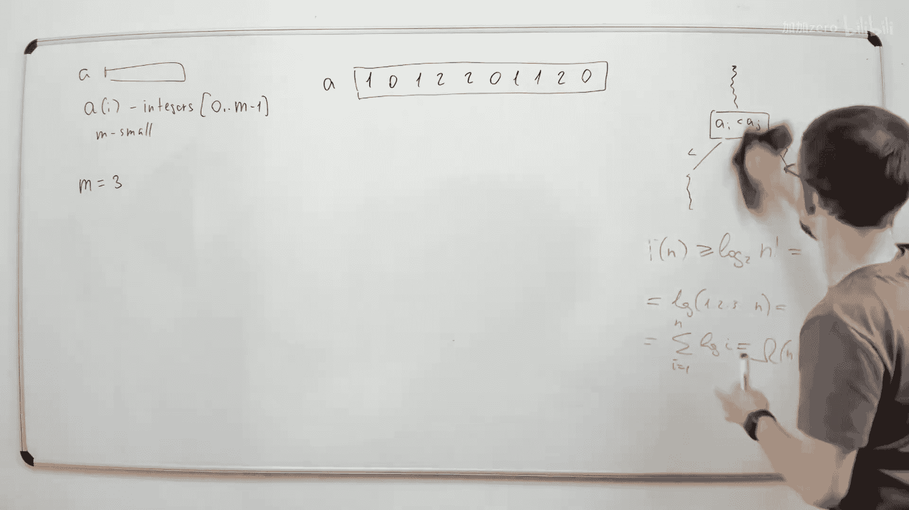

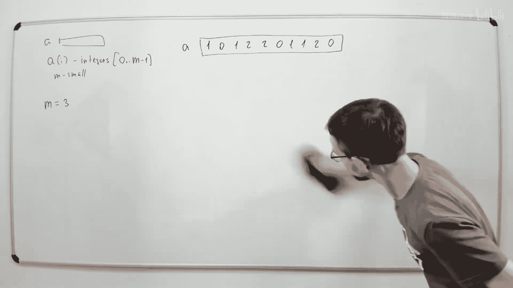

我们可以通过决策树模型来理解这个下界。假设我们有三个元素 X, Y, Z。排序算法通过一系列比较来决定最终的排列顺序。这个过程可以表示为一棵二叉树：
*   每个内部节点代表一次比较（例如，比较 X 和 Y）。
*   每个分支代表比较的结果（例如，X < Y 或 X > Y）。
*   每个叶子节点代表一种可能的排序结果（即元素的一种排列）。

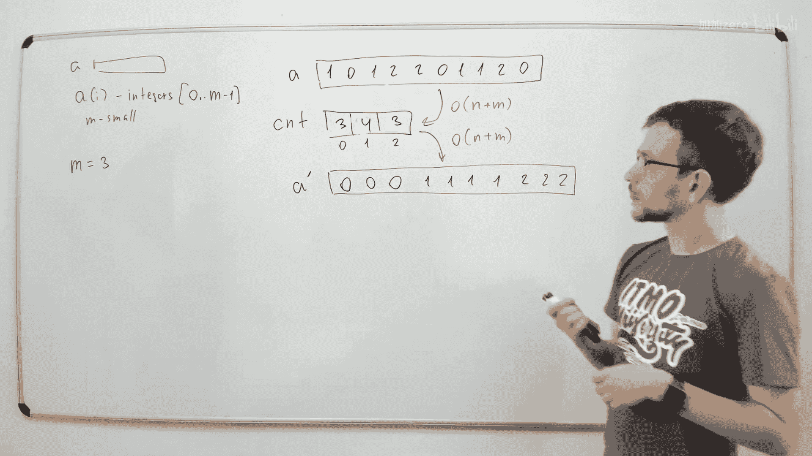

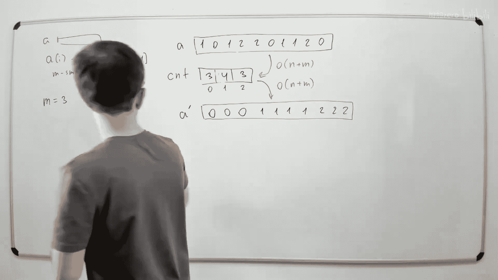

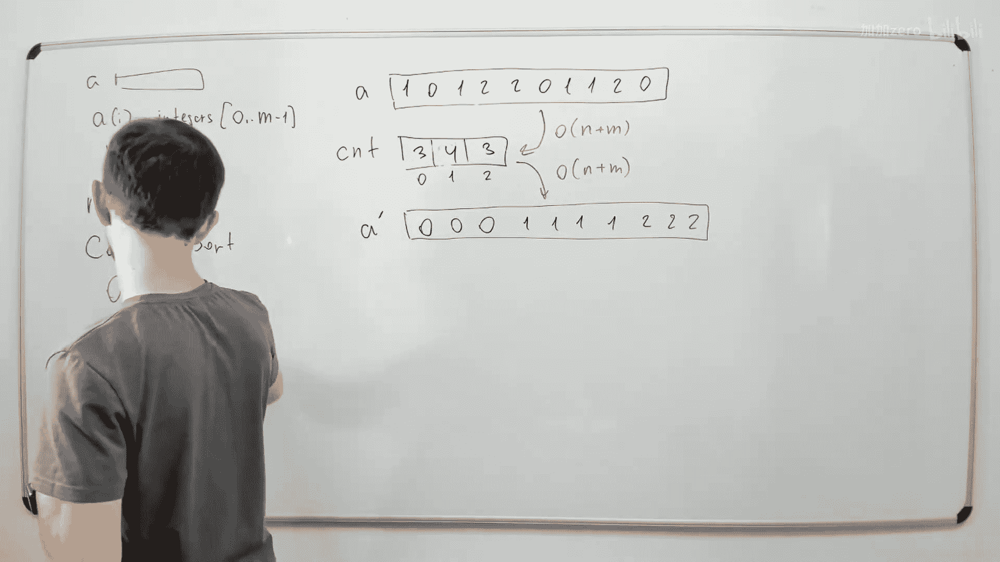

对于 n 个元素，共有 **n!** 种可能的排列，因此决策树至少有 **n!** 个叶子节点。一棵高度为 h 的二叉树最多有 **2^h** 个叶子节点。因此，要容纳 n! 个叶子，树的高度 h 必须满足：
**2^h ≥ n!**
对两边取对数，得到：
**h ≥ log₂(n!)**

根据斯特林公式近似，**log₂(n!)** 的增长速度是 **Ω(n log n)**。因此，任何基于比较的排序算法在最坏情况下都需要至少 **Ω(n log n)** 次比较。决策树的高度对应了算法所需的时间复杂度，这就证明了基于比较的排序算法的时间下界是 **Ω(n log n)**。

## 计数排序：突破下界的特例

上述下界证明基于“只能比较元素”的假设。如果我们能对元素进行更丰富的操作，有时就能实现更快的排序。计数排序就是这样一个特例，它适用于**元素是较小整数**的情况。

假设我们有一个数组 `a`，其中的元素都是范围在 `0` 到 `m-1` 之间的整数，且 `m` 是一个较小的数。

以下是计数排序的步骤：

1.  **统计频次**：创建一个大小为 `m` 的计数数组 `c`，用于统计每个值出现的次数。我们只需遍历原数组一次，对每个元素 `a[i]`，执行 `c[a[i]]++`。
2.  **生成排序数组**：根据计数数组 `c`，我们可以直接构造出排序后的数组。例如，如果 `c[0]=3`，就在结果数组的前三个位置放入 `0`；接着如果 `c[1]=4`，就在接下来的四个位置放入 `1`，依此类推。

计数排序的时间复杂度是 **O(n + m)**。当 `m` 与 `n` 处于同一数量级时，复杂度就是线性的 **O(n)**，这比基于比较的排序更快。

### 处理带附属数据的对象

在实际应用中，我们通常排序的是对象，而整数只是对象的键（key）。我们需要保持对象本身的完整。以下是改进的计数排序步骤：

1.  统计每个键值的出现次数，得到计数数组 `c`。
2.  将计数数组 `c` 转换为前缀和数组，这样 `c[k]` 就表示键值小于 `k` 的元素个数，也即键值为 `k` 的元素在结果数组中的起始位置。
3.  再次遍历原数组，根据每个对象的键值 `k` 和当前 `c[k]` 指向的位置，将对象放入结果数组的对应位置，然后 `c[k]++`。

这种方法同样是 **O(n + m)** 的时间复杂度，并且是**稳定排序**（即键值相同的对象，其相对顺序保持不变）。

## 基数排序：扩展计数排序的适用范围

计数排序要求整数范围 `m` 不能太大。如果我们要排序的整数范围很大（例如 `0` 到 `m² - 1`），该怎么办？基数排序通过将整数视为多个“位”的组合来解决这个问题。

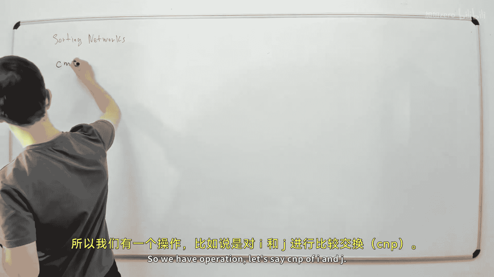

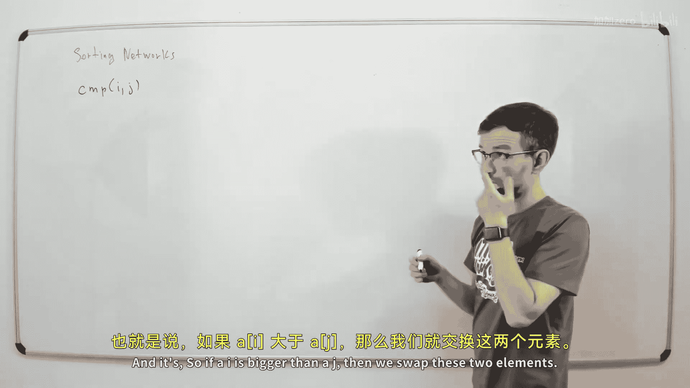

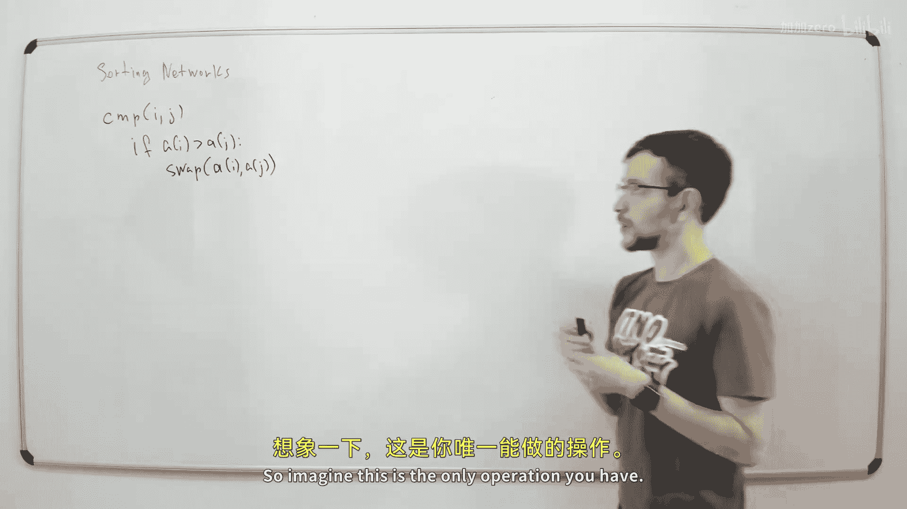

核心思想是：将一个整数 `x` 表示为 `x = y * M + z`，其中 `y` 和 `z` 都在 `0` 到 `M-1` 范围内。这相当于在 `M` 进制下，将 `x` 拆分成高位 `y` 和低位 `z` 两个数字。

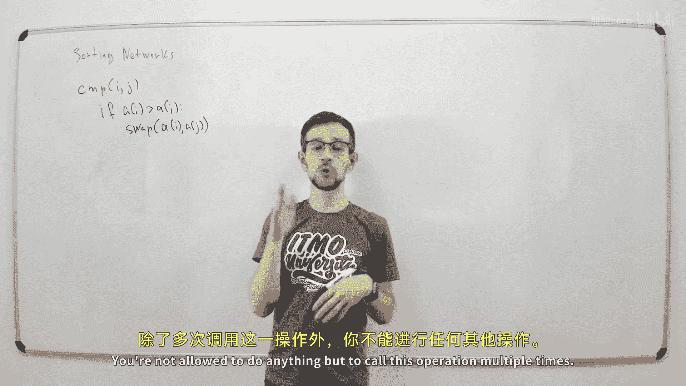

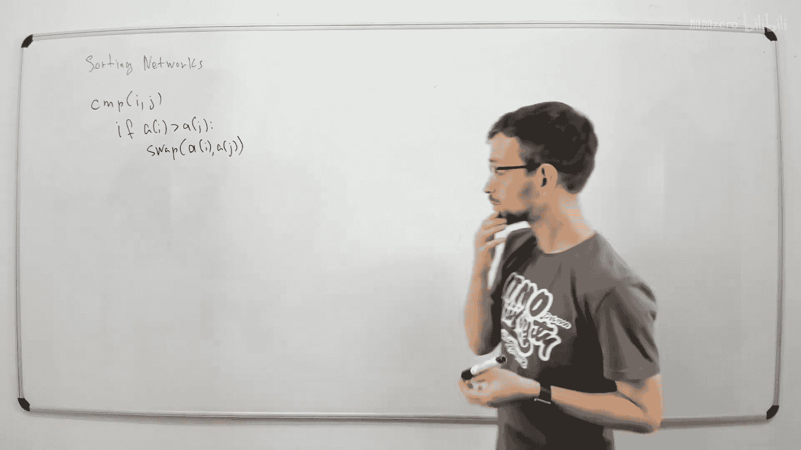

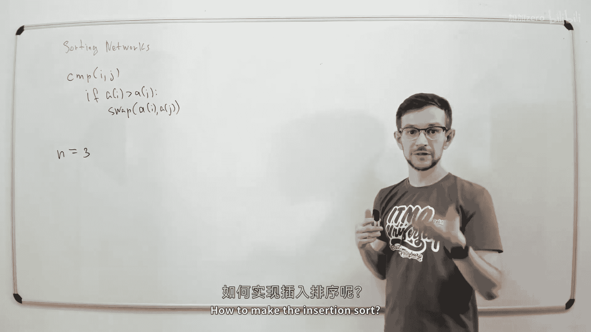

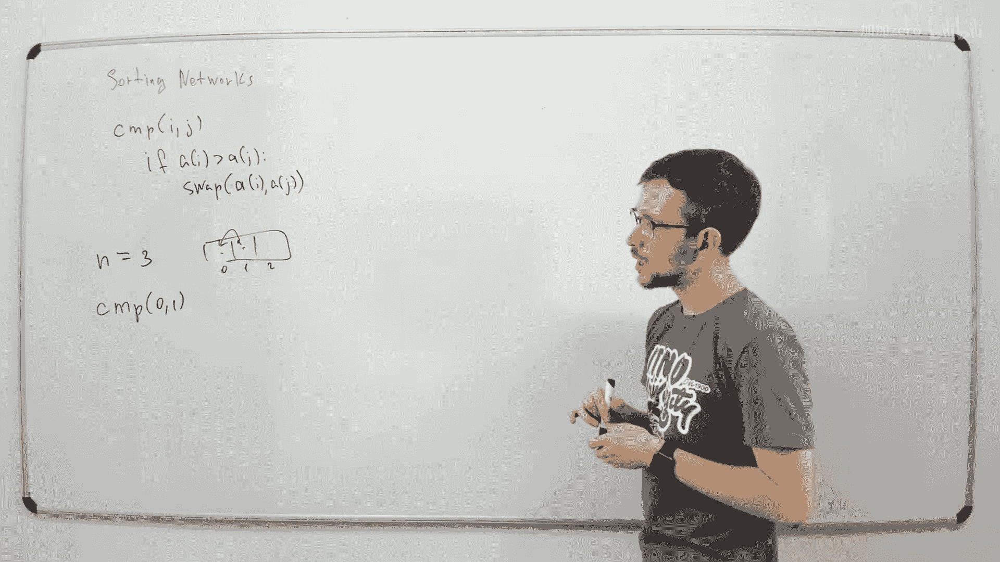

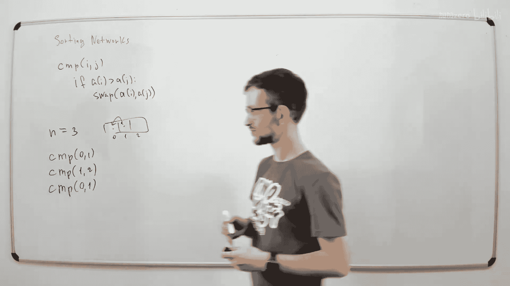

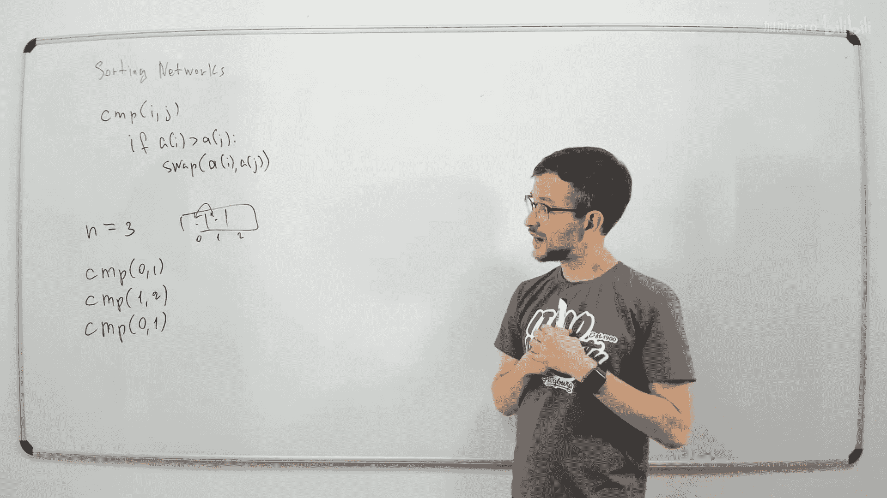

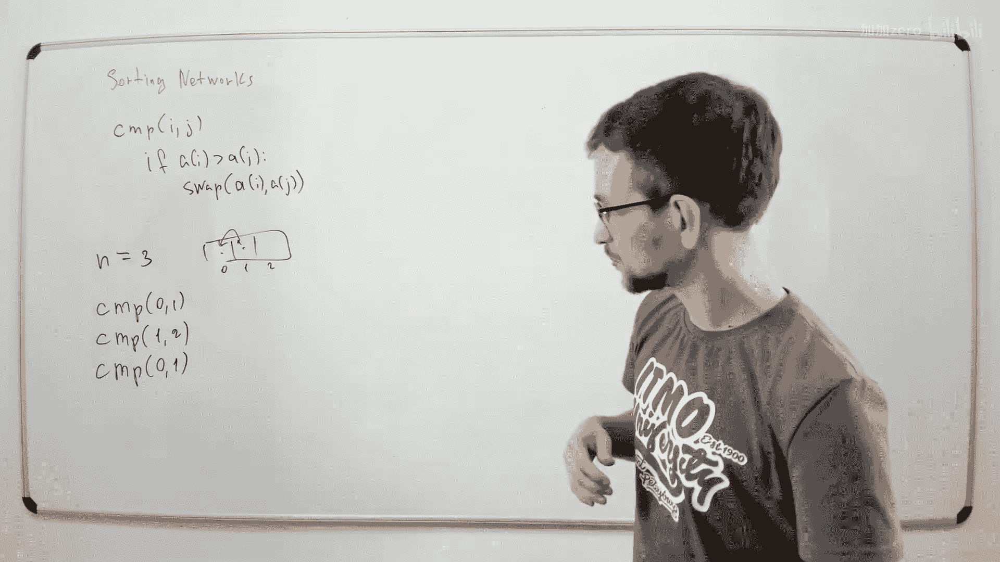

排序时，我们不再直接比较整个数字，而是先根据**低位** `z` 进行排序，再根据**高位** `y` 进行排序。关键是，第二次排序（按高位）必须使用**稳定排序算法**（如稳定的计数排序）。这样，在整体排序后，对于高位相同的元素，它们会按照低位的顺序排列，从而得到完全有序的序列。

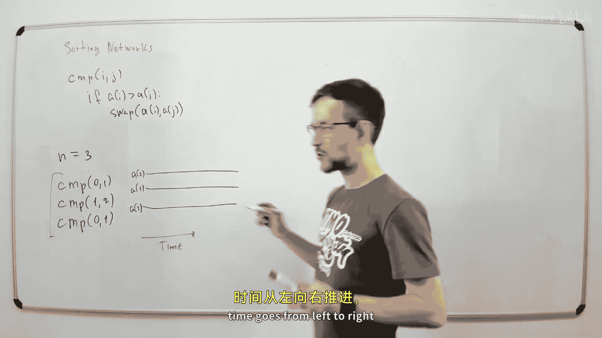

对于范围更大的整数，我们可以将其拆分成 `k` 个数字（例如，按十进制或二进制位拆分）。然后，我们从最低位到最高位，依次进行稳定的计数排序。这个过程称为**基数排序**。

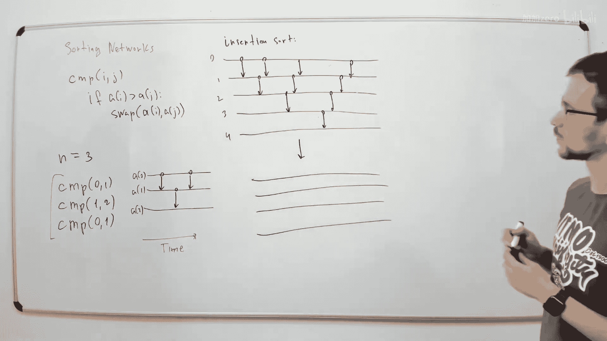

基数排序的时间复杂度是 **O(k * (n + M))**，其中 `k` 是数字的位数，`M` 是每一位的取值范围（例如十进制就是10）。当 `k` 为常数且 `M` 与 `n` 相当时，复杂度是线性的 **O(n)**。

## 排序网络：一种并行计算模型

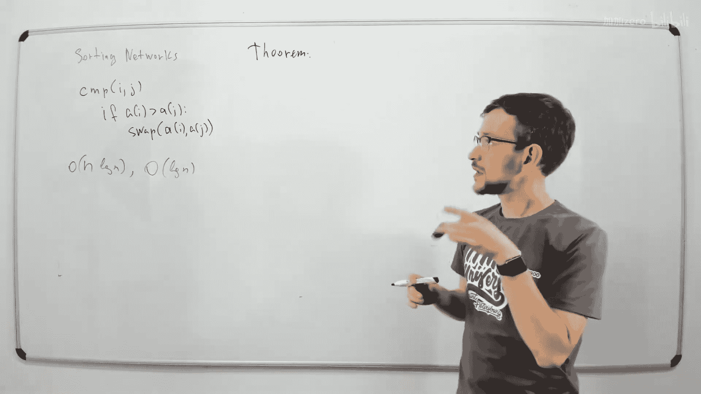

最后，我们介绍一种不同的计算模型——排序网络。在这个模型中，我们只能进行一种操作：**比较-交换**。即，给定两个索引 `i` 和 `j`，如果 `a[i] > a[j]`，则交换它们。

排序网络的目标是设计一个固定的、由比较器组成的网络结构，无论输入序列是什么，都能在输出端得到有序序列。我们关心两个指标：
1.  **比较器的总数**：代表算法的总工作量。
2.  **网络的深度**：代表在允许并行比较（互不依赖的比较可同时进行）的情况下，所需的“时间”步数。

### 双调排序网络

一种著名的排序网络是**双调排序网络**。它的核心是能够高效地排序一种特殊的序列——**双调序列**。

一个序列是双调的，如果它先单调递增（或不变）再单调递减（或不变），或者能通过循环移位变成这种形式。例如序列 `[3, 5, 7, 8, 6, 4, 2, 1]`。

双调排序网络利用了一个关键引理：**如果一个排序网络能正确排序所有由0和1组成的任意序列，那么它就能排序任意序列**。证明思路是，对于任意输入序列中的任意元素，可以构造一个0/1序列来“追踪”该元素在网络中的路径，从而证明其最终位置正确。

基于此，双调排序网络的设计专注于排序0/1双调序列。其算法采用分治策略：
1.  对于一个长度为 `n` 的双调序列，将其对半分成两个子序列 `A` 和 `B`。
2.  将 `A` 中的每个元素 `A[i]` 与 `B` 中对应位置的元素 `B[i]` 进行比较-交换，使得 `A` 中的所有元素都不大于 `B` 中的对应元素。
3.  可以证明，经过这一步后，`A` 和 `B` 都变成了（更小的）双调序列，并且 `A` 中的所有元素都不大于 `B` 中的任何元素。
4.  递归地对 `A` 和 `B` 进行双调排序。

对于一个长度为 `n` 的序列，双调排序网络总共需要 **O(n log² n)** 个比较器，其深度为 **O(log² n)**。虽然这不是理论上最优的（最优深度为 O(log n)），但其结构规整，易于理解和并行实现。

## 总结

本节课中我们一起学习了：
1.  **排序的理论下界**：基于比较的排序算法时间复杂度下界为 **Ω(n log n)**，这通过决策树模型得到证明。
2.  **计数排序**：对于元素为小整数的特殊情况，通过统计频次可以在 **O(n + m)** 时间内完成排序，突破了比较排序的下界。
3.  **基数排序**：通过从低位到高位进行多次稳定的计数排序，可以对更大范围的整数进行线性时间排序。
4.  **排序网络**：介绍了一种并行计算模型，以及**双调排序网络**的基本原理，它通过递归处理双调序列来构建排序网络。

这些知识揭示了算法效率的理论极限，也展示了在特定条件下突破极限的可能性，并为我们理解并行算法提供了基础。