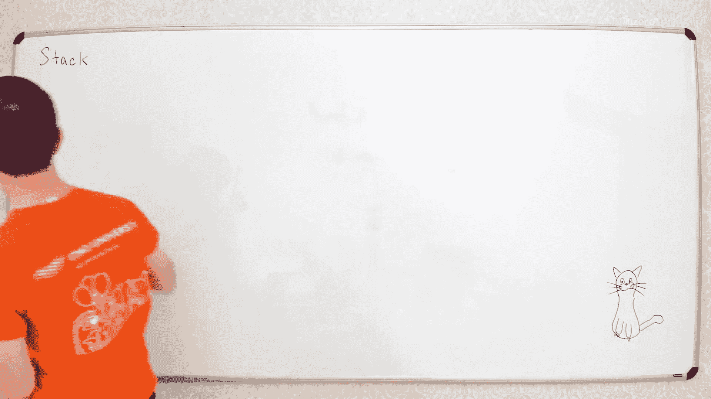
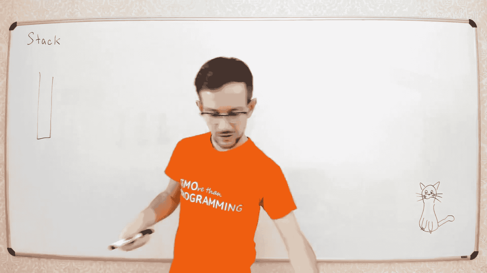
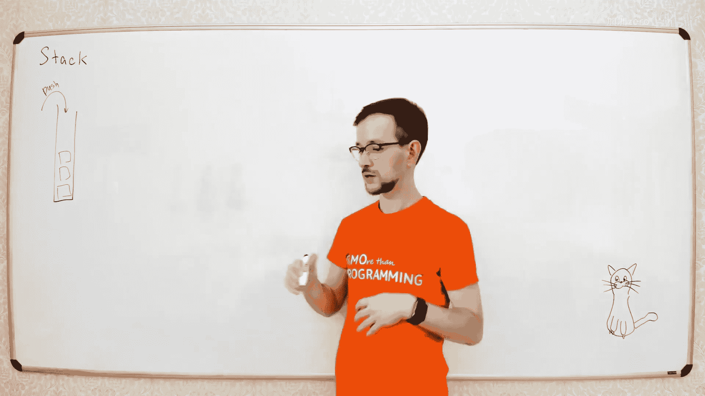
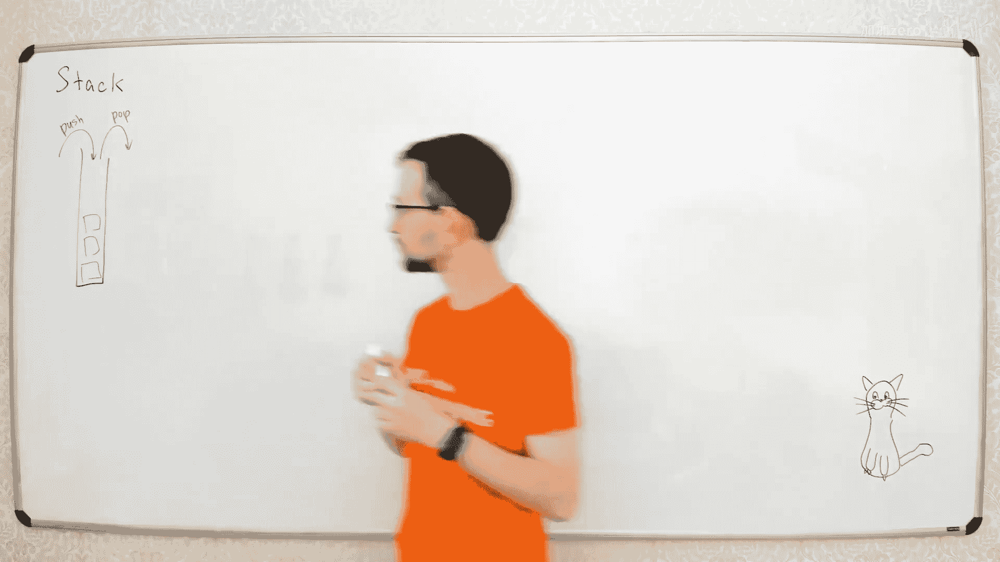
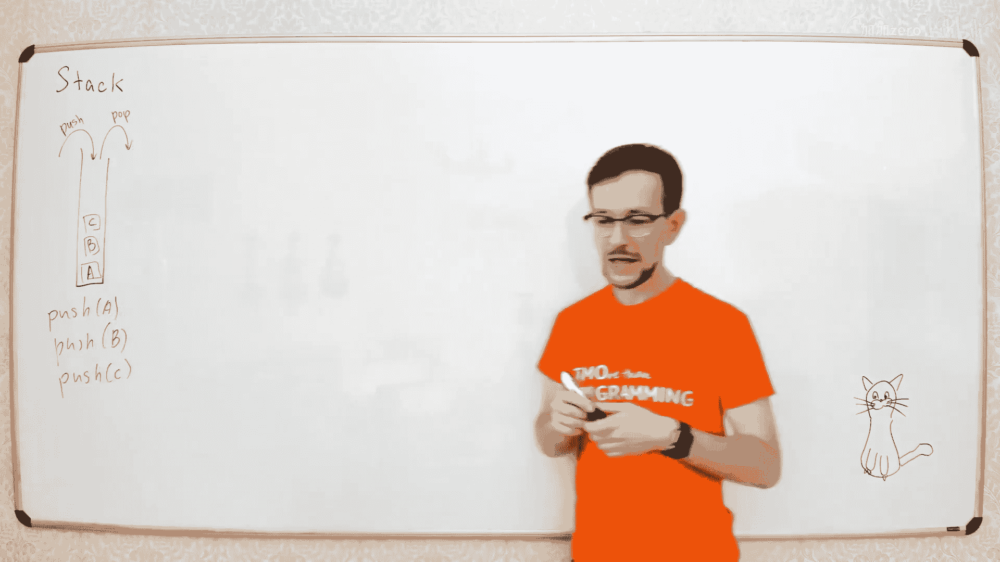
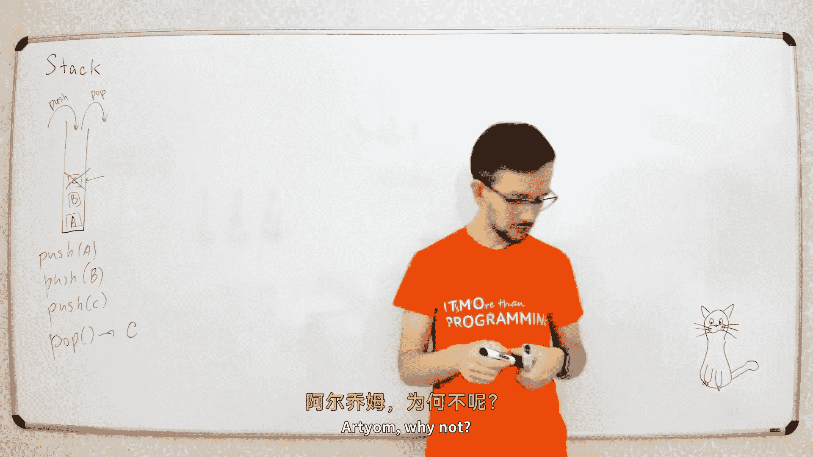
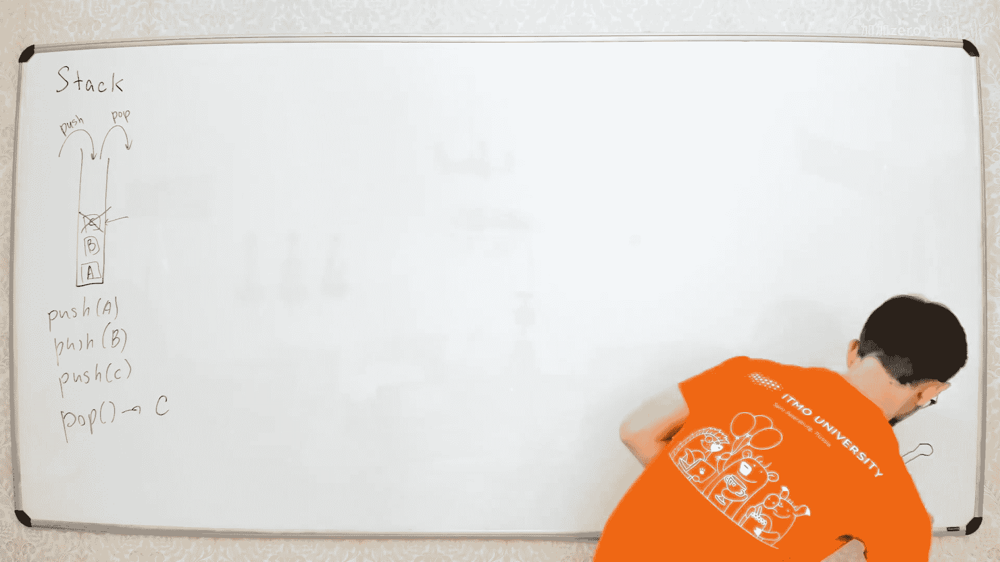
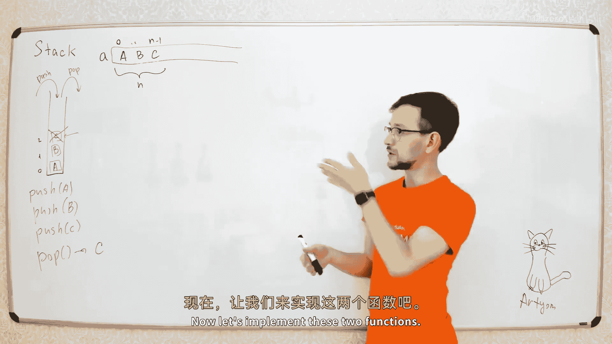
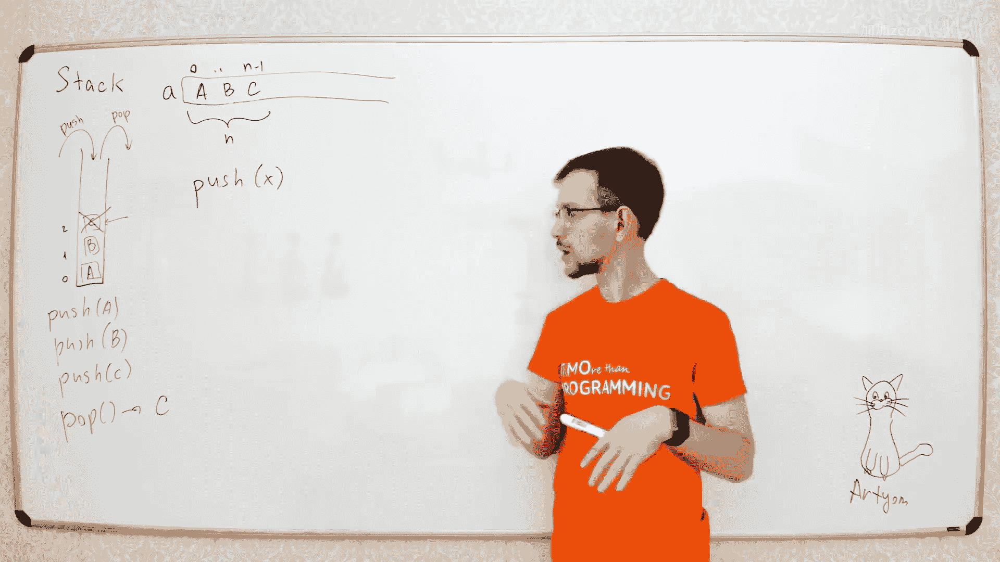

# 006：栈、队列与摊还分析





















在本节课中，我们将学习两种非常简单但应用广泛的数据结构：栈和队列。我们还将探讨如何分析这些数据结构中某些操作的平均时间复杂度，即摊还分析。





## 栈：什么是栈？📚

栈是一种非常简单的数据结构。你可以把它想象成一摞盘子。你只能从最上面放入或拿走盘子。

栈有两个基本操作：
*   **入栈**：将一个新元素放到栈顶。
*   **出栈**：从栈顶取出一个元素。

例如，我们依次入栈元素 A、B、C。此时栈顶是 C。当我们执行出栈操作时，会取出并移除元素 C。

## 栈的实现：使用数组 🛠️

如何用数组实现栈？假设我们有一个足够大的数组 `a`。我们用一个变量 `n` 来记录栈中当前有多少个元素。

以下是两个核心操作的伪代码：

**入栈操作 `push(x)`**：
```python
a[n] = x  # 将新元素 x 放入数组的 n 位置
n = n + 1 # 栈的大小增加 1
```

**出栈操作 `pop()`**：
```python
n = n - 1     # 栈的大小减少 1
return a[n]   # 返回原栈顶元素
```

栈的应用非常广泛。例如，计算机在执行递归函数时，就是使用栈来保存每一层函数的局部变量和返回地址。

## 队列：什么是队列？🚶‍♂️🚶‍♀️

队列是另一种简单的数据结构，就像现实生活中的排队。新来的人排在队尾，服务从队头开始。

队列也有两个基本操作：
*   **入队**：在队列的尾部添加一个新元素。
*   **出队**：从队列的头部移除一个元素。

例如，依次入队 A、B、C。当我们执行出队操作时，会移除并返回第一个元素 A。

## 队列的实现：使用数组 🛠️

我们同样使用一个数组 `a` 来实现队列。我们需要两个指针（或索引）：
*   `head`：指向队列的第一个元素。
*   `tail`：指向队列尾部下一个空闲位置。

以下是操作的伪代码：

**入队操作 `enqueue(x)`**：
```python
a[tail] = x   # 将新元素 x 放入 tail 位置
tail = tail + 1 # 尾指针后移
```

**出队操作 `dequeue()`**：
```python
x = a[head]   # 获取队头元素
head = head + 1 # 头指针后移
return x
```

随着入队和出队操作的进行，队列会在数组中向右“移动”。当 `tail` 到达数组末尾时，我们可以让它回到数组开头，形成一个**循环数组**，以重复利用空间。

## 动态数组与摊还分析 ⚡

上一节我们假设数组是无限大的。现实中，数组大小是固定的。对于栈，如果我们不知道最大需要多少空间，就需要一个能动态增长的数组。

一个简单的策略是：当数组已满时，创建一个更大的新数组（例如，原大小的两倍），然后将所有旧元素复制过去，再添加新元素。

如果每次数组满时只增加一个空间，那么每次 `push` 都可能需要复制所有元素，导致单次操作的时间复杂度为 O(n)，这很糟糕。

通过将数组大小翻倍，我们可以证明，虽然某些 `push` 操作很慢（需要复制），但平均下来，每个 `push` 操作的**摊还时间复杂度**是常数 O(1)。

### 什么是摊还分析？

摊还分析用于分析一系列操作的平均性能，即使其中某些单次操作代价很高。它保证了在任意长的操作序列中，总时间开销与操作次数成线性关系。

以下是三种常见的摊还分析方法：

1.  **聚合分析**：直接计算 n 次操作的总时间 T(n)，然后证明平均每次操作的时间 T(n)/n 是一个常数。
    *   对于翻倍策略的动态数组，n 次 `push` 的总复制次数小于 2n，加上 n 次简单插入，总时间小于 3n。因此摊还成本为常数 3。

2.  **核算法（会计方法）**：为每个操作分配一个“虚拟”的摊还成本。低成本操作的“余额”被储存起来，用于支付未来高成本操作的开销。
    *   对于动态数组的 `push`，我们为每次 `push` 分配 3 单位的摊还成本。其中 1 单位用于支付本次的简单插入，另外 2 单位作为“存款”留在刚插入的元素上。当需要扩展数组时，所有在旧数组中“存款”的元素（即后半部分元素）正好可以提供足够的“存款”来支付复制它们自己的成本。

3.  **势能法**：为数据结构的整个状态定义一个“势能”函数 Φ。操作的摊还成本定义为：**实际成本 + ΔΦ（操作后势能的变化）**。
    *   对于动态数组，可以定义势能 Φ = 2 * (数组容量 - 栈顶指针)。当数组未满时，势能较高；当数组满需要扩容时，势能会大幅下降，这个下降值正好抵消了复制的实际成本，使得摊还成本保持为常数。

## 双端队列与栈的扩展 🎪

双端队列是一种更通用的结构，允许在头部和尾部进行添加和删除操作。它结合了栈和队列的功能。

一个有趣的挑战是：**如何用两个栈实现一个队列？**

思路如下：
*   我们有两个栈：`stack1` 和 `stack2`。
*   **入队**：直接将新元素压入 `stack2`。
*   **出队**：
    1.  如果 `stack1` 不为空，直接从 `stack1` 弹出元素。
    2.  如果 `stack1` 为空，则将 `stack2` 中的所有元素依次弹出并压入 `stack1`。这样，最早进入 `stack2` 的元素就到了 `stack1` 的栈顶。然后从 `stack1` 弹出元素。

虽然将元素从 `stack2` 转移到 `stack1` 的操作是 O(n) 的，但每个元素只会被转移一次。使用摊还分析（例如核算法：每次入队时在元素上存一个“硬币”，用于支付未来它被转移和出队的成本），可以证明入队和出队的**摊还时间复杂度都是 O(1)**。

## 总结 📝

本节课我们一起学习了两种基础数据结构——栈和队列，了解了它们的定义、数组实现以及循环数组的技巧。更重要的是，我们引入了**摊还分析**的概念，学习了聚合分析、核算法和势能法这三种分析方法，并用它们证明了动态数组扩容和“双栈实现队列”等操作的平均高效性。掌握这些分析工具对于理解和设计高效的数据结构至关重要。