# 009：斐波那契堆 🧮

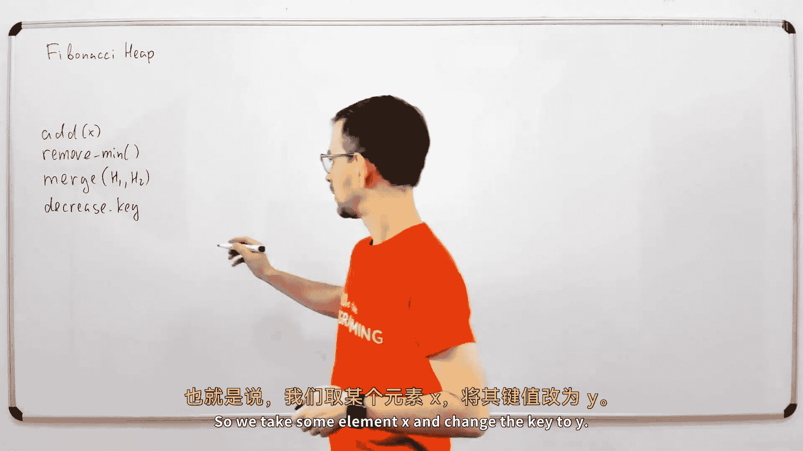

在本节课中，我们将要学习一种名为“斐波那契堆”的高级数据结构。它是一种支持多种高效操作的堆结构，特别是“合并”和“降低键值”操作。我们将从基础的堆操作开始，逐步理解斐波那契堆的设计原理和其摊销时间复杂度。

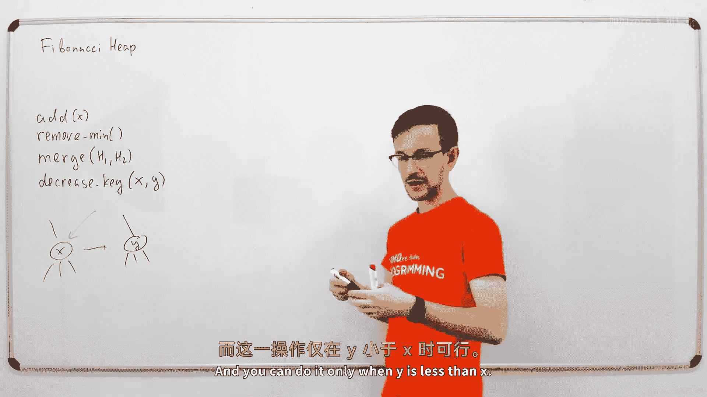

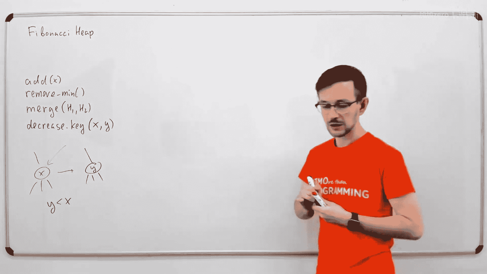

---

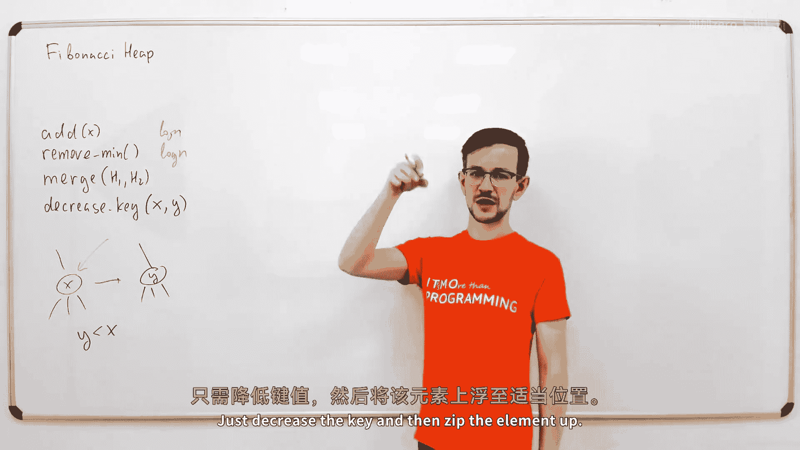

## 什么是斐波那契堆？ 🤔

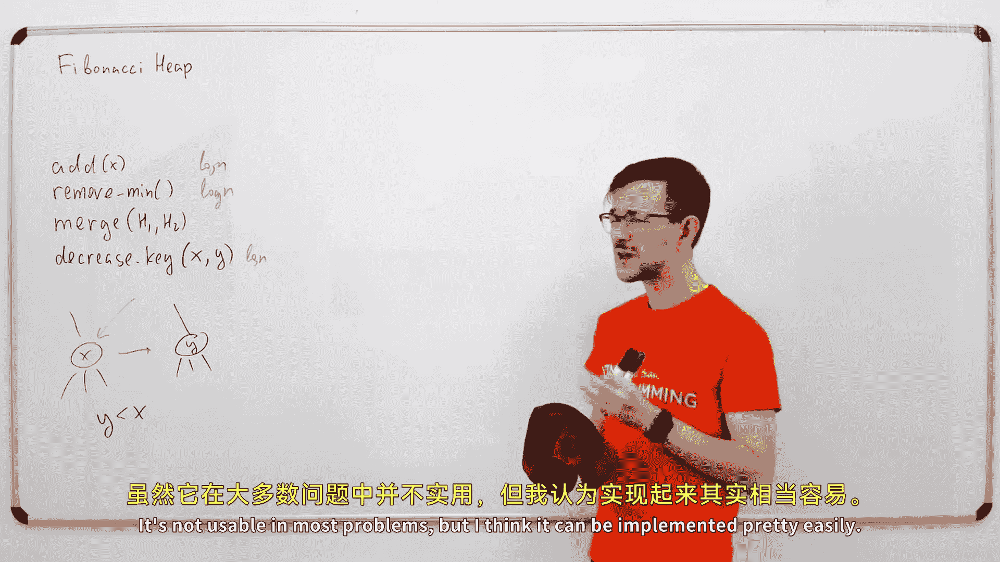

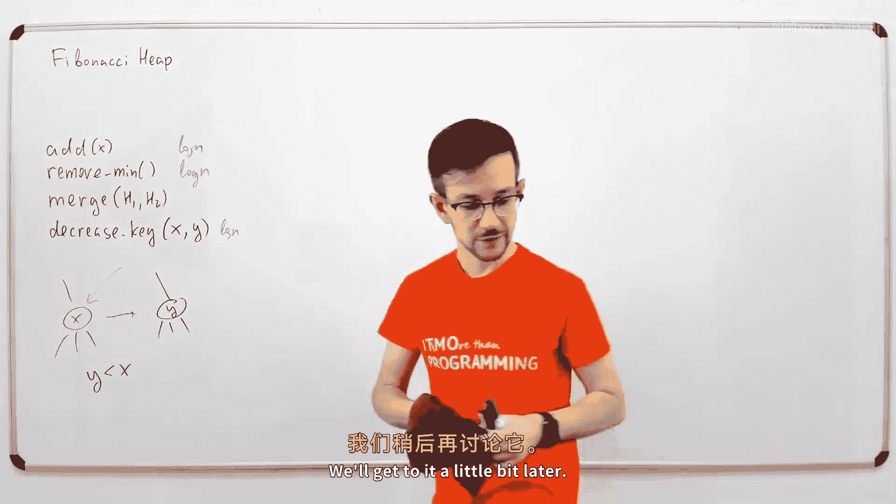

斐波那契堆是一种堆数据结构。它支持像添加元素和移除最小元素这样的基本操作，就像我们在第二讲中讨论过的普通二叉堆一样。

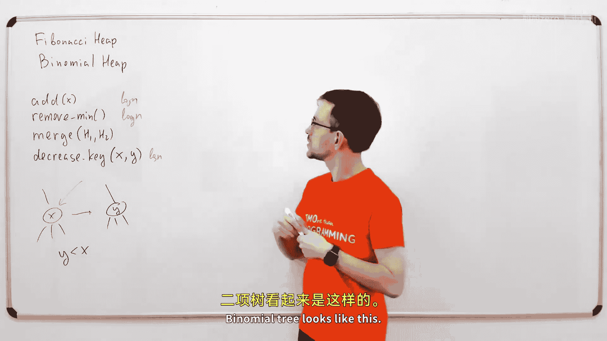

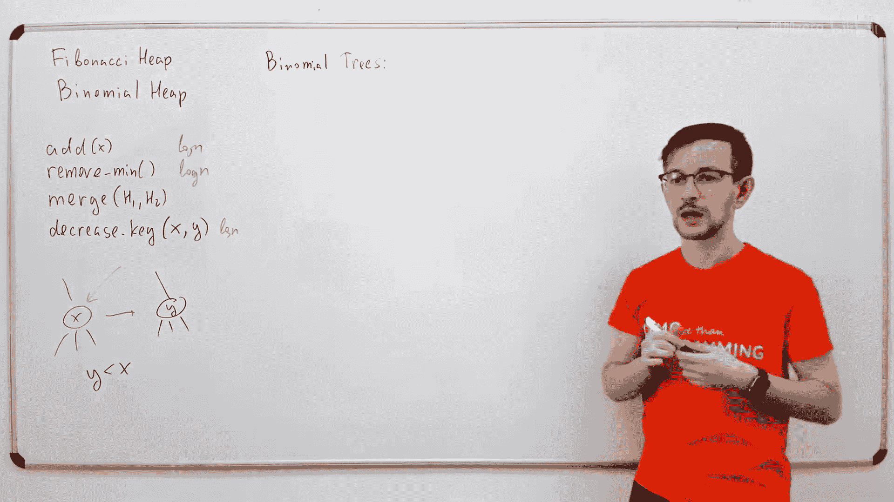

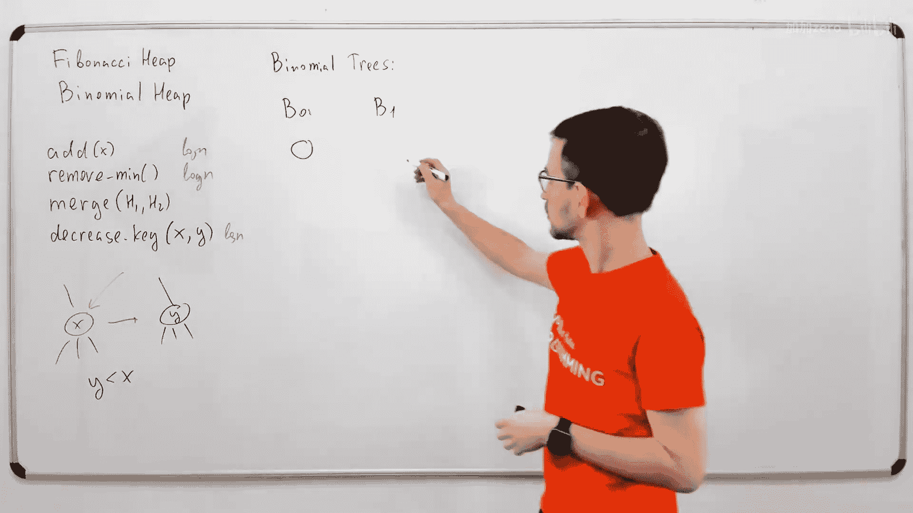

这些操作是所有堆结构的通用操作。斐波那契堆还支持另外两个重要的操作。

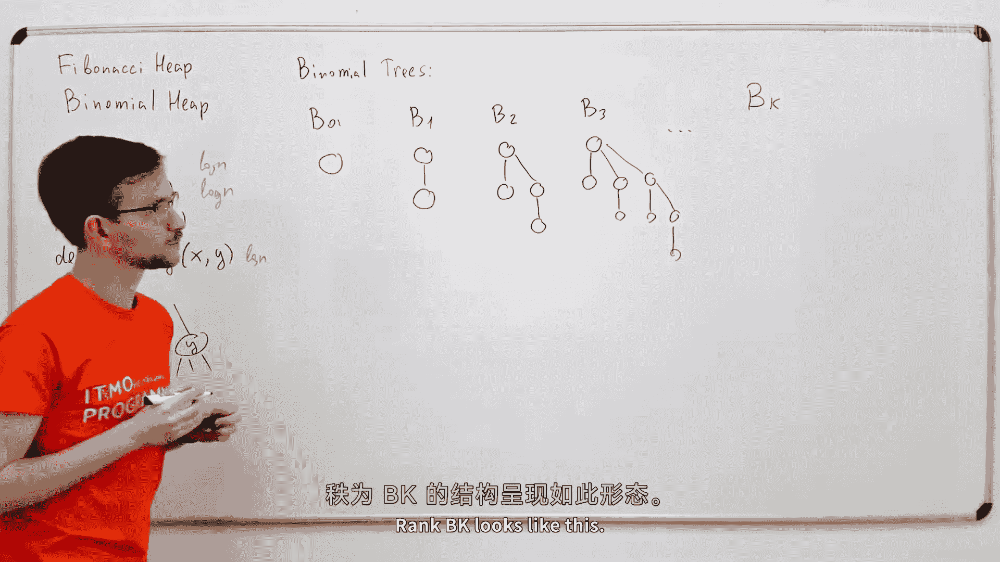

第一个重要操作是**合并两个堆**。就像在并查集中一样，你有两个独立的堆，然后将所有元素的集合合并起来，得到一个包含两个堆所有元素的大堆。

第二个重要操作是**降低键值**。这个操作会获取堆中已经存在的某个元素，并将其键值更改为另一个更小的值。例如，我们取一个元素 X，将其键值改为 Y，前提是 Y 小于 X。

---

## 与二叉堆的比较 ⚖️

上一节我们介绍了斐波那契堆支持的操作。本节中，我们来看看它与我们已知的二叉堆有何不同。

我们已经知道如何使用二叉堆。使用二叉堆时，你可以在 O(log n) 时间内添加元素，也可以在 O(log n) 时间内移除最小元素。你同样可以在 O(log n) 时间内降低键值（降低键值后通过“上浮”操作调整堆）。然而，你不能轻易地合并两个二叉堆。虽然你可以通过将较小堆的所有元素插入较大堆来实现合并，但这需要大约 O(log² n) 的时间，效率不高。

最常见的二叉堆支持这三种操作，它们都在 O(log n) 时间内完成。

---

## 迈向斐波那契堆：二项堆 🌳

在深入理解斐波那契堆之前，我们先来看一个更简单的中间结构：**二项堆**。理解二项堆有助于我们掌握斐波那契堆的工作原理。

二项堆是构建在“二项树”之上的堆。我们在第二讲中讨论的简单堆是基于二叉树的，每个节点恰好有两个子节点。而二项树则有所不同。

以下是不同阶数的二项树：
*   **0阶二项树**：只是一个单独的节点。
*   **1阶二项树**：一个根节点，连接着一个0阶二项树（作为子节点）。
*   **2阶二项树**：一个根节点，连接着一个1阶二项树和一个0阶二项树（作为子节点）。
*   **k阶二项树**：一个根节点，连接着 k 个子节点，这些子节点分别是阶数为 k-1, k-2, ..., 0 的二项树。

另一种理解方式是：k阶二项树可以通过将两个 (k-1) 阶二项树连接起来构成，将其中一个的根作为另一个根的子节点。

我们可以在这样的树上构建堆：在每个节点中放入元素，并维护堆性质——每个节点的值都小于或等于其子节点的值。

---

## 二项堆的结构与操作 🛠️

上一节我们介绍了二项树，本节中我们来看看如何用它们构建二项堆，并实现其操作。

k阶二项树恰好包含 2^k 个节点。如果我们想将 n 个元素放入二项堆中，而 n 不是2的幂次，我们可以将 n 分解为多个2的幂次之和（例如 11 = 8 + 2 + 1），并用对应阶数的二项树来存放这些元素。这样，二项堆就是一组不同阶数的二项树的集合。

为了最小化树的数量，我们应确保所有二项树的阶数都不同。因为 k阶树有 2^k 个节点，所以树的阶数不会超过 log₂ n。因此，一个二项堆中树的数量最多为 O(log n)。

以下是二项堆的核心操作：

### 添加元素
1.  将新元素视为一个0阶二项树。
2.  如果堆中已存在0阶树，则将这两棵0阶树合并成一棵1阶树。
3.  如果合并后，堆中又存在另一棵1阶树，则继续合并成2阶树。
4.  重复此过程，直到没有相同阶数的树可合并为止。
由于树的阶数不超过 O(log n)，此过程最多进行 O(log n) 次合并，每次合并是常数时间操作。因此，添加元素的时间复杂度为 **O(log n)**。

### 合并两个堆
合并两个二项堆类似于合并两个有序链表（按树的阶数排序）。我们同时遍历两个堆的树列表：
*   如果当前阶数唯一，则将该树加入结果堆。
*   如果遇到相同阶数的树，则将它们合并成一棵更高阶的树，并像处理进位一样继续与结果堆中可能存在的同阶树合并。
由于两个堆总共有 O(log n) 棵树，合并操作的时间复杂度为 **O(log n)**。

### 移除最小元素
1.  找到所有树根中的最小元素（O(log n) 时间）。
2.  移除该最小元素所在的根节点。
3.  将该根节点的所有子节点（它们本身是阶数各不相同的二项树）视为一个新的二项堆 H2。
4.  将原堆（移除了最小树后剩下的部分）与堆 H2 合并。
合并操作是 O(log n)，因此移除最小元素的总时间复杂度也是 **O(log n)**。

### 降低键值
在二项堆中，降低键值可以像在二叉堆中一样处理：降低键值后，通过不断与父节点交换（“上浮”）来恢复堆性质。由于树高为 O(log n)，此操作的时间复杂度为 **O(log n)**。

---

## 斐波那契堆的设计目标 🎯

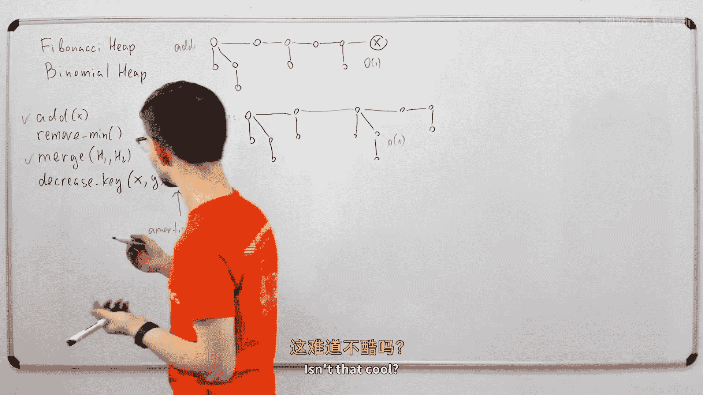

上一节我们完整介绍了二项堆，本节中我们来看看斐波那契堆如何对其进行优化，以实现更高效的操作。

我们的目标是让某些操作比 O(log n) 更快，即达到**摊销常数时间复杂度**。
1.  **添加元素**：二项堆的添加操作已经是摊销常数时间（虽然我们之前分析为 O(log n)，但通过精细的摊销分析可以证明）。
2.  **合并堆**：我们希望在常数时间内合并两个堆。
3.  **降低键值**：我们希望在常数时间内降低一个元素的键值。这在某些图算法（如Dijkstra或Prim算法）中非常重要。

为了实现这些目标，我们需要一个更灵活的结构。关键思路是：**推迟工作，仅在必要时进行整理**。

---

## 斐波那契堆的简化核心 💎

斐波那契堆放松了二项堆中“所有树阶数必须不同”的严格限制。它允许堆中存在多棵阶数相同的树。

基于此，操作变得非常简单：
*   **添加元素**：直接将新元素作为一个单节点树（0阶树）添加到堆的根链表中。**时间复杂度：O(1)**。
*   **合并堆**：直接将两个堆的根链表拼接在一起。**时间复杂度：O(1)**。

然而，这种简单性是有代价的。如果我们一直添加元素而不整理，堆可能会退化成大量单节点树。这会导致**查找或移除最小元素变得低效**，因为我们需要遍历所有树根来找到最小值。

因此，我们将整理工作推迟到**移除最小元素**时进行。

---

## 斐波那契堆的整理与移除最小元素 🔧

当需要移除最小元素时，我们不得不进行整理以保持效率。

**移除最小元素步骤**：
1.  找到并移除最小根节点（我们始终维护一个指向最小根的指针）。
2.  将该最小根的所有子节点提升为新的根节点，加入到根链表中。
3.  此时，根链表中可能有很多树，且可能存在相同阶数的树。
4.  执行**整理（Consolidate）**：遍历根链表，使用一个辅助数组记录已看到的树的阶数。
    *   如果遇到某个阶数 k 尚未记录，则记录这棵树。
    *   如果阶数 k 已记录，则将这两棵同阶树合并（将根值较大的树作为根值较小的树的子节点），得到一棵阶数为 k+1 的树。然后继续尝试将新树放入数组，可能引发连锁合并。
5.  整理完成后，所有树的阶数都将不同。因此，树的数量最多为 O(log n)。
6.  在整理过程中或之后，遍历新的根链表，找到并更新最小根指针。

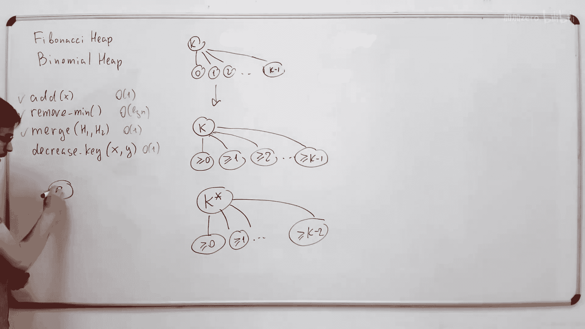

**时间复杂度分析**：
*   步骤2、3是常数时间。
*   步骤4的整理过程需要遍历所有根树并进行合并。设整理前有 m 棵树。每次合并减少一棵树。整理后剩下 O(log n) 棵树。因此，合并操作次数为 `m - O(log n)`。
*   如果我们定义**势能函数 Φ = 堆中树的数量**，那么：
    *   添加/合并操作会增加 Φ（O(1) 操作，势能增加 O(1)）。
    *   移除最小元素时，实际耗时 O(m)，但势能变化 ΔΦ = O(log n) - m（从 m 棵树减少到 O(log n) 棵）。
    *   根据摊销分析，**摊销时间复杂度 = 实际耗时 + ΔΦ = O(m) + (O(log n) - m) = O(log n)**。

因此，移除最小元素的**摊销时间复杂度为 O(log n)**。

---

## 斐波那契堆的降低键值操作 ⚡

这是斐波那契堆最精巧的部分，目的是实现 O(1) 的摊销降低键值操作。

在二项树中，降低键值后可能需要 O(log n) 次“上浮”操作。为了允许常数时间操作，斐波那契堆使用了更灵活的树结构，并引入了一个新规则：**每个节点最多允许“丢失”一个子节点**（被从子节点列表中移除）。如果一个节点丢失了一个子节点，我们将其标记为“已标记”。

**降低键值步骤**：
1.  降低某个节点 X 的键值。
2.  如果破坏了对父节点的堆性质（即 X 变得比父节点小），则将 X 从其父节点处“切断”（Cut）。
3.  将 X 提升为根节点，加入到根链表中，并清除其标记（因为根节点没有父节点，无需标记）。
4.  现在检查 X 的原父节点 P：
    *   如果 P 未被标记，则将其标记（表示它刚丢失了一个子节点）。操作结束。
    *   如果 P **已被标记**，则意味着这是它丢失的**第二个**子节点（违反了“最多丢失一个”的规则）。那么，我们同样将 P 从其父节点处“切断”，提升为根节点，并清除其标记。
    *   然后，继续递归地检查 P 的原父节点，直到遇到一个未被标记的节点或根节点为止。这个过程称为**级联切断（Cascading Cut）**。

**为什么这是常数摊销时间？**
*   一次降低键值可能引发一连串的切断操作（级联切断）。
*   我们修改势能函数为：**Φ = 树的数量 + 2 × 标记节点的数量**。
*   **添加/合并**：增加树的数量，势能增加 O(1)。
*   **降低键值**：假设我们进行了 k 次切断（包括最初的切断和级联切断）。
    *   实际耗时：O(k)。
    *   势能变化 ΔΦ：
        *   我们新增了 k 棵独立的树（来自被切断的节点）：`+k`
        *   我们清除了这些节点原有的标记（它们不再是子节点）：`-2k`
        *   我们可能标记了最后那个未被切断的父节点：`+2`
        *   总计：ΔΦ ≈ `-k + 2`
    *   摊销时间复杂度 = O(k) + (-k + O(1)) = **O(1)**。

通过精巧的势能函数设计（为每个标记节点存储“信用”），降低键值操作的摊销时间复杂度被证明是 **O(1)**。

---

## 总结 📚

本节课中我们一起学习了斐波那契堆这一复杂但强大的数据结构。让我们回顾一下其各项操作的摊销时间复杂度：

| 操作 | 描述 | 斐波那契堆摊销复杂度 | 二叉堆复杂度 |
| :--- | :--- | :--- | :--- |
| `insert(e)` | 插入元素 | **O(1)** | O(log n) |
| `merge(H1, H2)` | 合并两个堆 | **O(1)** | O(n) |
| `find-min()` | 查找最小元素 | **O(1)** | O(1) |
| `extract-min()` | 移除最小元素 | **O(log n)** | O(log n) |
| `decrease-key(x, k)` | 降低元素键值 | **O(1)** | O(log n) |
| `delete(x)` | 删除任意元素 | O(log n) | O(log n) |

斐波那契堆的核心思想是**惰性操作**和**摊销分析**。它通过允许结构暂时的不完美（允许存在多棵同阶树，允许节点丢失子节点），将昂贵的工作推迟到必要时（如`extract-min`时）进行，从而在摊还意义上获得了极其高效的操作性能，尤其是在需要频繁进行`decrease-key`操作的图算法中优势明显。虽然其实践中的常数因子较大，但它的理论价值深远。