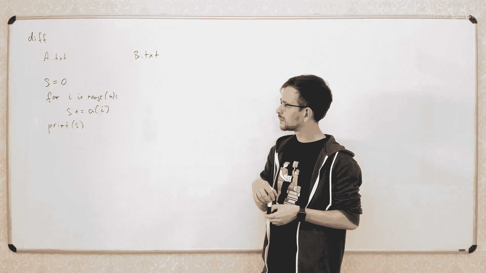
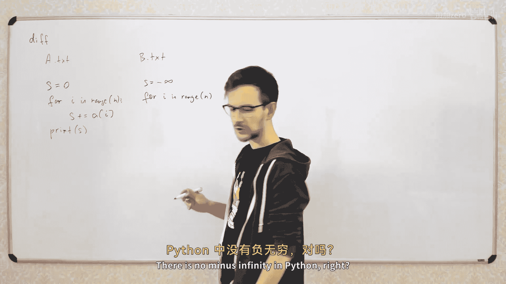
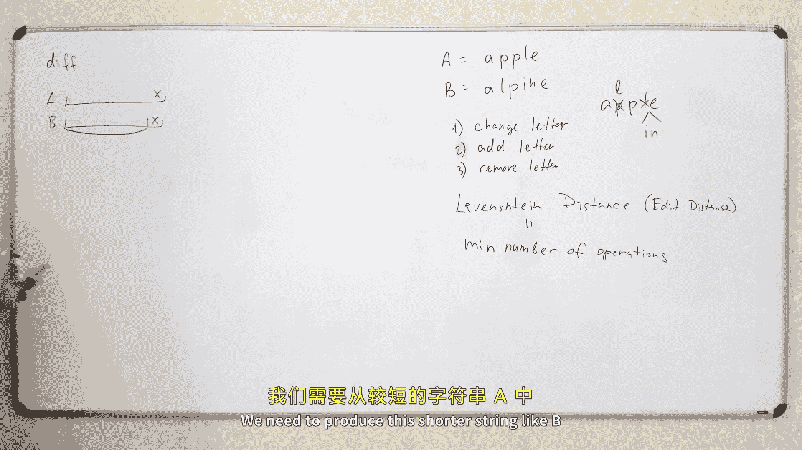
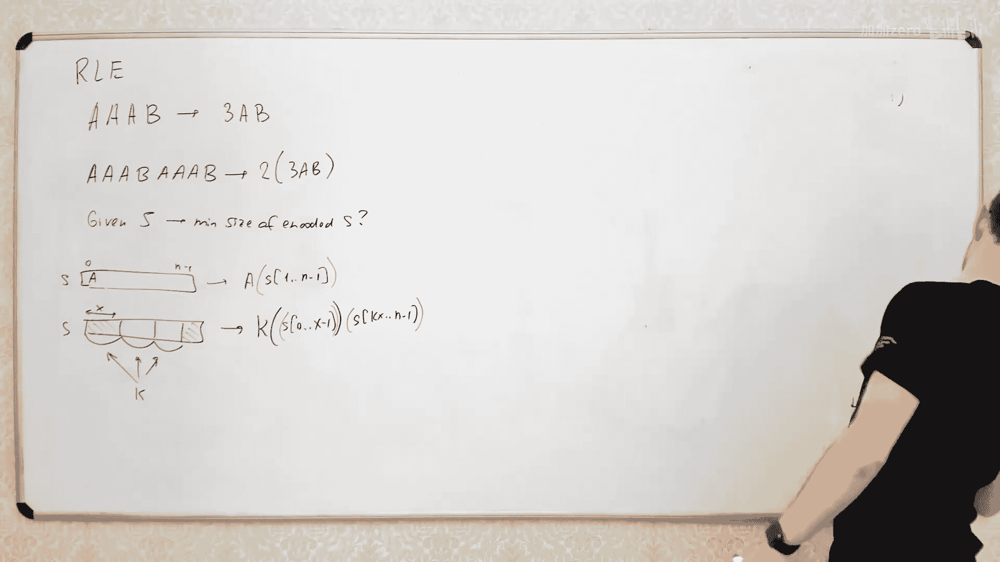

# 011：动态规划（第二部分）




在本节课中，我们将继续探讨动态规划的应用，并学习如何用它来解决几个更实际的问题。我们将重点分析两个经典案例：计算两个文本文件（或字符串）之间的差异（编辑距离），以及如何对文本进行最优排版（文本对齐问题）。最后，我们会简要介绍一个字符串最优编码的问题。




---

## 计算编辑距离 🧮

在上一节中，我们学习了动态规划的基本思想。本节中，我们来看看如何用它来解决一个非常实际的问题：计算两个字符串之间的最小编辑距离，也就是将一个字符串转换成另一个字符串所需的最少操作次数。这个算法是许多工具（如版本控制系统中的 `diff` 工具）的核心。

### 问题定义

假设我们有两个字符串 `A` 和 `B`。我们允许三种操作：
1.  **修改**一个字符。
2.  **删除**一个字符。
3.  **插入**一个字符。



我们的目标是找到将字符串 `A` 转换为字符串 `B` 所需的最少操作次数。这个最少操作数被称为 **莱文斯坦距离** 或 **编辑距离**。

### 动态规划思路

我们可以将大问题分解为更小的子问题。考虑两个字符串的最后一个字符：
*   如果它们相同，我们可以直接保留这个字符，问题就转化为将 `A` 的前 `i-1` 个字符转换为 `B` 的前 `j-1` 个字符。
*   如果它们不同，我们有三种选择：
    1.  修改 `A` 的最后一个字符为 `B` 的最后一个字符，然后解决剩余子问题。
    2.  删除 `A` 的最后一个字符，然后解决剩余子问题。
    3.  在 `A` 的末尾插入 `B` 的最后一个字符，然后解决剩余子问题。

我们总是选择这三种操作中成本最小的那个。

### 状态定义与转移方程

我们定义 `dp[i][j]` 为将字符串 `A` 的前 `i` 个字符转换为字符串 `B` 的前 `j` 个字符所需的最小编辑距离。

以下是状态转移方程：

*   **基础情况**：如果其中一个字符串为空，则编辑距离就是另一个字符串的长度。
    ```
    dp[0][j] = j
    dp[i][0] = i
    ```
*   **状态转移**：
    ```
    如果 A[i-1] == B[j-1]:
        dp[i][j] = dp[i-1][j-1]
    否则:
        dp[i][j] = 1 + min(dp[i-1][j-1],  // 修改操作
                           dp[i-1][j],    // 删除操作
                           dp[i][j-1])    // 插入操作
    ```

### 代码实现

以下是该算法的 Python 实现：

```python
def levenshtein_distance(A, B):
    m, n = len(A), len(B)
    dp = [[0] * (n + 1) for _ in range(m + 1)]

    # 初始化基础情况
    for i in range(m + 1):
        dp[i][0] = i
    for j in range(n + 1):
        dp[0][j] = j

    # 填充 dp 表
    for i in range(1, m + 1):
        for j in range(1, n + 1):
            if A[i - 1] == B[j - 1]:
                dp[i][j] = dp[i - 1][j - 1]
            else:
                dp[i][j] = 1 + min(dp[i - 1][j - 1],  # 修改
                                   dp[i - 1][j],      # 删除
                                   dp[i][j - 1])      # 插入
    return dp[m][n]

# 示例
A = "apple"
B = "aple"
print(levenshtein_distance(A, B))  # 输出：1 (删除一个 'p')
```

### 回溯以获取具体操作序列

如果我们不仅需要距离，还需要知道具体的操作序列，我们可以从 `dp[m][n]` 开始回溯。根据 `dp[i][j]` 的值是由哪个相邻状态转移而来，我们可以推断出在位置 `(i, j)` 执行了何种操作（修改、删除或插入）。

---

## 文本对齐问题 📝

了解了如何计算编辑距离后，我们来看另一个实际问题：文本对齐。想象你正在设计一个文本处理器，需要将一段文字美观地排列在固定宽度的页面上。如果单词排列不当，行尾可能会出现难看的巨大空白。我们的目标是找到一种分割文本为多行的方式，使得所有行尾的“不美观度”总和最小。

### 问题建模

首先，我们需要量化“不美观度”。一个常见的方法是定义一个“坏处”函数。例如，如果某行末尾的空白宽度为 `x`，我们可以定义其坏处为 `x³`。这样，大的空白会被严重惩罚。

假设我们有一个单词长度数组 `words` 和页面宽度 `L`。我们需要将单词序列分割成若干行。对于从第 `l` 到第 `r-1` 个单词组成的行，其坏处可以计算为：
```
badness(l, r) = (L - sum(words[l:r]) - (r - l - 1))³
```
这里 `(r - l - 1)` 是单词间的空格数（假设每个空格宽度为1）。如果 `sum(words[l:r]) + (r - l - 1) > L`，说明这行放不下，坏处设为无穷大。

### 动态规划思路

我们可以这样思考：对于前 `i` 个单词，考虑最后一行由哪些单词组成。假设最后一行包含从第 `k` 到第 `i-1` 个单词，那么总坏处就是这最后一行的坏处，加上前 `k` 个单词排列成行的最小总坏处。

### 状态定义与转移方程

定义 `dp[i]` 为排列前 `i` 个单词的最小总坏处。

状态转移方程为：
```
dp[i] = min( dp[k] + badness(k, i) )， 其中 0 <= k < i
```
`dp[0] = 0` 表示没有单词时坏处为0。

### 代码实现

以下是该算法的简化 Python 实现：

```python
def text_justification(words, L):
    n = len(words)
    dp = [float('inf')] * (n + 1)
    dp[0] = 0

    # 预先计算前缀和以便快速计算单词总长度
    prefix_sum = [0] * (n + 1)
    for i in range(1, n + 1):
        prefix_sum[i] = prefix_sum[i - 1] + words[i - 1]

    for i in range(1, n + 1):
        for k in range(i):
            # 计算从 words[k] 到 words[i-1] 的单词总长度和所需空格
            total_chars = prefix_sum[i] - prefix_sum[k]
            total_spaces = i - k - 1
            line_width = total_chars + total_spaces

            if line_width <= L:
                badness_val = (L - line_width) ** 3
                dp[i] = min(dp[i], dp[k] + badness_val)

    return dp[n]

# 示例
words = [3, 2, 2, 5]  # 单词长度
L = 10
print(text_justification(words, L))
```

在实际应用中，内层循环 `k` 的范围通常受行宽 `L` 限制，因此算法效率在实践中是可以接受的。

### 回溯以获取分行方案

同样，我们可以通过维护一个 `parent` 数组来记录每个 `dp[i]` 是由哪个 `k` 转移而来的。最后从 `dp[n]` 回溯，就能得到最优的分行方案。

---

## 字符串最优编码简介 🔤

最后，我们简要提一个更复杂的动态规划问题：字符串的最优编码。假设我们允许使用两种方式编码一个字符串 `S`：
1.  直接输出字符，如 `"a"`。
2.  输出重复模式，如 `"3[ab]"` 表示 `"ababab"`。

目标是找到编码后长度最短的表示形式。

### 解决思路



这个问题也可以用动态规划解决。我们定义 `dp[l][r]` 为子串 `S[l:r]` 的最短编码长度。对于每个子串，我们有两种选择：
*   **选项1**：将第一个字符单独编码，然后加上剩余部分的最优编码。即 `1 + dp[l+1][r]`。
*   **选项2**：尝试找到一个重复模式。即寻找一个长度 `x` 和重复次数 `k`，使得 `S[l:l+x]` 重复 `k` 次能构成 `S[l:l+k*x]`。那么编码长度就是 `数字k的位数 + 2（方括号） + dp[l][l+x]（编码重复单元） + dp[l+k*x][r]（编码剩余部分）`。

我们需要遍历所有可能的 `x` 和 `k`，并检查子串是否匹配（这可以用字符串哈希或 Z 算法等高效完成），然后取最小值。

这个问题的特点是，计算一个状态 `dp[l][r]` 时，可能会依赖**两个**更小的子问题状态（`dp[l][l+x]` 和 `dp[l+k*x][r]`），而不仅仅是之前常见的一个。在回溯构建最优编码字符串时，也需要递归地构建两个部分。

---

## 总结 📚

本节课我们一起学习了动态规划的更多实际应用：
1.  **编辑距离**：我们学习了如何用动态规划计算两个字符串的最小编辑距离，这是 `diff` 等工具的基础。其核心是定义 `dp[i][j]` 状态，并基于最后一个字符是否相同进行状态转移。
2.  **文本对齐**：我们探讨了如何将动态规划用于文本排版，通过定义“坏处”函数和状态 `dp[i]`，找到最小化行尾空白总坏处的分行方案。
3.  **字符串编码**：我们简要介绍了一个更复杂的动态规划问题，其中状态转移可能依赖于多个子问题，拓宽了我们对动态规划模型的理解。

动态规划的魅力在于，它能将许多看似复杂的最优化问题，分解为一系列重叠子问题，并通过递推高效求解。掌握识别问题状态和推导转移方程的能力是关键。