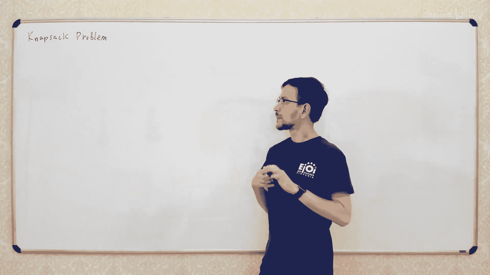
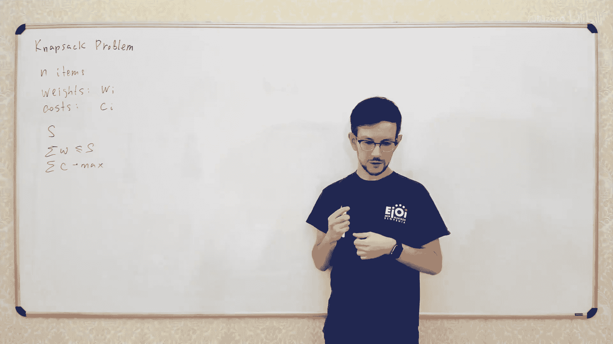

# 012：背包问题 🎒

在本节课中，我们将要学习一个在算法理论中非常重要的问题——背包问题。这个问题看似简单，但会出现在各种不同的实际场景中。学习它，能帮助你在实际项目中识别并优化类似的问题。

## 什么是经典背包问题？

经典背包问题描述如下：你有一系列物品，每个物品都有其重量（weight）和成本（cost）。同时，你有一个容量为 `S` 的背包。我们的目标是选择一些物品放入背包，使得在总重量不超过 `S` 的前提下，总成本达到最大。

用公式描述，即：从物品集合中选取一个子集，使得 `∑weight ≤ S`，并且 `∑cost` 的值最大。

一个重要的概念是，背包问题是一个 **NP完全** 问题。这意味着我们目前还不知道是否存在一个高效的通用解法。对于今天的课程，你只需要知道这类问题通常很难解决。

## 当重量为整数且较小时的解法

然而，在某些特定条件下，背包问题是可以高效解决的。其中一个重要情况是：**所有物品的重量都是整数，并且背包容量 `S` 相对较小**（例如，`S` 大约在百万级别，这在计算机内存中是可以处理的）。

在这种情况下，我们可以使用动态规划来解决。首先，让我们从一个更简单的问题开始理解。

### 简化问题：仅最大化总重量

假设我们只关心总重量，即每个物品的成本等于其重量。我们的目标仍然是总重量不超过 `S` 且最大化。

我们可以定义一个二维布尔数组 `dp[i][j]`：
*   `i` 表示我们只考虑前 `i` 个物品（索引从0到 i-1）。
*   `j` 表示一个目标总重量。
*   `dp[i][j]` 的值表示：**是否可能** 从前 `i` 个物品中选出一个子集，使其总重量**恰好等于** `j`。

以下是计算这个数组的方法：

我们考虑最后一个物品（第 `i-1` 个）。对于状态 `dp[i][j]`，有两种可能：
1.  **不选** 第 `i-1` 个物品：那么问题就变成了从前 `i-1` 个物品中选出总重量为 `j` 的子集，即 `dp[i-1][j]`。
2.  **选择** 第 `i-1` 个物品：那么剩下的 `i-1` 个物品需要凑出总重量 `j - weight[i-1]`，即 `dp[i-1][j - weight[i-1]]`。

只要以上两种情况有一种为真，`dp[i][j]` 就为真。因此，状态转移方程为：
`dp[i][j] = dp[i-1][j] OR dp[i-1][j - weight[i-1]]`

初始条件：`dp[0][0] = true`（空集的总重量为0），`dp[0][j] = false`（j > 0）。

填完整个表格后，要找到最大总重量（不超过 `S`），我们只需在最后一行（`i = n`）找到最大的 `j`，使得 `dp[n][j]` 为 `true`。

### 回到原问题：最大化总成本

现在，我们把成本加回来。我们需要修改动态规划的状态定义。

我们定义 `dp[i][j]` 为一个数值（而不是布尔值）：
*   `dp[i][j]` 表示：从前 `i` 个物品中选出一个总重量**恰好等于** `j` 的子集，所能获得的**最大总成本**。

状态转移的思路类似，但我们需要取最大值：
1.  不选第 `i-1` 个物品：最大成本为 `dp[i-1][j]`。
2.  选择第 `i-1` 个物品：最大成本为 `dp[i-1][j - weight[i-1]] + cost[i-1]`。

因此，状态转移方程为：
`dp[i][j] = max(dp[i-1][j], dp[i-1][j - weight[i-1]] + cost[i-1])`

对于不可能达到的状态（例如 `j < 0` 或初始时 `j > 0` 且 `i=0`），我们可以将其成本设为 `-∞`（在代码中可以用一个非常小的负数代替），因为 `-∞` 是 `max` 操作中的中性元素。

初始条件：`dp[0][0] = 0`，`dp[0][j] = -∞`（j > 0）。

填完表格后，最终答案不是 `dp[n][S]`，而是 `max(dp[n][j])`，其中 `j` 从 0 到 `S`。因为最优解的总重量可能小于 `S`。

这个算法的时间复杂度是 **O(n × S)**，当 `S` 不大时，这是可行的。

## 当物品数量 `n` 很小时的解法

上一节我们介绍了在背包容量 `S` 较小时的高效解法。本节中我们来看看另一种情况：**当物品数量 `n` 非常小的时候**（例如 `n ≤ 25` 或 `40`），即使 `S` 很大，我们也有办法。

最直接的方法是**枚举所有可能的物品子集**。总共有 `2^n` 个子集。对于每个子集，我们计算其总重量和总成本，检查重量是否不超过 `S`，并更新最大成本。

### 如何枚举所有子集？

一个巧妙的方法是利用整数的二进制表示。对于一个有 `n` 个物品的集合，我们可以用一个 `n` 位的二进制数来表示一个子集：如果第 `i` 位是1，表示选择第 `i` 个物品；是0则表示不选。

例如，对于3个物品，子集 `{物品1， 物品3}` 对应的二进制数是 `101`（二进制），即十进制数 `5`。

我们可以简单地循环 `x` 从 `0` 到 `(2^n - 1)`，每个 `x` 就对应一个子集。要检查物品 `i` 是否在子集 `x` 中，可以使用位运算：`(x >> i) & 1`。

这种暴力枚举算法的时间复杂度是 **O(2^n × n)**。虽然是指数级，但在 `n` 很小时是可行的。

### 优化：折半搜索（Meet in the Middle）

当 `n` 大到约 `40` 时，`2^40` 的枚举可能就太慢了。我们可以使用一种称为 **折半搜索** 的技巧进行优化。

思路如下：
1.  将 `n` 个物品平分成两组，每组大约 `n/2` 个。
2.  分别枚举第一组和第二组的所有子集，得到两个列表 `List1` 和 `List2`。每个列表中的元素是一个 `(重量 w, 成本 c)` 对。
3.  对 `List2` 按重量 `w` 排序，并为每个前缀预先计算该前缀中的最大成本 `max_c`。
4.  遍历 `List1` 中的每个子集 `(w1, c1)`。我们需要在 `List2` 中找到一个子集 `(w2, c2)`，使得 `w1 + w2 ≤ S`，并且 `c1 + c2` 最大。
    *   由于 `List2` 已按重量排序，我们可以用**二分查找**快速找到所有满足 `w2 ≤ S - w1` 的子集（即一个前缀）。
    *   这个前缀中的最大成本 `max_c` 我们已经预先计算好了。
    *   因此，对于每个 `(w1, c1)`，我们可以在 **O(log(2^(n/2))) = O(n)** 时间内找到最优的 `(w2, c2)`。

总时间复杂度约为：`O(2^(n/2) * n)`（生成和排序列表） + `O(2^(n/2) * n)`（遍历和二分查找）。这比直接的 `O(2^n * n)` 有了巨大改进，使得解决 `n ≈ 40` 的问题成为可能。

## 扩展：多背包问题（装箱问题）

最后，我们简要看一个相关但更复杂的问题的变体：**多背包问题**（或称为装箱问题）。

问题描述：你有 `n` 个物品（只有重量，没有成本）和**无限多个**容量均为 `S` 的背包。目标是用**最少**的背包装下所有物品。

即使物品重量是小的整数，这个问题也通常很难，因为状态需要记录多个背包的当前容量。但当 `n` 很小时，我们依然可以用基于子集枚举的动态规划。

### 基于子集的动态规划

定义 `dp[X]` 为：装完物品集合 `X`（用二进制数表示）所需的最少背包数量。
状态转移：要计算 `dp[X]`，我们枚举 `X` 的一个子集 `Y`，这个子集 `Y` 必须能**被单独装进一个背包**（即 `sum(weight of Y) ≤ S`）。那么，剩下的物品 `X \ Y` 需要 `dp[X \ Y]` 个背包。所以：
`dp[X] = min(1 + dp[X \ Y])`，对于所有满足条件的子集 `Y`。

初始状态：`dp[空集] = 0`。

这个算法需要枚举所有子集 `X`，以及每个 `X` 的所有子集 `Y`。优化前的时间复杂度很高（约 `O(3^n)`）。但我们可以优化枚举子集 `Y` 的过程，只枚举 `X` 的子集，并使用位运算技巧高效生成下一个子集。

### 更优的解法：基于“最后一个背包”的状态设计

我们可以设计一个更聪明的状态，每次只添加一个物品，从而减少状态转移的数量。

定义状态 `dp[X]` 不是一个数字，而是一个**数对 `(a, b)`**：
*   `a`：装完集合 `X` 已使用的完整背包数量。
*   `b`：当前最后一个（未装满的）背包中已装入物品的总重量。

我们定义 `(a1, b1)` 比 `(a2, b2)` **更优**，当且仅当 `a1 < a2`，或者 `a1 == a2 且 b1 ≤ b2`。我们的动态规划就是寻找每个状态 `X` 下的最优 `(a, b)` 对。

状态转移（添加一个物品 `i` 到集合 `X`）：
1.  如果当前最后一个背包还能放下物品 `i` (`b + weight[i] ≤ S`)，则放入最后一个背包：新状态为 `(a, b + weight[i])`。
2.  如果放不下，则必须新开一个背包来装物品 `i`：新状态为 `(a + 1, weight[i])`。

我们从空状态 `(0, 0)` 开始，逐步添加物品，并始终为每个物品集合 `X` 维护最优的 `(a, b)` 对。最终，装完所有物品（即全集）对应的 `a` 值就是最少需要的背包数。

这种方法的状态数仍是 `2^n`，但每个状态的转移只有 `O(n)` 种（尝试添加每个尚未加入的物品），总复杂度约为 `O(2^n * n)`，比之前的 `O(3^n)` 更优。

## 总结

本节课中我们一起学习了背包问题及其变体：
1.  **经典背包问题**：在总重量限制下最大化总成本，是一个NP完全问题。
2.  **动态规划解法**：当所有物品重量为整数且背包容量 `S` 较小时，可以使用 `O(n × S)` 的动态规划高效解决。
3.  **枚举子集解法**：当物品数量 `n` 很小时，可以直接枚举所有 `2^n` 个子集来求解。
4.  **折半搜索优化**：当 `n` 较大（如~40）时，可以将集合分成两半，分别枚举后合并，将复杂度从 `O(2^n)` 优化到约 `O(2^(n/2))`。
5.  **多背包问题**：介绍了当 `n` 较小时，如何使用基于子集枚举的动态规划，以及通过优化状态设计（记录最后一个背包的容量）来更高效地求解。

理解这些不同场景下的解法，能帮助你在遇到类似优化问题时，快速识别并应用合适的策略。