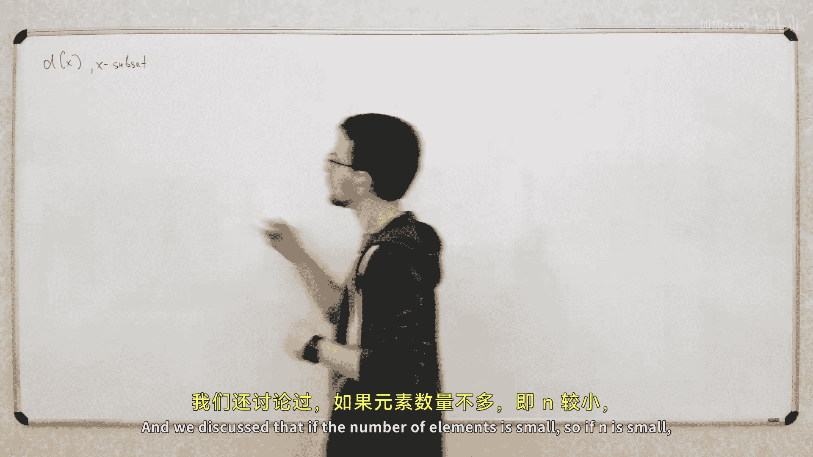
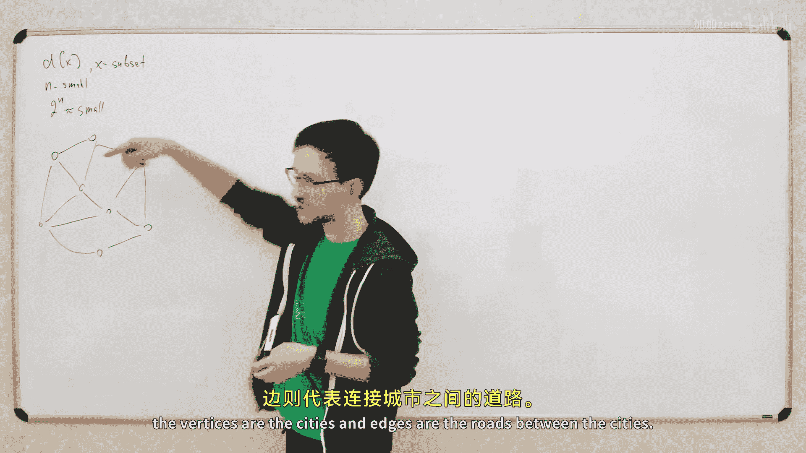
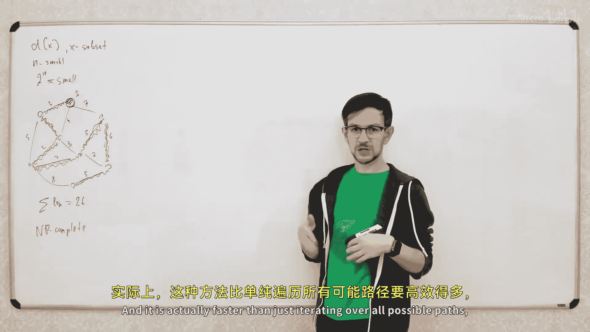
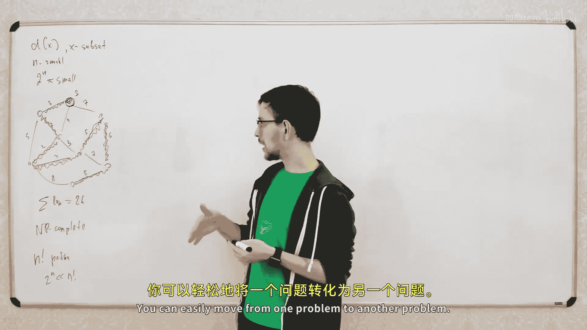
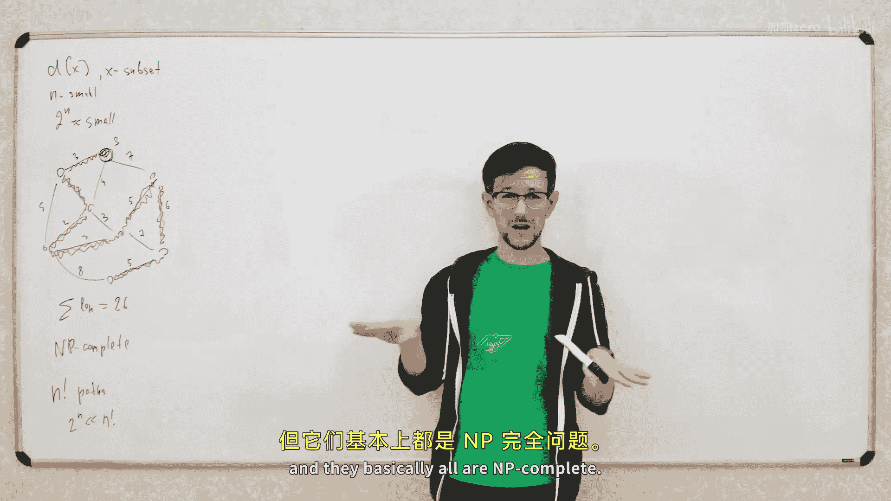
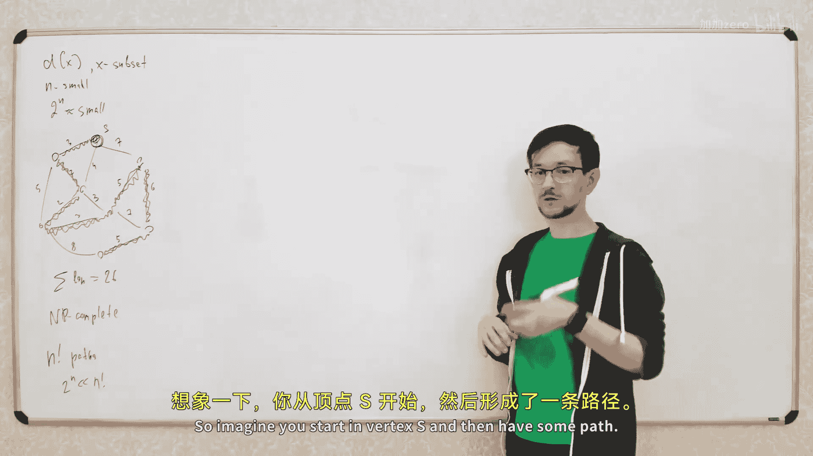
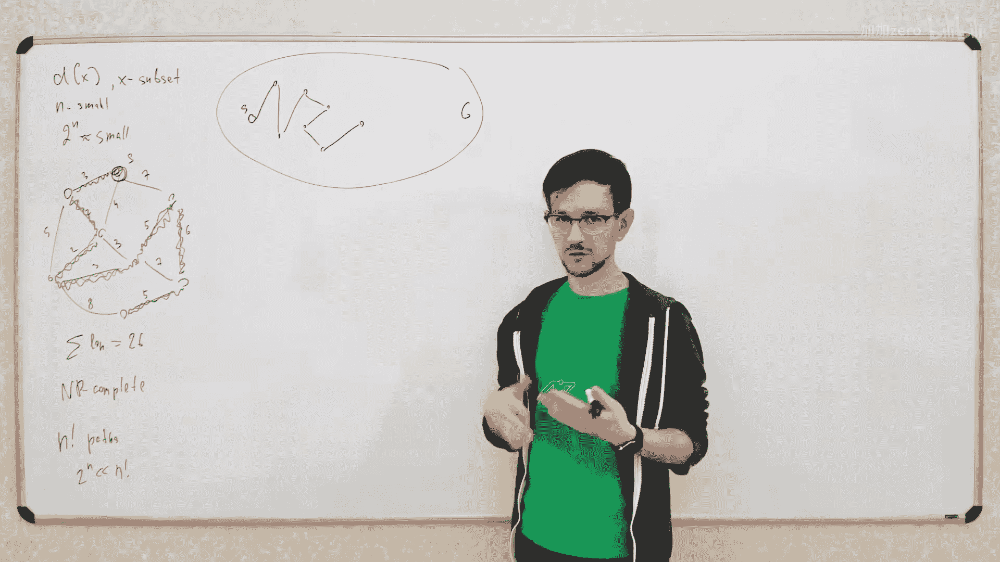
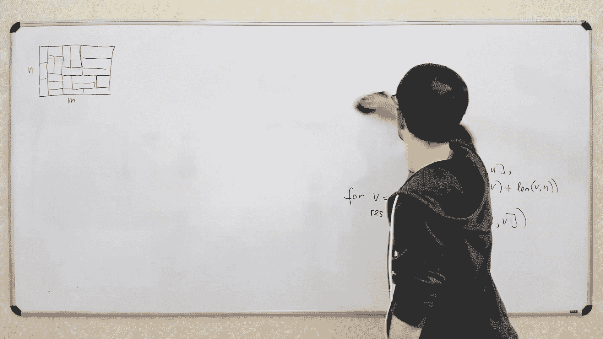
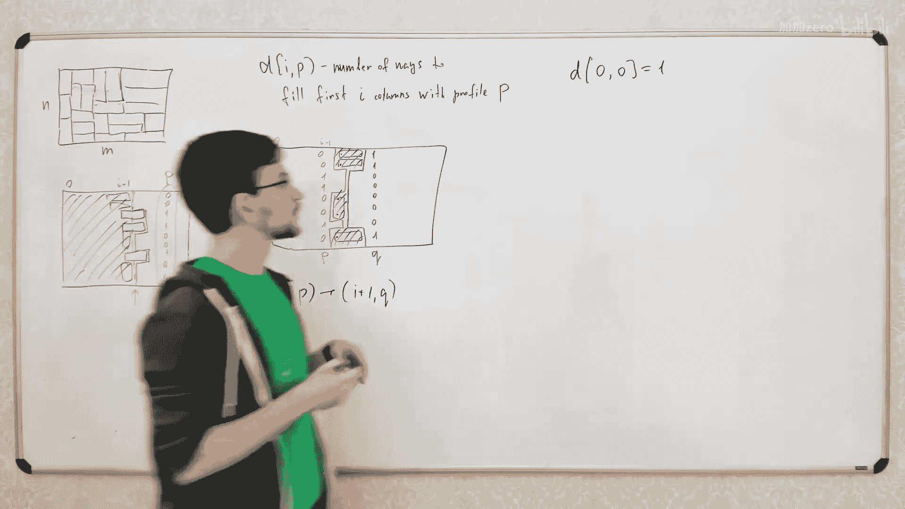

# 013：子集动态规划与轮廓动态规划








在本节课中，我们将学习动态规划的两种高级应用：基于子集的动态规划和基于轮廓的动态规划。这两种方法在处理组合优化问题时非常强大，尤其当问题规模较小时，它们能提供高效的解决方案。





## 子集动态规划








上一节我们介绍了动态规划的基本概念，本节中我们来看看如何将子集作为动态规划的状态参数。这意味着动态规划的状态之一是一个集合，而不仅仅是一个数字。例如，状态可以表示为 `dp[x]`，其中 `x` 是一个子集。



如果集合中元素的数量 `n` 较小（例如大约为20），那么子集的总数 `2^n`（大约一百万）也是可以接受的。我们可以创建一个大小为百万的数组来处理。

### 旅行商问题

以下是子集动态规划的一个经典应用：寻找最小权重的哈密顿回路，即旅行商问题。

**问题描述**：给定一个带权图（顶点代表城市，边代表道路及其距离），需要从起点城市 `s` 出发，访问所有其他城市恰好一次，并最终返回起点（或结束于任意点），目标是使总旅行距离最小。这是一个NP完全问题，意味着没有已知的多项式时间解法。然而，当顶点数 `n` 较小时，我们可以使用时间复杂度为 `O(2^n * n^2)` 的动态规划算法，这比暴力枚举所有 `n!` 条路径要高效得多。


**动态规划思路**：我们按顺序构建路径。动态规划的中间状态是：我们已经访问了某个顶点子集 `X`，并且当前正站在该子集中的最后一个顶点 `v` 上。状态 `dp[X][v]` 表示访问子集 `X` 并以顶点 `v` 结束的最小成本。




**状态转移**：从当前状态 `(X, v)`，我们可以通过一条边 `(v, u)` 移动到未访问的顶点 `u`。新的状态将是 `(X ∪ {u}, u)`，成本增加边 `(v, u)` 的权重。


**算法实现**：
1.  初始化：`dp[{s}][s] = 0`。
2.  遍历所有子集状态 `(X, v)`。
3.  对于每个状态，遍历所有从 `v` 出发的边 `(v, u)`，如果 `u` 不在 `X` 中，则尝试更新状态 `(X ∪ {u}, u)` 的最小成本。
4.  最终答案是在访问了所有顶点（即 `X` 为全集）的各个状态 `dp[全集][v]` 中取最小值。


**核心代码框架**：
```python
# 假设 n 为顶点数，graph[v] 是 v 的邻接表（包含边权）
dp = [[INF] * n for _ in range(1 << n)]
dp[1 << s][s] = 0  # 初始状态，只包含起点 s


for mask in range(1 << n): # 遍历所有子集
    for v in range(n):
        if not (mask & (1 << v)): # 如果 v 不在当前子集中，跳过
            continue
        for u, weight in graph[v]:
            if mask & (1 << u): # 如果 u 已在子集中，跳过
                continue
            new_mask = mask | (1 << u)
            dp[new_mask][u] = min(dp[new_mask][u], dp[mask][v] + weight)



# 寻找访问所有顶点后的最小成本
full_mask = (1 << n) - 1
answer = min(dp[full_mask][v] for v in range(n))
```

**关键点**：当问题的状态可以仅由已处理元素的子集来定义，而无需关心其内部顺序时，就可以考虑使用子集动态规划。

## 轮廓动态规划

上一节我们介绍了基于子集的动态规划，本节中我们来看看一种更具体的、常用于二维网格问题的技术——轮廓动态规划。

轮廓动态规划常用于按层（例如按列）构建解决方案的问题。在构建下一层时，我们只需要知道上一层边界的特定状态（即“轮廓”），而不需要知道整个已构建部分的内部细节。

### 铺砖问题

一个经典例子是铺砖问题：计算用 `1x2` 大小的砖块铺满 `n x m` 矩形网格的方法数。

**动态规划思路**：我们一列一列地填充网格。状态定义为：我们已经填充了前 `i` 列，并且第 `i` 列的“轮廓”由一个位掩码 `profile` 表示。`profile` 的第 `j` 位为1表示第 `j` 行有一个砖块从第 `i` 列“伸出”到第 `i+1` 列（即该砖块横跨了两列）。

**状态转移**：从状态 `(i, profile)`，我们需要填充第 `i+1` 列中所有因轮廓而空出的格子。我们需要枚举所有可能的方式用砖块填满这些空位，从而得到一个新的轮廓 `new_profile`，并转移到状态 `(i+1, new_profile)`。

**检查兼容性**：判断能否从轮廓 `p` 转移到轮廓 `q`，需要检查两者定义的中间空隙是否能被 `1x2` 砖块恰好填满。这可以通过逐行检查或巧妙的位运算来完成。

**算法优化（破碎轮廓法）**：上述方法的状态转移数可能较多（最多 `4^n`）。我们可以采用“破碎轮廓”法来简化：不再一次填充整列，而是一个格子一个格子地填充。状态变为 `(i, j, profile)`，表示正在填充第 `i` 列的第 `j` 行，`profile` 描述了当前列及下一列相关格子的占用情况。这样，每次转移只涉及放置一个砖块（水平或垂直），代码更简单，且状态转移是线性的。

**核心思想**：轮廓动态规划适用于问题结构是分层的，在构建下一层时，只需要知道上一层边界（轮廓）的状态信息。

### 另一个例子：网格染色问题

考虑另一个问题：将 `n x m` 网格的每个格子染成黑或白，要求不存在任何 `2x2` 子网格颜色全相同。求染色方案数。

**动态规划思路**：同样按列处理。状态 `(i, profile)` 表示前 `i` 列已染色，`profile` 记录了第 `i` 列每行的颜色。在填充第 `i+1` 列时，我们需要确保不会与第 `i` 列形成单色的 `2x2` 方块。这同样可以通过轮廓动态规划或破碎轮廓法来解决，状态中需要包含当前列和下一列部分格子的颜色信息。

## 总结

本节课我们一起学习了两种高级动态规划技术。
1.  **子集动态规划**：当问题状态可以由已处理元素的子集唯一确定时使用。我们以旅行商问题为例，展示了如何用 `O(2^n * n^2)` 的时间解决小规模NP难问题。
2.  **轮廓动态规划**：常用于二维网格的铺砌、染色等问题。其核心是按层构建，状态记录层间的边界轮廓。我们介绍了标准的轮廓法和更优的破碎轮廓法，后者通过逐格转移简化了逻辑和复杂度。

这两种方法都利用了位掩码来高效表示和转移状态，是解决特定类型组合优化问题的有力工具。要掌握它们，关键在于识别问题是否具有“仅依赖前一层轮廓”的结构，并通过练习熟悉状态设计与转移的实现。