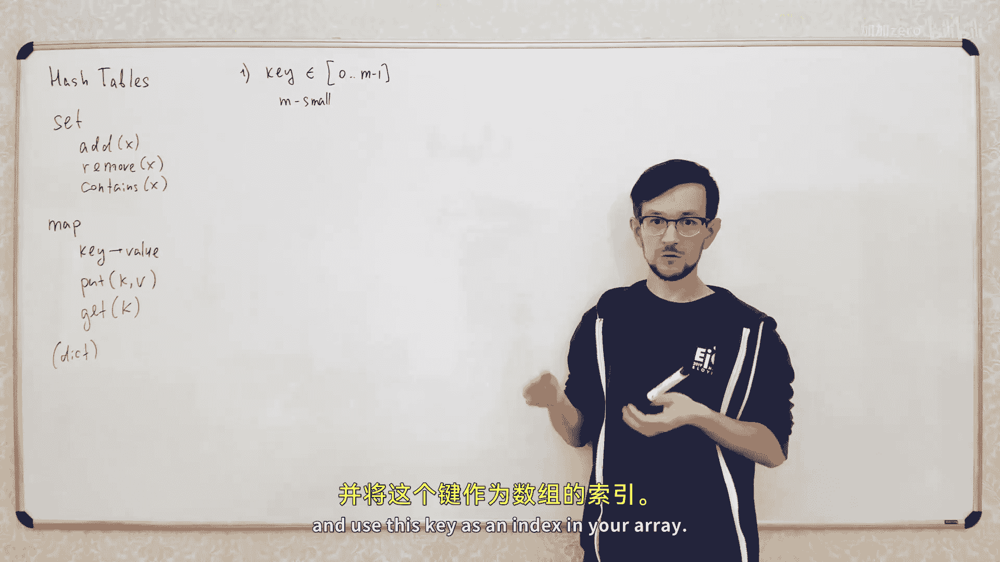
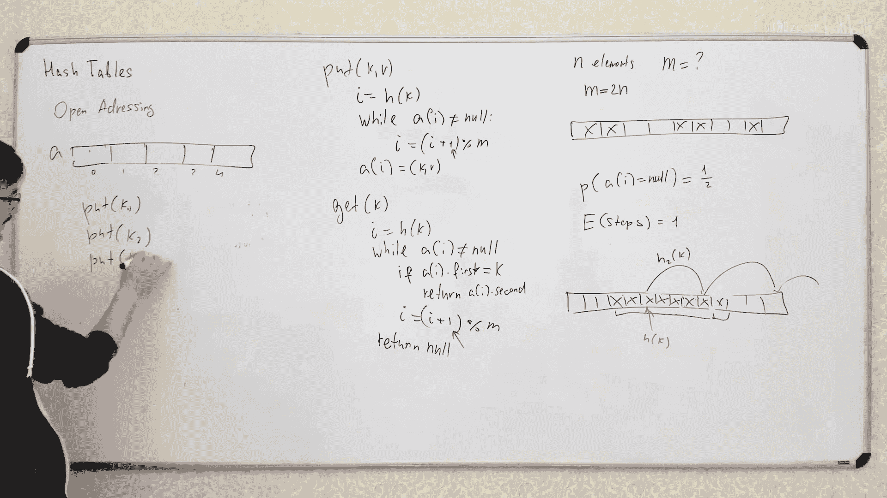

# 014：哈希表


在本节课中，我们将要学习一种非常强大且广泛应用的数据结构——哈希表。我们将探讨它的基本概念、工作原理、实现方式以及在实际应用中需要注意的问题。


哈希表是一种随机化的数据结构，虽然在某些特殊情况下可能引发问题，但其应用极为广泛。我们将讨论基于哈希表的两大主要数据结构：集合（Set）和映射（Map），并学习如何实现它们。


---



## 什么是哈希表？


哈希表是一种用于存储键值对的数据结构。它的核心思想是使用一个哈希函数，将键（Key）映射到一个固定大小的数组（通常称为哈希桶）的索引上。这样，我们可以通过计算键的哈希值来快速定位其对应的值（Value）。

**核心公式**：`index = hash(key) % array_size`

---

## 基于哈希表的数据结构

上一节我们介绍了哈希表的基本概念，本节中我们来看看基于哈希表构建的两种核心数据结构。

### 集合（Set）

集合是一种存储唯一元素的数据结构。它支持以下基本操作：
*   **添加（Add）**：将一个对象加入集合。
*   **删除（Remove）**：从集合中移除一个对象。
*   **查询（Contains）**：检查一个对象是否存在于集合中。

集合在许多场景下非常有用，例如，计算一个列表中不同对象的数量：只需将所有对象放入一个集合，然后检查集合的大小即可。

### 映射（Map）

映射（或称字典）是一种将键对象映射到值对象的数据结构。你可以把它想象成一个数组，但索引（键）可以是任意对象，而不仅仅是整数。

映射支持以下基本操作：
*   **插入（Put）**：将一个键值对存入映射。
*   **获取（Get）**：根据键获取对应的值。

这两种数据结构在各种算法和实际项目中都非常重要且被广泛使用。

---

## 哈希表的简单实现

了解了集合和映射的概念后，我们来看看如何用哈希表来实现它们。让我们从一个简单的情况开始。

### 当键为小整数时

最简单的场景是当键是范围较小的整数时（例如从0到M-1）。在这种情况下，实现一个映射非常简单。

**实现思路**：直接使用一个大小为M的数组。将键`k`作为数组的索引，值`v`存储在`array[k]`的位置。
*   `put(k, v)` 操作：`array[k] = v`
*   `get(k)` 操作：`return array[k]`

**代码示例**：
```python
array = [None] * M  # 创建一个大小为M的数组

def put(k, v):
    array[k] = v

def get(k):
    return array[k]
```

---

## 处理更大的键空间

上一节我们处理了键是小整数的简单情况。但当键的范围很大（例如一个很大的整数）时，我们无法直接创建一个巨大的数组。本节中我们来看看如何解决这个问题。

核心思路是引入一个**哈希函数（Hash Function）**。这个函数接收一个大范围的键，并返回一个小范围的整数（例如0到M-1），然后我们用这个结果作为数组的索引。

**核心公式**：`h(k) = k % M` （一个简单的哈希函数例子）

**实现思路**：
1.  创建一个大小为M的数组。
2.  插入时，计算 `index = h(key)`，然后将值存入 `array[index]`。
3.  查询时，同样计算 `index = h(key)`，然后从 `array[index]` 读取值。

**示例**：设数组大小为5，哈希函数为 `h(k) = k % 5`。
*   执行 `put(37, 3)`：`h(37) = 2`，所以将值3存入 `array[2]`。
*   执行 `get(37)`：`h(37) = 2`，从 `array[2]` 读取到值3。

---

## 哈希冲突及其解决

上一节我们使用哈希函数将大键映射到小数组。但这会带来一个关键问题：**哈希冲突（Collision）**。本节中我们来看看什么是冲突以及如何解决它。

### 什么是哈希冲突？

当两个不同的键 `x` 和 `y` 经过哈希函数计算后得到了相同的索引，即 `h(x) == h(y)`，就发生了哈希冲突。

**示例**：继续使用 `h(k) = k % 5`。
*   `h(37) = 2`
*   `h(52) = 2`
键37和52发生了冲突，它们都会被映射到数组索引2。

### 解决方法一：链地址法

最直接的解决方法是**链地址法（Chaining）**。我们不再在数组的每个位置存储单个值，而是存储一个链表（或其他容器），用于存放所有哈希到该索引的键值对。

**调整后的实现思路**：
1.  数组的每个元素是一个链表，初始为空。
2.  **插入 `put(k, v)`**：
    *   计算 `index = h(k)`。
    *   遍历 `array[index]` 处的链表，检查是否已存在键 `k`。
    *   如果存在，更新其值；如果不存在，将新的键值对 `(k, v)` 添加到链表末尾。
3.  **查询 `get(k)`**：
    *   计算 `index = h(k)`。
    *   遍历 `array[index]` 处的链表，查找键为 `k` 的节点。
    *   找到则返回对应的值，否则返回 `None`（表示键不存在）。

**代码示例（简化版，未处理更新逻辑）**：
```python
class Node:
    def __init__(self, key, value):
        self.key = key
        self.value = value
        self.next = None

array = [None] * M  # 每个位置初始为None，代表空链表

def put(k, v):
    index = h(k)
    # 简化为直接添加到链表头部，实际需先检查是否存在
    new_node = Node(k, v)
    new_node.next = array[index]
    array[index] = new_node

def get(k):
    index = h(k)
    current = array[index]
    while current is not None:
        if current.key == k:
            return current.value
        current = current.next
    return None
```

---

## 时间复杂度与随机哈希函数

解决了冲突后，我们需要分析链地址法的时间复杂度。最坏情况下，所有键都冲突到同一个桶，查询时间会退化为O(n)。本节中我们探讨如何通过选择好的哈希函数来获得平均常数时间复杂度。

### 理想情况：完全随机哈希函数

假设我们有一个**完全随机**的哈希函数 `h`，它将键均匀、独立地映射到 `M` 个桶中。对于任意两个不同的键 `x` 和 `y`，它们哈希值相等的概率是 `1/M`。

在这种情况下，对于一个包含 `n` 个元素的哈希表，每个桶中链表长度的**期望值**是 `n / M`。如果我们保持 `M` 与 `n` 成正比（例如 `M ≈ n`），那么期望长度就是一个常数。因此，`get` 和 `put` 操作的**平均时间复杂度是 O(1)**。

### 现实挑战与通用哈希函数族

然而，我们无法在程序中存储一个完全随机的函数（因为需要太多空间）。实践中，我们从一个精心设计的、较小的**哈希函数族**中随机选择一个函数来使用。

一个经典且简单的通用哈希函数族是：
**公式**：`h_{a, p}(k) = ((a * k) % p) % M`
其中 `p` 是一个大质数，`a` 是从 `1` 到 `p-1` 中随机选择的整数。

可以证明，从这个函数族中随机选择的函数，能以很高的概率满足“对于任意不同键 `x`, `y`，冲突概率约为 `1/M`”的性质，从而保证平均常数时间复杂度。

**关键点**：哈希函数需要是“随机”的，或者来自一个具有良好随机性质的函数族，以防止恶意数据导致性能退化。

---

## 开放寻址法

除了链地址法，还有另一种处理冲突的策略，称为**开放寻址法（Open Addressing）**。本节中我们来看看它的工作原理。

### 核心思想

在开放寻址法中，哈希表数组的每个位置只存储一个键值对。当发生冲突时（即目标位置已被占用），它会按照一个预定的**探测序列**依次检查后续位置，直到找到一个空位（用于插入）或找到目标键（用于查询）。

最简单的探测序列是**线性探测**：如果位置 `i` 被占，则尝试 `i+1`, `i+2`, ... 直到数组末尾，然后可能绕回开头。

**插入 `put(k, v)` 操作（简化描述）**：
1.  计算起始索引 `i = h(k)`。
2.  从 `i` 开始，向后查找第一个空位置。
3.  将键值对 `(k, v)` 放入该空位。

**查询 `get(k)` 操作**：
1.  计算起始索引 `i = h(k)`。
2.  从 `i` 开始，向后查找。
    *   如果遇到键为 `k` 的位置，返回对应的值。
    *   如果遇到一个**空位置**，说明键 `k` 不存在于表中（因为插入时，键 `k` 一定会被放在探测序列中第一个可用的空位）。

### 负载因子与性能

为了使开放寻址法高效工作，哈希表必须保持足够多的空位。我们定义**负载因子 α = n / M**，即元素数量与数组大小的比值。

通常需要保持 `α < 0.7 ~ 0.8`。如果表太满（`α` 接近1），查找空位的探测序列会变得非常长，性能急剧下降。当元素数量增多时，需要动态扩容（创建一个更大的数组，并重新插入所有元素），类似于动态数组（如Python `list`）的扩容机制。

### 开放寻址法的优缺点

**优点**：
*   **内存局部性好**：所有数据都存储在一个连续的数组中，遍历探测序列时缓存命中率高，访问速度快。
*   **无需额外指针**：节省了链地址法中链表节点所需的额外内存开销。

**缺点**：
*   **容易产生聚集**：线性探测容易导致连续的被占位置形成“聚集”，这会加长探测路径。可以使用二次探测或双重哈希等改进的探测序列来缓解。
*   **删除操作复杂**：删除一个元素不能简单地将位置置空，否则会中断后续元素的探测序列。通常采用“惰性删除”（标记为已删除）的策略。

---

## 哈希表的动态管理与总结



最后，我们讨论哈希表在实际使用中的一些高级话题和总结。

### 应对哈希洪水攻击

如果攻击者知道你的哈希函数，他们可以精心构造大量具有相同哈希值的键，使你的哈希表退化为链表，导致服务拒绝。防御策略包括：
1.  **使用随机密钥**：像之前介绍的，从通用哈希函数族中随机选择函数，攻击者无法预知。
2.  **动态重新哈希**：监控桶的深度。如果某个桶变得异常大，说明可能正在被攻击。此时，可以**随机选择一个新的哈希函数**，并重新将所有元素插入到新的哈希表中（即重新哈希）。由于新函数是随机且独立的，攻击者之前构造的数据在新函数下很难再次全部冲突。

### 哈希表与二叉搜索树的比较

哈希表虽然高效，但并非万能。另一种重要的数据结构——**平衡二叉搜索树（如红黑树）**，提供了不同的权衡：
*   **哈希表优势**：平均情况下，插入、删除、查找的时间复杂度为 O(1)，通常更快。
*   **二叉搜索树优势**：
    *   **有序性**：树中元素是按序存储的，可以高效地进行范围查询、查找前驱/后继、最小/最大元素等操作。
    *   **最坏情况保证**：平衡树能保证最坏情况下操作时间复杂度为 O(log n)，而哈希表最坏情况是 O(n)。
    *   **稳定性**：不依赖于哈希函数的随机性。

### 总结

本节课中我们一起学习了：
1.  **哈希表**的基本概念：通过哈希函数将键映射到数组索引，实现快速访问。
2.  基于哈希表的两种数据结构：**集合（Set）** 和 **映射（Map）**。
3.  **哈希冲突**的必然性及两种主要解决方法：
    *   **链地址法**：每个桶使用一个链表存储冲突元素。
    *   **开放寻址法**：在数组内按照探测序列寻找空位。
4.  保证平均 O(1) 时间复杂度的关键：使用**随机或来自通用函数族的哈希函数**。
5.  哈希表的**动态扩容**机制以及应对恶意数据的**重新哈希**策略。
6.  哈希表与二叉搜索树的简要比较。

哈希表是算法工具箱中不可或缺的利器，理解其原理和实现细节，对于编写高效程序至关重要。