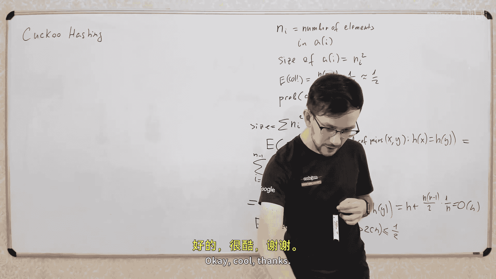
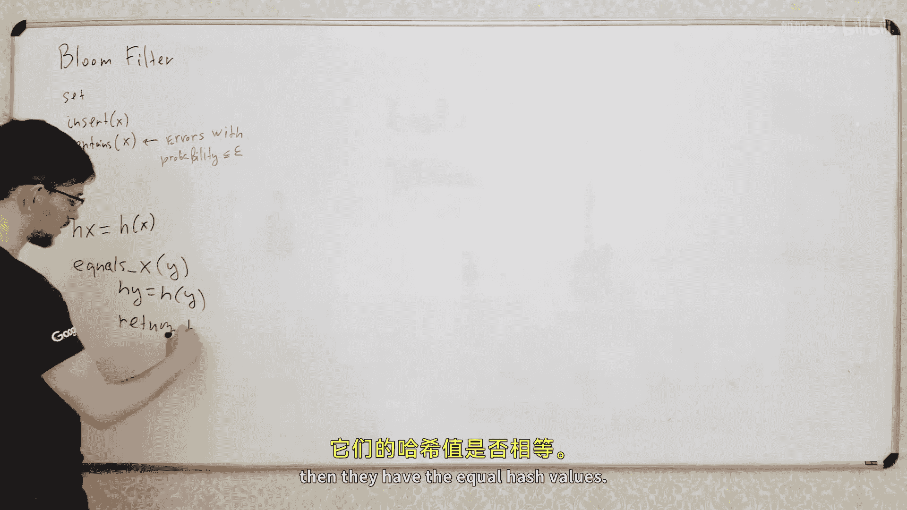

# 015：完美哈希、布谷鸟哈希与布隆过滤器


在本节课中，我们将继续探讨哈希表，学习几种高级技术：完美哈希、布谷鸟哈希以及布隆过滤器。这些技术旨在优化哈希表的性能，特别是在最坏情况下的查询时间，或者以极小的内存开销实现集合成员查询，同时允许一定的错误率。

## 回顾：标准哈希表


上一节我们介绍了两种基于哈希表的数据结构：集合（Set）和映射（Map）。集合支持插入和查询操作，映射则支持通过键来存储和获取值。

我们学习了如何构建平均时间复杂度为 **O(1)** 的哈希表。其关键在于选择一个良好的哈希函数。如果一个哈希函数满足：对于任意两个不同的键 `x` 和 `y`，其碰撞概率约为 **1/L**（其中 L 是桶数组的大小），那么哈希表的操作平均复杂度就是常数时间。

然而，这种平均复杂度并不能保证最坏情况下的性能。在某些场景下，我们可能希望查询操作（如 `get` 或 `contains`）在最坏情况下也能保证 **O(1)** 的时间复杂度，即使这可能需要更长的构建时间。接下来，我们将探讨如何实现这一目标。

## 完美哈希

完美哈希的目标是构建一个静态哈希表，使得查询操作在最坏情况下也能在常数时间内完成。其核心思想是使用两级哈希结构来彻底避免查询时的碰撞。

### 基本结构

回忆标准哈希表的链地址法：我们有一个大小为 L 的主数组，每个桶（bucket）是一个链表，存放所有哈希到该位置的键值对。查询时，需要遍历链表，平均链表长度是常数，但最坏情况下可能很长。

完美哈希的改进方法是：将每个桶内的链表替换为另一个小型哈希表。

1.  **第一级哈希**：使用一个哈希函数 `h` 将键映射到主数组的某个桶 `i`。
2.  **第二级哈希**：对于第 `i` 个桶，我们为其分配一个专属的哈希函数 `g_i` 和一个独立的小型数组。这个小型哈希表被设计为**无碰撞**的。

### 如何实现无碰撞的小哈希表？

要使一个存放 `n_i` 个元素的小哈希表无碰撞，一个经典方法是让该哈希表的大小 `m_i` 约等于 `n_i` 的平方（即 `m_i ≈ n_i²`）。如果从一个“通用哈希函数族”中随机选择哈希函数 `g_i`，那么构建出无碰撞哈希表的概率将超过 1/2。因此，我们可以多次尝试选择不同的 `g_i`，直到找到一个能产生无碰撞映射的函数。由于成功概率高，这个过程通常很快。

### 内存占用分析

你可能会问：为什么不直接构建一个巨大的无碰撞哈希表？因为那需要 **O(n²)** 的内存，代价太高。

在完美哈希中，我们只对小哈希表使用平方级空间。总内存消耗是各个小哈希表大小之和：`S = Σ (n_i²)`。我们可以证明，如果主哈希函数 `h` 是良好的，那么 `S` 的期望值是 **O(n)**。通过重新选择主哈希函数 `h`，我们可以以高概率保证总内存消耗保持在 **O(n)** 线性范围内。

### 操作流程

1.  **构建阶段**：
    *   选择一个主哈希函数 `h`。
    *   将所有元素分配到主数组的各个桶中。
    *   检查总内存消耗 `S`。如果过大，则重新选择 `h`。
    *   对每个非空桶，尝试不同的哈希函数 `g_i`，直到构建出无碰撞的小哈希表。
2.  **查询阶段**：
    *   计算 `i = h(key)`。
    *   在桶 `i` 对应的小哈希表中，计算 `j = g_i(key)`。
    *   直接访问小哈希表数组的第 `j` 个位置获取值。由于无碰撞，此操作是严格的 **O(1)**。

**总结**：完美哈希通过“以空间换时间”和“两级哈希”的策略，将最坏情况下的查询时间复杂度优化到了 **O(1)**，同时保持了总体的线性空间复杂度。它非常适合“一次构建、多次查询”的静态场景。



## 布谷鸟哈希

布谷鸟哈希是另一种保证最坏情况下 **O(1)** 查询时间的技术，它在实践中通常比完美哈希更节省空间且常数因子更小。


### 核心思想

布谷鸟哈希维护两个数组（`Array1` 和 `Array2`）和两个哈希函数（`h1` 和 `h2`）。每个键 `x` 在哈希表中有**两个候选位置**：`Array1[h1(x)]` 或 `Array2[h2(x)]`。哈希表始终维持一个不变式：任何已存储的键 `x` 必定存在于它的两个候选位置之一。

### 查询与插入

*   **查询 `get(x)`**：只需检查两个候选位置。如果找到 `x`，则返回；否则，`x` 肯定不在表中。这是一个严格的 **O(1)** 操作。
*   **插入 `put(x)`**：
    1.  检查 `x` 的两个候选位置。如果任一为空，则将 `x` 放入。
    2.  如果两个位置都被占用，则选择其中一个（例如 `Array1[h1(x)]`），将原元素 `y` “踢出”，并将 `x` 放入该位置。
    3.  现在，被踢出的 `y` 需要被重新安置到它的另一个候选位置。如果那个位置也被占用，就重复这个“踢出”过程，直到找到一个空位，或者达到一定的循环次数。

### 处理循环与重建

插入过程中可能会遇到循环，导致无法安置所有元素。这表明当前的两个哈希函数对于当前的元素集合可能导致冲突无法解决。

此时，解决方案是：记录本次插入失败，选择两个新的哈希函数（`h1'`, `h2'`），然后**重建**整个哈希表（即取出所有元素，用新哈希函数重新插入）。研究表明，如果哈希函数来自一个“log n 通用哈希函数族”，那么插入失败（需要重建）的概率很低。

### 特点与权衡


*   **优点**：查询速度极快，内存利用率较高（数组负载因子可达约50%）。
*   **缺点**：插入操作在最坏情况下可能触发全表重建，虽然平均概率很低。它更适用于查询为主、插入不频繁或可以批量预处理再查询的场景。

**总结**：布谷鸟哈希通过赋予每个元素两个“巢穴”并允许“踢出”机制，以简洁的方式实现了最坏情况 **O(1)** 的查询。其性能依赖于哈希函数的性质，在实践中往往表现优异。

## 布隆过滤器


布隆过滤器是一个完全不同的数据结构，用于表示一个集合。它的特点是**占用内存极小**，但代价是允许一定的**误判率**（即可能错误地认为某个元素在集合中）。



### 为什么需要它？

有时，我们只需要判断一个元素是否在一个超大集合中（例如，检查一个URL是否在黑名单中），并且可以容忍极低概率的错误。使用标准哈希表需要存储所有元素本身，内存开销大。布隆过滤器则允许我们使用远小于元素总大小的内存来完成这个任务。

### 工作原理

布隆过滤器包含一个长度为 `m` 的比特数组 `B`（初始全为0）和 `k` 个独立的哈希函数 `h1, h2, ..., hk`。

*   **插入 `add(x)`**：对于元素 `x`，计算 `k` 个哈希值 `h1(x) ... hk(x)`，将比特数组 `B` 中对应位置全部设为1。
    ```python
    for i in range(k):
        index = h_i(x) % m
        B[index] = 1
    ```
*   **查询 `contains(x)`**：计算 `x` 的 `k` 个哈希值，检查比特数组 `B` 中所有对应位置是否都为1。
    *   如果**所有位都是1**，则返回“**可能在集合中**”。
    *   如果**有任何一位是0**，则返回“**肯定不在集合中**”。

### 误差分析与参数设置

*   **为什么会有误判？** 不同的元素可能通过哈希函数将某些相同的比特位设为1。查询一个不存在的元素时，如果它的 `k` 个哈希位置恰好都被其他元素设为1了，就会发生误判。
*   **如何控制误差？** 误判概率 `ε` 与参数 `m`（数组大小）、`k`（哈希函数个数）、`n`（已插入元素数量）有关。经过优化，可以得到近似关系：
    *   给定 `n` 和期望的误判率 `ε`，最优的哈希函数数量 `k ≈ ln(2) * (m/n)`，但更直接的是，所需数组大小 `m ≈ -n * ln(ε) / (ln2)²`。
    *   例如，要存储100万个元素，并希望误判率低于百万分之一（`ε=1e-6`），大约需要 `m ≈ 2.5MB` 的比特数组和 `k ≈ 10` 个哈希函数。

### 特点与应用

*   **优点**：空间效率极高，插入和查询时间都是 **O(k)**，且 `k` 是常数。
*   **缺点**：不支持删除操作（除非使用变体如计数布隆过滤器）；存在误判；只能回答“可能在”或“肯定不在”。
*   **应用**：网络爬虫去重、缓存穿透防护、数据库查询前置过滤等。

**总结**：布隆过滤器以允许可控的误判率为代价，实现了极高的空间效率，是处理海量数据成员查询问题的利器。

## 高级变体：布谷鸟过滤器

最后，我们简要提及结合了布谷鸟哈希和布隆过滤器思想的数据结构——**布谷鸟过滤器**。它同样用于成员查询，并允许误判。

*   它存储的是元素的“指纹”（一个短哈希值），而非元素本身。
*   像布谷鸟哈希一样，每个指纹有两个候选桶位置。
*   查询时，检查两个位置中是否存在该指纹。
*   它的空间效率通常比标准布隆过滤器更高，并且支持删除操作（标准布隆过滤器不支持）。

本节课中我们一起学习了三种高级哈希相关技术：**完美哈希**通过两级哈希保证最坏情况查询速度；**布谷鸟哈希**通过巧妙的“踢出”机制实现高效查询；**布隆过滤器**则以微小误判率为代价，实现了极致的空间节省。这些工具丰富了我们在不同场景（追求绝对性能、追求空间效率、允许近似结果）下处理数据集合问题的工具箱。