# 017：Eval-Link-Update 数据结构

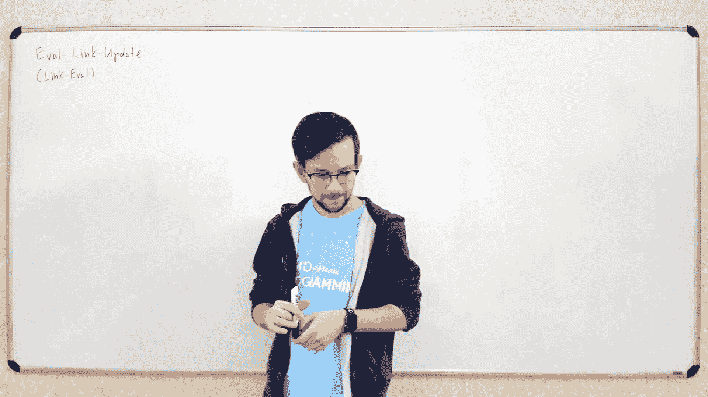

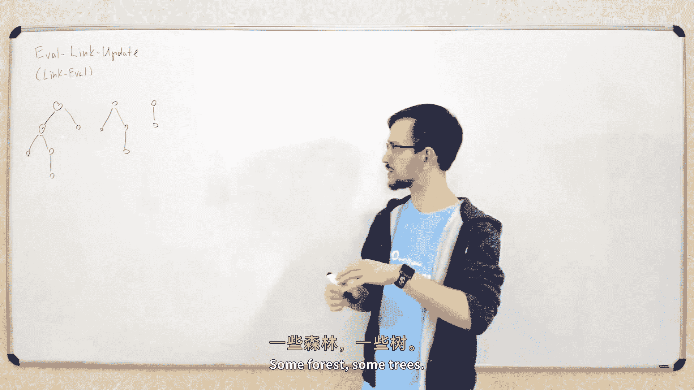

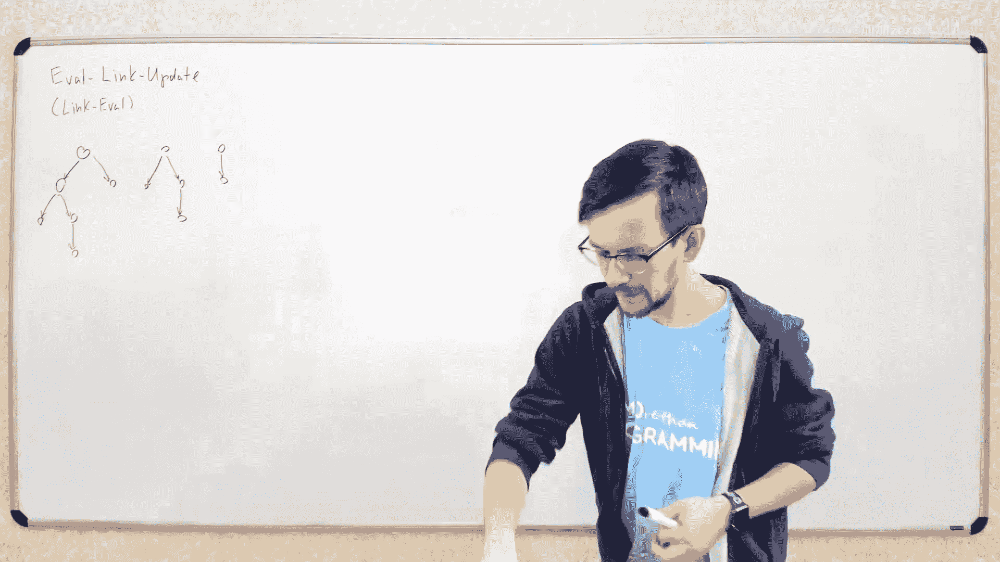

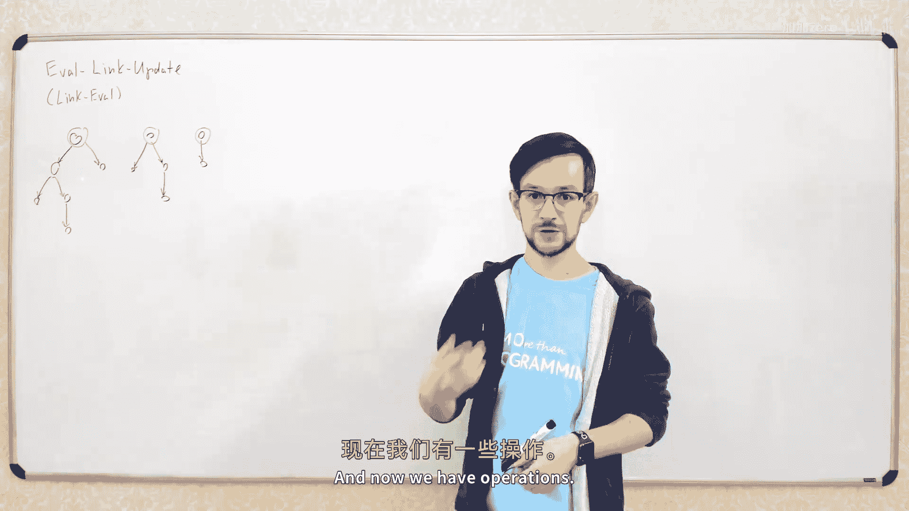

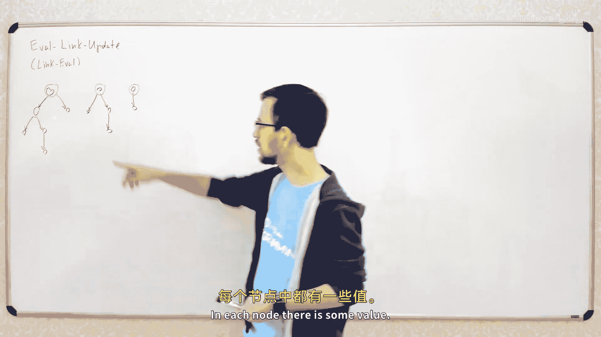

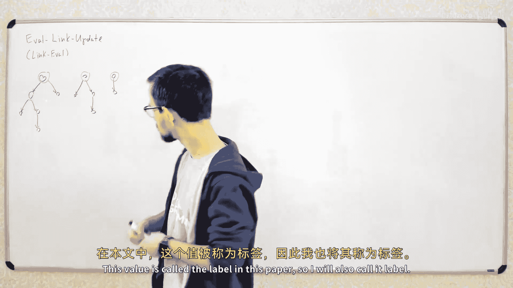

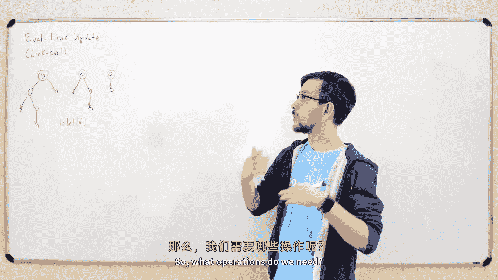

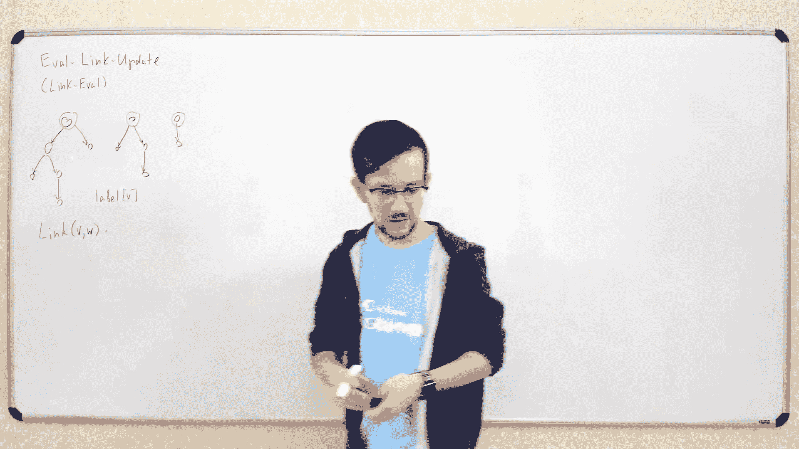

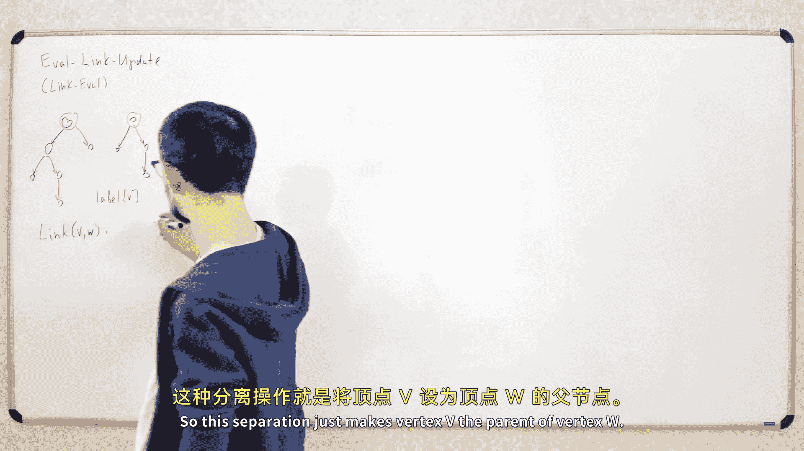

在本节课中，我们将学习一种名为 **Eval-Link-Update** 的数据结构。它类似于我们之前讨论过的并查集（Union-Find），但功能更强大，支持在动态树结构上高效地计算路径上的聚合值。我们将了解其核心操作、工作原理以及如何通过路径压缩和平衡树技术来优化其性能。

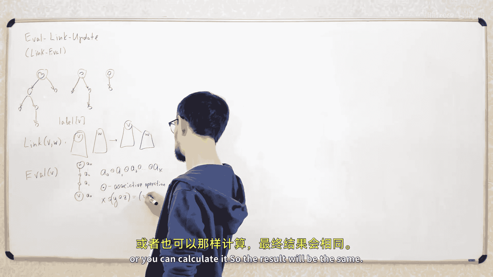

## 数据结构概述

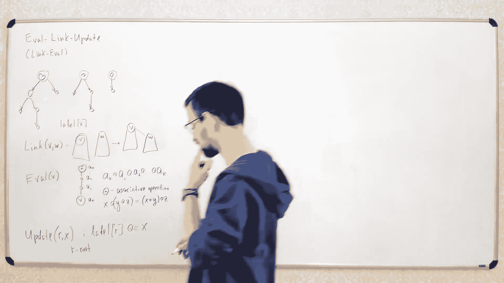

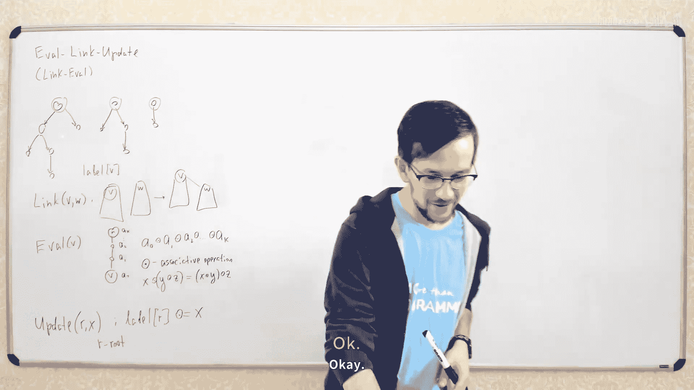

Eval-Link-Update 数据结构维护一个由多棵树组成的森林。每棵树都有一个根节点，每个节点恰好属于一棵树。每个节点 `v` 都存储一个值，我们称之为标签 `label(v)`。

该数据结构支持以下三种操作：
*   **`link(v, w)`**：将节点 `w` 所在的树连接到节点 `v` 所在的树下，使 `v` 成为 `w` 的父节点。这会将两棵树合并为一棵。
*   **`eval(v)`**：计算从节点 `v` 到其所在树根节点的路径上所有节点标签的聚合值。这个聚合操作（记为 `⊕`）必须是**可结合**的，即 `(a ⊕ b) ⊕ c = a ⊕ (b ⊕ c)`。
*   **`update(r, x)`**：更新节点 `r` 的标签。在本文讨论的版本中，`r` 必须是其所在树的**根节点**。

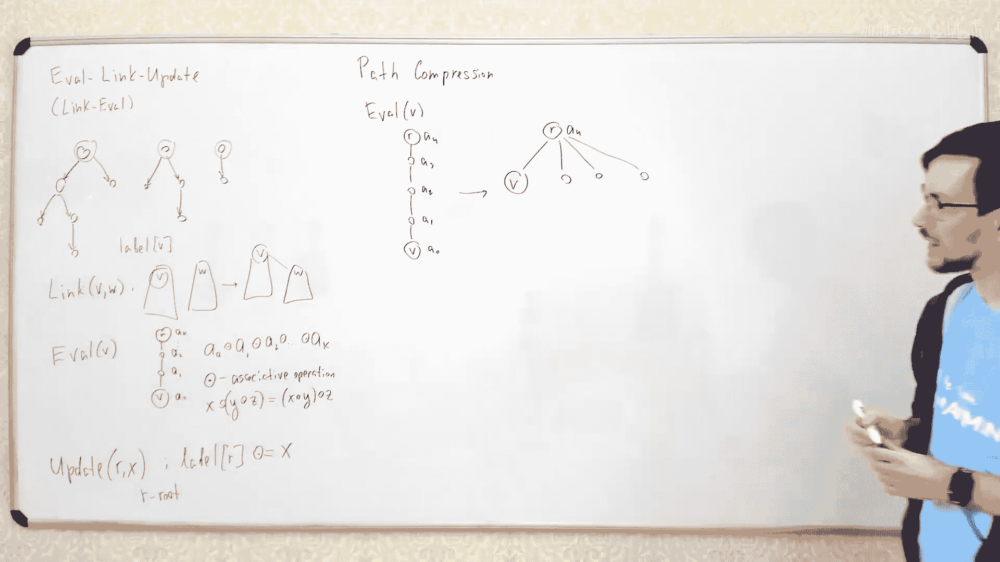

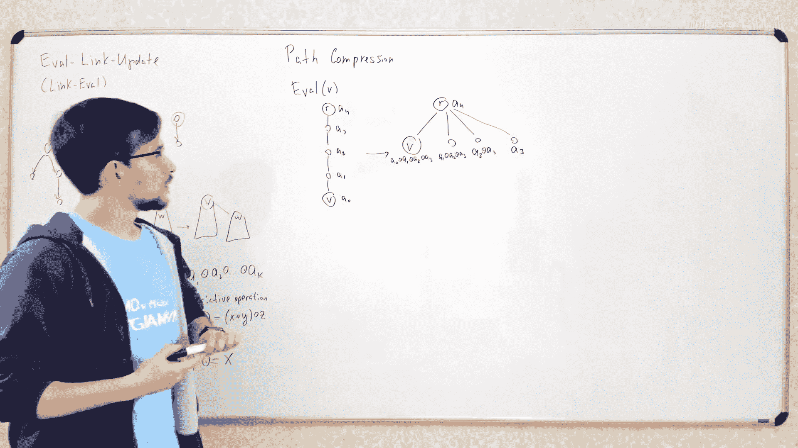

我们的目标是高效地支持这些操作，理想情况下能达到接近常数时间的摊还复杂度。

## 基础实现与路径压缩

上一节我们介绍了数据结构的基本形态和操作。本节中，我们来看看如何利用一个简单的技巧——**路径压缩**——来实现这些操作。

路径压缩的思想与我们之前在并查集中使用的类似。当我们执行一次 `eval(v)` 操作时，我们会沿着从 `v` 到根节点 `r` 的路径遍历，并计算聚合结果。之后，我们可以将这条路径上的所有节点（除了根节点）直接连接到根节点 `r` 上，从而“压缩”这条路径。

以下是执行 `eval(v)` 并应用路径压缩的步骤：
1.  从节点 `v` 开始，向上遍历到根节点 `r`，记录路径上所有节点的标签：`a0, a1, ..., ak`，其中 `a0 = label(v)`，`ak = label(r)`。
2.  计算聚合结果 `result = a0 ⊕ a1 ⊕ ... ⊕ ak`。
3.  为了在压缩后保持 `eval` 结果不变，我们需要更新路径上（除根节点外）每个节点的标签。新的标签应使得从该节点到根的新路径的聚合结果等于旧路径的结果。
    *   我们可以从路径的末端（靠近根）向前计算新的标签值。
    *   例如，对于路径上的倒数第二个节点，其新标签应设为 `a_{k-1} ⊕ ak`，这样从它到根（现在直接相连）的结果 `(a_{k-1} ⊕ ak) ⊕ (根标签)` 在结合律下等于旧结果。
4.  最后，将路径上所有节点（除根节点外）的父指针直接指向根节点 `r`。

`link(v, w)` 操作很简单，只需将 `w` 的父指针设为 `v` 即可。
`update(r, x)` 操作也很直接，因为 `r` 是根节点，我们只需修改 `label(r)`。

如果树是平衡的，这种朴素的路径压缩方法能带来很好的摊还时间复杂度（逆阿克曼函数级别）。但如果树不平衡（例如退化成链），单次 `eval` 操作在最坏情况下可能是 `O(n)`。

## 实现平衡：具有逆元的操作

上一节我们看到，简单的路径压缩在树不平衡时效率不高。本节中，我们来看看一种特殊情况：当聚合操作 `⊕` 对每个元素都存在**逆元**时，如何构建一棵始终平衡的“虚拟树”来保证高效性。

我们要求对于任何标签值 `x`，都存在一个逆元 `x^{-1}`，使得 `x ⊕ x^{-1} = e`，其中 `e` 是该操作的**单位元**（例如，加法中的 `0`，乘法中的 `1`）。一个常见的例子是**整数加法**，其逆元就是相反数（`-x`）。

核心思路是，我们并不直接维护原始的“真实树”，而是维护一棵与之等价的、**平衡的虚拟树**。这棵虚拟树包含所有相同的节点，但结构经过调整以保证平衡。我们确保在这棵虚拟树上计算 `eval` 的结果与在真实树上计算的结果完全相同。

以下是构建和维护平衡虚拟树的关键技巧：在 `link(v, w)` 时，我们模仿并查集的“按大小合并”启发式策略。
*   我们跟踪每棵虚拟树的大小（节点总数）。
*   当需要连接 `v` 和 `w` 时，我们比较 `size(v)` 和 `size(w)`。
*   如果 `size(w) <= size(v)`，我们按原计划连接（`w` 成为 `v` 的子节点）。
*   如果 `size(w) > size(v)`，我们则**反转连接方向**，让 `v` 成为 `w` 的子节点。为了保持 `eval` 结果不变，我们必须相应地调整 `v` 和 `w` 的标签：
    *   新 `label(w) = label(w) ⊕ label(v)`
    *   新 `label(v) = label(v)^{-1} ⊕ label(w)^{-1}` （或根据操作顺序调整）
*   通过总是将较小的树连接到较大的树下，我们可以保证虚拟树的高度是 `O(log n)` 的。

由于虚拟树是平衡的，在其上应用路径压缩就能获得优异的摊还复杂度（`O(α(n))`，其中 `α` 是逆阿克曼函数）。

## 处理更一般的操作（如最大值）

上一节的方法依赖于聚合操作存在逆元。但对于像**最大值**（`max`）这样的操作，逆元并不存在。本节中，我们探讨如何处理这类更一般的操作。

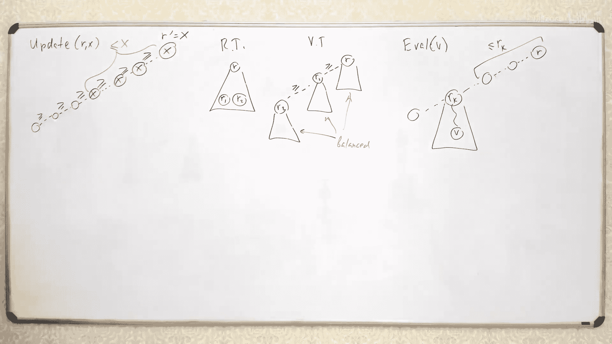

对于 `max` 操作，我们采用一种不同的策略。我们不再将整棵树维护为一棵平衡树，而是将其维护为一系列**平衡链**的序列。

我们维护以下结构：
*   将原始树中的每个连通分量（树）表示为一系列平衡的“小树”。
*   这些小树通过它们的根节点连接成一个序列。
*   关键性质：这个序列中，根节点的标签值是**单调非递减**的（从左到右递增或相等）。

`eval(v)` 操作现在只需在 `v` 所在的**小树**内部进行路径压缩，计算到其小树根节点的聚合值。由于序列中右边小树的根节点标签值更大，从 `v` 到全局根节点的实际最大值其实就是 `v` 所在小树根节点的值（或者序列中更右侧的某个根节点值，取决于实现）。这个性质保证了正确性。

`update(r, x)` 操作（`r` 是全局根）需要更新 `label(r)`。如果新值 `x` 大于旧值，我们可能需要：
1.  找到序列中所有根节点标签值 `<= x` 的小树。
2.  将这些小树的根节点标签也更新为 `x`（因为 `x` 现在成为了路径上的新最大值）。
3.  将这些小树**合并**成一棵新的平衡小树。合并时使用“小树连大树”的启发式方法以保持平衡。

`link(v, w)` 操作更为复杂，但核心思想是考虑两个节点所属的整个集合（所有小树）的总大小。总是将总大小较小的集合合并到较大的集合中，并调整小树序列的顺序以维持根节点标签的单调性。在合并过程中，可能会触发类似 `update` 中的子树合并操作。

通过精细的势能分析，可以证明即使对于 `max` 操作，每个操作的摊还时间复杂度也能达到接近常数（`O(α(n))`）。

## 复杂度分析与总结

本节课中，我们一起学习了 **Eval-Link-Update** 数据结构。

我们首先定义了它的三个核心操作：`link`（合并树）、`eval`（计算路径聚合值）和 `update`（更新根标签）。然后，我们看到了如何通过**路径压缩**这一基础技术来实现它们。

接着，我们探讨了两种优化策略以获得优异的摊还复杂度：
1.  **对于存在逆元的操作**（如加法）：通过维护一棵平衡的虚拟树，并在 `link` 时使用“按大小合并”策略，可以保证 `O(α(n))` 的时间复杂度。
2.  **对于一般结合操作**（如最大值）：通过将树组织成一系列根节点标签有序的平衡链，并在 `link` 和 `update` 时谨慎地合并链以保持平衡和单调性，同样可以达到 `O(α(n))` 的摊还复杂度。

这种数据结构虽然比简单的并查集复杂，但它提供了在动态树上进行路径查询和更新的强大能力，在某些特定算法（如动态最小生成树）中非常有用。其核心思想——结合路径压缩、平衡启发式合并以及势能分析——是高级数据结构设计中的经典范例。