# 018：线段树


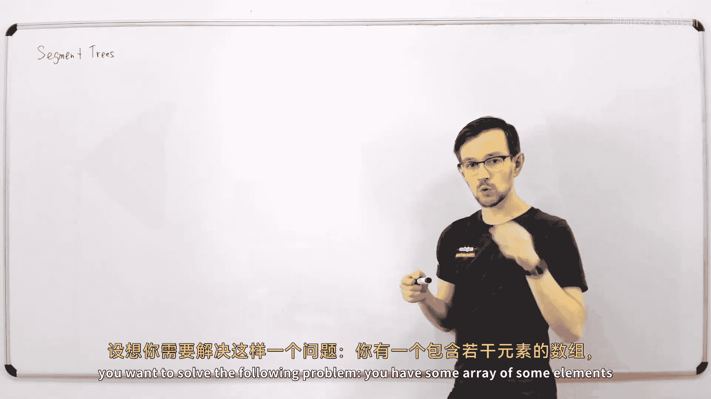


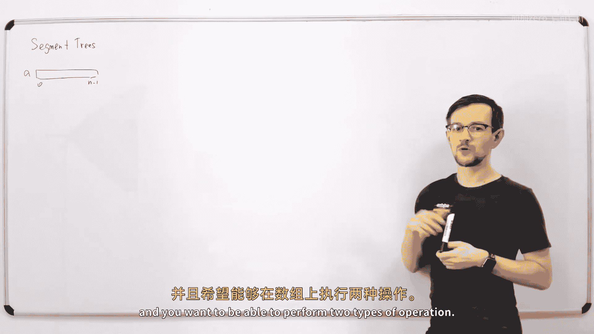

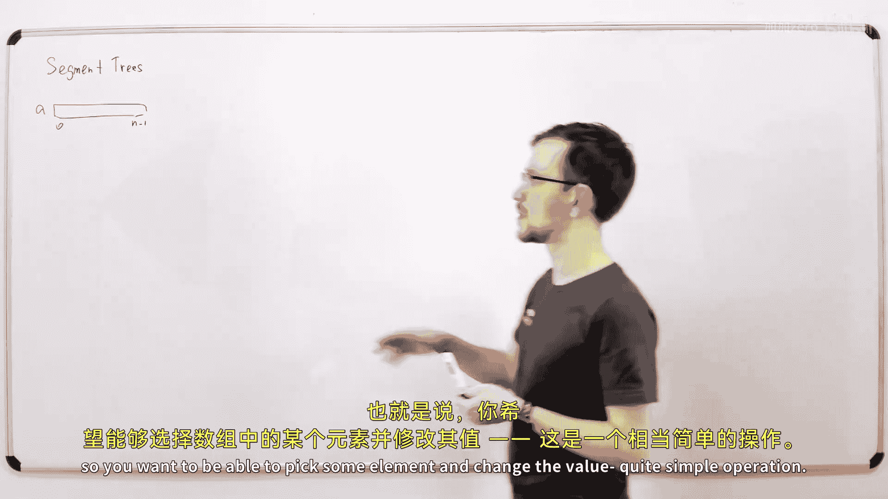


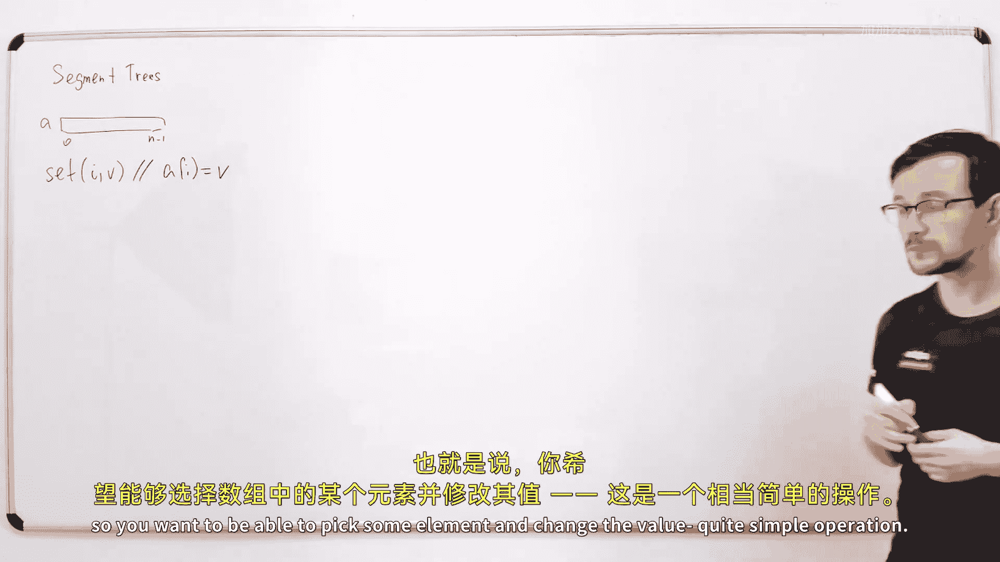


在本节课中，我们将学习一种名为“线段树”的强大数据结构。线段树主要用于处理数组上的区间查询和单点更新操作，并且能够在对数时间内完成这些操作。我们将从线段树的基本概念开始，逐步学习其构建、更新和查询方法，并探讨其可以支持的各种操作。


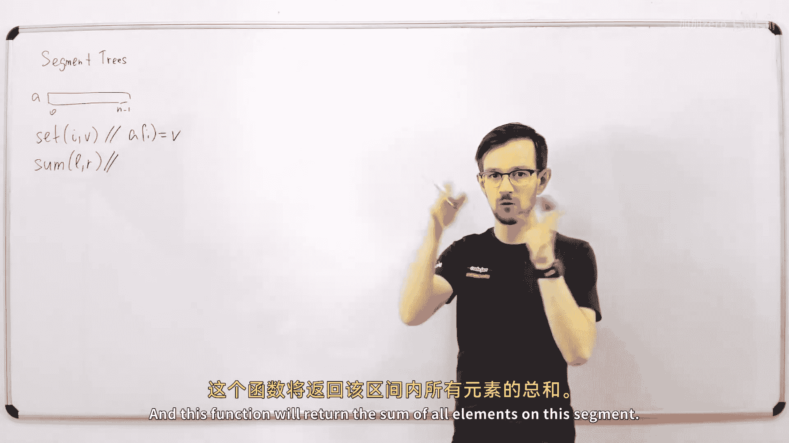


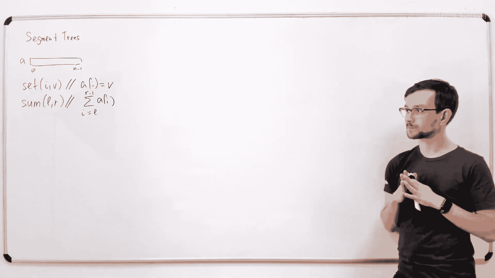


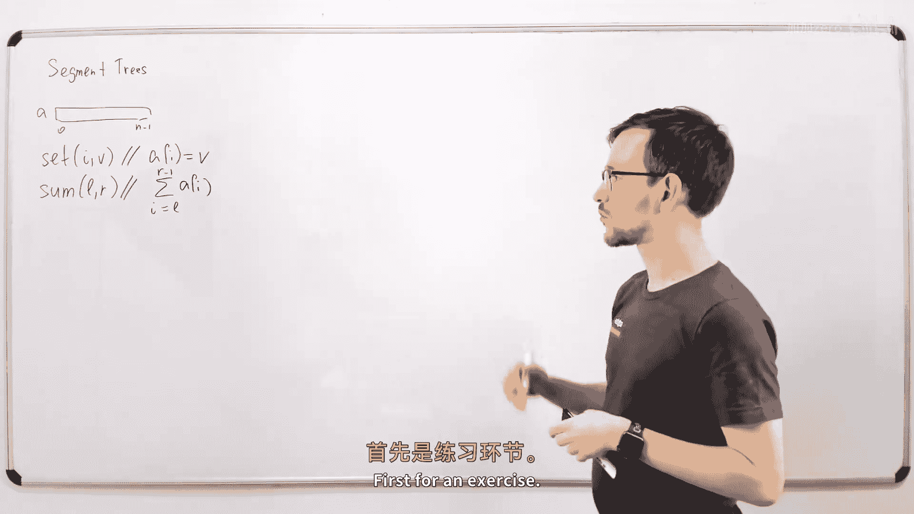


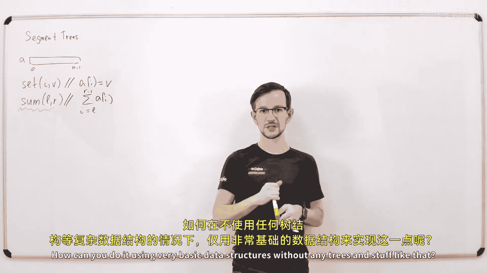


## 线段树是什么？


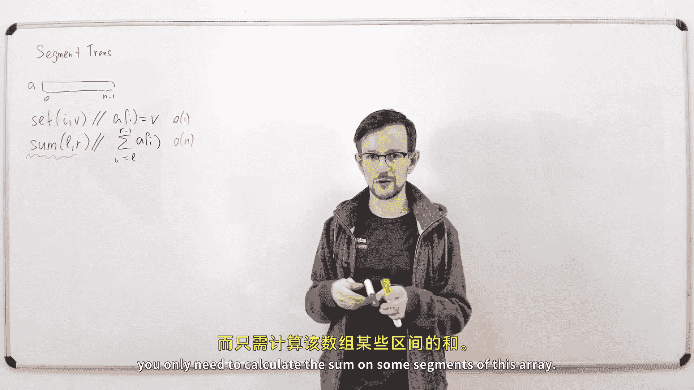


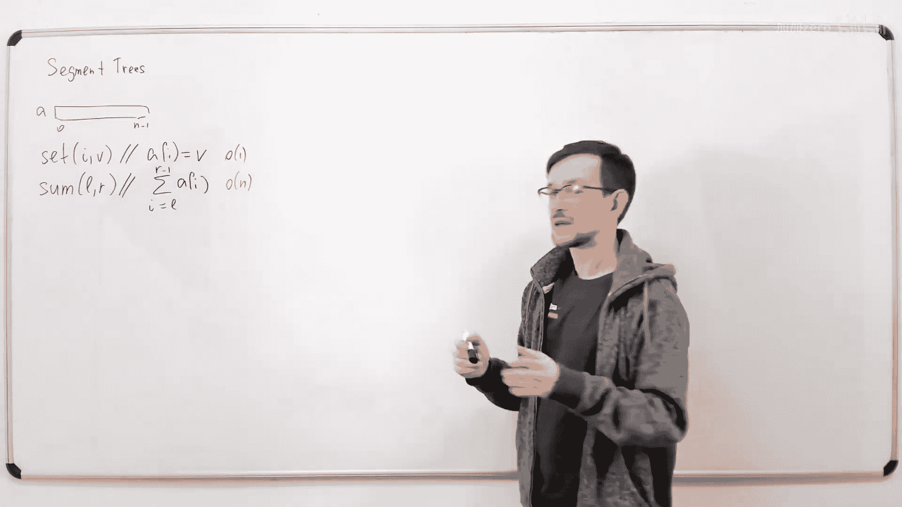

线段树是一种二叉树数据结构，用于高效处理数组的区间查询和单点更新问题。它之所以得名，是因为树中的每个节点都对应原始数组中的一个连续区间（或“线段”）。


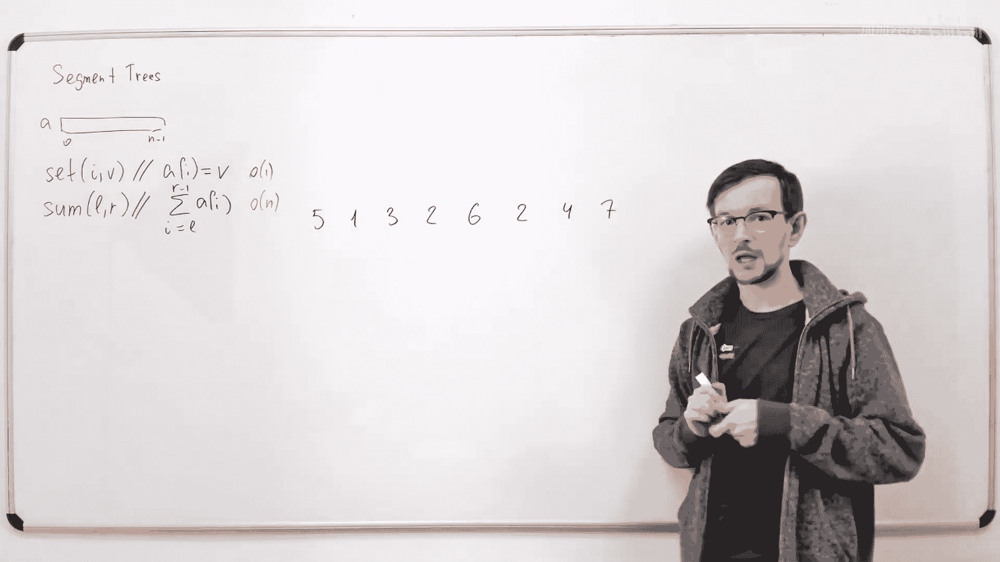


线段树可以解决以下核心问题：你有一个包含 `n` 个元素的数组 `a`，需要支持两种操作：
1.  **`set(i, v)`**：将位置 `i` 的元素值修改为 `v`。
2.  **`sum(l, r)`**：计算并返回数组中从索引 `l`（包含）到 `r`（不包含）这个区间内所有元素的和。

我们的目标是让这两种操作都比线性时间 `O(n)` 更快。线段树可以在 `O(log n)` 时间内完成这两种操作。

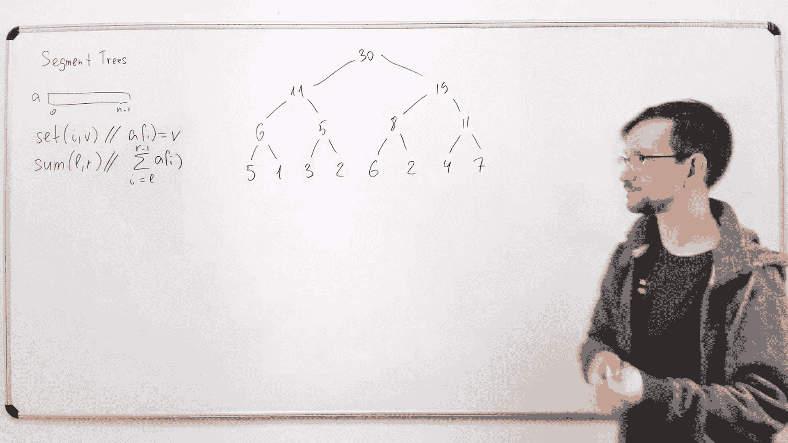

## 构建线段树

线段树是一棵完全二叉树。我们假设数组的长度 `n` 是 2 的幂次（如果不是，可以通过添加不影响结果的“中性元素”来扩展到最近的 2 的幂次，这不会改变算法的渐近复杂度）。

**构建过程如下：**
*   树的**叶子节点**对应原始数组的每个单个元素。
*   每个**内部节点**存储其两个子节点所代表区间的值的“和”（或我们定义的其他操作结果）。
*   根节点代表整个数组区间 `[0, n)`。

例如，对于数组 `a = [5, 1, 3, 2, 6, 12, 4, 5]`，其用于求和的线段树结构如下图所示（数值为对应区间的和）：
```
                  [0,8):38
                 /        \
          [0,4):11       [4,8):27
          /    \          /    \
    [0,2):6 [2,4):5 [4,6):18 [6,8):9
     / \     / \     / \     / \
   5   1   3   2   6  12   4   5
```
这样，我们就将整个数组的信息以分层的方式组织了起来。

## 实现更新操作 (`set`)

当我们想要更新数组中的一个元素（例如 `set(i, v)`）时，我们需要更新所有包含该元素的线段树节点。

**更新算法步骤如下：**
1.  从代表该单个元素的叶子节点开始。
2.  更新该叶子节点的值。
3.  沿着路径向上回溯到根节点。
4.  对于路径上的每个父节点，根据其更新后的子节点值重新计算其存储的值（例如，重新计算和）。

由于树的高度是 `O(log n)`，因此我们只需要更新 `O(log n)` 个节点，这使得更新操作非常高效。

**伪代码描述（递归版本）：**
```python
def set(node, node_l, node_r, i, v):
    # node: 当前节点索引
    # node_l, node_r: 当前节点代表的区间 [node_l, node_r)
    # i: 要更新的数组位置
    # v: 新值
    if node_l == i and node_r == node_l + 1: # 到达叶子节点
        tree[node] = v
        return
    mid = (node_l + node_r) // 2
    if i < mid: # 目标在左子树
        set(node*2 + 1, node_l, mid, i, v)
    else:       # 目标在右子树
        set(node*2 + 2, mid, node_r, i, v)
    # 更新当前节点的值（例如，求和）
    tree[node] = tree[node*2 + 1] + tree[node*2 + 2]
```

## 实现区间查询操作 (`sum`)

查询区间 `[l, r)` 的和时，我们不需要遍历区间内的每个元素。相反，我们可以利用线段树中预计算好的区间和来组合出答案。

**查询算法核心思想：**
我们从根节点开始进行递归遍历，并应用以下两个优化规则：
1.  **完全无关**：如果当前节点代表的区间 `[node_l, node_r)` 与查询区间 `[l, r)` 完全没有交集，则直接返回，不继续向下递归。
2.  **完全包含**：如果当前节点代表的区间完全包含在查询区间内（即 `l <= node_l` 且 `node_r <= r`），则直接将该节点存储的预计算值（区间和）加入最终结果，并返回，不再向下递归。
3.  **部分重叠**：如果上述两种情况都不满足，说明当前区间与查询区间部分重叠。此时，我们递归地查询其左子节点和右子节点，然后将两者的结果合并。

**为什么这样高效？**
*   “完全无关”和“完全包含”的节点会立即终止递归，避免了遍历整个树。
*   在每一层树中，只有最多 `O(log n)` 个节点会进入“部分重叠”的情况（这些节点是查询区间边界 `l` 或 `r` 所在的节点）。因此，总共访问的节点数约为 `O(log n)`。

**伪代码描述（递归版本）：**
```python
def sum(node, node_l, node_r, l, r):
    # 查询区间 [l, r) 在节点 node 所代表区间 [node_l, node_r) 内的和
    if node_l >= r or node_r <= l: # 情况1：完全无关
        return 0 # 对于求和操作，空区间的中性元素是0
    if l <= node_l and node_r <= r: # 情况2：完全包含
        return tree[node]
    # 情况3：部分重叠
    mid = (node_l + node_r) // 2
    left_sum = sum(node*2 + 1, node_l, mid, l, r)
    right_sum = sum(node*2 + 2, mid, node_r, l, r)
    return left_sum + right_sum
```

## 线段树支持的其他操作

线段树的强大之处在于，它不仅仅能用于求和。只要一个二元操作 **`op`** 满足**结合律**（即 `(a op b) op c = a op (b op c)`），我们就可以用线段树来维护它。

**常见的满足结合律的操作包括：**
*   **求和**：`a + b`
*   **乘积**：`a * b`
*   **最大值**：`max(a, b)` （中性元素为 `-∞`）
*   **最小值**：`min(a, b)` （中性元素为 `+∞`）
*   **最大公约数 (GCD)**：`gcd(a, b)`
*   **按位与/或/异或**：`a & b`, `a | b`, `a ^ b`

要将线段树从求和改为其他操作，只需修改代码中的三处：
1.  构建和更新时，合并子节点值的操作（如将 `+` 改为 `max`）。
2.  查询时，合并左右子树结果的操作。
3.  查询中“完全无关”情况下返回的**中性元素**（对于 `max` 是 `-∞`，对于 `min` 是 `+∞`，对于求和是 `0`）。

## 可持久化线段树简介

上一节我们介绍了标准线段树的基本操作，本节中我们来看看一个高级概念：**可持久化**。

可持久化数据结构能够保留其所有历史版本。当你对其进行修改时，它会创建一个新的版本，同时旧的版本仍然可以被访问和查询。

**如何实现可持久化线段树？**
核心思想是**路径复制**。当更新一个节点时，我们并不直接修改它，而是创建该节点的一个新副本，在新副本上修改值。然后，为了保持树的连接，我们需要创建其父节点的新副本，并让其指向新的子节点，如此递归向上直到根节点。这样，旧版本的根节点仍然指向旧的节点结构，而新版本的根节点指向新的节点结构。

**优点与代价：**
*   **优点**：可以访问任意历史版本的状态，这在某些问题中非常有用（例如，查询某个历史时刻的区间信息）。
*   **代价**：每次更新会创建 `O(log n)` 个新节点，增加了空间消耗。实现上需要使用指针或引用来连接节点，而不是简单的数组索引。

## 总结

本节课中我们一起学习了线段树这一重要的数据结构。
*   我们首先了解了线段树解决的核心问题：数组的**单点更新**和**区间查询**。
*   然后，我们学习了如何构建线段树，以及如何在对数时间内实现 `set` 和 `sum` 操作，关键在于利用树的层次结构和递归中的剪枝优化。
*   接着，我们认识到线段树的通用性，它能够支持任何满足**结合律**的二元操作，如最大值、最小值、GCD等。
*   最后，我们简要介绍了**可持久化线段树**的概念，它通过路径复制技术来保存数据结构的所有历史版本。

线段树是许多更复杂数据结构（如树状数组、树链剖分等）的基础，理解其原理对后续学习至关重要。