# 019：线段树与延迟传播


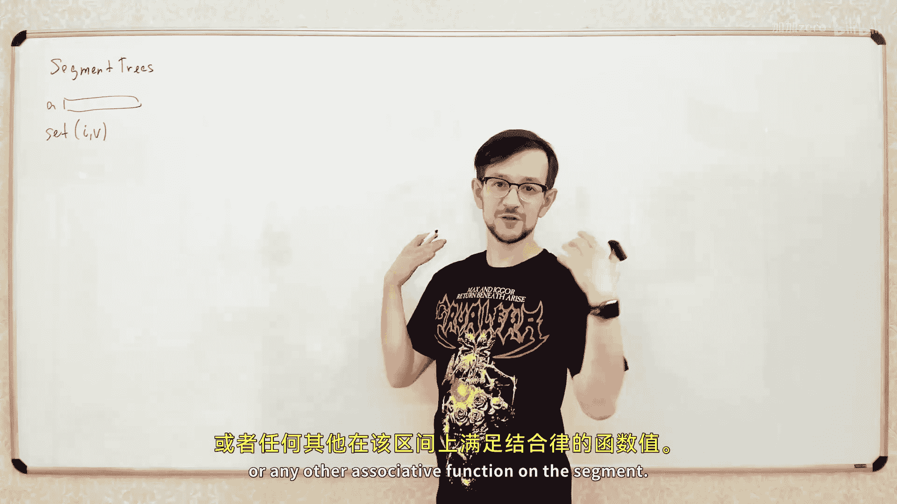


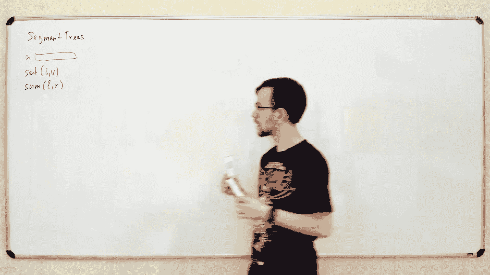

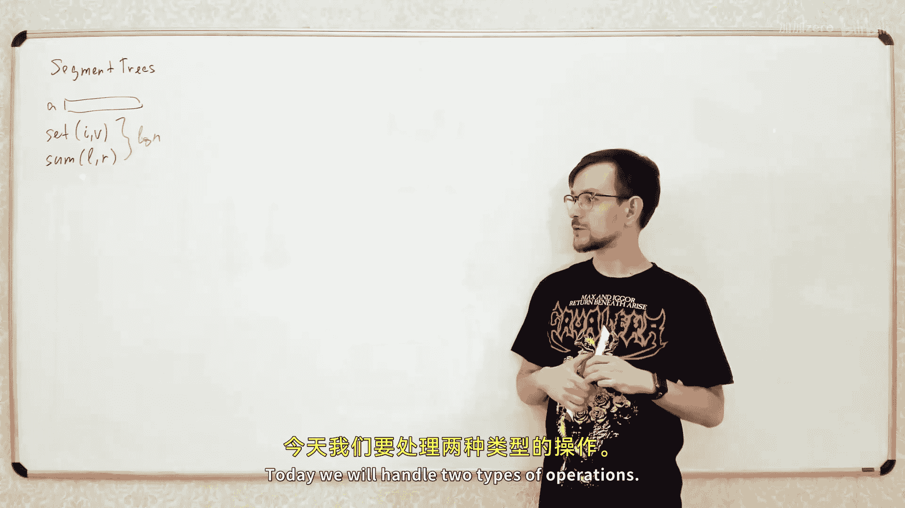


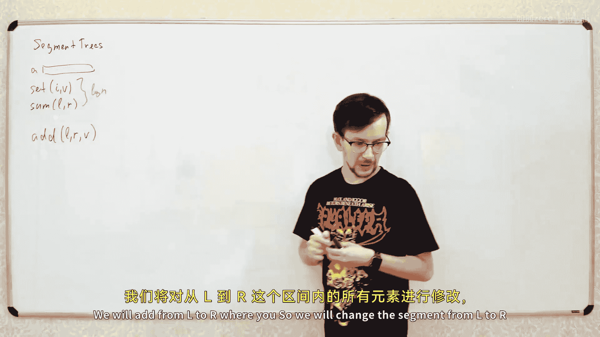


在本节课中，我们将继续学习线段树。如果你看过Codeforces上关于线段树的课程，那么本节课的第一部分内容会与第二课完全相同。我们将回顾线段树的基本概念，然后深入探讨一种更强大的技术——延迟传播，它允许我们高效地对整个区间进行修改操作。

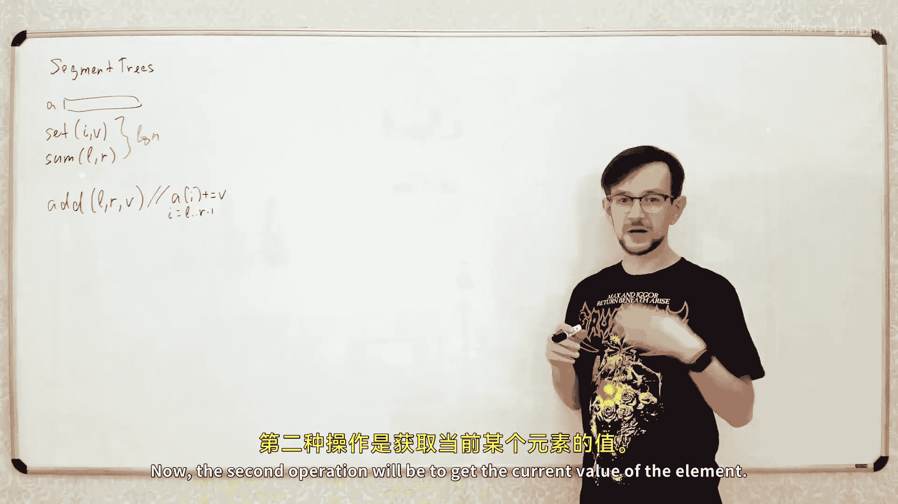


## 线段树回顾


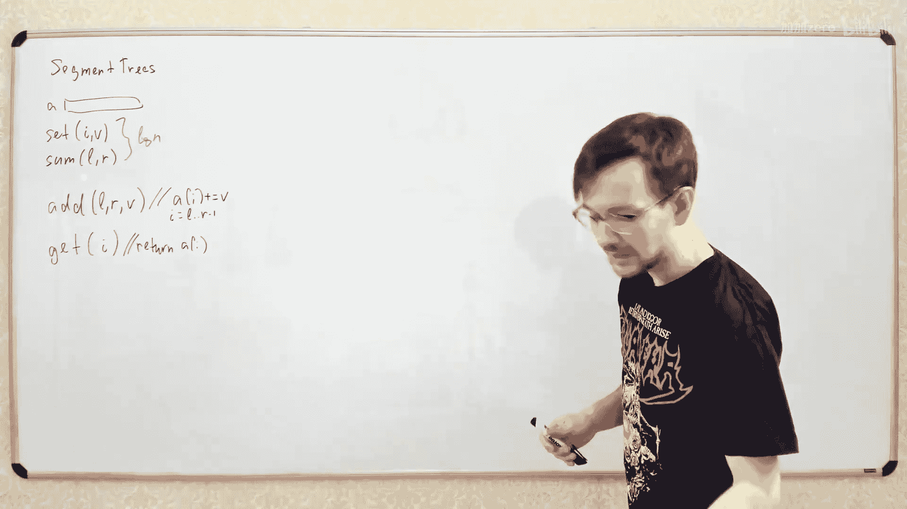

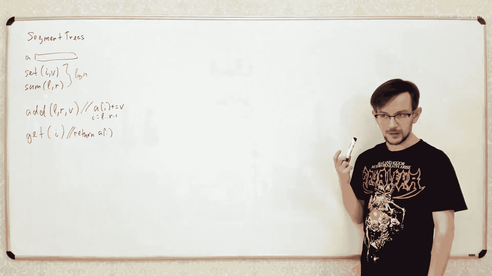


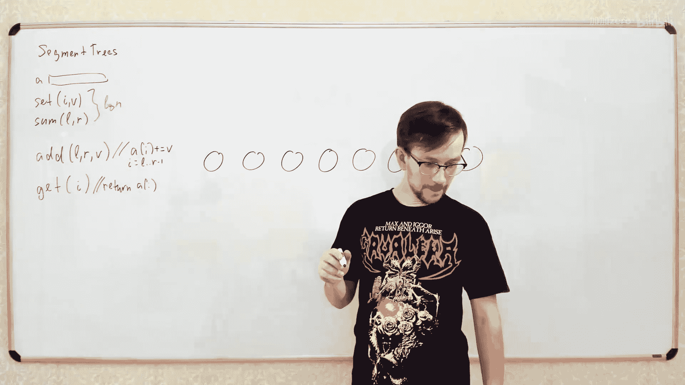

上一节我们讨论了以下问题：我们有一个数组，需要处理两种类型的查询。第一种查询是修改单个元素的值，例如 `set(i, v)`。第二种查询是计算某个区间上的聚合值，例如区间和、区间最小值，或任何其他满足结合律的函数。

我们讨论了如何构建线段树，使得这两种操作都能在对数时间内完成。

## 引入新的操作类型

今天，我们将再次使用线段树，但尝试处理不同类型的操作。我们将处理两种操作：
1.  修改操作：对整个区间 `[L, R]` 内的所有元素加上一个值 `v`。即，对于所有 `i` 属于 `[L, R]`，执行 `a[i] += v`。
2.  查询操作：获取某个位置 `i` 的当前元素值。

如果使用简单的数组，查询操作可以在常数时间内完成，但修改操作需要遍历区间内的所有元素，时间复杂度是线性的。我们希望让修改操作更快，同时也能在良好时间内获取元素值。我们的目标是让这两种操作都在对数时间内完成。

## 基础思路：存储“待加”值

我们将像上一讲那样构建线段树。例如，对于一个有8个元素的数组，我们构建一个满二叉树，叶子节点对应数组的每个元素。初始时，树中所有节点的值都为0。

每个节点对应数组的一个区间。我们将存储在节点中的数字解释为“需要加到该节点对应区间所有元素上的值”。

例如，如果我们在某个节点存储了数字5，就意味着我们需要将5加到该节点对应区间的所有元素上。

## 区间修改操作

现在，我们来看如何执行区间修改操作。假设我们想对某个区间 `[L, R]` 的所有元素加上值 `v`（例如5）。

操作步骤如下：
1.  我们将目标区间 `[L, R]` 分割成若干个部分，使得每个部分都完全包含于线段树的某个节点所代表的区间内。这与上一讲中计算区间和时的分割方法完全相同。
2.  对于每一个被完全包含的节点，我们直接将值 `v` 加到该节点存储的“待加”值上。

这样，我们就完成了对整个区间的修改，而无需实际遍历区间内的每一个元素。寻找这些节点的递归过程与上一讲完全一致，因此时间复杂度也是 `O(log n)`。

以下是递归函数的伪代码：
```python
def add(node, node_l, node_r, query_l, query_r, v):
    if node_r <= query_l or query_r <= node_l: # 区间无交集
        return
    if query_l <= node_l and node_r <= query_r: # 节点区间完全被包含
        tree[node] += v
        return
    mid = (node_l + node_r) // 2
    add(node*2, node_l, mid, query_l, query_r, v)
    add(node*2+1, mid, node_r, query_l, query_r, v)
```

## 单点查询操作

接下来，我们如何获取某个位置 `i` 的当前值呢？

思路很简单：一个元素的最终值，等于初始值加上所有影响到它的修改操作的值。在线段树中，所有会影响元素 `i` 的修改操作，都存储在该元素对应叶子节点到根节点的路径上的节点中。

因此，要查询元素 `i` 的值，我们只需从根节点出发，沿着通向叶子 `i` 的路径向下走，将路径上所有节点存储的“待加”值累加起来，再加上元素的初始值，就得到了当前值。这个操作同样只需要访问 `O(log n)` 个节点。

## 从具体操作到抽象操作

上一节我们介绍了“区间加值”和“单点查询”。但线段树的能力远不止于此。我们可以将思路抽象化，以支持更多种类的操作。

假设我们有一个抽象的操作 `modify(L, R, param)`，它会对区间 `[L, R]` 内的所有元素施加某种变换，参数是 `param`。同时，我们还有一个查询函数 `get(L, R)`，用于计算区间 `[L, R]` 上的某个聚合值（如和、最小值等）。

为了我们的算法能正常工作，这些操作需要满足一些性质。

首先，修改操作本身需要是**可结合的**。这意味着如果我们先施加操作 `X`，再施加操作 `Y`，其结果应该等同于施加一个组合后的操作 `Z`（`Z = combine(X, Y)`）。加法操作显然是可结合的，因为 `(a + 5) + 2 = a + (5 + 2)`。

其次，在计算最终元素值时，我们隐含地假设了操作的**可交换性**。在之前的例子中，我们查询元素值时，只是简单地将路径上的所有“加值”求和，这相当于假设了加法操作的顺序不影响结果（`5 + 2 = 2 + 5`）。然而，并非所有可结合的操作都是可交换的。

一个常见的、可结合但不可交换的操作是**赋值操作**（`set value`）。如果你先赋值 `x`，再赋值 `y`，最终结果是 `y`。但如果顺序反过来，先赋值 `y` 再赋值 `x`，结果就是 `x`。顺序至关重要。

那么，如何处理这种不可交换的操作呢？答案是：我们需要在线段树中维护操作的**顺序**。

## 延迟传播：维护操作顺序

延迟传播是一种强大的技术，它允许我们处理不可交换的操作，同时保持高效性。

核心思想是：我们保证对于树中的任何节点，所有需要应用到该节点对应区间的操作，都按照从底向上（从旧到新）的顺序存储。也就是说，在从叶子到根的路径上，越靠近叶子的操作越旧，越靠近根的操作越新。

当我们计算一个元素的值时，我们从叶子开始，自底向上地按顺序应用路径上的所有操作，这样就能得到正确的结果。

但是，当我们进行新的修改时，可能会破坏这个顺序。例如，一个旧操作 `X` 存储在一个父节点，而一个新的操作 `Y` 需要应用到它的某个子节点所代表的区间。如果我们简单地把 `Y` 加到子节点，那么在计算时，我们会先应用 `Y`（在子节点），再应用 `X`（在父节点），这顺序就反了。

延迟传播通过“将操作向下推”来解决这个问题。其原则是：**只有当我们需要访问一个节点的子节点时，才将该节点存储的操作应用到它的子节点上**。

具体过程如下：
1.  假设节点 `p` 存储了一个操作 `X`。
2.  当我们需要递归进入 `p` 的左孩子或右孩子时，我们首先进行“传播”：
    *   将操作 `X` 与左孩子当前存储的操作 `Y_left` 组合，得到新操作 `Z_left = combine(X, Y_left)`，并将其存储到左孩子。
    *   同样，将操作 `X` 与右孩子当前存储的操作 `Y_right` 组合，得到 `Z_right = combine(X, Y_right)`，存储到右孩子。
    *   清空节点 `p` 存储的操作（或标记为已传播）。
3.  这样，操作 `X` 就被“推”到了更深的层，并且与子节点原有的操作以正确的顺序（先旧后新）组合了起来。

通过这种方式，我们始终能保持操作在树中的正确顺序。每次传播只涉及常数时间的操作（组合两个操作）。

## 结合区间查询：区间加值与区间最小值

现在，让我们把延迟传播技术和上一讲的区间查询功能结合起来。我们希望数据结构支持两种操作：
1.  `add(L, R, v)`: 给区间 `[L, R]` 的所有元素加上 `v`。
2.  `query_min(L, R)`: 查询区间 `[L, R]` 的最小值。

我们在线段树的每个节点维护两个值：
*   `min_val[node]`: 该节点对应区间的最小值（**不考虑存储在该节点及其祖先节点上的“待加”操作**）。
*   `add_val[node]`: 需要加到该区间所有元素上的值（即延迟标记）。

**区间加值操作 `add`**:
1.  与之前类似，递归地找到完全包含于 `[L, R]` 的节点。
2.  对于这些节点，我们执行：
    *   `add_val[node] += v`
    *   `min_val[node] += v` （因为给区间内每个元素加 `v`，其最小值也增加 `v`）
3.  在递归返回时，像普通线段树一样，根据左右孩子的最小值更新 `min_val[node]`。

**区间最小值查询 `query_min`**:
1.  在递归过程中，每当进入一个节点，首先执行**延迟传播**，将该节点的 `add_val` 推到它的左右孩子，并更新左右孩子的 `min_val`。
2.  然后，像普通线段树查询一样，根据查询区间与当前节点区间的关系，递归查询左右子树，并返回结果。

**延迟传播函数 `propagate(node)`**:
```python
def propagate(node):
    if node 不是叶子节点:
        left_child = node * 2
        right_child = node * 2 + 1
        # 将当前节点的延迟标记推到左右孩子
        add_val[left_child] += add_val[node]
        min_val[left_child] += add_val[node]
        add_val[right_child] += add_val[node]
        min_val[right_child] += add_val[node]
        # 清空当前节点的延迟标记
        add_val[node] = 0
```
通过在每个递归操作的开始调用 `propagate`，我们确保了查询和修改过程中信息的正确性。

## 抽象操作所需性质总结

如果我们希望支持一个抽象的修改操作 `modify_op` 和一个抽象的查询操作 `query_op`（例如区间赋值和区间和），那么它们需要满足以下性质才能使延迟传播线段树正常工作：

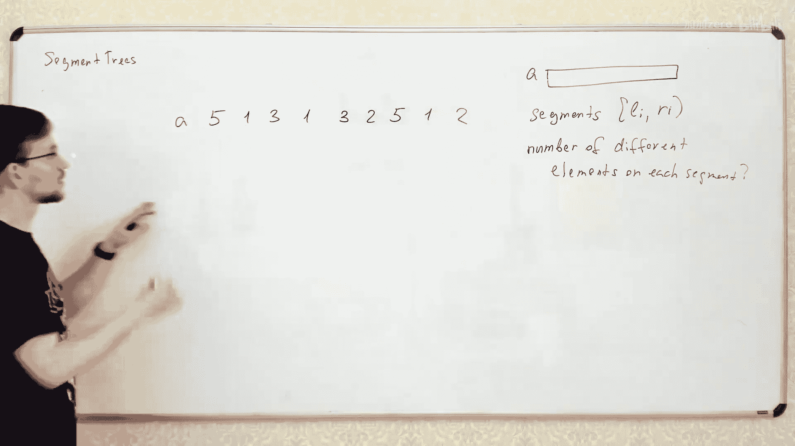

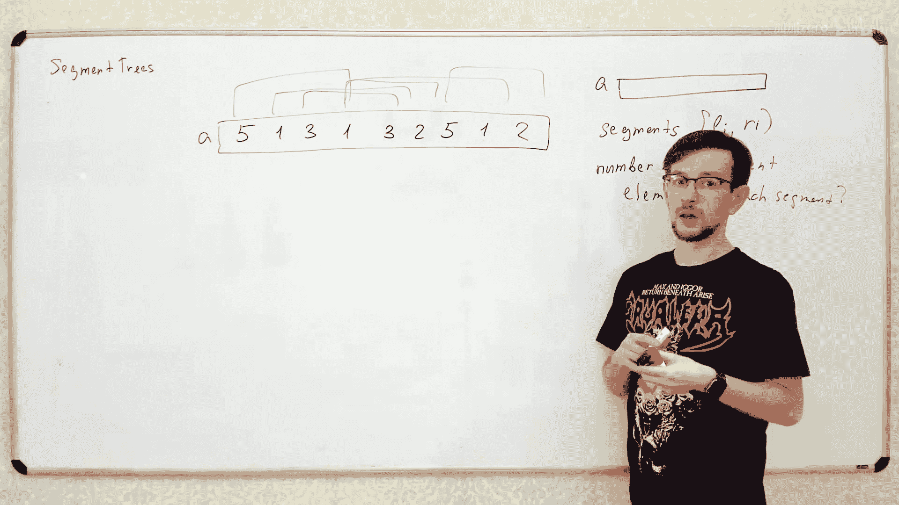

1.  **结合律**: `modify_op` 必须是可结合的。即 `combine(combine(a, X), Y) = combine(a, combine(X, Y))`，这允许我们将多个操作合并。
2.  **分配律**: `modify_op` 必须能分配到 `query_op` 上。这是最关键的性质。它意味着：先对区间内每个元素应用修改操作 `X`，再进行区间查询 `query_op`，得到的结果，应该等于先进行区间查询 `query_op`，再对查询结果应用同一个修改操作 `X`（以某种方式定义在聚合值上）。
    *   例如，对于“区间加值”和“区间求和”：`sum(a[i] + v) = sum(a[i]) + length * v`。这里，对每个元素加 `v` 再求和，等于先求和再加 `(区间长度 * v)`。`v` 被“分配”到了求和操作上。
    *   对于“区间赋值”和“区间求和”：这个性质不成立，因为赋值操作会覆盖原有值，不能简单地分配到求和上。对于“区间赋值”和“区间最大值/最小值”，性质是成立的。

如果一对操作不满足分配律，通常不能直接用标准的延迟传播线段树处理，可能需要更复杂的技巧或不同的数据结构。

## 应用示例：离线查询区间不同元素个数

让我们看一个利用线段树（结合持久化技术）解决的有趣问题：**离线处理多个查询，每个查询问一个区间内有多少个不同的数字**。

**离线算法思路（莫队算法思想变种）**:
1.  我们维护一个数组 `B`，初始全为0。
2.  考虑所有**左端点相同**的查询。对于左端点 `L`，我们将 `B` 中每个数字**在区间 `[L, n)` 内第一次出现的位置**标记为1，其余为0。
    *   例如，对于数组 `[5, 1, 3, 5, 1, 4, 3, 4]`，当 `L=0` 时，数字5第一次出现在下标0，数字1在1，数字3在2，数字4在5。所以 `B = [1, 1, 1, 0, 0, 1, 0, 0]`。
3.  对于任何一个左端点为 `L`，右端点为 `R` 的查询，答案就是 `B[L]` 到 `B[R]` 的和！因为 `B` 中1的个数正好对应了从 `L` 开始，每个数字第一次出现的位置。
4.  现在，我们将左端点 `L` 向右移动一位到 `L+1`。我们需要更新数组 `B`：
    *   将 `B[L]` 设为0（因为左端点移动，原 `L` 位置不再考虑）。
    *   找到原 `a[L]` 这个数字在 `L` 之后**下一次**出现的位置 `next[L]`，将 `B[next[L]]` 设为1（因为它现在成了该数字在新区间内的第一次出现）。

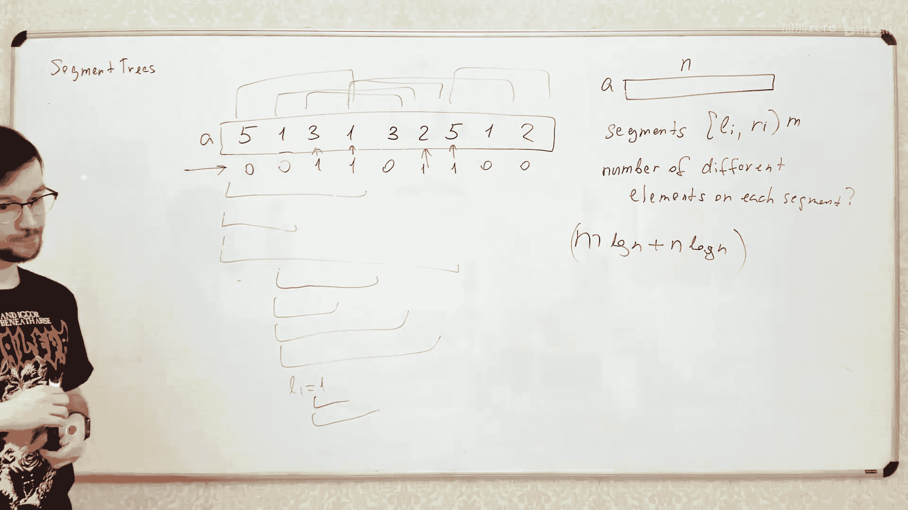

**算法流程**:
1.  预处理每个位置 `i` 的下一个相同值的位置 `next[i]`（可用哈希表从右向左扫描完成）。
2.  将所有查询按左端点 `L` 分组。
3.  初始化一个支持**单点赋值**和**区间求和**的线段树（线段树维护数组 `B`）。
4.  从左到右遍历每个左端点 `L`：
    a. 回答所有左端点为 `L` 的查询（在线段树上查询区间和）。
    b. 将线段树在位置 `L` 的值设为0。
    c. 将线段树在位置 `next[L]` 的值设为1（如果 `next[L]` 存在）。
5.  时间复杂度：预处理 `O(n)`，每个查询 `O(log n)`，每次左端点移动进行两次线段树更新 `O(log n)`，总复杂度 `O((n + m) log n)`，其中 `m` 是查询数。

## 在线查询与持久化线段树

上述算法是离线的，因为它需要预先知道所有查询并按左端点排序。如果问题要求**在线查询**（即每次给出 `L, R` 要立即回答），我们可以借助**持久化线段树**。

**思路**:
1.  在上述离线算法中，我们实际上为每个可能的左端点 `L` 构建了一个对应的线段树状态（即当时的数组 `B` 的状态）。
2.  如果我们能把这些所有 `L` 对应的线段树状态都保存下来，那么对于任何一个在线查询 `(L, R)`，我们只需要：
    a. 取出左端点 `L` 对应的那个版本的线段树。
    b. 在这个版本的线段树上查询区间 `[L, R]` 的和，即为答案。
3.  问题在于，直接保存 `n` 棵完整的线段树需要 `O(n^2)` 空间，不可行。

**解决方案**:
使用**持久化线段树**。在从左向右移动 `L` 的过程中，从 `L` 的状态到 `L+1` 的状态，我们只对线段树进行了两次单点修改操作。持久化线段树在每次修改时，只创建新路径上的 `O(log n)` 个新节点，并与旧节点共享未修改的部分。

因此，我们可以顺序构建出 `n+1` 个版本（从 `L=0` 到 `L=n`）的持久化线段树，总空间复杂度仅为 `O(n log n)`。对于每个在线查询，我们只需在对应版本的树上进行区间求和查询，时间复杂度 `O(log n)`。

这展示了持久化数据结构的一个经典应用场景：需要高效访问某个数据结构在历史时刻的状态。

## 总结

本节课我们一起深入学习了线段树及其高级技巧。
*   我们首先回顾了线段树处理单点修改和区间查询的基础。
*   然后，我们学习了如何用线段树处理**区间修改**和**单点查询**，核心是在节点上存储“待加”的延迟标记。
*   接着，我们引入了**延迟传播**这一关键技术，它通过惰性地将标记向下推送，解决了操作顺序和不可交换操作的问题。
*   我们将延迟传播与区间查询功能结合，实现了能同时高效处理**区间修改**和**区间查询**的强大数据结构，并以“区间加值/区间最小值”为例说明了实现方法。
*   我们讨论了抽象操作需要满足的**结合律**和**分配律**，这是设计自定义延迟传播操作的关键。
*   最后，我们通过“区间不同元素个数”问题，展示了线段树在离线算法中的应用，并引申出使用**持久化线段树**来应对在线查询的场景。

线段树是算法竞赛和软件开发中极其重要的数据结构，理解和掌握其基础与变种，对于解决复杂的区间维护问题至关重要。