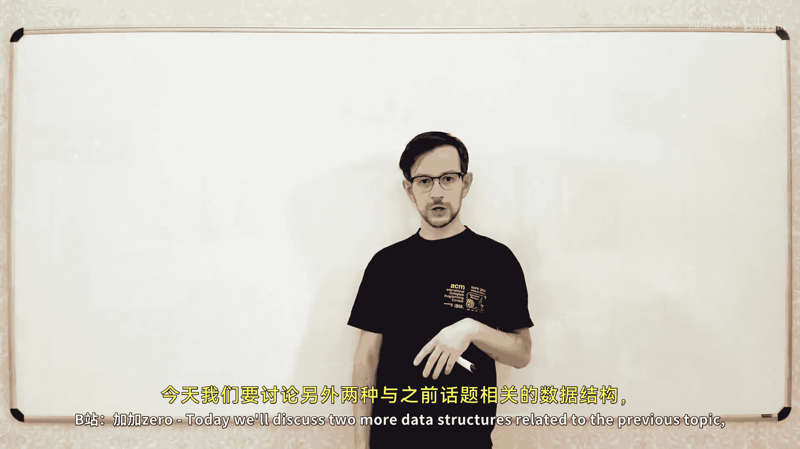
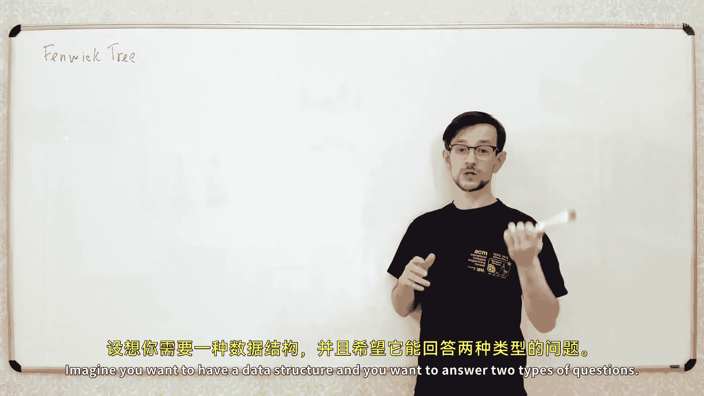
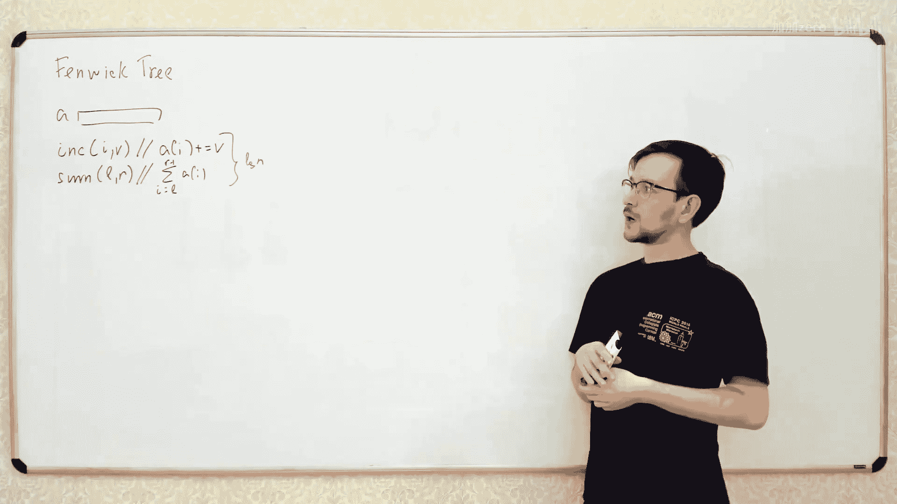
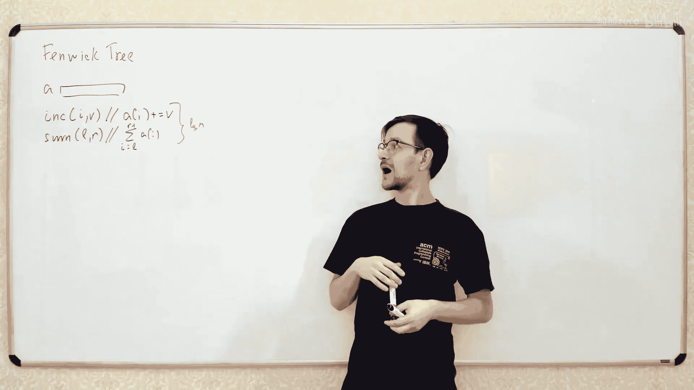
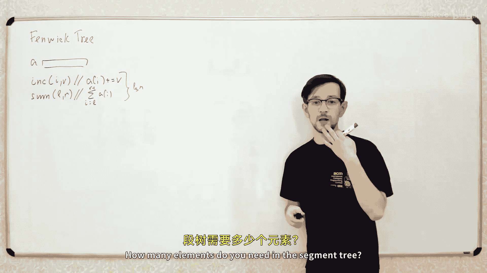
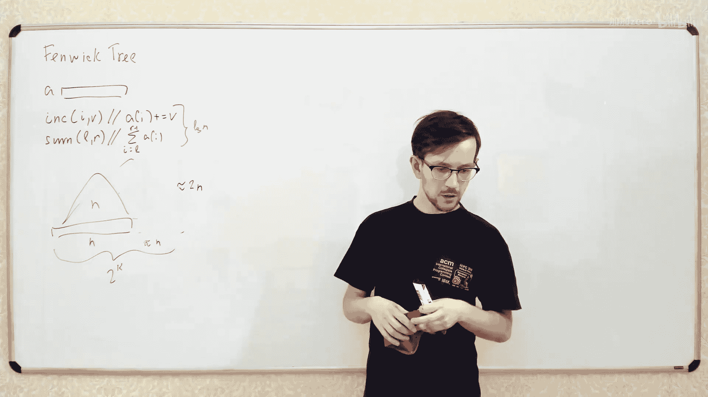
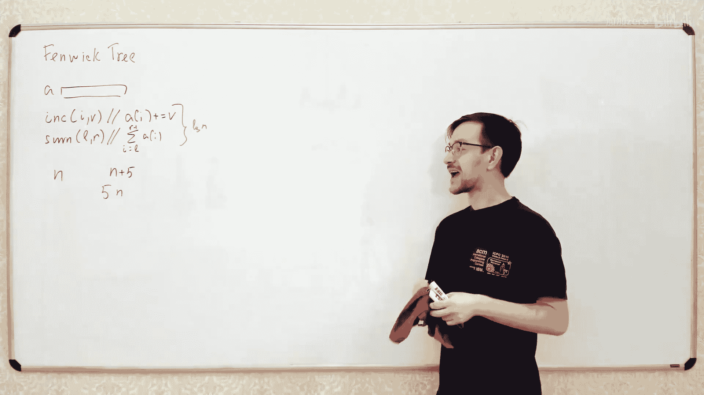
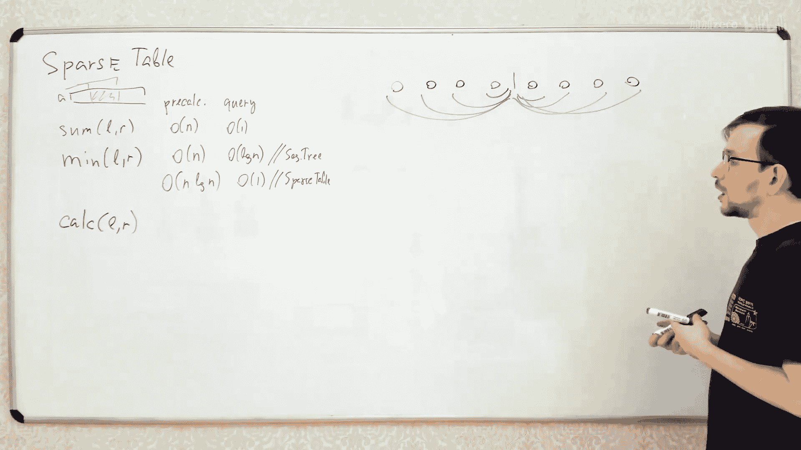

# 020：Fenwick Tree 与 Sparse Table

在本节课中，我们将学习两种与线段树相关但略有不同的数据结构：Fenwick Tree（树状数组）和 Sparse Table（稀疏表）。这两种结构都能高效地处理数组上的区间查询问题，但各有其适用场景和优势。

## Fenwick Tree（树状数组） 🧮

上一节我们介绍了线段树，本节中我们来看看Fenwick Tree。Fenwick Tree 是一种用于高效计算数组前缀和的数据结构，它支持两种操作：单点更新和前缀和查询，进而可以计算任意区间和。

### 核心问题与优势

Fenwick Tree 旨在解决以下问题：对于一个初始数组，我们需要支持两种操作：
1.  **单点更新**：将数组中第 `i` 个元素的值增加 `v`。
2.  **区间查询**：查询数组中从索引 `L` 到 `R`（`L <= R`）的所有元素之和。

其时间复杂度与线段树相同，均为 `O(log n)`。但Fenwick Tree具有两个显著优势：
*   **更小的常数因子**：其操作更简单，在实际运行中通常比线段树更快。
*   **更低的内存消耗**：它只需要一个与原数组大小相同的额外数组，而线段树在最坏情况下需要约 `4n` 的空间。

### 核心思想

Fenwick Tree 的核心是维护一个大小为 `n` 的数组 `F`。数组 `F` 中的每个元素 `F[i]` 并不直接存储原数组 `A[i]` 的值，而是存储原数组 `A` 中**某个特定区间**的和。

这个“特定区间”由一个巧妙的函数 `P(i)` 定义。`F[i]` 存储的是原数组 `A` 中从索引 `P(i)` 到 `i`（包含两端）这个区间的和。

关键在于，我们通过精心设计 `P(i)` 函数，使得无论是进行前缀和查询还是单点更新，都只需要访问大约 `log n` 个 `F` 数组中的元素。

### 神奇的 P(i) 函数

`P(i)` 函数的定义基于数字 `i` 的二进制表示。具体规则如下：
1.  找到数字 `i` 的二进制表示中**最右侧的 0**。
2.  将这个 0 及其右侧所有的 1 都变为 0。
3.  得到的数字就是 `P(i)`。

例如，若 `i = 13`，其二进制为 `1101`。
*   最右侧的 0 是第二位（从右向左，0-based索引）。
*   将该位及其右侧（即最低位）的 1 变为 0，得到 `1100`，即十进制的 `12`。
*   因此，`P(13) = 12`。`F[13]` 存储的就是 `A[12] + A[13]` 的和。

这个计算可以通过位运算高效完成：
`P(i) = i & (i + 1)`

### 操作实现

以下是两种核心操作的实现逻辑。

#### 前缀和查询

要计算原数组前 `x` 个元素的和（即前缀和 `sum(0, x-1)`），我们遵循以下步骤：
1.  初始化结果 `result = 0`。
2.  令当前索引 `idx = x`。
3.  只要 `idx >= 0`，就执行循环：
    *   将 `F[idx]` 的值加到 `result`。
    *   将 `idx` 更新为 `P(idx) - 1`，即 `idx = (idx & (idx + 1)) - 1`。
4.  循环结束，`result` 即为所求前缀和。

这个过程可以理解为不断“跳跃”到前一个未覆盖的区间块，并将这些块的和累加起来。

#### 单点更新

当我们要将原数组第 `i` 个元素的值增加 `v` 时，需要更新所有包含了 `A[i]` 的区间块。这些区间块对应的 `F` 数组索引可以通过以下方式找到：
1.  令当前索引 `j = i`。
2.  只要 `j < n`，就执行循环：
    *   将 `v` 加到 `F[j]` 上。
    *   将 `j` 更新为 `j | (j + 1)`。
3.  循环结束，所有相关的区间和都已更新。

`j | (j + 1)` 这个操作的效果是，将 `j` 的二进制表示中最右侧的 0 变为 1，并将其右侧所有位变为 0。这正是寻找下一个包含 `i` 的更大区间块的方法。

### 时间复杂度分析

无论是查询还是更新，`while` 循环的迭代次数都等于数字 `i` 的二进制表示中 `1` 的个数。在最坏情况下，这个数量是 `O(log n)`。因此，两种操作的时间复杂度都是 `O(log n)`。

### 局限性

Fenwick Tree 功能相对专一，通常适用于**可逆的**结合性操作（如加法、乘法、异或）。对于更复杂的操作（如区间赋值、求最值且需要懒更新），线段树是更灵活的选择。

---

## Sparse Table（稀疏表） 📊

上一节我们介绍了支持动态更新的Fenwick Tree，本节中我们来看看处理静态区间查询的利器——Sparse Table。Sparse Table 主要用于解决**静态数组**上的区间查询问题，即数组元素在预处理后不再改变。

### 核心问题与对比

Sparse Table 解决的核心问题是：给定一个固定数组，需要高效回答大量的区间查询（例如求区间最小值、最大值、区间和等）。

与线段树对比：
*   **线段树**：构建时间 `O(n)`，查询时间 `O(log n)`。
*   **Sparse Table**：构建时间 `O(n log n)`，查询时间 `O(1)`。

因此，选择哪种结构取决于查询次数 `m`：
*   如果查询次数 `m` 很大，Sparse Table 的 `O(1)` 查询优势明显。
*   如果查询次数 `m` 较小，线段树的 `O(n + m log n)` 总时间可能更优。

### 核心思想：预计算幂长度区间

Sparse Table 的核心思想是**预计算**。它预先计算并存储原数组中所有长度为 `2` 的幂次（`1, 2, 4, 8...`）的区间的查询结果。

我们用一个二维数组 `st` 来存储这些结果：
*   `st[i][j]` 表示原数组中，从索引 `i` 开始，长度为 `2^j` 的区间的查询结果（例如最小值）。

### 构建 Sparse Table

构建过程采用动态规划的思想，通过较小区间的结果组合出较大区间的结果。

以下是构建步骤：
1.  初始化：对于每个 `i`，`st[i][0] = A[i]`（长度为 `2^0 = 1` 的区间就是元素本身）。
2.  递推计算：对于 `j` 从 `1` 到 `log2(n)`，对于 `i` 从 `0` 到 `n - 2^j`（确保区间不越界）：
    *   `st[i][j] = combine(st[i][j-1], st[i + 2^(j-1)][j-1])`
    *   这里 `combine` 是查询操作（如 `min`, `max`, `sum`）。它将区间 `[i, i+2^j)` 分成了两个长度为 `2^(j-1)` 的子区间 `[i, i+2^(j-1))` 和 `[i+2^(j-1), i+2^j)`，然后合并它们的结果。

构建过程的总时间复杂度为 `O(n log n)`，因为共有 `n log n` 个状态，每个状态的计算是 `O(1)`。

### 区间查询

对于一个查询区间 `[L, R]`，其长度为 `len = R - L + 1`。Sparse Table 的巧妙之处在于，我们可以用两个预计算的、长度为 `2^k` 的区间来覆盖它，其中 `k = floor(log2(len))`，即不大于 `len` 的最大2的幂次。

这两个区间是：
1.  从 `L` 开始，长度为 `2^k` 的区间：`[L, L + 2^k)`
2.  从 `R - 2^k + 1` 开始，长度为 `2^k` 的区间：`[R - 2^k + 1, R + 1)`

可以证明，这两个区间一定覆盖了整个 `[L, R]` 区间，并且可能有重叠。对于**幂等性**操作（如 `min`, `max`, `gcd`），重叠不影响结果。因此，查询结果就是：
`result = combine(st[L][k], st[R - 2^k + 1][k])`

由于 `k` 可以通过预处理或位运算在 `O(1)` 时间内得到，因此整个查询操作是 `O(1)` 的。

### 适用性与扩展

Sparse Table 完美适用于**幂等**且**可结合**的运算，例如：
*   最小值 (`min`)
*   最大值 (`max`)
*   最大公约数 (`gcd`)
*   按位与 (`&`)、按位或 (`|`)

对于**非幂等**但可结合的操作（如区间和），标准的 Sparse Table 无法直接应用，因为重叠区间的值会被重复计算。但可以通过一些扩展技巧（例如结合前缀和，或使用更复杂的分层结构）来实现 `O(1)` 查询，这通常被称为 **“±1 RMQ”** 或通过 **“分块+预处理”** 的思想来实现 `O(n)` 预处理、`O(1)` 查询的静态区间和，但这已超出基础 Sparse Table 的范畴。

---

## 总结 🎯

本节课中我们一起学习了两种高效的数据结构：
1.  **Fenwick Tree (树状数组)**：一种内存效率极高、代码简洁的数据结构，专为处理**单点更新**和**前缀和查询**（可推导出区间和）而设计，两种操作均为 `O(log n)` 时间复杂度。它比线段树更轻量，但功能相对单一。
2.  **Sparse Table (稀疏表)**：一种用于**静态数组**区间查询的强大工具，支持 `O(n log n)` 预处理和 `O(1)` 查询。它特别适合回答大量区间最值类查询，但对于需要更新的场景则不适用。

理解这两种结构的设计思想、优势及局限性，能帮助你在解决实际问题时，根据数据是否静态、操作类型、查询数量等因素，选择最合适的工具。