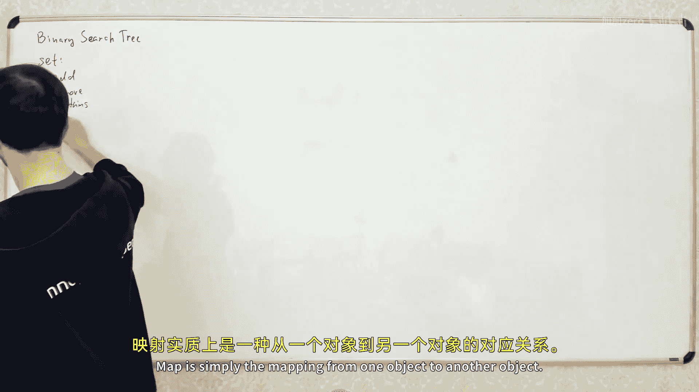
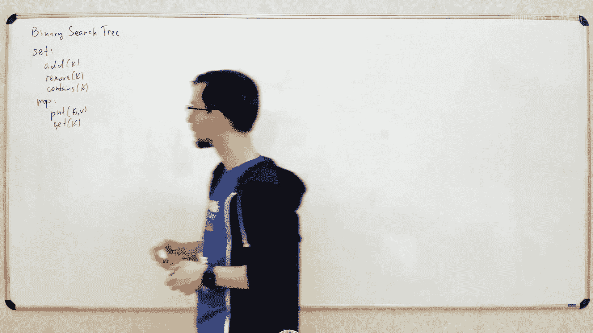
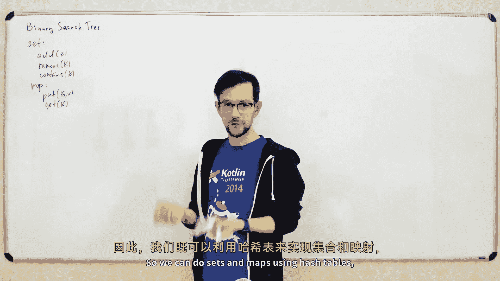
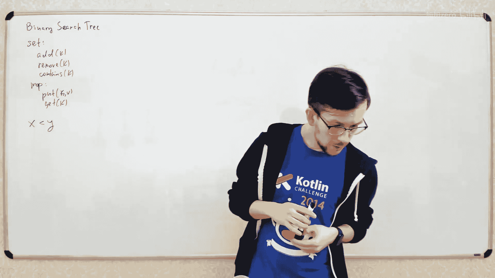
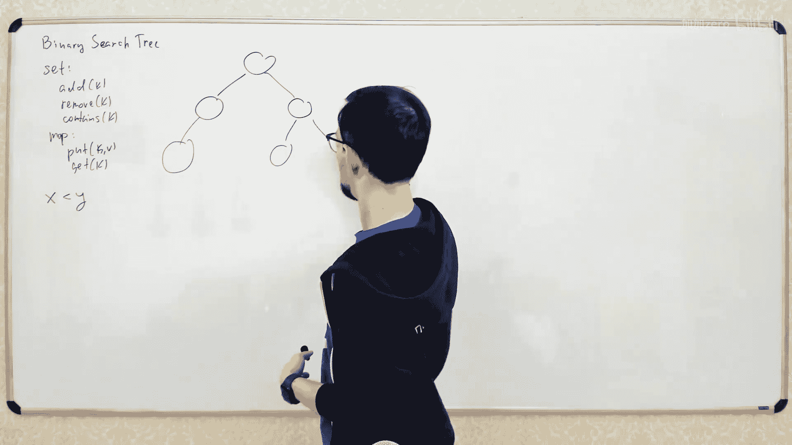

# 022：二叉搜索树与AVL树

在本节课中，我们将要学习一种非常重要的数据结构——二叉搜索树。我们将了解它的基本概念、核心操作，以及如何通过AVL树这种平衡策略来保证其操作效率。课程内容从基础定义开始，逐步深入到插入、删除、查找等操作的实现，最后介绍保持树平衡的AVL树旋转机制。

## 什么是二叉搜索树？🌳

二叉搜索树是计算机科学中一个非常重要的数据结构，它是许多其他数据结构和算法的基础。

二叉搜索树最常见的应用是实现映射和集合这两种数据结构。集合包含一组元素，你可以向其中添加元素、移除元素，以及检查某个元素是否存在于集合中。映射则是从一个对象到另一个对象的映射关系，例如在Java中，它类似于键值对。

我们已经学习过可以使用哈希表来实现集合和映射。那么，为什么还要使用二叉搜索树呢？在某些方面，二叉搜索树比哈希表更强大。如果只需要基本的添加、删除和查找操作，哈希表通常更快且更简单。但是，如果你需要一些我们稍后会讨论的额外操作，就可能需要使用二叉搜索树。

## 二叉搜索树的定义与性质 📝

要实现二叉搜索树，你需要能够比较两个不同的键。存储在树中的所有键必须是可相互比较的。你需要一种方法来检查一个键是否小于另一个键。对于数字，直接比较即可；对于对象，则需要特定的比较方式，例如字符串可以按字典序比较。本质上，你需要一个接收两个参数并判断第一个参数是否小于第二个参数的函数。

二叉搜索树是一种二叉树。二叉树意味着树中的每个节点最多有两个子节点：一个左孩子和一个右孩子。有些节点可能只有左孩子或只有右孩子，也可能没有孩子。

二叉搜索树有一个简单的性质：对于树中的任意节点X，其左子树中的所有元素都小于X，而其右子树中的所有元素都都大于X。这个性质有助于我们高效地查找元素。

## 基本操作：查找 🔍

查找是二叉搜索树的基本操作。我们来看看如何检查一个给定元素是否存在于树中。

假设我们要在树中查找键 `13`。我们从树的根节点开始。根节点的键是 `10`，而我们要找的 `13` 大于 `10`，因此目标元素（如果存在）必然在右子树中。于是我们进入右子树。在右子树的节点上，我们看到键 `25`。因为 `13` 小于 `25`，所以目标元素必然在当前节点的左子树中。我们进入左子树，在这里找到了键为 `13` 的节点，查找成功。

这是一个递归过程：从根节点开始，每次比较当前节点的键与目标键。如果目标键小于当前节点的键，则进入左子树；如果大于，则进入右子树；如果相等，则找到目标。如果最终到达了一个空子树（没有孩子），则说明目标元素不存在于树中。

查找操作的时间复杂度取决于树的高度。树的高度是从根节点到最远叶子节点的最长路径上的节点数。在最坏情况下，如果树退化成一条链（每个节点只有一个孩子），高度就是 `O(n)`，查找操作变为线性时间。在最好情况下，如果树是完全平衡的，高度就是 `O(log n)`，查找操作是对数时间。

## 基本操作：插入 ➕

接下来我们看看如何向二叉搜索树中添加新元素。

假设我们要添加元素 `18`。我们首先需要为这个新元素找到合适的位置。查找位置的过程与查找操作类似：从根节点开始，比较键值。`18` 大于根节点的 `10`，所以进入右子树。在右子树的节点 `25` 上，`18` 小于 `25`，所以进入其左子树。在这个左子树的节点 `13` 上，`18` 大于 `13`，应该进入其右子树。但此时节点 `13` 的右孩子为空，这正是新元素 `18` 应该插入的位置。于是，我们在此处创建一个新的右孩子节点，并将 `18` 放入其中。

插入操作也是一个递归过程，其时间复杂度同样取决于树的高度。

## 基本操作：删除 ➖

从二叉搜索树中删除元素稍微复杂一些。

假设我们要删除节点 `X`。问题在于，如果 `X` 有两个孩子，删除后需要处理这两个子树。最简单的处理方式如下：
1.  找到节点 `X` 的后继节点 `Y`，即右子树中最小的元素。要找到最小元素，只需从右子树的根开始，一直向左走，直到没有左孩子为止。
2.  将节点 `Y` 的键值与节点 `X` 交换。
3.  现在，原来的节点 `Y` 位置（现在是原来的键值）需要被删除。由于 `Y` 是右子树中的最小节点，它最多只有一个右孩子（不可能有左孩子，否则那就不是最小节点了）。因此，我们可以简单地用 `Y` 的右子树（如果存在）替换 `Y` 原来的位置。

删除操作的时间复杂度也取决于树的高度。

## 平衡的重要性 ⚖️

如前所述，所有基本操作的时间复杂度都依赖于树的高度。如果树退化成链状，高度为 `O(n)`，操作就是线性时间，这和使用简单数组进行线性搜索的效率一样，并不理想。我们期望树的高度是 `O(log n)`，这样所有操作都能在对数时间内完成。

完全平衡的二叉树高度为 `O(log n)`，但我们无法在频繁的插入和删除操作中始终保持树的完全平衡。因此，我们的目标是让树“近似平衡”，使得高度始终保持在 `O(log n)` 的范围内。这就需要引入“平衡二叉搜索树”的概念。

## AVL树：一种平衡策略 🔄

AVL树是实现平衡二叉搜索树的一种简单方法。其平衡基于“旋转”操作。

旋转是一种能改变树的结构，但同时保持二叉搜索树性质（元素顺序不变）的简单操作。考虑两个节点 `X` 和 `Y`（`Y` 是 `X` 的右孩子），以及它们的子树 `A`、`B`、`C`。右旋操作将 `Y` 变为新的根节点，`X` 变为 `Y` 的左孩子，同时调整子树 `B` 的位置，使其成为 `X` 的右孩子。可以验证，旋转前后树中元素的中序遍历顺序保持不变。

AVL树通过维护一个“平衡因子”来保持平衡。对于树中的每个节点，我们定义其左子树的高度和右子树的高度。AVL树要求对于每个节点，其左右子树的高度差（平衡因子）绝对值不超过1。这个性质保证了树的高度是 `O(log n)`。

## AVL树的平衡维护 🛠️

当我们插入或删除一个节点后，可能会破坏AVL树的平衡条件（某个节点的平衡因子变为2或-2）。由于每次只修改一个节点，高度差的变化最多为1，所以不平衡时，高度差恰好为2。

当我们发现某个节点 `X` 不平衡时（假设右子树比左子树高2），我们需要通过旋转来修复。修复分为四种情况，取决于 `X` 的右孩子 `Y` 的平衡情况。以下是两种主要情况的旋转策略：

1.  **右右情况**：`X` 的右子树比左子树高2，并且 `X` 的右孩子 `Y` 的右子树比左子树高（或等高）。这种情况下，对 `X` 进行一次左旋即可恢复平衡。
2.  **右左情况**：`X` 的右子树比左子树高2，但是 `X` 的右孩子 `Y` 的左子树比右子树高。这种情况下，需要先对 `Y` 进行一次右旋，将其转换为右右情况，然后再对 `X` 进行一次左旋。

左子树过高的情况与此对称。

在实现插入或删除操作时，我们在递归返回（从修改位置回溯到根节点）的过程中，沿途检查每个节点的平衡因子。一旦发现不平衡的节点，就根据上述情况应用相应的旋转操作来恢复平衡。修复后，该节点及其子树恢复平衡，然后继续向上检查，直到根节点。

## 二叉搜索树的扩展操作 📈

除了实现集合和映射，二叉搜索树（尤其是平衡二叉搜索树）还支持一些哈希表难以实现的有用操作。

一个重要的操作是**查找最接近的元素**。例如，在C++的 `std::set` 中，有 `lower_bound` 函数，用于查找大于等于给定值 `x` 的最小元素。在二叉搜索树中实现此功能很简单：从根节点开始，根据比较结果决定向左或向右子树搜索，并沿途记录可能的最佳候选节点。

此外，我们还可以利用二叉搜索树来实现类似于**线段树**的功能。我们可以为每个节点维护其子树中所有元素的某种聚合信息（如总和、最小值等）。当需要查询某个键值区间 `[L, R]` 的聚合值时，可以从根节点开始进行递归查询：如果当前节点代表的区间完全在 `[L, R]` 内，则直接返回该节点的聚合值；如果完全不相交，则返回空值；如果部分相交，则递归查询左右子树并合并结果。由于树的平衡性，这种查询可以在 `O(log n)` 时间内完成。更重要的是，我们还可以在任意位置插入或删除元素，这是静态线段树无法做到的。通过引入类似线段树的“懒惰传播”机制，我们甚至能在平衡二叉搜索树上实现区间修改操作。

## 总结 🎯

本节课我们一起学习了二叉搜索树这一基础数据结构。我们从其定义和核心性质出发，详细讲解了查找、插入和删除三大基本操作的原理与实现，并分析了其时间复杂度与树高度的关系。为了确保高效性，我们引入了AVL树这种平衡二叉搜索树，学习了通过旋转操作维护树平衡的机制。最后，我们还探讨了二叉搜索树在范围查找和模拟线段树功能等领域的扩展应用。理解二叉搜索树是掌握更高级树形结构（如红黑树、B树等）的关键一步。