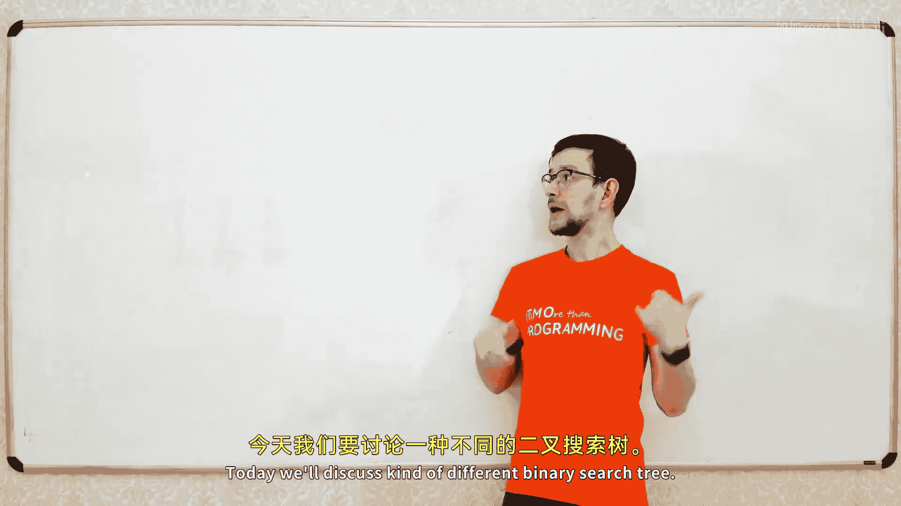
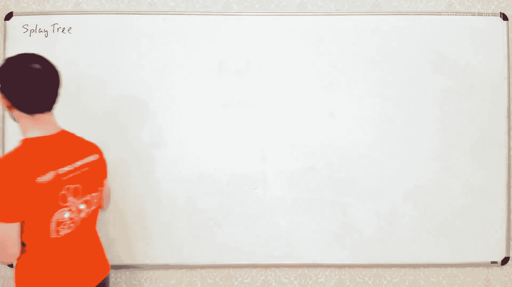
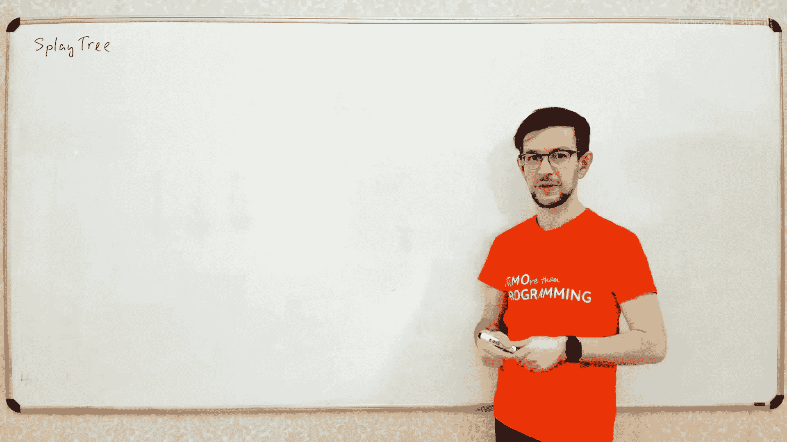
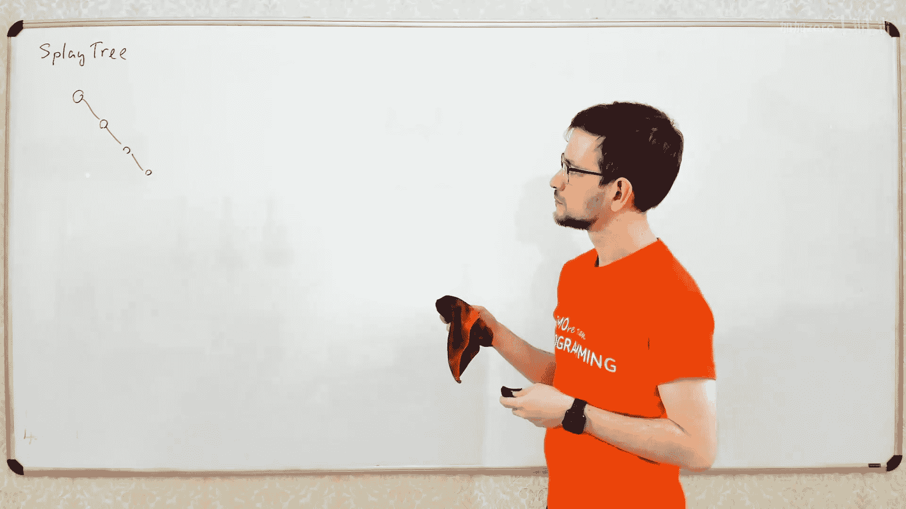
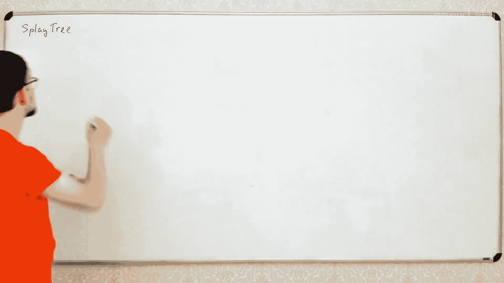
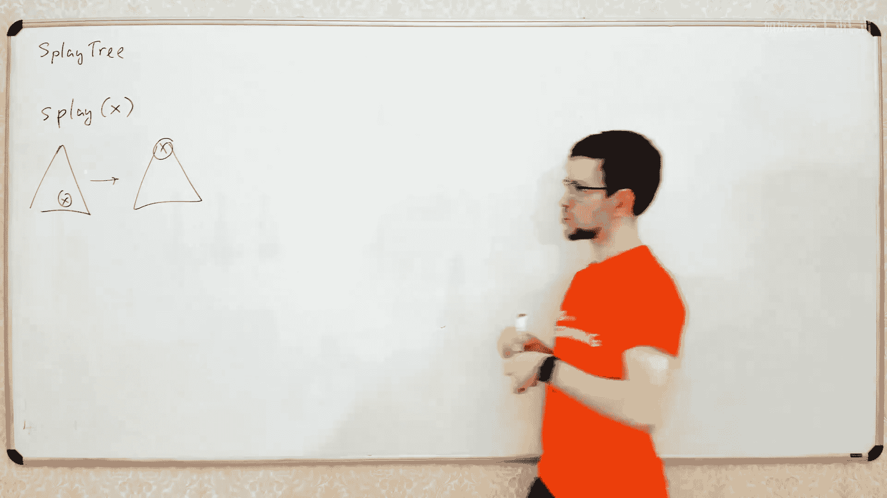
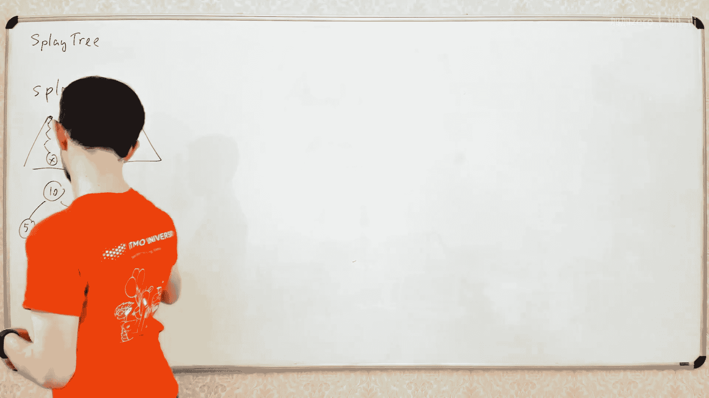
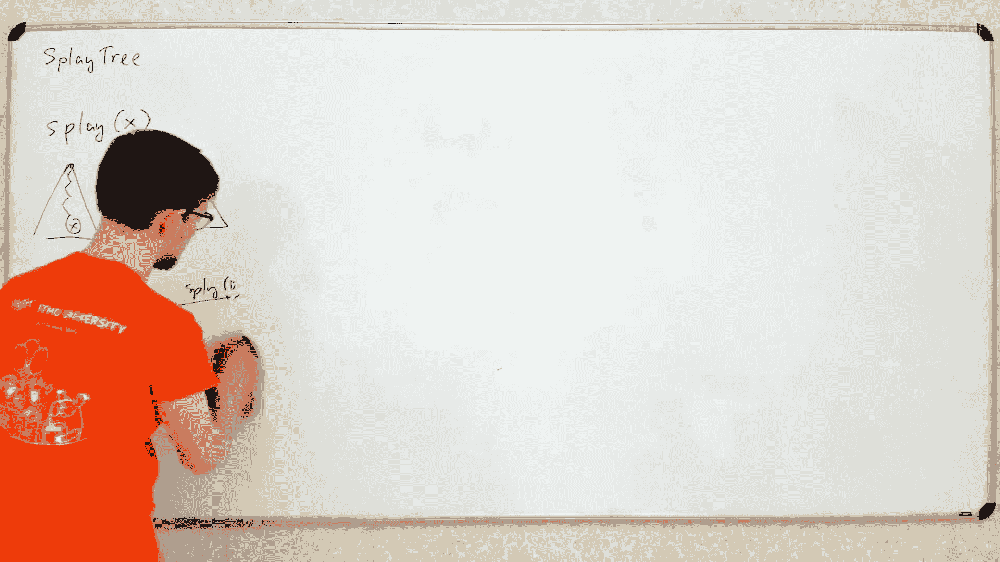

# 024：伸展树









在本节课中，我们将学习一种特殊的二叉搜索树——伸展树。我们将了解它的核心操作“伸展”，并证明其操作的**平摊时间复杂度**为 O(log n)。伸展树的神奇之处在于，它无需存储任何额外的平衡信息，仅通过访问节点后的“伸展”操作就能自我优化，使频繁访问的节点靠近树根。





## 什么是伸展树？





上一节我们讨论了AVL树和Treap等平衡二叉搜索树。本节中我们来看看伸展树。

伸展树是一种二叉搜索树。它非常酷。我们不需要维护任何平衡属性，也不需要在节点中保存任何额外数据（如高度、权重或随机键）。我们只是构建一棵普通的二叉搜索树，然后通过一种内部机制让树自我平衡。

这完全像魔法一样。任何二叉搜索树都是一棵有效的伸展树。这意味着，在某个时刻，你的伸展树可能看起来像一条长链。这是一棵有效的伸展树。每棵树都是有效的伸展树。如果你的树长这样，意味着你的伸展树认为，对于当前情况，这就是最好的树。在每个时间点，伸展树都维持着一种结构，这种结构在某种程度上优化了你当前的操作序列。一些内部魔法使得这棵树为你的当前情况保持平衡。

“Splay”这个词有点奇怪。我不太确定它具体是什么意思。我相信除了关于伸展树的书籍外，我从未在其他书中见过这个词。

## 核心操作：伸展

伸展树的主要操作是“伸展”，这也是它名字的由来。

伸展操作非常简单。它接收树中的某个节点 `x`。通过一系列旋转，它将树变换为另一棵包含相同元素的树，但节点 `x` 成为了新的树根。

你可以通过旋转从 `x` 到树根路径上的边来实现这一点。任何元素都可以成为树的根。例如，如果你选择节点12并对其调用伸展操作，12将成为树根，所有其他元素将分布在它的子树中。

现在，所有其他操作是如何工作的呢？所有操作都非常简单。

### 查找操作

以下是查找操作的过程：
1.  从树根开始，沿着二叉搜索树的规则向下查找目标节点 `x`。
2.  找到节点 `x` 后，对其调用伸展操作。

这就是整个计划。所有操作都是如此：如果你需要访问某个节点，你沿着路径找到它，然后对该节点调用伸展操作。伸展操作会将这个节点沿着路径向上移动，最终使其成为树根。

现在，我将证明所有操作的**平摊时间复杂度**是 O(log n)。更准确地说，我将证明查找操作的平摊时间复杂度是 O(log n)。

让我们回忆一下什么是平摊时间复杂度。平摊时间复杂度意味着，如果你有一个长度为 `k` 的操作序列，那么执行这 `k` 个操作所花费的总时间不超过 `k * log n`。这就是平摊复杂度的含义。

单个操作可能耗时很长。例如，如果你的树是一条长链，而你试图访问底部的节点，那么这次操作的时间复杂度将是线性的（O(n)）。但这种情况不会一直发生。有些操作可能耗时很长，但总的时间复杂度不会超过 `k * log n`。

如何证明呢？我会简单地证明。观察查找操作是如何工作的：你需要向下遍历整条路径找到 `x`，然后调用伸展操作，伸展操作又会沿着同一条路径向上移动 `x`。因此，查找操作的时间复杂度大约是伸展操作的两倍。

如果我证明了伸展操作的平摊时间复杂度是 O(log n)，那么查找操作以及其他所有操作的平摊时间复杂度也都是 O(log n)。这就是计划。

## 伸展操作的实现

现在，如何实现伸展操作？我们分三步进行，每次我们查看节点 `x`、它的父节点 `p` 和它的祖父节点 `g`。

让我们考虑三种可能的情况。

**情况一：节点 `x` 没有祖父节点（即 `p` 是树根）**
在这种情况下，我们只需要旋转连接 `x` 和 `p` 的边。这个操作称为 **zig**。
```
    p          x
   / \   ->   / \
  x   C      A   p
 / \            / \
A   B          B   C
```
旋转后，`x` 成为子树（此时也是整棵树）的根。

**情况二：节点 `x` 有祖父节点，且 `x` 与 `p`、`p` 与 `g` 的关系方向不同（例如，`x` 是 `p` 的右孩子，而 `p` 是 `g` 的左孩子）**
这个操作称为 **zig-zag**。我们可以通过两次旋转来实现：先旋转 `x-p` 边，再旋转 `x-g` 边。最终 `x` 成为子树的根。
```
     g            g            x
    / \          / \         /   \
   p   D        x   D       p     g
  / \     ->   / \     ->  / \   / \
 A   x        p   C       A   B C   D
    / \      / \
   B   C    A   B
```

**情况三：节点 `x` 有祖父节点，且 `x` 与 `p`、`p` 与 `g` 的关系方向相同（例如，`x` 是 `p` 的左孩子，且 `p` 是 `g` 的左孩子）**
这个操作称为 **zig-zig**。同样通过两次旋转实现：先旋转 `p-g` 边，再旋转 `x-p` 边。最终 `x` 成为子树的根。
```
      g            p            x
     / \          / \         /   \
    p   D        x   g       A     p
   / \     ->   / \ / \   ->      / \
  x   C        A   B C D         B   g
 / \                                  \
A   B                                  D
                                       \
                                        C
```
*(注：上图第三棵树的右子树结构在典型描述中应为 `(B, g(D, C))`，此处为视频中图示的直观转译，原理一致：`x` 上提为根，原结构重组为其子树。)*

实现起来非常简单。你编写一个处理单次旋转的函数。然后，只要 `x` 不是树根，就检查它属于哪种情况，并调用相应的旋转组合。每次操作都会将 `x` 向上移动两层。

## 时间复杂度证明（平摊分析）

现在到了关键部分：证明平摊时间复杂度是 O(log n)。我们将使用**势能法**进行证明。

我们为伸展树的当前状态定义一个势能函数 Φ。每次操作的实际耗时加上势能的变化量，就是该操作的平摊耗时。

目标是定义一个势能函数 Φ，使得即使单次伸展操作的实际耗时可能很长（O(n)），但势能会大幅下降，从而导致平摊耗时仅为 O(log n)。

### 势能函数的定义

1.  为每个节点 `x` 分配一个权重 `w(x)`。为了简单证明 O(log n) 的复杂度，我们设所有节点的权重 `w(x) = 1`。
2.  定义节点 `x` 的**规模** `s(x)` 为以 `x` 为根的子树中所有节点的权重之和。
3.  定义节点 `x` 的**秩** `r(x)` 为 `log₂(s(x))`。
4.  定义整个树的势能 Φ 为所有节点秩的总和：`Φ = ∑ r(x)`。

### 关键引理

伸展操作中，将节点 `x` 伸展到根的平摊耗时不超过 `1 + 3*(r'(x) - r(x))`，其中 `r(x)` 是 `x` 伸展前的秩，`r'(x)` 是 `x` 伸展后（成为树根）的秩。

由于伸展后 `x` 是树根，`s'(x) = n`（总节点数），所以 `r'(x) = log₂ n`。而 `r(x) ≥ 0`，因此平摊耗时 `≤ 1 + 3*log₂ n = O(log n)`。

### 证明思路（以 zig-zig 为例）

对于 zig-zig 操作，我们需要证明其平摊耗时 `≤ 3*(r'(x) - r(x))`（没有常数项 `+1`，这与 zig 情况不同，原因在总和中会抵消）。

平摊耗时 = 实际耗时 (2次旋转) + ΔΦ (势能变化)
ΔΦ 主要涉及 `x`, `p`, `g` 三个节点秩的变化：`(r'(x) - r(x)) + (r'(p) - r(p)) + (r'(g) - r(g))`

通过一系列代换和不等式放缩（利用 `r(p) ≥ r(x)`，以及 `r'(p) ≤ r'(x)` 等性质），最终可以将证明转化为验证一个不等式：
`log₂(s'(p)/s'(x)) + log₂(s'(g)/s'(x)) ≤ -2`
这等价于证明 `(s'(p)/s'(x)) * (s'(g)/s'(x)) ≤ 1/4`。

观察子树规模：`s'(x) = s'(p) + s'(g) + 1`。因此，两个分数 `s'(p)/s'(x)` 和 `s'(g)/s'(x)` 的和小于等于1。根据基本不等式，当两个非负数的和为定值（≤1）时，其乘积在两者相等时取最大值，最大值为 `(1/2)*(1/2)=1/4`。因此不等式成立。

zig 和 zig-zag 情况的证明思路类似。将所有步骤（一系列 zig-zig, zig-zag 和一个可能的 zig）的平摊耗时相加，中间项的秩会相互抵消，最终总平摊耗时约为 `1 + 3*(r'(根) - r(初始)) = O(log n)`。

## 伸展树的优势与特性

伸展树具有一些有趣的实践特性：

*   **局部性**：如果一个节点被频繁访问，它会被多次伸展到树根附近，因此后续访问速度会更快。这类似于缓存算法。
*   **序列访问优化**：如果连续多次访问同一个节点，第一次耗时 O(log n)，之后几次访问由于该节点已在根节点，耗时仅为 O(1)。相比之下，AVL树或Treap每次访问都需要 O(log n)。
*   **静态最优性猜想**：一个著名的开放问题是：对于任何固定的访问序列，伸展树的总耗时是否在常数因子内逼近最优的静态二叉搜索树（即事先知道所有访问序列而专门构建的最优树）？在许多特定情况下（如顺序访问、频率不均匀的访问），伸展树都被证明是（近似）最优的。虽然尚未被普遍证明，但这显示了伸展树强大的自适应能力。

## 总结

本节课中我们一起学习了伸展树：
1.  伸展树是一种自调整的二叉搜索树，无需存储平衡信息。
2.  其核心操作是**伸展**，即在访问任何节点后，通过一系列旋转将其移动到树根。
3.  我们详细分析了 zig, zig-zig, zig-zag 三种旋转情况。
4.  使用**势能法**，我们证明了伸展操作的**平摊时间复杂度**为 O(log n)，从而所有基本操作（查找、插入、删除）的平摊时间复杂度也是 O(log n)。
5.  伸展树具有利用访问局部性的优点，对于某些访问模式效率很高。

伸展树是一个优雅且理论上深刻的数据结构。在接下来的课程中，我们还会看到如何利用伸展树来优化其他数据结构（如链接-切割树）。