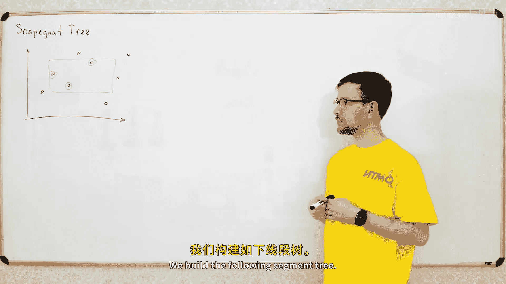
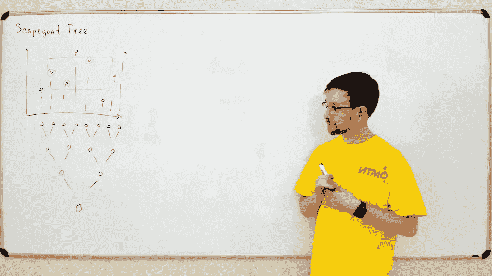
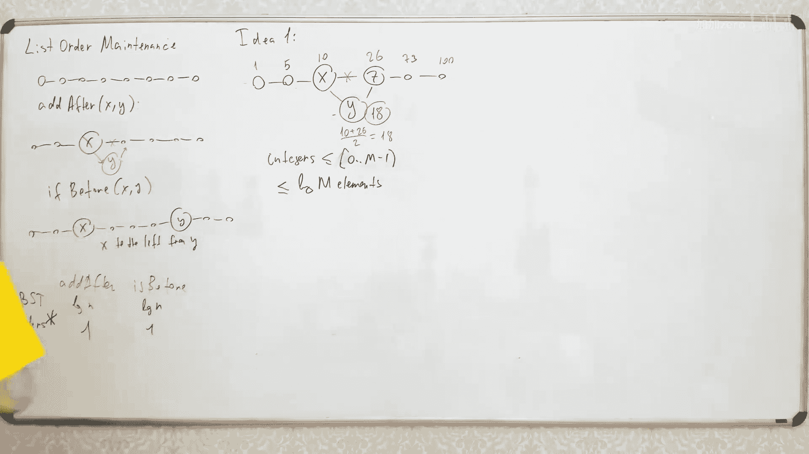

# 025：替罪羊树与列表顺序维护








## 概述
在本节课中，我们将学习一种特殊的二叉搜索树——替罪羊树。这种树不使用旋转操作来维持平衡，因此适用于一些需要维护额外信息（如排序列表）的特殊场景。我们还将探讨如何利用替罪羊树来实现高效的列表顺序维护数据结构，该结构支持在常数时间内比较元素顺序和插入新元素。


---

## 替罪羊树简介

上一节我们介绍了多种平衡二叉搜索树。本节中我们来看看最后一种二叉搜索树——替罪羊树。这种树之所以特殊，是因为它允许我们解决一些特殊问题。

替罪羊树不使用旋转操作来维持平衡。这一点很重要，因为在某些数据结构中，旋转操作会破坏节点中维护的额外信息（例如排序列表），导致更新成本过高。

## 问题背景：动态二维点集查询

回忆之前关于二维线段树的讨论。我们有一个点集，需要支持两种操作：查询矩形区域内的所有点，以及动态更新点的坐标（例如移动一个点）。

构建线段树时，每个节点维护该节点对应X坐标区间内所有点的列表，并按Y坐标排序。查询时，我们需要在多个节点的列表中，通过二分查找找到Y坐标在指定区间内的点。

当需要更新一个点的Y坐标时，我们只需在该点所在的所有节点列表中更新该点的值。由于每个节点列表都是排序的，我们可以用二叉搜索树（如C++的`set`）来维护，从而实现 `O(log² n)` 的更新复杂度。

然而，当需要更新点的X坐标或插入新点时，问题就变得复杂了。这需要改变点在X轴上的顺序，从而可能破坏整个线段树的结构。简单的解决方案是允许树结构变得“不完美”，例如在插入新点时，将叶节点分裂，并将新点添加到路径上所有节点的列表中。但这会导致树的高度增加，不再保持 `O(log n)` 的高度。

## 传统平衡技术的局限性

我们之前讨论的平衡技术（如AVL树、红黑树、伸展树）都依赖于旋转操作。但在当前场景下，每个节点维护着一个包含其子树所有元素的排序列表。进行旋转时，我们需要为旋转后的节点重建这个排序列表，而合并两个已排序列表需要线性时间，无法在 `O(log n)` 时间内完成。因此，我们不能使用基于旋转的平衡技术。

## 替罪羊树的平衡策略

替罪羊树使用一种不同的平衡策略。它依赖于一个简单的属性：对于任意节点 `x` 及其父节点 `p`，`x` 的子树大小最多是 `p` 的子树大小的 `α` 倍。其中 `α` 是一个常数，通常取值在 `0.5` 到 `1` 之间，例如 `0.7`。

**公式**：`size(x) <= α * size(p)`

这个属性保证了树的高度为 `O(log n)`。因为从根到叶子的路径上，子树大小至少以因子 `α` 递减。

当插入或删除节点导致这个属性被破坏时，我们找到从插入点到根路径上第一个不满足该属性的节点。这个节点被称为“替罪羊”。我们不是通过旋转来修复它，而是将这个“替罪羊”节点的整个子树**完全重建**为一棵完美平衡的二叉搜索树。

重建操作可以在线性时间内完成。虽然单次重建代价较高，但分摊分析表明，每次插入操作的分摊时间复杂度仍然是 `O(log n)`。

## 替罪羊树的操作与复杂度

以下是替罪羊树的核心操作步骤：

1.  **插入**：像普通二叉搜索树一样插入新节点，并更新路径上所有节点的子树大小。
2.  **检查平衡**：从新节点向根回溯，检查每个节点是否满足 `size(child) <= α * size(parent)`。
3.  **重建**：如果发现不满足条件的节点（替罪羊），则将其整个子树重建为完美平衡的树。

虽然单次重建需要 `O(k)` 时间（`k` 为子树大小），但分摊分析表明，在两次重建之间至少需要 `Ω(k)` 次插入操作才能使该子树再次变得不平衡。因此，每个插入操作的分摊成本是常数，总的分摊插入时间复杂度为 `O(log n)`。

## 列表顺序维护问题

现在，我们利用替罪羊树来解决另一个问题：列表顺序维护。我们需要维护一个元素列表，并支持两种操作：
1.  `insertAfter(x, y)`：在元素 `x` 之后插入新元素 `y`。
2.  `isBefore(x, y)`：比较元素 `x` 和 `y` 在列表中的顺序。

使用普通的二叉搜索树，这两种操作都可以在 `O(log n)` 时间内完成。但我们的目标是让它们都在**常数分摊时间**内完成。

## 常数时间比较的初步想法

一个直观的想法是为每个列表元素分配一个整数标签，并保持这些标签按列表顺序递增。比较两个元素时，只需比较它们的标签。插入新元素时，将其标签设为前后两个元素标签的平均值。

**代码示例（概念）**：
```python
# 初始：元素A标签0，元素B标签MAX
# 在A和B之间插入C
label_C = (label_A + label_B) // 2
```

问题在于，如果反复在相同位置插入，标签的精度会耗尽（例如，整数会溢出或无法再取平均值）。如果标签范围是 `0` 到 `M-1`，那么在最坏情况下，只能在固定位置插入约 `log M` 次。

## 结合替罪羊树的解决方案

为了支持任意多次插入，我们将列表元素分组为**块**，每个块大小约为 `O(log n)`。我们维护一个替罪羊树，其中每个树节点对应一个块。



**比较操作 `isBefore(x, y)`**：
*   如果 `x` 和 `y` 在同一个块内，我们使用块内分配的标签（范围足够小，可以用取平均的方法）进行常数时间比较。
*   如果 `x` 和 `y` 在不同块内，我们通过比较它们在替罪羊树中对应节点的标签（由树结构决定，后文详述）来确定顺序，这也是常数时间。

**插入操作 `insertAfter(x, y)`**：
1.  在 `x` 所在的块内，将 `y` 插入到 `x` 之后，并为 `y` 分配其前后元素标签的平均值。这是常数时间。
2.  如果插入后块的大小超过了上限（例如 `2 * log n`），我们将这个块**分裂**成两个大小约为 `log n` 的块。
3.  块分裂意味着我们需要在替罪羊树中为新的块创建一个新节点并插入。这个插入操作的成本是 `O(log n)`。

## 分摊复杂度分析

虽然块分裂会导致一次 `O(log n)` 的替罪羊树插入操作，但分裂后，两个新块的大小都只有原来的一半左右。因此，至少需要再经过 `Ω(log n)` 次插入操作，才会导致其中一个块再次需要分裂。

所以，每次列表插入操作的分摊时间复杂度是：`O(1)`（块内插入） + `O(log n) / Ω(log n)`（分裂成本分摊） = `O(1)`。

## 替罪羊树中标签的分配

我们如何为替罪羊树中的每个节点（代表一个块）分配用于比较的标签呢？我们利用树的结构：
*   从根节点到目标节点的路径中，每次向左走，我们在二进制标签前添加“00”；每次向右走，则添加“11”。
*   到达目标节点后，我们在末尾添加“01”作为终止标记，并用0填充至固定长度。

这样生成的二进制数，保证了树的中序遍历顺序（即块的列表顺序）与这些数的数值顺序一致。由于树高为 `O(log n)`，标签的长度也是 `O(log n)` 位，这在现代计算机模型中是常数时间可比的。

替罪羊树的关键优势在于，它通过重建而非旋转来保持平衡。在重建子树时，我们可以同时为子树中的所有节点重新计算这些标签，而不会影响树的其他部分。

## 总结

本节课中我们一起学习了：
1.  **替罪羊树**：一种通过重建子树而非旋转来维持平衡的二叉搜索树。它维护 `size(child) <= α * size(parent)` 的不变性，破坏时则重建。其插入操作的分摊时间复杂度为 `O(log n)`。
2.  **列表顺序维护**：一个支持常数时间比较和常数分摊时间插入的数据结构。其核心思想是将列表分块，块内使用局部标签，块间使用替罪羊树维护全局顺序。通过巧妙的分摊分析，`insertAfter` 和 `isBefore` 操作都能高效完成。

替罪羊树展示了平衡二叉搜索树设计的多样性，以及在特定约束下（如禁止旋转）如何设计高效的数据结构。列表顺序维护结构则是一个经典案例，展示了如何组合简单想法（标签、分块）与复杂数据结构（替罪羊树）来解决难题。