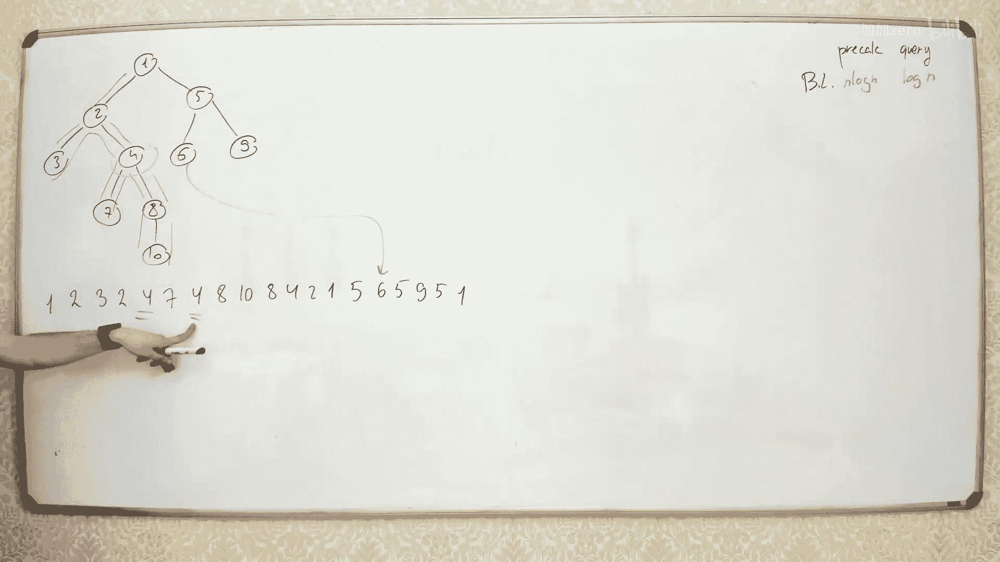

# 026：Farach-Colton和Bender算法


在本节课中，我们将学习一种新的数据结构主题。我们已经完成了对二叉搜索树的讨论，现在开始学习略有不同的树结构。本周，或许接下来的几周，我们将讨论通用树。

## 什么是树？

树本质上是一个无环图。如果你有一个无向图，并且它没有环，那么它就是一个树。例如，下图就是一个树。


有时你会遇到另一种类型的树，称为有根树。上面的树是无根的，所有顶点都是平等的。而有根树则有一个根节点，它类似于我们讨论二叉搜索树时的结构。这棵树有一个根，所有连接到根的节点都是其子节点。每个节点可以有任意数量的子节点，这与二叉树的子节点数量限制不同。


例如，上图中一个节点有三个子节点，子节点数量可以是任意值。

## 树的重要性

树是一种非常重要的数据结构，广泛应用于各种不同的问题中。最常见的是，有根树通常用于描述层次模型。例如，文件系统中的目录树、版本控制系统中的版本树，或者公司组织结构图。有根树因其具有根、叶和方向的结构，处理起来更加方便。

无根树（即无环图）在算法中也有应用，尤其是在图算法中。有时，在图算法中，你只需要处理图内部的某个树结构。通常，处理无根树的第一步是将其转化为有根树。

## 如何为树指定根节点

为树指定根节点非常简单。你只需选择树中的任意一个顶点，将其声明为树的根，然后将所有边从这个根节点向外定向。例如，假设我们有以下树节点：1, 2, 3, 4, 5, 6, 7, 8, 9。如果我们选择节点1作为根，那么它的邻居节点2、6、9就成为其子节点。然后递归地对每个子节点进行相同操作：对于节点6，其子节点是7和4；对于节点9，其子节点是8和5，依此类推。这是一个简单的转换过程。

## 有根树上的关键操作：最低公共祖先

在有根树中，最有用的操作之一是找到两个节点的**最低公共祖先**。

**最低公共祖先**的定义是：给定树中的两个节点U和V，考虑它们所有的祖先节点。公共祖先是指同时是U和V祖先的节点。在所有公共祖先中，深度最大的那个（即离根节点最远的那个）就是最低公共祖先。

为什么这个操作如此重要？因为它与树中的路径结构密切相关。在树中，从节点U到节点V的路径总是这样的：先从U向上走到达最低公共祖先W，然后再从W向下走到达V。因此，任何从U到V的路径都可以拆分为两部分：从U到W的上行路径和从W到V的下行路径。最低公共祖先W就是这个路径的“转折点”。

## LCA的应用举例：计算节点间距离

一个直接的应用是计算树上两个节点之间的距离。假设我们知道节点U和V的最低公共祖先W。那么，从U到V的距离就等于从U到W的距离加上从V到W的距离。

如何计算从节点到其祖先的距离？这可以通过节点的深度来实现。节点的深度定义为从根节点到该节点的边数。那么：
*   从U到W的距离 = `depth(U) - depth(W)`
*   从V到W的距离 = `depth(V) - depth(W)`

因此，总距离为：
`distance(U, V) = (depth(U) - depth(W)) + (depth(V) - depth(W))`

所以，一旦我们能高效地找到任意两个节点的LCA，就能轻松计算出它们之间的距离。这只是LCA众多应用中的一个，许多涉及树上路径的问题都可以通过将路径拆分为两条到LCA的路径来简化。

## 计算LCA的技术概览

我们将讨论两种计算LCA的重要技术。它们本身是解决LCA问题的方法，但其思想可以应用于更多复杂问题。

第一种技术称为**二叉提升**。
第二种技术利用了树的欧拉序和**稀疏表**或**线段树**，并最终通过分块优化得到一个线性预处理、常数查询的算法，即**Farach-Colton和Bender算法**。

## 技术一：二叉提升

上一节我们介绍了LCA的概念及其应用，本节我们来看看第一种计算LCA的技术：二叉提升。

### 核心思想

二叉提升的核心思想是：能够从任意节点快速跳转到其祖先节点，而不是一步一步地向上移动。我们通过预计算一些“跳跃指针”来实现这一点。

对于每个节点 `v`，我们预计算一个数组 `jump[v][k]`。这个指针指向从节点 `v` 向上走 `2^k` 步后到达的祖先节点。例如：
*   `jump[v][0]` 指向 `v` 的父节点（向上1步）。
*   `jump[v][1]` 指向 `v` 的祖父节点（向上2步）。
*   `jump[v][2]` 指向向上4步到达的节点，依此类推。

如果向上 `2^k` 步超出了根节点，我们可以将指针设为 `null`、`-1`，或者简单地让它指向根节点（实现细节）。

### 预计算跳跃指针

我们如何计算所有这些指针呢？可以借鉴稀疏表的思路，按 `k` 从小到大的顺序进行计算。

1.  **初始化 (`k=0`)**: 对于每个节点 `v`，`jump[v][0]` 就是它的父节点。这可以在一次树遍历中完成。
2.  **递推计算 (`k>0`)**: 对于 `k` 从 1 到 `log(n)`，对于每个节点 `v`：
    `jump[v][k] = jump[ jump[v][k-1] ][k-1]`
    这个公式的含义是：要向上跳 `2^k` 步，可以先向上跳 `2^(k-1)` 步到达一个中间节点 `mid`，然后再从 `mid` 向上跳 `2^(k-1)` 步。由于 `jump[v][k-1]` 和 `jump[mid][k-1]` 都已经计算好了，所以可以直接得到。

以下是预计算的伪代码框架：
```python
# 假设 parent[v] 存储了节点v的父节点，根节点的父节点为-1或自身。
logN = ceil(log2(n)) + 1
jump = [[-1]*logN for _ in range(n)]

# 初始化 k=0
for v in range(n):
    jump[v][0] = parent[v]

# 递推计算 k=1...logN-1
for k in range(1, logN):
    for v in range(n):
        mid = jump[v][k-1]
        if mid != -1:
            jump[v][k] = jump[mid][k-1]
        # 如果mid是-1，则jump[v][k]保持为-1
```
**时间复杂度**：我们需要为 `n` 个节点每个计算 `log(n)` 个指针，每次计算是常数时间，所以总预处理时间复杂度为 **O(n log n)**。

### 使用二叉提升计算LCA

现在，我们利用预计算好的 `jump` 数组来求两个节点 `u` 和 `v` 的LCA。过程分为两步：

**第一步：将两个节点提升到同一深度**。
假设 `depth[u] < depth[v]`（否则交换）。我们计算深度差 `d = depth[v] - depth[u]`。我们需要将较深的节点 `v` 向上移动 `d` 步，使其与 `u` 处于同一深度。
我们可以将 `d` 表示为二进制形式。例如，`d = 5 (二进制101)`，意味着我们需要向上移动 `2^2 + 2^0` 步。利用 `jump` 数组，我们可以从最大的 `2^k` 开始尝试：如果 `d >= 2^k`，则进行 `jump[v][k]` 跳跃，并减少 `d`。这样可以在 `O(log n)` 步内完成。

更优雅的实现是，不显式计算 `d`，而是从高到低遍历 `k`，如果 `jump[v][k]` 的深度仍然大于等于 `depth[u]`，就进行跳跃。
```python
def lift_to_same_depth(u, v):
    if depth[u] > depth[v]:
        u, v = v, u # 确保v更深
    # 将v提升到与u同深
    diff = depth[v] - depth[u]
    k = 0
    while diff > 0:
        if diff & 1: # 如果二进制当前位为1
            v = jump[v][k]
        k += 1
        diff >>= 1
    return u, v
# 或者使用从高到低遍历k的版本
```

**第二步：二分搜索寻找LCA**。
当 `u` 和 `v` 处于同一深度后，如果此时 `u == v`，那么 `u`（或 `v`）就是LCA。
否则，我们进行一种“二分搜索”。我们维持一个不变性：`u` 和 `v` 的当前祖先不同，但它们的某个祖先（最终是LCA）是相同的。我们从最大的步长 `2^k` 开始尝试：
*   如果 `jump[u][k] != jump[v][k]`，说明 `u` 和 `v` 向上跳 `2^k` 步后到达的节点**还不是**公共祖先（或者还不是最低的那个）。那么我们可以安全地将 `u` 和 `v` 同时向上跳 `2^k` 步，在新的、更低的起点上继续搜索。
*   如果 `jump[u][k] == jump[v][k]`，说明这个跳跃跳得太远了，直接跳到了一个公共祖先（可能不是最低的）。那么我们就不进行这次跳跃，而是尝试更小的步长 `k-1`。

最终，当 `k` 减少到0时，`u` 和 `v` 将停留在LCA的两个直接子节点上。此时，`u` 和 `v` 的父节点（即 `jump[u][0]`）就是LCA。

以下是计算LCA的完整函数伪代码：
```python
def lca(u, v):
    # 1. 提升到同一深度
    if depth[u] > depth[v]:
        u, v = v, u
    # 将v提升
    diff = depth[v] - depth[u]
    for k in range(logN-1, -1, -1):
        if diff & (1 << k):
            v = jump[v][k]
    if u == v:
        return u
    # 2. 二分搜索LCA
    for k in range(logN-1, -1, -1):
        if jump[u][k] != jump[v][k]:
            u = jump[u][k]
            v = jump[v][k]
    # 此时u和v是LCA的子节点
    return jump[u][0]
```

**查询时间复杂度**：每一步循环最多 `log(n)` 次，因此每次查询LCA的时间复杂度为 **O(log n)**。

**总结**：二叉提升技术预处理时间复杂度为 O(n log n)，单次查询时间复杂度为 O(log n)。它是一种非常强大且灵活的技术，不仅可以用于求LCA，还可以通过在跳跃时维护额外信息（如路径上的最大值、和等）来解决更多树上路径查询问题。



## 技术二：基于欧拉序与RMQ

上一节我们学习了基于二叉提升的LCA算法。本节我们来看一种完全不同的思路：将LCA问题转化为**区间最小值查询**问题。

### 核心思想与欧拉序

这个技术的核心思想是将树形结构转化为线性结构。我们通过树的**深度优先搜索**来得到一个节点访问序列，称为**欧拉序**。

生成欧拉序的递归过程如下：
1.  从根节点开始DFS。
2.  每次**进入**一个节点时，将其记录到序列中。
3.  递归访问该节点的所有子节点。
4.  每次**离开**一个节点（即回溯）时，再次将其记录到序列中。

这样，每条边会被遍历两次（一次向下，一次向上），每个节点会根据其度数被记录多次。最终我们得到一个长度为 `2*n - 1` 左右的序列 `euler_tour`。

同时，我们记录：
*   `depth[node]`：每个节点在树中的深度。
*   `first_occurrence[node]`：每个节点在欧拉序中**第一次出现**的位置索引。

### LCA转化为RMQ

关键观察是：对于任意两个节点 `u` 和 `v`，考虑它们在欧拉序中第一次出现的位置 `first[u]` 和 `first[v]`。假设 `first[u] < first[v]`。
现在，查看欧拉序中从 `first[u]` 到 `first[v]` 的这个区间。这个区间对应了从 `u` 出发，遍历部分子树，最后走到 `v` 的一条路径。**这条路径上一定会经过 `u` 和 `v` 的最低公共祖先 `LCA(u, v)`**。

更重要的性质是：在这个区间内，所有节点中**深度最小**的那个节点，就是 `u` 和 `v` 的最低公共祖先。

**为什么？**
因为DFS遍历的特性，当你从 `u` 走到 `LCA(u,v)` 再走到 `v` 的过程中，LCA是深度最小的点（它是 `u` 和 `v` 的公共祖先，且在路径上离根最近）。在欧拉序的这段区间里，深度更小的祖先节点（LCA的祖先）不会出现，因为DFS在离开LCA向上回溯时，就已经离开了那个子树分支。

因此，问题转化为：
**在数组 `depth[euler_tour[i]]` 上，查询区间 `[first[u], first[v]]` 内的最小深度值对应的节点。**

这是一个经典的**区间最小值查询**问题。

### 使用线段树或稀疏表求解RMQ

现在，我们有了一个深度数组 `depth_array`，其长度为 `M (约 2n)`。我们需要快速回答这个数组上的区间最小值查询。

有两种主要数据结构：
1.  **线段树**：可以在 O(M) 时间内构建，每次查询需要 O(log M) 时间。由于 M 是 O(n)，所以预处理 O(n)，查询 O(log n)。
2.  **稀疏表**：可以在 O(M log M) 时间内构建，但查询只需要 O(1) 时间。同样 M 是 O(n)，所以预处理 O(n log n)，查询 O(1)。

使用稀疏表，我们可以实现更快的查询。以下是步骤：
*   **预处理**：
    1.  进行DFS，生成欧拉序 `euler_tour`，深度数组 `depth_array`，以及首次出现数组 `first_occ`。
    2.  在 `depth_array` 上构建稀疏表 `st`，用于快速查询任意区间的最小值**索引**。
*   **查询 LCA(u, v)**：
    1.  `l = first_occ[u]`, `r = first_occ[v]`。如果 `l > r`，交换它们。
    2.  使用稀疏表查询 `depth_array` 在区间 `[l, r]` 内最小深度值的索引 `idx`。
    3.  `LCA(u, v) = euler_tour[idx]`。

**总结当前方案**：
*   **方法2A（线段树）**：预处理 O(n)，查询 O(log n)。
*   **方法2B（稀疏表）**：预处理 O(n log n)，查询 O(1)。

我们的目标是获得一个**预处理 O(n)** 且**查询 O(1)** 的算法。接下来介绍的Farach-Colton和Bender算法就实现了这一点。

## Farach-Colton和Bender算法

上一节我们将LCA转化为RMQ，并看到了稀疏表查询虽快但预处理较慢。本节我们介绍Farach-Colton和Bender算法，它通过巧妙的分块技术，在**线性预处理**时间内实现**常数查询**。

### 算法框架回顾

我们有一个深度数组 `D`（来自欧拉序），长度为 `M`。我们需要支持 `D` 上的区间最小值查询。稀疏表需要 O(M log M) 的预处理时间，我们希望减少到 O(M)。

观察：我们的深度数组 `D` 有一个特殊性质——**相邻元素的差绝对值为1**（因为DFS时深度每次变化±1）。这个性质是优化的关键。

### 分块思想

1.  **将数组分块**：将长度为 `M` 的数组 `D` 分成大小为 `B` 的块（最后一块可能较小）。设块数为 `K = ceil(M / B)`。
2.  **块内最小值**：对于每个块 `i`，预计算其内部的最小值 `block_min[i]`。这需要 O(M) 时间。
3.  **块间查询**：对于查询区间 `[l, r]`，它可能覆盖若干个完整的块以及左右两端不完整的块。
    *   对于完整的块，我们只需要查询这些块的 `block_min` 值中的最小值。
    *   对于左右不完整的块，我们需要在块内进行查询。

如果我们能：
*   **快速回答完整块区间的最小值查询**（即对 `block_min` 数组进行RMQ）。
*   **快速回答任意块内的任意区间查询**。

并且总时间都是常数，那么整体查询就是常数时间。

### 实现常数查询

**步骤一：处理完整块区间查询**
我们对 `block_min` 数组构建一个**稀疏表**。由于块数 `K ≈ M/B`，构建稀疏表的时间为 O(K log K)。如果我们选择 `B = log(M)`，那么 `K ≈ M / log M`，`log K ≈ log M`，所以预处理时间为 O( (M/log M) * log M ) = O(M)，是线性的！查询完整块区间最小值时，稀疏表可以在 O(1) 时间内完成。

**步骤二：处理块内查询**
块的大小是 `B = log(M)`。我们需要能够快速回答**任意一个块内，任意区间 `[l`, r]` 的最小值查询**。一个朴素的想法是为每个块预计算所有可能的区间查询结果，但这样会有 O(B^2) 个区间，总预计算量是 O(K * B^2) = O(M * B)，当 B=log M 时是 O(M log M)，不是线性。

这里利用了深度数组 `D` 的相邻差为±1的特殊性质。这个性质意味着，**每个块的类型可以由一个长度为 `B-1` 的“符号序列”唯一确定**，其中每个符号表示相邻深度的差是 `+1` (上升) 还是 `-1` (下降)。

例如，深度序列 `[3, 4, 5, 4]` 对应的符号序列是 `[+1, +1, -1]`。
不同的符号序列有多少种？最多有 `2^(B-1)` 种。

如果我们选择 `B = (log M) / 2`，那么 `2^(B-1) ≈ 2^((log M)/2) = sqrt(M)`。这个数量级是关于 `M` 的亚线性（根号级别）。

**关键操作**：
*   我们预先枚举所有可能的 `sqrt(M)` 种块类型。
*   对于每种块类型，我们预先计算其内部**所有可能区间** `[l, r]` (0 <= l <= r < B) 的最小值查询结果，存储在一个表 `precomp[type][l][r]` 中。
*   这个三维表的大小约为：`(块类型数) * B * B ≈ sqrt(M) * (log M)^2`。当 M 较大时，这仍然可以小于 M，因此构建这个表的总时间是 **O(M)** 级别的（具体是 O(sqrt(M) * (log M)^2)，这被吸收进 O(M) 中）。

在实际查询时：
1.  确定查询区间 `[l, r]` 所在的块。
2.  对于两端的非完整块，通过查找该块的类型，并在预计算的表 `precomp` 中直接 O(1) 得到块内区间最小值。
3.  对于中间的完整块，通过 `block_min` 数组上的稀疏表 O(1) 得到最小值。
4.  取这三部分最小值中的最小值，即为最终结果。

### 算法总结

Farach-Colton和Bender算法的主要步骤：

1.  **预处理**：
    a.  DFS生成欧拉序、深度数组 `D`、首次出现数组 `first_occ`。
    b.  设置块大小 `B = (log M) / 2`（或类似常数），将 `D` 分块。
    c.  计算每个块的最小值数组 `block_min`。
    d.  在 `block_min` 数组上构建稀疏表（O(M)时间）。
    e.  为每个块计算其“类型”（基于相邻深度差的符号序列）。
    f.  预计算所有可能块类型的所有可能区间查询结果表 `precomp`（O(M)时间）。
2.  **查询 LCA(u, v)**：
    a.  `l = first_occ[u]`, `r = first_occ[v]`（确保 l <= r）。
    b.  找到 `l` 和 `r` 所在的块 `bl` 和 `br`。
    c.  如果 `bl == br`，直接在块 `bl` 内通过查表 `precomp` 得到最小值对应节点。
    d.  否则：
        i.   查询块 `bl` 内 `[l, 块尾]` 的最小值（查表 `precomp`）。
        ii.  查询块 `br` 内 `[块头, r]` 的最小值（查表 `precomp`）。
        iii. 如果 `bl+1 <= br-1`，查询 `block_min` 数组在区间 `[bl+1, br-1]` 的最小值（用稀疏表）。
        iv.  从上述三个值中取最小值对应的节点，即为LCA。

**最终复杂度**：
*   预处理时间：**O(n)** （线性）
*   查询时间：**O(1)** （常数）

## 扩展：将RMQ问题转化为LCA问题

有趣的是，LCA和RMQ问题可以相互转化。我们刚刚展示了如何利用RMQ（在特殊深度数组上）来解决LCA问题。反过来，**任何一般的静态数组区间最小值查询问题，都可以转化为LCA问题来解决**。

转化方法如下：
1.  给定数组 `A`，构建其**笛卡尔树**。
    *   笛卡尔树的根是整个数组的最小值所在位置。
    *   根的左子树由最小值左侧子数组递归构建，右子树由右侧子数组递归构建。
    *   这样的树可以在 O(n) 时间内构建。
2.  观察：在数组 `A` 的区间 `[l, r]` 中，最小值的索引正是笛卡尔树中节点 `l` 和节点 `r` 的**最低公共祖先**（这里的节点对应数组下标）。
3.  因此，要查询 `A[l...r]` 的最小值，只需在笛卡尔树上计算 `LCA(l, r)`，该节点对应的下标就是最小值位置。

既然我们已经有了线性预处理、常数查询的LCA算法（Farach-Colton和Bender），那么我们就得到了一个对于**任意静态数组**，也能实现线性预处理、常数查询的RMQ算法。这展示了LCA与RMQ这两个问题的深刻联系。

## 课程总结

本节课我们一起学习了树结构中的核心操作——最低公共祖先的多种计算方法。

1.  **二叉提升法**：通过预计算每个节点向上 `2^k` 步的祖先，在 O(n log n) 预处理后，以 O(log n) 时间查询LCA。该方法思想通用，可用于解决多种树上路径问题。
2.  **基于欧拉序与RMQ的方法**：将LCA问题转化为深度数组上的区间最小值查询。
    *   使用**线段树**处理RMQ，实现 O(n) 预处理，O(log n) 查询。
    *   使用**稀疏表**处理RMQ，实现 O(n log n) 预处理，O(1) 查询。
3.  **Farach-Colton和Bender算法**：一种优化的RMQ算法，利用深度数组相邻差为±1的特殊性质和分块技巧，实现了 **O(n) 预处理**和 **O(1) 查询**的LCA计算。这是理论上的最优结果之一。
4.  我们还了解了LCA与一般RMQ问题的等价性，可以通过构建笛卡尔树将任意RMQ问题转化为LCA问题。

这些算法不仅在竞赛编程中非常重要，也是许多高级图算法和数据结构的基础。理解它们的思想，有助于你解决更复杂的树上查询与路径问题。