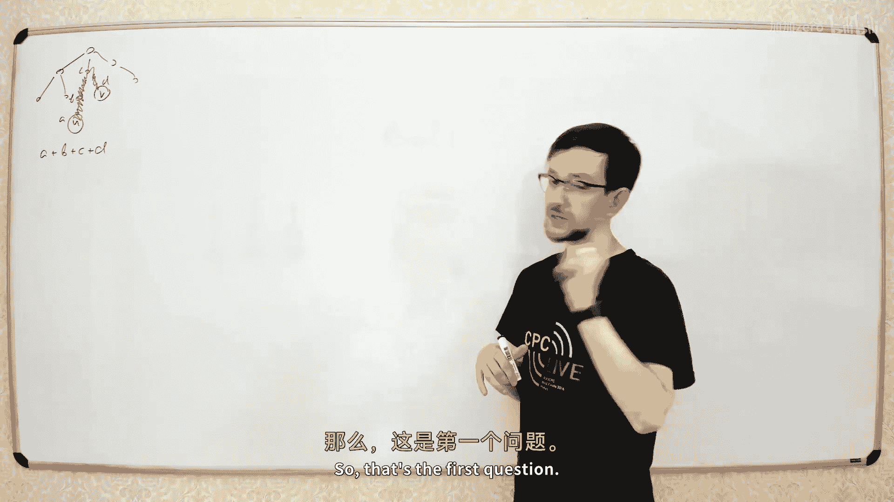

# 027：树链剖分 (Heavy-Light Decomposition)




在本节课中，我们将要学习一种处理树上路径查询与修改问题的强大技术——树链剖分。我们将学习如何将一棵树分解为若干条链，并利用线段树等数据结构高效地处理路径上的信息。

上一节我们讨论了如何利用倍增法或欧拉序结合RMQ来高效求解树上两点的最近公共祖先。本节中，我们来看看一个更一般的问题：如何在支持节点值修改的树上，快速查询任意两点路径上某种结合函数（如求和、求最小值）的结果。


## 问题定义

我们有一棵包含 N 个节点的树。每个节点 `v` 都有一个权值 `val[v]`。我们需要处理两种类型的请求：

1.  **修改请求**：将节点 `v` 的权值修改为 `x`。
    ```
    set(v, x): val[v] = x
    ```
2.  **查询请求**：给定两个节点 `u` 和 `v`，计算从 `u` 到 `v` 的路径上所有节点权值的某个**结合函数**（例如求和、求最小值）的结果。
    ```
    query(u, v): f(val[a], val[b], val[c], ...) 其中 a, b, c, ... 是 u->v 路径上的节点
    ```

如果只有查询请求，我们可以使用倍增法在 `O(log N)` 时间内完成。但引入修改请求后，我们需要一种能动态维护路径信息的数据结构。

## 从特殊情况入手：链

在解决一般树上的问题前，让我们先考虑一个最简单的特殊情况：如果这棵树是一条链（即“竹子”形状的树）。

在这种情况下，树退化为一个数组。我们的问题就变成了：
*   修改数组某个位置的值。
*   查询数组某个区间的结合函数值。

这恰好是**线段树**可以完美解决的问题，时间复杂度为 `O(log N)`。

这个简单的案例告诉我们，对于一般树，我们至少需要像线段树一样高效的数据结构。树链剖分的核心思想，就是将一棵树“拍平”成若干条链，然后在每条链上使用线段树。

## 树链剖分核心思想

树链剖分的目标是将树分解为若干条不相交的“重链”，使得从树根到任意节点的路径上，经过的重链数量不超过 `O(log N)` 条。

以下是实现树链剖分的步骤。

### 第一步：定义重儿子与重边

首先，我们需要为每个非叶子节点选择一个“重儿子”。为此，我们计算以每个节点为根的子树大小 `size[x]`。

对于一个节点 `x`，我们查看它的所有子节点 `y`。`size[y]` 最大的那个子节点被称为 `x` 的**重儿子**。连接 `x` 与其重儿子的边被称为**重边**。连接到其他子节点的边则称为**轻边**。

以下是计算子树大小和重儿子的递归伪代码：
```python
def dfs_size(x, parent):
    size[x] = 1
    max_size = 0
    for y in children of x:
        if y == parent: continue
        dfs_size(y, x)
        size[x] += size[y]
        if size[y] > max_size:
            max_size = size[y]
            heavy[x] = y  # 记录重儿子
```
这个过程可以在 `O(N)` 时间内完成。

### 第二步：形成重链

所有重边连接起来，形成了若干条从上到下的路径，我们称之为**重链**。每个节点都属于且仅属于一条重链。轻边则是连接不同重链的“桥梁”。

下图展示了一棵树被剖分成重链（加粗边连接）后的样子：


### 第三步：关键性质——轻边数量级

树链剖分高效的关键在于以下性质：**从树根到任意节点 `u` 的路径上，最多只有 `O(log N)` 条轻边**。

**证明思路**：考虑从节点 `u` 出发，沿着父节点不断走向根。每当我们经过一条轻边 `(p[u], u)`，就意味着 `u` 不是 `p[u]` 的重儿子。根据定义，`p[u]` 的重儿子所在的子树大小至少和以 `u` 为根的子树大小一样大。因此，当我们从 `u` 跳到 `p[u]` 时，所在的子树大小至少翻倍。由于子树大小最大为 `N`，所以翻倍的次数不会超过 `log₂ N` 次，即轻边数量为 `O(log N)`。

由于一条重链的端点由轻边决定，因此从根到 `u` 的路径最多被轻边分割成 `O(log N)` 条重链片段。

## 利用树链剖分处理查询

现在，我们来看如何利用剖分的结果回答 `query(u, v)`。

1.  设 `lca` 为 `u` 和 `v` 的最近公共祖先。路径 `u -> v` 可以拆分为 `u -> lca` 和 `lca -> v` 两段。
2.  考虑 `u -> lca` 这一段。我们不断地将 `u` 向上跳转到所在重链的顶端：
    *   如果 `u` 所在重链的顶端节点 `top[u]` 在 `lca` 的下方（即深度大于 `lca`），那么整段 `u` 到 `top[u]` 的路径都在查询路径上。我们可以用线段树快速查询这条重链片段上节点权值的函数结果，然后将 `u` 设置为 `top[u]` 的父节点。
    *   如果 `top[u]` 就是 `lca` 或其祖先，那么只需要查询 `u` 到 `lca` 在这条重链上的片段即可。
3.  对 `v -> lca` 这一段进行完全对称的操作。
4.  最后，将两段查询的结果用结合函数合并（注意顺序，如果函数不满足交换律，需要小心处理）。

由于每条重链上的节点编号是连续的（我们接下来会实现），所以查询重链片段就是在线段树上查询一个区间。每次跳跃都会跳到一条新的重链，而跳跃次数是 `O(log N)` 的，每次跳跃需要进行一次 `O(log N)` 的线段树查询。因此，一次 `query` 操作的总时间复杂度为 `O(log² N)`。

## 实现细节：简易编码法

理论可能略显复杂，但实现可以非常简洁。以下是一种高效的实现方法，它只使用**一个**线段树，而非每条重链一个。

### 1. 进行DFS并分配编号

我们进行两次DFS。
*   **第一次DFS**：计算每个节点的子树大小 `size`、深度 `depth`、父节点 `parent` 和重儿子 `heavy`。
*   **第二次DFS**：优先遍历重儿子，并为每个节点分配一个连续的编号 `pos[x]`。这个DFS的顺序保证了**每条重链上的节点编号是连续的**。

伪代码如下：
```python
def dfs1(x, p, d):
    parent[x] = p
    depth[x] = d
    size[x] = 1
    max_size = 0
    for y in graph[x]:
        if y == p: continue
        dfs1(y, x, d+1)
        size[x] += size[y]
        if size[y] > max_size:
            max_size = size[y]
            heavy[x] = y

def dfs2(x, top_node):
    top[x] = top_node        # 当前重链的顶端
    pos[x] = current_pos     # 分配编号
    current_pos += 1
    # 优先处理重儿子，保证重链编号连续
    if heavy[x] != -1:
        dfs2(heavy[x], top_node)
    # 处理其他轻儿子，每个轻儿子都是一条新重链的起点
    for y in graph[x]:
        if y == parent[x] or y == heavy[x]: continue
        dfs2(y, y)
```

### 2. 构建线段树

我们用 `pos[x]` 作为下标，将节点的权值 `val[x]` 填入数组 `arr` 中，即 `arr[pos[x]] = val[x]`。然后在这个数组 `arr` 上构建线段树，支持单点修改和区间查询。

### 3. 路径查询函数

以下是 `query(u, v)` 的核心代码，它同时完成了求LCA和路径信息聚合：
```python
def query_path(u, v):
    result = NEUTRAL  # 结合函数的单位元，如求和时为0，求最小值时为INF
    # 当u和v不在同一条重链上时
    while top[u] != top[v]:
        if depth[top[u]] < depth[top[v]]:
            u, v = v, u  # 保证u所在链顶端更深
        # 此时，top[u]一定比top[v]深。查询u到top[u]这段链
        result = combine(result, segtree_query(pos[top[u]], pos[u]))
        u = parent[top[u]]  # 跳到上一条链
    # 现在u和v在同一条重链上
    if depth[u] > depth[v]:
        u, v = v, u
    # 查询它们之间的部分
    result = combine(result, segtree_query(pos[u], pos[v]))
    return result
```
`set(v, x)` 操作非常简单，只需在线段树上更新 `pos[v]` 位置的值即可：`segtree_update(pos[v], x)`。

## 时间复杂度分析

*   **预处理**：两次DFS，`O(N)`。
*   **修改操作**：一次线段树单点更新，`O(log N)`。
*   **查询操作**：`while` 循环每次跳跃到一条新重链，跳跃次数为 `O(log N)`。每次跳跃需要进行一次 `O(log N)` 的线段树查询。总复杂度 `O(log² N)`。

## 总结

本节课中我们一起学习了树链剖分这一强大技术。我们首先定义了重儿子、重边和重链，并理解了其 `O(log N)` 跳跃次数的关键性质。然后，我们学习了如何通过两次DFS为节点分配连续编号，从而将树上路径查询转化为 `O(log N)` 个线段树区间查询，最终在 `O(log² N)` 的时间内处理带修改的树上路径查询问题。这种将树“拍平”并用线段树维护的思想，是解决许多复杂树上动态问题的基础。在接下来的课程中，我们将见识到更灵活、支持树形态修改的数据结构——Link-Cut Tree。