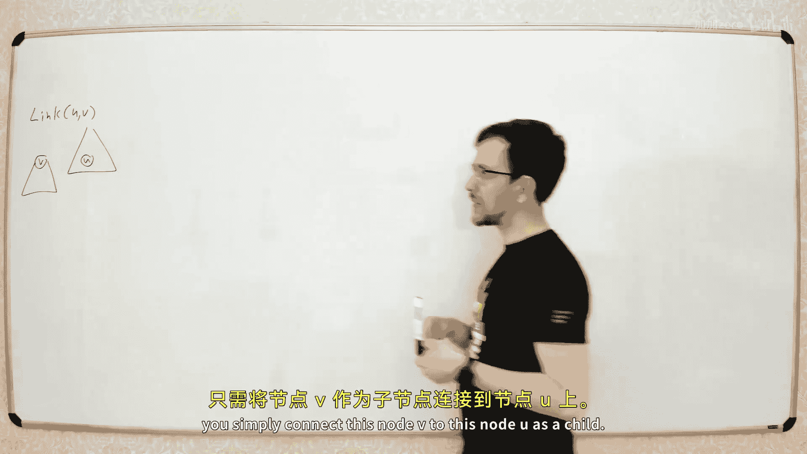
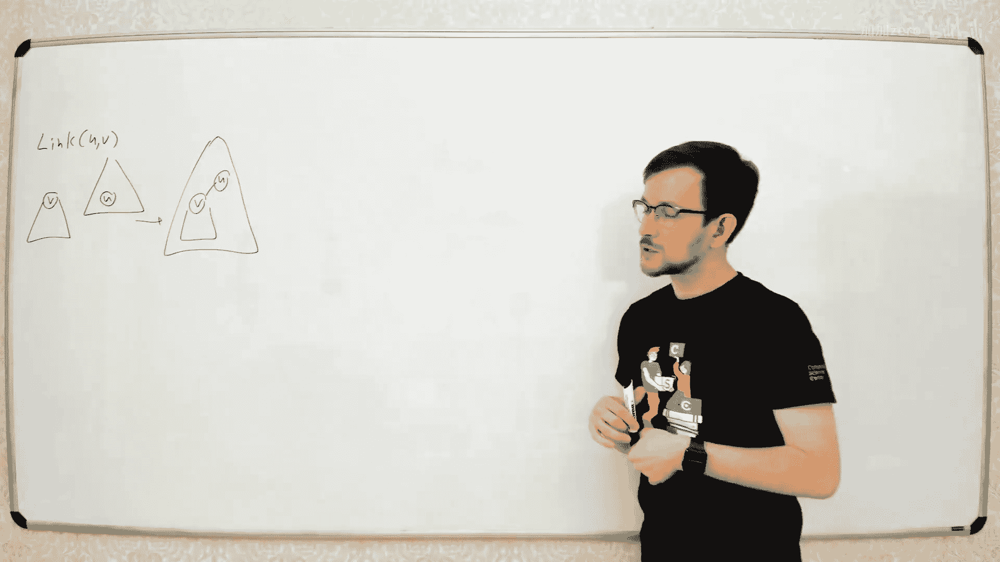
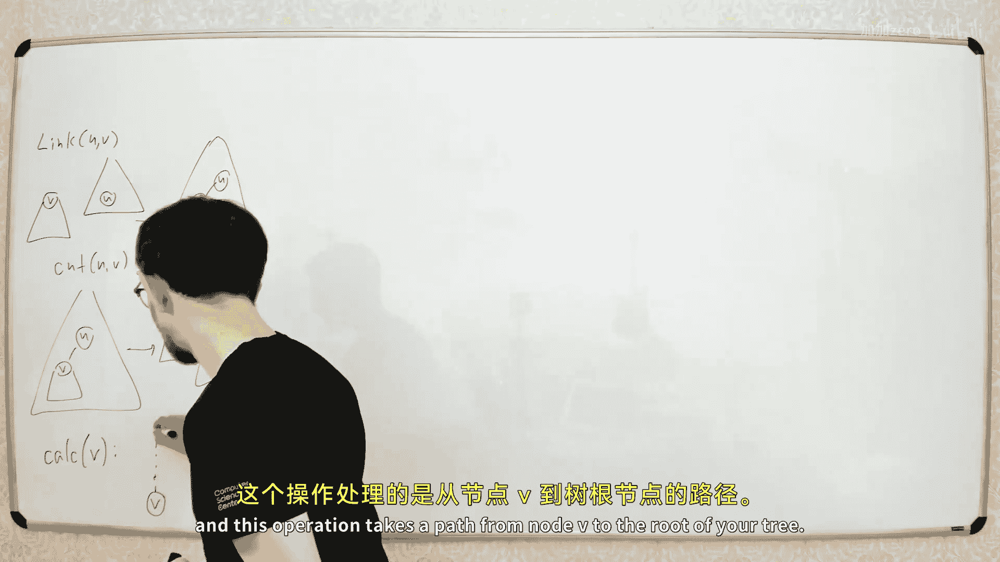
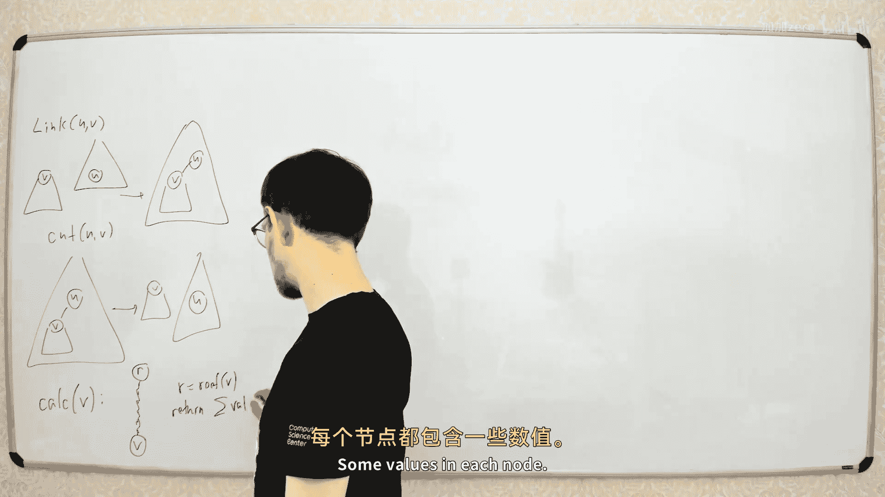
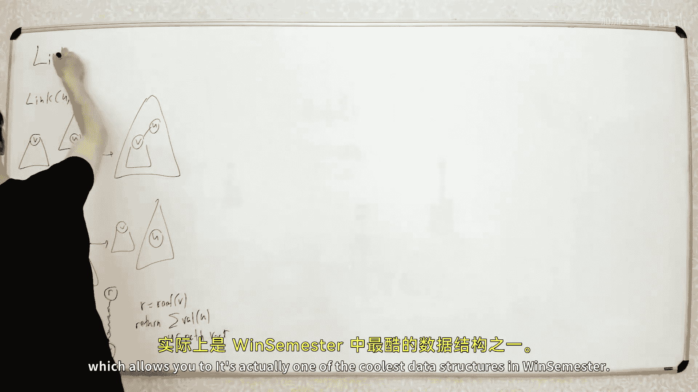
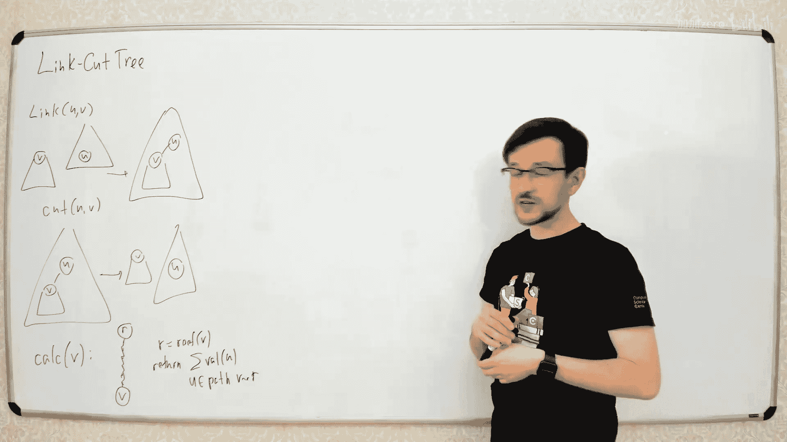
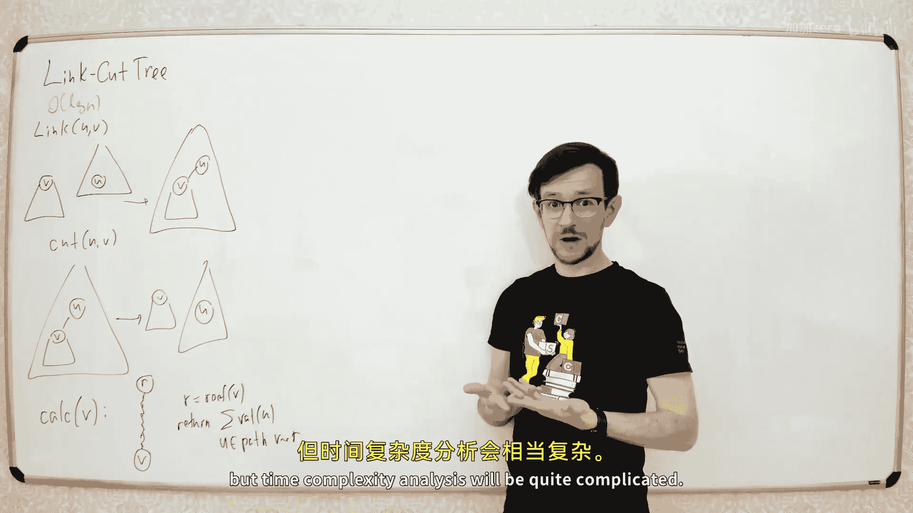

# 028：Link-Cut Tree








在本节课中，我们将学习一种强大的数据结构——Link-Cut Tree。它允许我们在一个动态变化的森林（一组树）上高效地执行三种核心操作：连接两棵树、切断一条边，以及在树中任意节点到根的路径上计算某个函数。我们将看到，这个结构虽然听起来复杂，但其核心思想非常巧妙，并且代码实现可以相当简洁。







上一节我们讨论了静态树上的路径查询。本节中，我们将升级这个结构，使其能够处理树结构的动态变化。



## 核心概念与问题定义

我们有一个由多棵树组成的森林。每棵树的每个节点上都有一个值。我们需要支持以下三种操作：

1.  **`link(u, v)`**: 将节点 `v` 所在树的根，连接到另一棵树的节点 `u` 上，成为 `u` 的一个子节点。前提是 `v` 必须是其所在树的根，且 `u` 和 `v` 原本不在同一棵树中。
    *   **公式描述**: `parent[v] = u` （将森林中两棵独立的树合并为一棵）。
2.  **`cut(v)`**: 将节点 `v` 与其父节点之间的边切断，使 `v` 及其子树成为一棵新的独立树木。
    *   **公式描述**: `parent[v] = null` （将一棵树分割成两棵）。
3.  **`query(v)`**: 计算从节点 `v` 到其所在树的根节点 `r` 的路径上所有节点值的某个**结合函数**（例如求和、求最小值、按位与等）。
    *   **公式描述**: 计算 `f(value[v], value[parent[v]], ..., value[r])`，其中 `f` 是结合函数。

我们的目标是让所有这些操作的时间复杂度都达到 **O(log n)**，其中 n 是节点总数。

## Link-Cut Tree 的核心思想：路径分解

Link-Cut Tree 的核心是将每棵树**分解成若干条路径**。这不是像“树链剖分”那样固定的、基于子树大小的“重路径”分解，而是一种可以**动态调整**的分解。

以下是分解规则：
*   对于树中的每个节点，我们最多可以**标记 (mark)** 它到其某个子节点的一条边。
*   只考虑被标记的边，整个树就会被分割成若干条链（路径），以及一些孤立的节点（可视为长度为1的路径）。

**示例**:
假设我们有一棵树，并标记了某些边（图中加粗边）。那么，所有加粗边会形成几条路径，未标记的边则连接着这些路径。
```
        1
       / \
      2   3
     / \   \
    4   5   6
       / \
      7   8
```
假设标记的边是 1-2, 2-5, 5-7。那么形成的路径有：
*   路径 A: 1 -> 2 -> 5 -> 7
*   路径 B: 3 -> 6 （假设边3-6被标记）
*   孤立节点: 4, 8

**关键点**：每条路径我们都用一个 **Splay Tree**（伸展树）来维护。Splay Tree 是一种自调整的二叉搜索树，它能高效地支持**合并**和**拆分**操作，这正是我们动态调整路径分解所需要的。

在 Link-Cut Tree 的内部表示中：
*   每个 Splay Tree 对应一条路径。
*   Splay Tree 中的**中序遍历顺序**，对应着路径从**上（靠近根）到下**的节点顺序。
*   对于非根的路径，其对应 Splay Tree 的**根节点**有一个额外的指针，指向该路径在整棵树中的**父节点**（即连接这条路径和上方路径的那个节点）。

## 关键操作：`expose(v)`

Link-Cut Tree 最核心的操作是 `expose(v)`。它的作用是：**将从节点 `v` 到树根的路径上的所有边都标记出来**。

**为什么需要 `expose`？**
在执行 `query(v)` 时，我们需要计算 `v` 到根的路径。如果这条路径上的所有边都被标记了，那么根据我们的分解规则，`v` 和根节点就一定在**同一条路径**上，也就是在**同一个 Splay Tree** 中。这样，我们只需要在这个 Splay Tree 的根节点上维护的聚合信息，就能立刻得到查询结果。

**`expose(v)` 如何工作？**
算法从节点 `v` 开始，自底向上地处理，确保 `v` 到根的路径成为一条连续的、被标记的路径。

以下是 `expose` 操作的伪代码描述：
```python
def expose(v):
    splay(v)                 # 将v旋转到其所在Splay Tree的根
    v.right = None           # 断开v的右子树（右子树对应路径上v下方的部分，我们不需要）
    while v.parent is not None: # 当v还有路径上方的父节点时
        u = v.parent         # u是v当前路径连接的上方节点
        splay(u)             # 将u旋转到其所在Splay Tree的根
        # 此时u的右子树是其原路径中在u下方的部分，我们需要先断开它（相当于取消标记一条边）
        u.right = None
        # 然后将v所在的整条路径（现在是一个Splay Tree）作为u的右子树连接上（相当于标记u-v边）
        u.right = v
        splay(v)             # 再次将v旋转到根，为下一次循环做准备
```
**过程图解**:
1.  初始状态，路径是分散的。
2.  `splay(v)`，使 `v` 成为其所在路径 Splay 的根。
3.  找到 `v` 所在路径连接的父节点 `u`。
4.  `splay(u)`，使 `u` 成为其所在路径 Splay 的根。
5.  断开 `u` 的右子树（取消 `u` 原来可能标记的到另一个子节点的边）。
6.  将 `v` 所在的 Splay Tree 作为 `u` 的右子树连接（标记 `u-v` 边）。现在 `u` 和 `v` 就在同一个 Splay Tree 中了。
7.  重复这个过程，直到 `v` 到达整棵树的根。

执行完 `expose(v)` 后，`v` 到根的整条路径就在一个 Splay Tree 中，且 `v` 是这个 Splay Tree 的根（通过最后的 `splay(v)`）。

## 三大操作的实现

基于 `expose` 操作，我们可以非常简洁地实现三个核心操作。

### 1. 查询 `query(v)`
1.  调用 `expose(v)`。
2.  此时，`v` 是包含其到根整条路径的 Splay Tree 的根。
3.  直接返回该 Splay Tree 根节点上维护的聚合值（例如子树和、最小值等）。

### 2. 连接 `link(u, v)`
前提：`v` 是某棵树的根，且 `u` 和 `v` 不在同一棵树中。
1.  调用 `expose(v)`。确保 `v` 是其所在 Splay Tree 的根，且没有右子树（即 `v` 下方没有其他节点）。
2.  调用 `expose(u)`。确保 `u` 是其所在 Splay Tree 的根。
3.  将 `v` 的父亲指针设置为 `u`。这相当于在 `u` 和 `v` 之间添加了一条**未标记**的边。
    *   **代码描述**: `v.parent = u`

### 3. 切断 `cut(v)`
1.  调用 `expose(v)`。确保 `v` 是其所在 Splay Tree 的根。
2.  此时，`v` 的左子树（如果存在）就是原树中 `v` 到根路径上 `v` 以上的部分。`v` 的右子树是 `v` 的子孙（但根据 `expose` 性质，此时 `v.right` 应为 `None`）。
3.  断开 `v` 与其左子树的连接。这相当于取消了 `v` 与其父节点之间边的标记，并完成了切割。
    *   **代码描述**: `v.left.parent = None; v.left = None`

## 时间复杂度分析（摊销 O(log n)）

`expose(v)` 操作的时间主要花费在循环中的 `splay` 操作上。每个 `splay` 操作的摊销时间复杂度是 **O(log n)**。

关键在于，一次 `expose` 中可能调用多次 `splay`。我们需要证明所有 `splay` 操作的总摊销时间仍然是 **O(log n)**，而不是 O(k log n)（k 是路径上的边数）。

**直观理解（非严格证明）**:
我们可以借助“树链剖分”中“轻边/重边”的概念来辅助分析。为森林定义一个固定的“重链剖分”。在 `expose` 过程中，每次循环我们标记一条边 (`u-v`)，同时可能取消标记 `u` 原来连接的另一条边。

*   如果被标记的边是**重边**，那么这次操作减少了“未标记的重边”数量。
*   如果被标记的边是**轻边**，那么这次操作可能增加“未标记的重边”数量（因为取消了 `u` 原来可能连接的一条重边）。

我们定义一个**势能函数**：`Φ = (未标记的重边数量) * log n`。
*   标记一条重边：势能减少 `log n`。
*   标记一条轻边：势能最多增加 `log n`。

一次 `expose` 的实际操作代价约为 `k * log n`（k次splay）。其**摊销代价** = 实际代价 + 势能变化。
*   假设标记了 `x` 条重边和 `y` 条轻边 (k = x + y)。
*   势能变化约为 `-x*log n + y*log n`。
*   摊销代价 ≈ `(x+y)*log n + (-x+y)*log n = 2y*log n`。

根据重链剖分的性质，任意路径上的轻边数量 `y` 不超过 `log n`。因此，摊销代价为 **O(log² n)**。通过更精细地结合 Splay Tree 本身的摊销分析（势能定义为节点的“秩”之和），可以进一步将摊销代价优化到 **O(log n)**。详细证明较为复杂，但结论是：`link`, `cut`, `query` 操作的**摊销时间复杂度均为 O(log n)**。

## 总结

本节课我们一起学习了 Link-Cut Tree 这一用于维护动态森林的强大数据结构。

*   **核心思想**：通过动态的路径分解，将树分解为用 Splay Tree 维护的路径集合。
*   **关键操作**：`expose(v)` 是基石，它通过一系列 Splay 操作，将指定节点到根的路径整合到同一个 Splay Tree 中。
*   **操作实现**：
    *   `query(v)`: `expose(v)` 后从 Splay 根节点获取信息。
    *   `link(u, v)`: 对 `u` 和 `v` 分别 `expose`，然后设置父指针。
    *   `cut(v)`: `expose(v)` 后断开其与左子树的连接。
*   **时间复杂度**：所有核心操作的**摊销时间复杂度均为 O(log n)**。

Link-Cut Tree 巧妙结合了路径分解、Splay Tree 的自调整特性以及摊销分析，是算法竞赛和高级数据结构课程中的经典内容。虽然初次接触可能觉得复杂，但理解了其核心思想后，你会发现它的设计非常精妙。