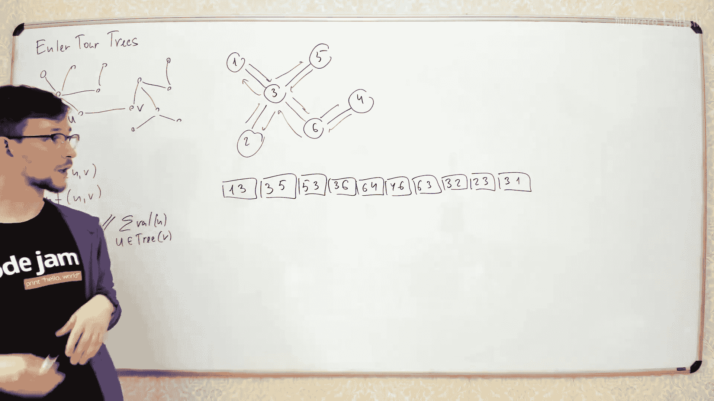
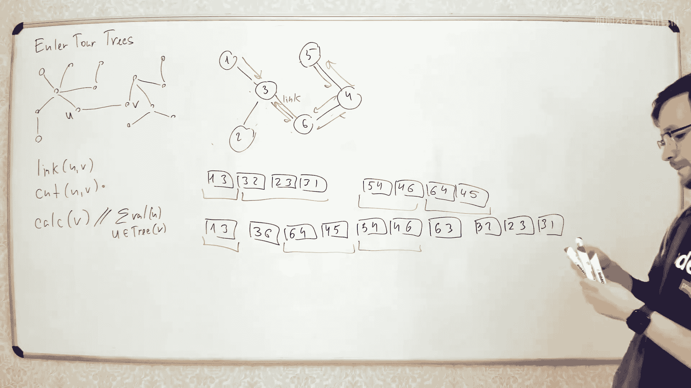
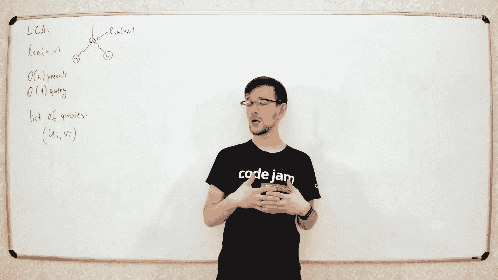
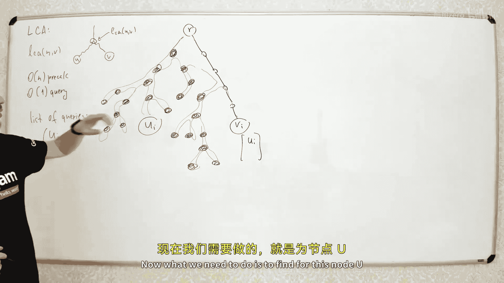
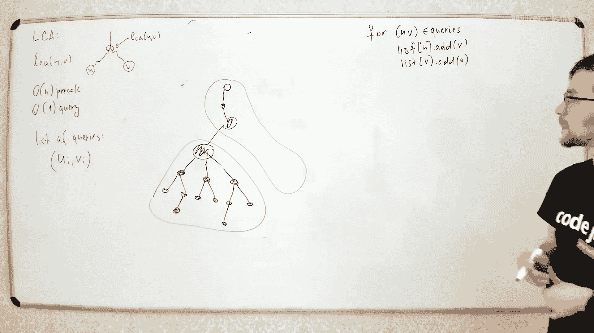

# 029：欧拉回路树与Tarjan算法

在本节课中，我们将学习两种处理树结构的重要技术。首先，我们将探讨欧拉回路树，这是一种支持动态连接和切割边，并能高效计算树上聚合函数的数据结构。随后，我们将学习Tarjan的离线LCA算法，这是一种在实践中非常高效且易于实现的技术，用于快速求解多组节点的最近公共祖先问题。

---

## 欧拉回路树：概念与表示

上一节我们介绍了处理动态树问题的需求。本节中，我们来看看如何利用欧拉回路来表示一棵树。

欧拉回路是对树的一种遍历方式，它从某个节点出发，沿着每条边恰好走两次（一去一回），最终回到起点，形成一个边的序列。这个序列包含了树的所有边信息。

对于一个无根树，我们可以从任意节点开始构建其欧拉回路。例如，对于下图中的树，从节点1开始的一个可能的欧拉回路边序列是：`(1,3)`, `(3,5)`, `(5,3)`, `(3,2)`, `(2,3)`, `(3,1)`。

这个边序列就是树的欧拉回路表示。我们将利用这个序列作为树的核心表示，并在此基础上支持动态操作。

---

## 支持的操作：连接、切割与查询

欧拉回路树需要支持三种核心操作，这与动态树问题（如Link-Cut Tree）类似，但实现更简单。

以下是三种操作的定义：
1.  **连接**：给定两个不同树中的节点 `u` 和 `v`，在它们之间添加一条边，将两棵树合并为一棵。
2.  **切割**：给定一棵树中的一条边 `(u, v)`，移除这条边，将树分割成两棵独立的树。
3.  **查询**：给定一个节点 `v`，计算其所在整棵树上所有节点（或边）的某个聚合函数值（如求和、求最小值）。

---

## 数据结构实现：使用伸展树

为了高效地分割和合并欧拉回路序列，我们使用伸展树来维护这个序列。序列中的每个元素（边）对应伸展树中的一个节点。

因此，一棵树的欧拉回路就对应一棵伸展树。对树的操作将转化为对伸展树的分裂与合并操作。

---

## 切割操作详解

假设我们要切割边 `(3,6)`。在欧拉回路序列中，这条边会出现两次：一次是 `(3,6)`，一次是 `(6,3)`。

切割操作的步骤如下：
1.  在伸展树中找到代表边 `(3,6)` 的节点，并通过伸展操作将其变为根节点。
2.  将根节点的左子树和右子树分裂开。左子树对应原序列中 `(3,6)` 之前的部分，右子树对应之后的部分。
3.  类似地，在伸展树中找到代表边 `(6,3)` 的节点，将其变为根并分裂其左右子树。
4.  此时，我们得到了三个子树片段：`A`（`(3,6)`之前）、`B`（`(3,6)`和`(6,3)`之间）、`C`（`(6,3)`之后）。
5.  片段 `B` 就是被切割下来的小树的欧拉回路。
6.  将片段 `A` 和片段 `C` 合并，就得到了剩余大树的欧拉回路。

通过几次伸展树的分裂与合并，我们就在 `O(log n)` 时间内完成了切割操作。

---

## 连接操作详解

连接操作是切割的逆过程。假设我们要连接两棵独立的树，分别在节点 `3` 和节点 `6` 处添加边 `(3,6)`。

设第一棵树的欧拉回路序列为 `T1`，第二棵为 `T2`。连接操作的步骤如下：
1.  在 `T1` 对应的伸展树中，找到代表节点 `3` 的任意位置（例如边 `(1,3)` 的节点），并将其分裂为左右两部分 `L1` 和 `R1`。
2.  在 `T2` 对应的伸展树中，找到代表节点 `6` 的任意位置，并将其分裂为左右两部分 `L2` 和 `R2`。
3.  新的大树的欧拉回路可以通过按顺序合并以下片段构成：`L1` -> 新边 `(3,6)` -> `L2` -> `R2` -> 新边 `(6,3)` -> `R1`。
4.  通过伸展树的合并操作，我们可以高效地构建出这个新序列。

为了快速定位节点在序列中的位置，一个巧妙的实现技巧是：在欧拉回路序列中不仅存储边，也存储节点。这样，每个节点在伸展树中都有一个明确的代表节点，查找和分裂操作就变得非常直接。

---

## 查询操作实现

查询操作是欧拉回路树简单性的体现。由于整棵树的欧拉回路完全由一棵伸展树维护，而伸展树天然支持区间查询。

实现方法如下：
*   如果值存储在树的**节点**上，则在构建欧拉回路序列时，为每个节点创建一个对应的伸展树节点，并赋予其节点值；为每条边创建的节点则赋予中性值（如0）。
*   如果值存储在树的**边**上，则反之。
*   当需要查询节点 `v` 所在整棵树的聚合值时，我们只需查询代表整棵树的伸展树的根节点存储的聚合值即可。因为伸展树每个节点都维护了其子树的聚合值，根节点就维护了整个序列（即整棵树）的聚合值。

因此，查询操作可以在 `O(1)` 或 `O(log n)` 时间内完成（取决于伸展树是否需要在查询后调整）。

---

## Tarjan离线LCA算法

现在，我们转换话题，来看一个解决最近公共祖先问题的经典离线算法——Tarjan算法。它基于深度优先搜索和并查集，实现非常简洁。

---

## 算法核心思想

Tarjan算法要求所有查询 `(u, v)` 预先已知。算法对树进行一次深度优先遍历，并在回溯的过程中利用并查集来回答查询。

核心思想是：当遍历到节点 `v` 时，对于所有形如 `(u, v)` 的查询，如果 `u` 已经被访问过，那么 `u` 和 `v` 的 LCA 就是 `u` 当前所在集合的代表元（即 `u` 向上走最先遇到的未完全回溯的祖先）。

---

## 算法步骤

以下是算法的具体步骤：
1.  **预处理**：为每个节点 `v` 建立一个列表，存放所有与 `v` 相关的查询 `(u, v)`。
2.  **深度优先遍历**：从根节点开始进行DFS。
3.  **访问节点**：当首次访问节点 `v` 时，将其标记为“正在访问”。
4.  **处理子节点**：递归地遍历 `v` 的所有子节点。
5.  **回答查询**：在处理完 `v` 的所有子节点后，遍历 `v` 的查询列表。对于每个查询 `(u, v)`：
    *   如果 `u` 已经被访问过且已经完成了回溯（即不在当前路径上），则此时 `u` 所在集合的代表元就是 `u` 和 `v` 的 LCA。记录答案。
6.  **回溯与合并**：在节点 `v` 的所有处理完成后，将 `v` 与其父节点在并查集中合并。这表示 `v` 及其子树的所有节点，它们的“向上最先遇到的未回溯祖先”变成了 `v` 的父节点。
7.  **完成**：当遍历完整棵树后，所有查询的答案都已得出。

---

## 时间复杂度和优势

Tarjan算法的时间复杂度为 `O(n + m * α(n))`，其中 `n` 是节点数，`m` 是查询数，`α` 是反阿克曼函数，增长极其缓慢，在实际应用中可视为常数。

虽然理论上存在 `O(n + m)` 的在线算法，但Tarjan算法的常数因子非常小，且代码简洁，因此在实践中往往效率更高。它也是许多需要离线处理树上路径问题的基础。

---

## 总结

本节课中我们一起学习了两种强大的树算法。
1.  我们首先学习了**欧拉回路树**，它通过将树的欧拉回路序列用伸展树维护，优雅地支持了动态树的连接、切割和子树聚合查询操作，代码实现相对直观。
2.  接着，我们学习了**Tarjan离线LCA算法**，它利用深度优先遍历和并查集，以近乎线性的时间复杂度高效地回答了大量预知的最近公共祖先查询，是实践中不可或缺的利器。

掌握这两种算法，将极大地增强你处理复杂树形数据结构问题的能力。