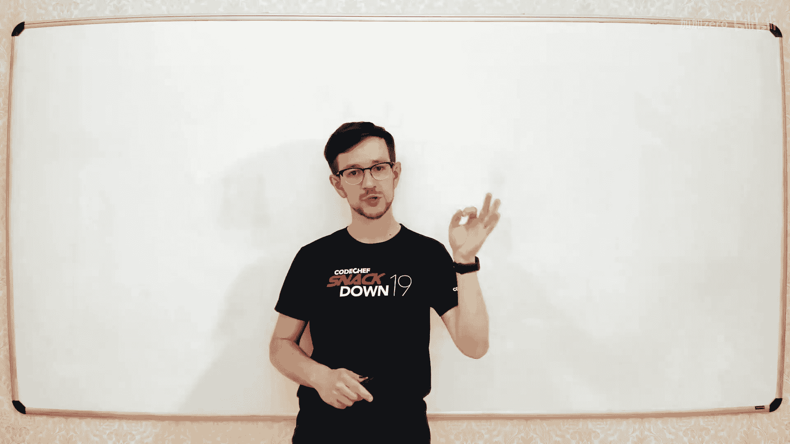
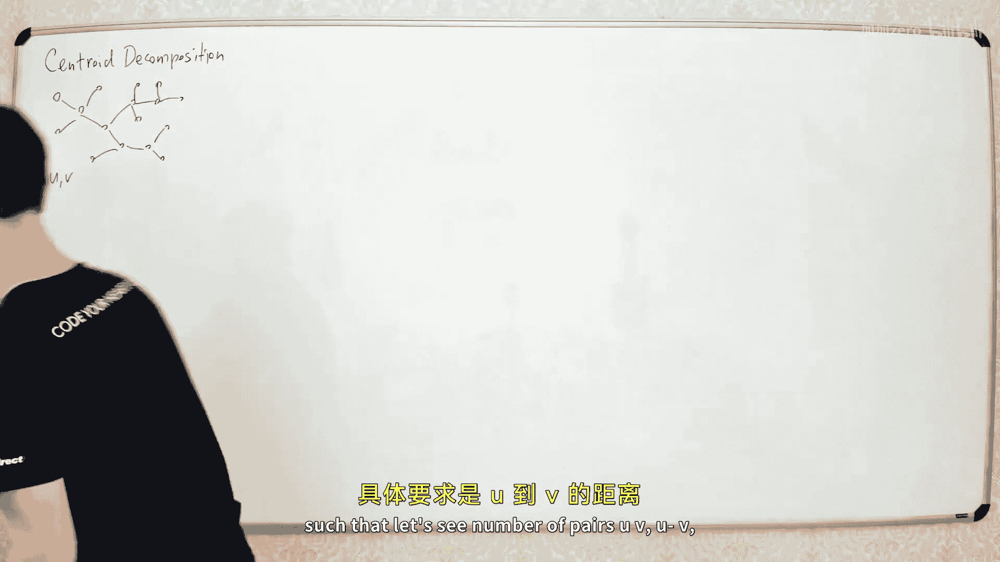
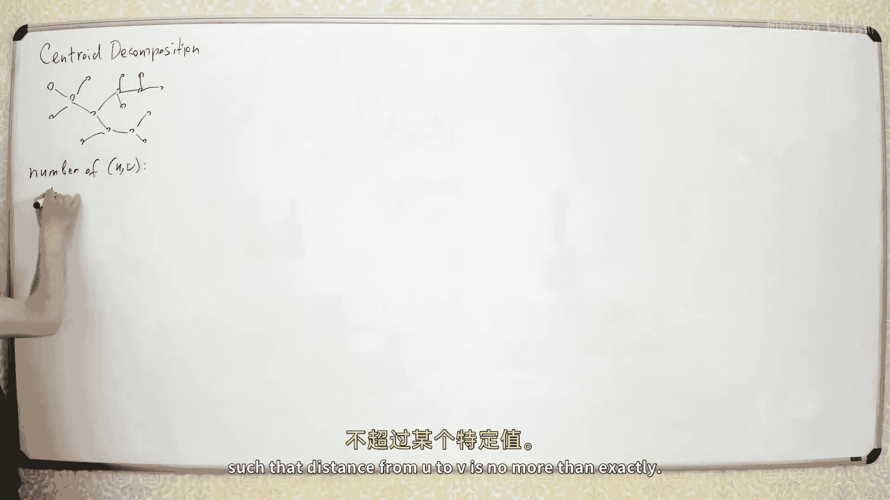
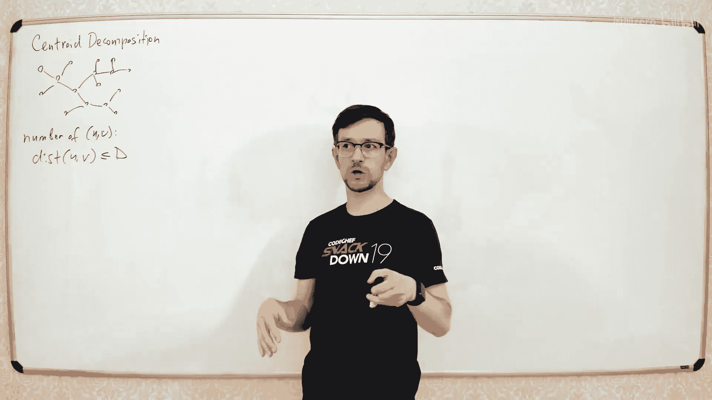
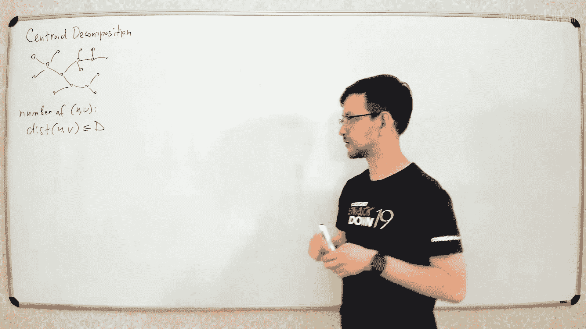
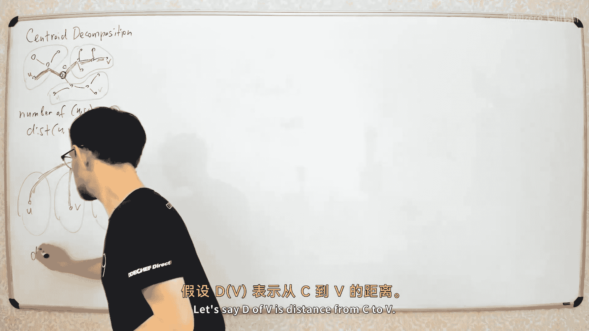

# 030：重心分解 🌳













在本节课中，我们将要学习一种用于处理树形结构的高级技巧——重心分解。重心分解是一种“分而治之”的策略，它允许我们高效地解决两类常见问题：一类是计算树中所有路径的某种属性，另一类是在树的某个区域内回答在线查询。我们将通过简单的例子来理解其核心思想，并学习如何实现它。




## 什么是重心分解？🤔

重心分解是一种将树递归地分解为更小子结构的方法。其核心是找到一个称为“重心”的特殊节点。

**定义**：对于一棵有 `n` 个节点的树，一个节点 `c` 被称为重心，当且仅当移除该节点后，产生的每个连通分量的大小都不超过 `n/2`。

一个重要的性质是：**任何树都至少有一个重心**。我们可以通过一个简单的算法在线性时间内找到它。

## 如何找到重心？🔍

上一节我们介绍了重心的定义，本节中我们来看看如何高效地找到它。算法步骤如下：

1.  从任意节点（例如节点 `v`）开始，进行深度优先搜索（DFS），计算以每个节点为根的子树大小。
2.  检查当前节点 `v`。如果对于 `v` 的每一个子节点 `u`，其子树大小 `size[u] <= n/2`，并且 `n - size[v] <= n/2`（即 `v` “上方”的部分也不超过 `n/2`），那么 `v` 就是重心。
3.  如果 `v` 不是重心，那么必然存在一个子节点 `u`，其子树大小 `size[u] > n/2`。此时，重心必然在子树 `u` 中。我们令 `v = u`，并重复步骤 2。

以下是查找重心的伪代码：

```python
def find_centroid(v, parent, total_size):
    size[v] = 1
    is_centroid = True
    for u in neighbors[v]:
        if u != parent and not removed[u]:
            find_centroid(u, v, total_size)
            size[v] += size[u]
            if size[u] > total_size // 2:
                is_centroid = False
    if total_size - size[v] > total_size // 2:
        is_centroid = False
    if is_centroid:
        centroid = v
```

## 重心分解的构建 🏗️

找到重心后，我们就可以递归地构建整个分解结构。过程如下：

1.  找到当前树（或子树）的重心 `c`。
2.  将节点 `c` “移除”（标记为已处理），原树被分割成若干个互不相连的连通分量。
3.  对每一个连通分量，递归地执行步骤 1 和 2。

这个过程会形成一棵以重心为节点的“分解树”。每个原始节点都会出现在从根到叶子的某条路径上，且这条路径的长度不超过 `O(log n)`。

## 应用一：处理所有路径问题 🛤️

上一节我们构建了分解结构，本节中我们来看看如何利用它解决第一类问题：计算树中所有路径的某种属性。我们以计算“距离不超过 K 的节点对数量”为例。

**思路**：利用分治思想。对于当前子树的重心 `c`：
*   所有不经过 `c` 的路径，必然完全包含在某个子分量中，可以通过递归调用解决。
*   所有经过 `c` 的路径 `(u, v)`，可以拆分为 `u->c` 和 `c->v` 两段。问题转化为：在 `c` 的不同子分量中，寻找满足 `dist(c, u) + dist(c, v) <= K` 的节点对 `(u, v)`。

以下是计算经过重心 `c` 的合法路径数量的方法：

1.  预处理从重心 `c` 到其所在子树中所有节点的距离。
2.  收集所有子分量中的节点距离，形成一个数组，并排序。
3.  对于每个子分量：
    *   先计算在整个数组中，有多少节点 `v` 满足 `dist(c, v) <= K - dist(c, u)`（使用二分查找）。
    *   再减去在本子分量内部满足该条件的节点数（避免重复计算同一分量内的点对，因为它们在递归中已处理）。
4.  将结果累加。

这样，每一层递归的总时间复杂度为 `O(n log n)`，递归深度为 `O(log n)`，总时间复杂度约为 `O(n log² n)`。若能在线性时间内完成合并，则可优化至 `O(n log n)`。

## 应用二：回答区域查询问题 📍

第二类问题是：在线回答形如“在节点 `v` 距离 `D` 范围内，所有节点的某种属性（如最小值、和）”的查询。

**思路**：利用分解的层次结构进行预处理。对于每个原始节点 `v`，我们预处理出它在分解树中所有祖先重心（即包含 `v` 的各级子分量的重心）列表，以及 `v` 到这些重心的距离。

当查询 `(v, D)` 到来时：
1.  我们遍历 `v` 对应的所有重心祖先 `c_i`。
2.  对于每个重心 `c_i`，合法的节点 `u` 需满足：`dist(v, c_i) + dist(c_i, u) <= D`，即 `dist(c_i, u) <= D - dist(v, c_i)`。
3.  对于每个重心 `c_i`，我们已经预处理了其所在分量中所有节点到它的距离，并排序存储。我们只需在该数组中二分查找满足上式的节点数量或计算其属性（如最小值、前缀和等）。

由于每个节点所属的重心祖先不超过 `O(log n)` 个，因此每次查询的时间复杂度为 `O(log² n)`（若使用 `O(1)` 查询的数据结构维护前缀信息，可降至 `O(log n)`）。

**注意**：若要计算“和”等可减属性，在计算重心 `c_i` 的贡献时，需减去与 `v` 处于 `c_i` 同一子分量的那些节点的贡献，以避免重复计算。这可以通过为每个子分量单独维护一个有序数组来实现。

## 总结 📚

本节课中我们一起学习了树的重心分解技术。
*   我们首先学习了**重心**的定义和高效的查找算法。
*   接着，我们了解了如何递归地**构建重心分解**，形成一棵深度为 `O(log n)` 的分解树。
*   然后，我们探讨了重心分解的两大主要应用：
    1.  **处理所有路径问题**：通过“分治-合并”的策略，将路径按是否经过重心分类处理，典型时间复杂度为 `O(n log² n)`。
    2.  **回答区域查询问题**：通过预处理每个节点到其所有重心祖先的距离，将树上区域查询转化为多个关于重心距离的二分查找，典型单次查询时间复杂度为 `O(log² n)`。

重心分解是一个强大的工具，它将树的结构以平衡的方式层层分解，使得许多复杂问题得以高效解决。掌握其核心思想后，你可以尝试用它来解决更多有趣的树上问题。