# 031：外部存储算法 🗃️

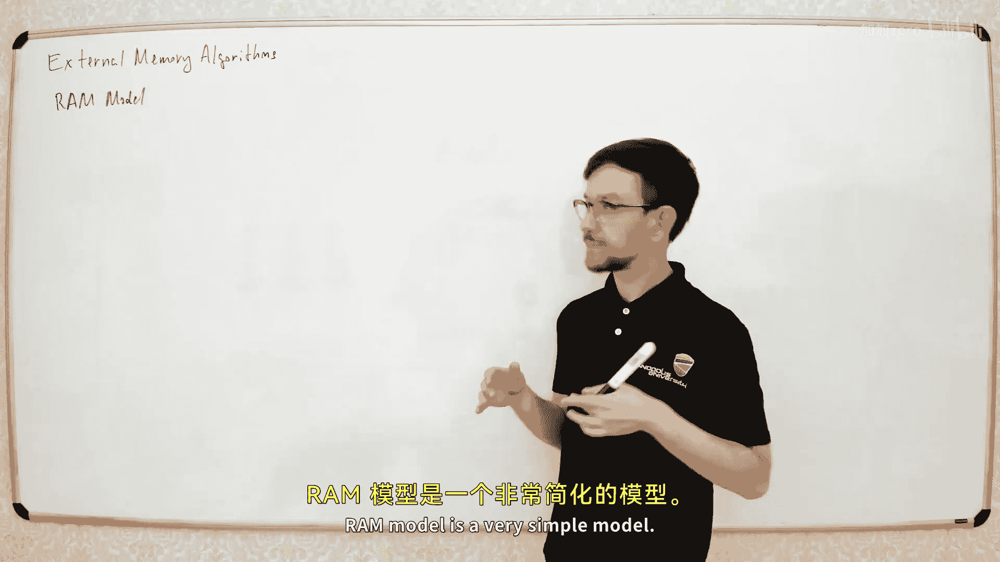

在本节课中，我们将要学习**外部存储算法**。我们将了解为什么需要这种特殊的算法模型，它与我们熟悉的RAM模型有何不同，并学习如何设计适用于处理海量数据的算法。

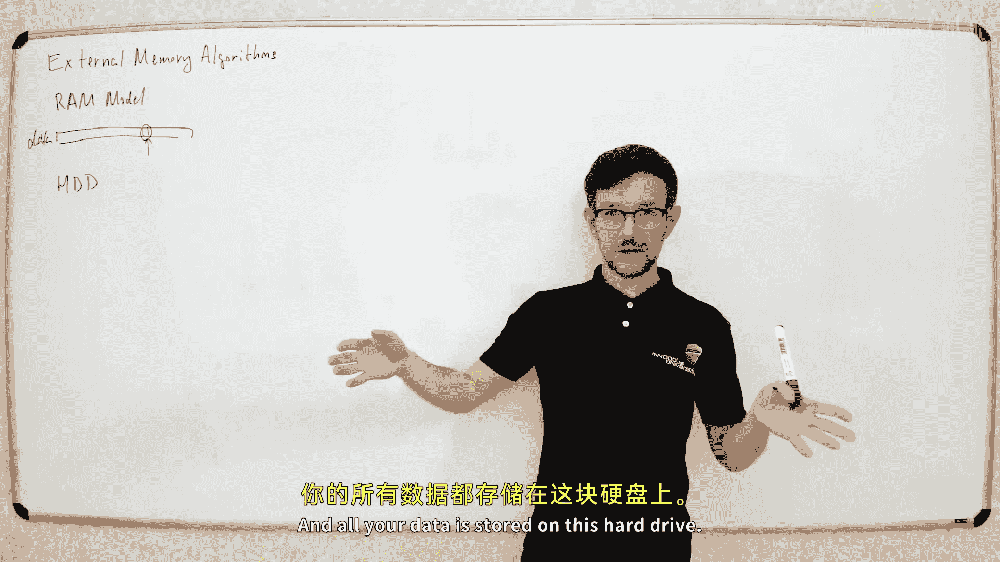

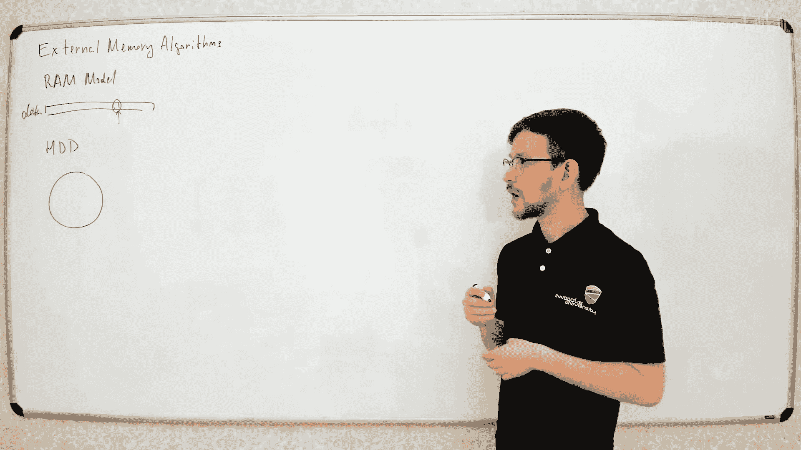

## 概述：为什么需要外部存储算法？

通常，当我们讨论算法时，我们工作在**RAM模型**中。在这个模型中，我们假设所有数据都存储在一个大的内存数组中，并且可以在常数时间内访问任何数据。这个模型对于标准计算机程序来说非常合适。

但是，有时数据量太大，无法全部放入内存。这时，数据必须存储在**外部存储设备**上，例如硬盘。硬盘的物理结构与内存不同，访问数据的方式也大相径庭。

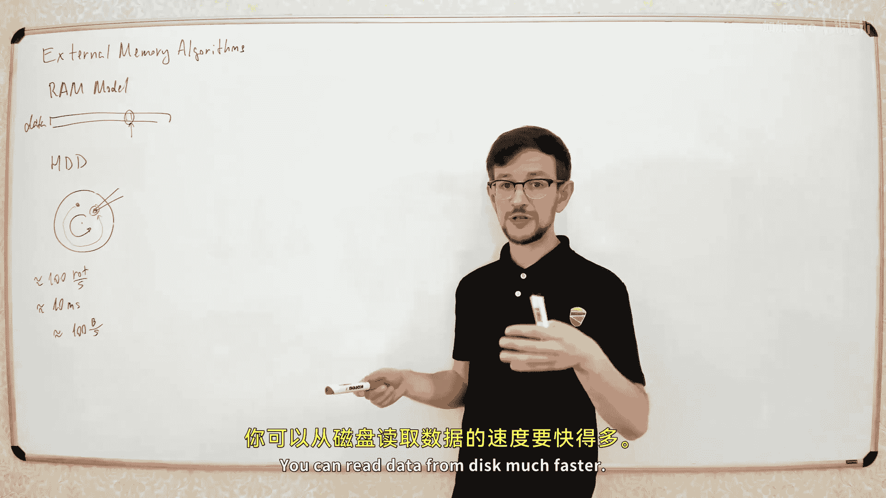

## 硬盘的工作原理与访问延迟

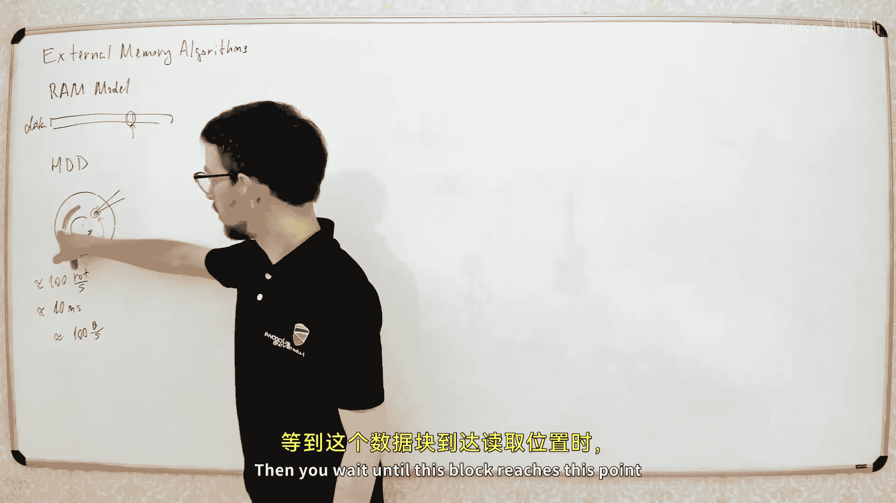

硬盘由一个高速旋转的盘片和一个读写磁头组成。数据分布在盘片表面。磁头只能读取其当前位置下方的数据。

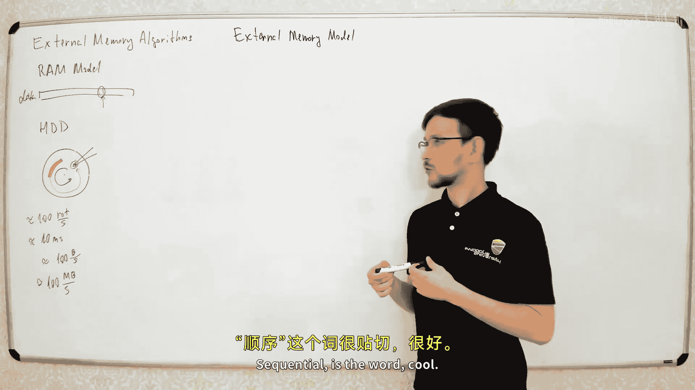

当你需要访问硬盘上的某个特定数据时，磁头必须等待盘片旋转，直到目标数据移动到磁头下方。这个等待时间，称为**寻道时间**，大约为10毫秒。

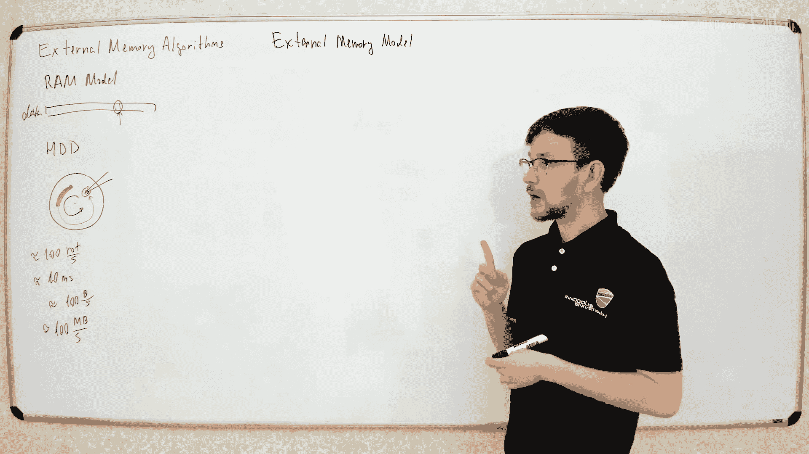

10毫秒看似很短，但现代CPU每秒可以执行数十亿次操作。相比之下，如果每次只读取一个字节，那么读取速度将非常慢，大约只有100字节/秒。

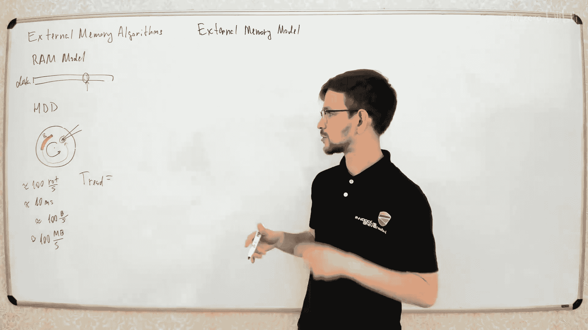

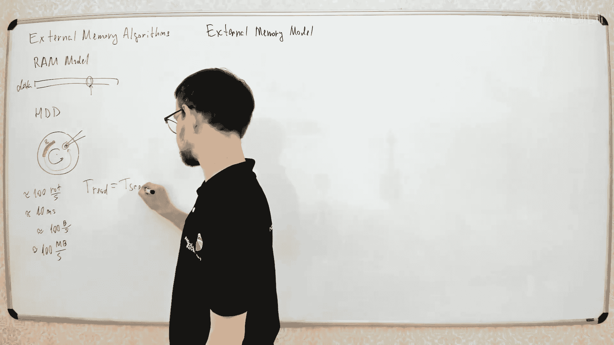

然而，硬盘可以**连续读取**大块数据。一旦磁头定位到数据块的起始位置，它就可以高速连续读取整个块。典型的连续读取速度可以达到约100 MB/秒。

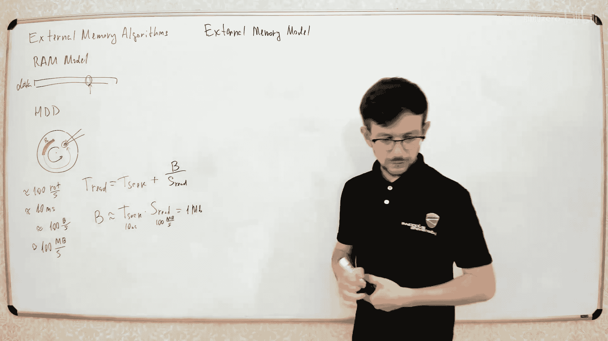

因此，**连续读取**的速度比**随机访问**单个字节快大约**一百万倍**。这个巨大的差异意味着RAM模型在处理外部存储数据时不再适用。

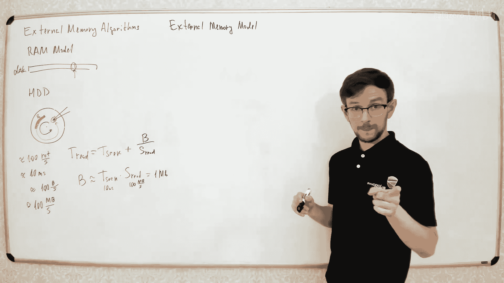

## 外部存储模型

为了简化问题并设计高效的算法，我们引入**外部存储模型**。这个模型抽象了硬盘的关键特性：

1.  数据存储在**外部存储**（如硬盘）中。
2.  我们有一个有限的**内部内存**（大小记为 **M**），可以快速访问。
3.  数据在内部内存和外部存储之间以**固定大小的块**（大小记为 **B**）进行传输。
4.  我们只关心**输入/输出（I/O）操作**的次数，即读取或写入一个块的次数。在内部内存中进行的计算被认为是免费的（零时间）。

该模型有两个关键参数：内存大小 **M** 和块大小 **B**。算法的时间复杂度将表示为包含 **N**（数据总量）、**M** 和 **B** 的公式。

上一节我们介绍了外部存储模型的基本概念，本节中我们来看看如何在这个模型下进行简单的计算。

## 扫描：计算数组元素之和

假设我们有一个大小为 **N** 的数组存储在外部硬盘上，我们想计算所有元素的总和。

在RAM模型中，我们只需遍历数组，将每个元素加到累加器中。时间复杂度是 **O(N)**。

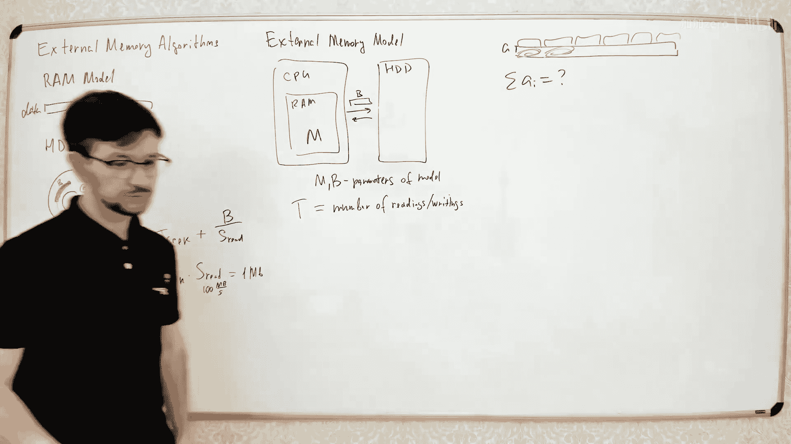

在外部存储模型中，我们不能逐个元素访问，而必须按块读取。我们将数组分成若干个大小为 **B** 的块。

以下是计算步骤：
1.  从硬盘读取第一个块到内部内存。
2.  在内存中计算这个块内所有元素的和。
3.  重复步骤1和2，直到处理完所有块。
4.  将所有块的和相加得到最终结果。

这个算法需要读取 **N/B** 个块（假设N是B的倍数）。因此，I/O复杂度是 **O(N/B)**。与RAM模型的O(N)相比，这实际上快了 **B** 倍，因为每次I/O操作都带来了B个数据项。

## 排序：外部归并排序

排序是数据处理的核心操作。我们如何在外部存储模型中高效地排序呢？

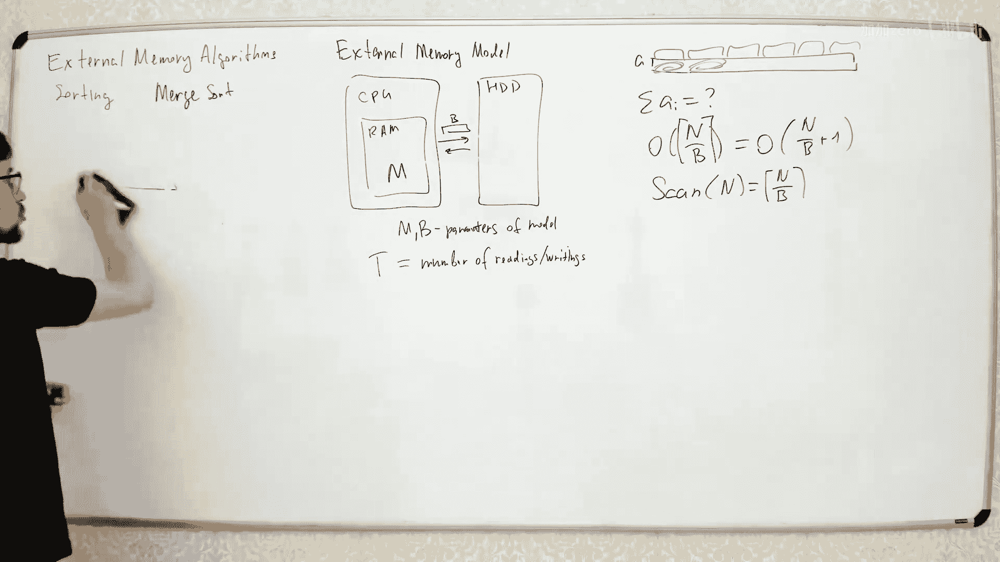

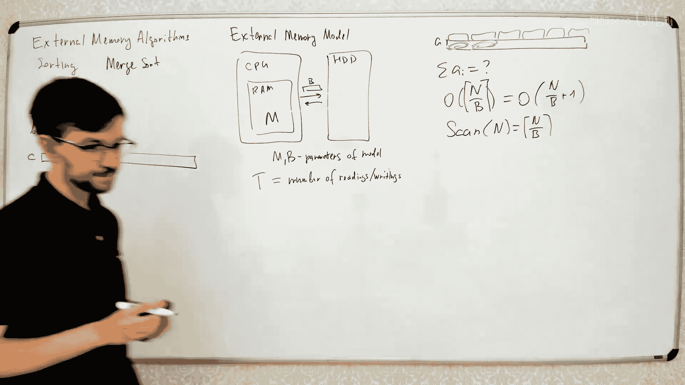

我们之前学过的**归并排序**非常适合这个模型，因为它主要涉及数据的顺序访问。

### 两路归并

首先，回顾如何合并两个已排序的数组。我们使用两个指针，分别指向两个数组的当前元素，比较它们，将较小的元素放入输出数组，并移动相应的指针。

在外部存储模型中，我们这样做：
1.  为两个输入数组和输出数组各在内部内存中维护一个**块缓冲区**。
2.  从硬盘读取每个输入数组的第一个块到其缓冲区。
3.  比较两个缓冲区当前的最小元素，将较小的输出到输出缓冲区。
4.  当一个输入缓冲区被耗尽时，从硬盘读取该输入数组的下一个块。
5.  当输出缓冲区被填满时，将其作为一个块写入硬盘，并清空以接收更多数据。

合并两个总大小为 **N** 的数组，I/O复杂度为 **O(N/B)**。

### 多路归并与排序算法

标准的归并排序是递归地将数组分成两半，分别排序后再合并。在外部存储模型中，我们可以做得更好。

我们的内部内存可以容纳不止两个块。假设内存可以容纳约 **M/B** 个块。那么，我们可以一次性合并 **M/B** 个已排序的子数组，而不是仅仅两个。

这改变了递归树：
*   我们不是将问题分成2份，而是分成 **K ≈ M/B** 份。
*   递归深度从 **log₂ N** 减少到 **logₖ N**，其中 **K = M/B**。
*   在每一递归层，我们仍然需要线性扫描所有数据以进行合并，I/O复杂度为 **O(N/B)**。

因此，外部归并排序的总I/O复杂度为：
**O( (N/B) * log_{M/B} (N/B) )**

可以证明，对于基于比较的排序，这是外部存储模型下的**最优时间复杂度**。

## 数据结构：栈、队列与B树

我们也可以在外部存储模型中设计数据结构。

### 栈

实现一个外部存储栈：
1.  在内部内存中维护栈的**顶部一个或两个块**作为缓冲区。
2.  **压入**操作：将元素放入顶部缓冲区。如果缓冲区满，则将其作为块写入硬盘，并启用新的空缓冲区。
3.  **弹出**操作：从顶部缓冲区取出元素。如果缓冲区空，则从硬盘读入前一个块到缓冲区。

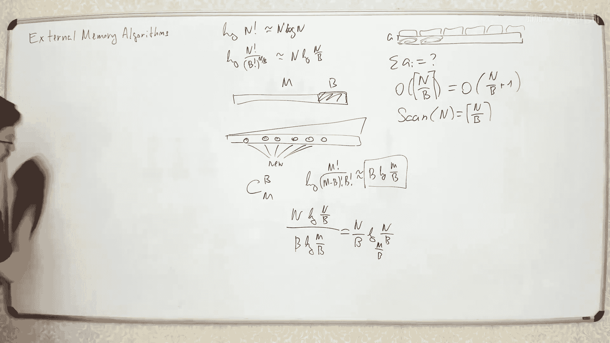

通过维护两个块的缓冲区，可以平摊开销，使得每个栈操作的**均摊I/O复杂度为 O(1/B)**。这意味着每B次操作平均只需要一次I/O。

### B树

对于需要随机访问的字典结构（如映射、集合），**B树**是外部存储的标准索引结构。

B树的特点：
*   每个节点包含多达 **B** 个键值，而不是像二叉搜索树那样只有一个。
*   一个包含 **k** 个键的节点有 **k+1** 个子节点指针。
*   树的高度大约是 **log_{B} N**。

搜索过程：从根节点开始，读取一个节点（一个块）到内存，在节点的键中找到合适的区间，然后进入相应的子节点。因此，一次搜索需要 **O(log_{B} N)** 次I/O操作。

虽然这比内存中的二叉搜索树慢，但对于必须支持任意随机访问的外部存储数据结构来说，这是高效的。像哈希表这样的结构在外部存储中也可能面临类似挑战，因为随机访问模式会导致大量I/O。

## 算法技巧：排序与连接

许多外部存储算法的一个常见模式是：**先排序，后处理**。

### 示例1：构建排列的逆

问题：给定一个排列 **P**（即一个包含1到N每个数字恰好一次的数组），存储在外部。想构建其逆排列 **R**，使得 `R[P[i]] = i`。

在RAM中，可以直接赋值：`for i: R[P[i]] = i`。但这在外部存储中是随机的写操作，效率低下。

外部存储解法：
1.  生成一个操作列表，每个操作是 `(目标索引, 值)`，即 `(P[i], i)`。
2.  将这个列表**按照目标索引排序**。
3.  现在，操作列表已按顺序（目标索引）排列。顺序地读取每个操作，并将值写入输出数组的相应位置。此时的写操作是连续的。

主要开销在于排序，因此I/O复杂度为 **O((N/B) log_{M/B} (N/B))**。

### 示例2：数组复合

问题：给定数组 **A** 和 **B**，构建数组 **C**，使得 `C[i] = B[A[i]]`。这类似于根据A中的值查找B。

我们可以将其视为两个表的**连接**操作：
1.  构建表1：`(i, A[i])`
2.  构建表2：`(j, B[j])`，其中j本身就是索引，所以实际上是 `(j, B[j])`，但j从1到N。
3.  我们需要根据表1的第二个字段（A[i]）和表2的第一个字段（j）进行连接。
4.  将两个表分别**按照连接键排序**：表1按 `A[i]` 排序，表2按 `j` 排序。
5.  使用类似归并排序的双指针方法扫描两个已排序的表，当键匹配时（`A[i] == j`），我们就知道 `C[i] = B[j]`。

同样，主要开销是排序。

## 总结

本节课中我们一起学习了**外部存储算法**的核心内容。

我们首先了解了传统RAM模型的局限性，以及当数据量超出内存时，必须考虑数据存储的物理特性（如硬盘的连续访问远快于随机访问）。由此，我们引入了**外部存储模型**，其核心是使用**块I/O**来传输数据，并关注I/O次数而非CPU计算次数。

接着，我们探讨了该模型下的基本操作：**扫描**（求和）和**排序**。外部归并排序通过利用内存进行**多路归并**，达到了近乎最优的I/O复杂度 **O((N/B) log_{M/B} (N/B))**。

然后，我们研究了如何设计外部存储**数据结构**，例如高效的**栈**和适用于索引的**B树**。

最后，我们学习了外部存储算法的一个关键策略：**“先排序，后处理”**。通过将随机访问模式转化为顺序访问模式（如构建排列逆和数组复合的例子），我们可以极大地提升处理海量数据的效率。

掌握这些思想，对于处理数据库、大数据系统以及任何需要高效利用存储层次结构（如CPU缓存 vs. 内存）的场合都至关重要。