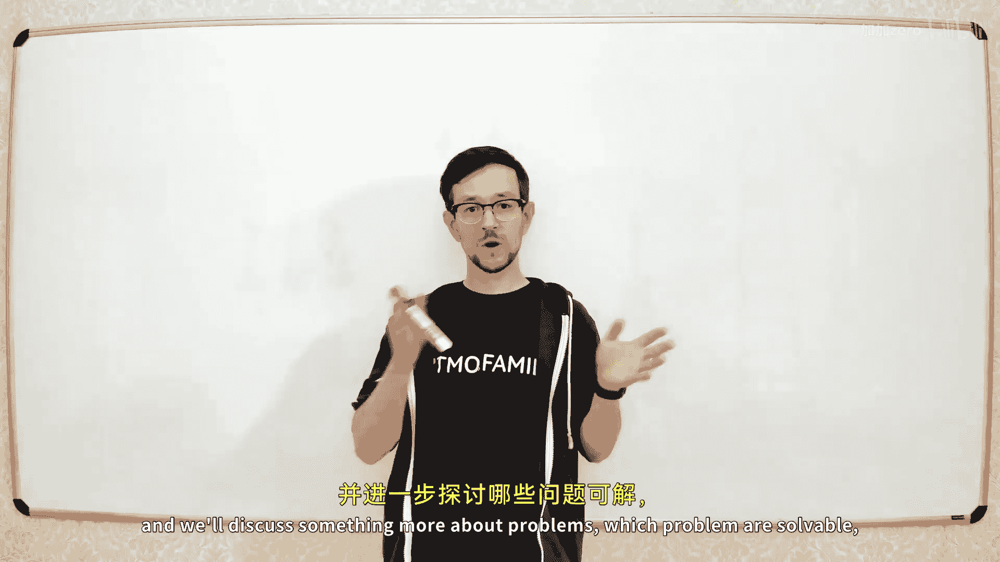
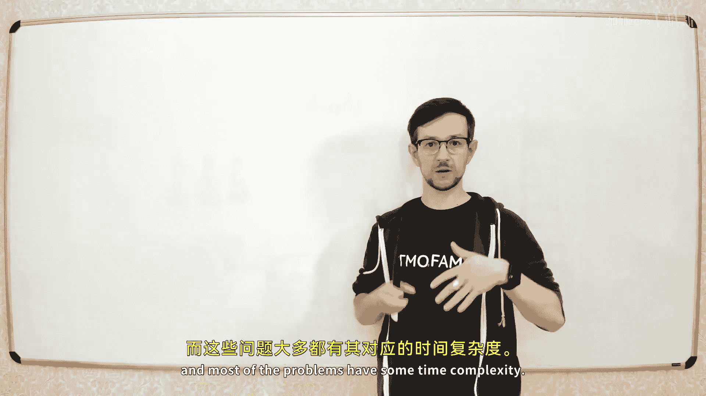
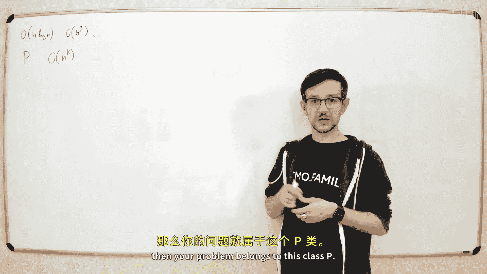
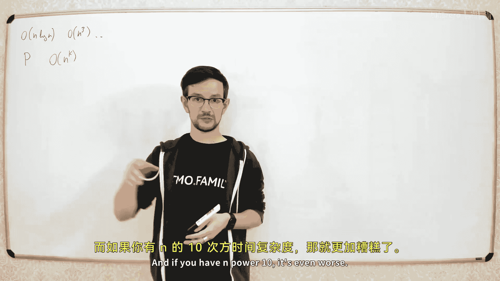
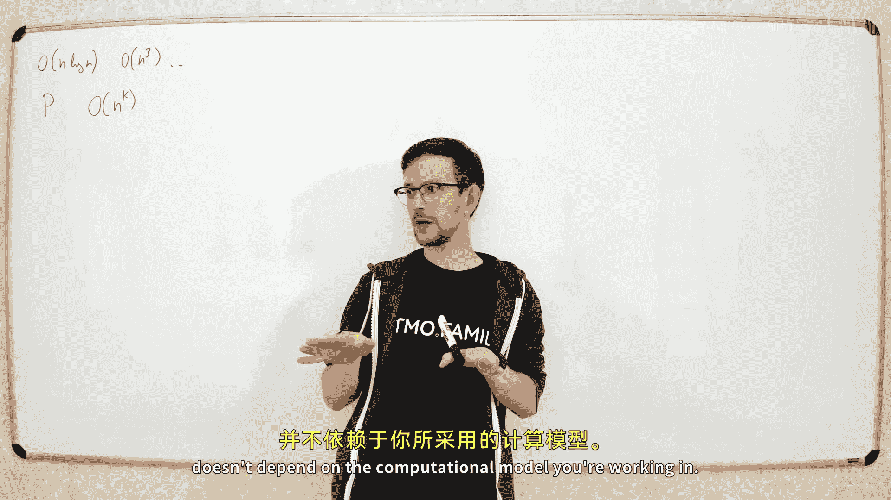
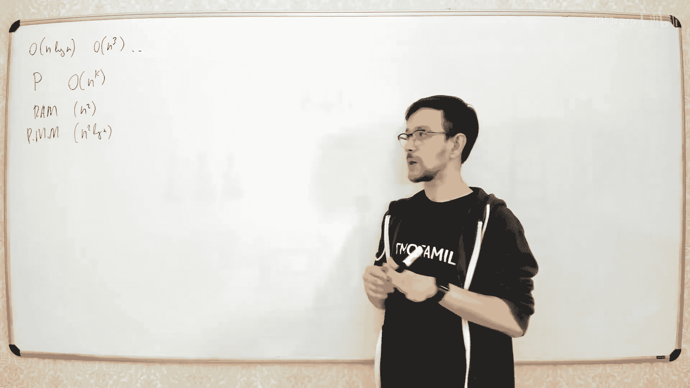
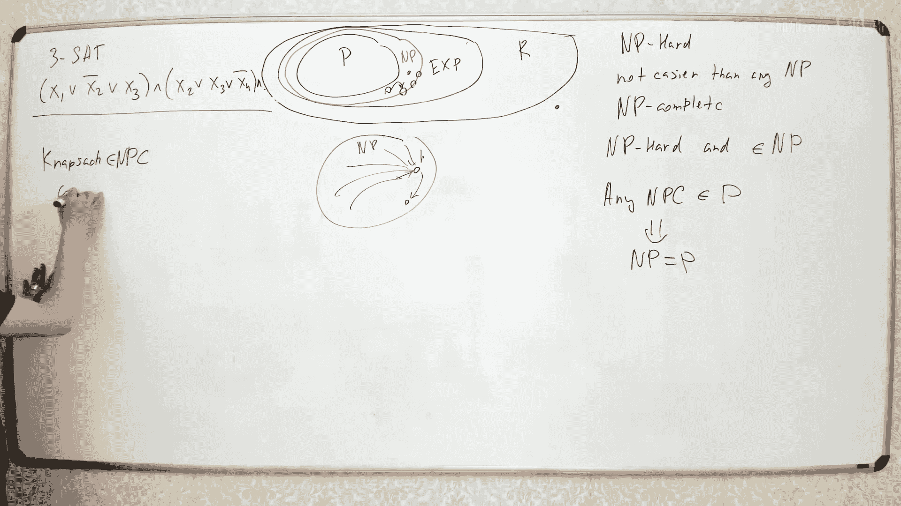

# 032：复杂度类

在本节课中，我们将学习复杂度理论的基础知识。我们将探讨哪些问题是可解的，哪些是不可解的，以及如何根据解决问题的计算难度对问题进行分类。课程将涵盖P类、NP类、可判定性以及NP完全性等核心概念。

---

## 什么是复杂度类？

上一节我们介绍了算法的时间复杂度。本节中，我们来看看如何根据计算难度对问题进行分类。

我们讨论过的大多数问题都有特定的时间复杂度，例如 **O(n log n)** 或 **O(n³)**。在复杂度理论中，所有能在多项式时间内解决的问题被归入同一个复杂度类，称为 **P类**。

**P类** 是所有能在多项式时间内解决的问题的集合。如果一个问题的求解时间复杂度是 **nᵏ**（其中k是常数），那么该问题就属于P类。

我们之所以不区分不同的多项式时间复杂度（如n²和n¹⁰），是因为“能在多项式时间内解决”这一性质与所使用的计算模型无关。无论是在RAM模型还是图灵机模型中，只要一个问题在某个模型中存在多项式时间解法，它在其他标准计算模型中同样存在多项式时间解法。

---

## 图灵机模型

为了理论上的简洁性，我们通常使用一个非常简单的计算模型：**图灵机**。

图灵机包含以下部分：
*   一个无限长的纸带，被划分为格子。
*   一个读写头，每次只能访问纸带上的一个格子。
*   一个有限状态控制器（程序）。

程序是一个简单的自动机。在每个步骤中，它根据当前状态和读写头下的符号，决定：
1.  将当前格子写入一个新符号。
2.  将读写头向左或向右移动一格（或不动）。
3.  转移到下一个状态。

尽管图灵机模型非常简单，但它足以模拟任何现代计算机（RAM模型）的计算过程。在RAM模型中需要常数时间的操作（如数组索引），在图灵机中可能需要多项式时间（如O(n²)）来模拟，但这仍然属于多项式时间。因此，**P类** 的定义在图灵机模型下依然成立。

---

## 超出P类的问题

那么，是否存在不属于P类的问题？答案是肯定的。

考虑一个 **n × n** 的国际象棋棋盘，上面有若干棋子。问题是：给定一个棋局，判断执白方是否必胜。

可以证明，这个问题**无法**在多项式时间内解决。虽然棋盘状态是有限的（总状态数是有限的），我们可以通过穷举所有可能状态来求解，但这种方法所需的时间是**指数级**的，远超任何多项式时间。

这类可以在指数时间内解决的问题，属于 **EXP类**。指数时间意味着时间复杂度形如 **2^(nᵏ)** 或 **n!** 等。几乎所有实际可解但不属于P类的问题，都属于EXP类。

---

## 可判定性问题与不可解问题

接下来，我们探索比EXP类更难的问题：那些**不可解**的问题。

所有能被图灵机在有限步内解决的问题，构成 **R类**（递归可判定问题）。那么，是否存在不属于R类的问题？即，是否存在任何图灵机都无法解决的问题？

艾伦·图灵发现，这样的问题是存在的。最经典的例子是 **停机问题**。

**停机问题**描述如下：给定一个程序（描述）和它的输入，判断这个程序在给定输入上是否会**停止**（在有限步内结束运行），还是会**永远运行**下去。

我们可以用反证法证明停机问题是不可解的：
1.  假设存在一个算法 `HALT(P, X)`，它能判断程序 `P` 在输入 `X` 上是否会停机。
2.  现在我们构造一个新程序 `F(P)`：
    *   它调用 `HALT(P, P)`，即判断“程序P以自身代码作为输入时是否会停机”。
    *   如果 `HALT(P, P)` 返回“是”（会停机），那么 `F` 就进入无限循环（不停机）。
    *   如果 `HALT(P, P)` 返回“否”（不会停机），那么 `F` 就立刻停止。
3.  现在，考虑当 `F` 以自身代码 `F` 作为输入时会发生什么 (`F(F)`)：
    *   如果 `F(F)` 会停机，那么根据 `F` 的逻辑，`HALT(F, F)` 应返回“否”，这意味着 `F(F)` 不会停机，矛盾。
    *   如果 `F(F)` 不会停机，那么根据 `F` 的逻辑，`HALT(F, F)` 应返回“是”，这意味着 `F(F)` 会停机，同样矛盾。
4.  因此，我们的假设不成立，这样的 `HALT` 算法不存在。**停机问题是不可解的**。

这个结论意义深远。它意味着，**分析程序的非平凡属性（如是否会出错、是否有某个功能）本质上是不可解的问题**。我们日常使用的代码分析工具（如IDE的静态检查）只能基于启发式方法发现常见模式中的错误，而无法对任意复杂程序做出完全正确的判定。

---

## 图灵完备系统

不可解性不仅限于程序分析。许多看似简单的系统，只要它们足够复杂（被称为**图灵完备**），其行为分析就同样是不可解的。

**图灵完备** 意味着该系统可以模拟一台通用图灵机的计算。如果一个系统是图灵完备的，那么关于该系统行为的许多判定问题（例如“给定初始状态，系统最终会稳定吗？”）就都是不可解的，因为你可以将停机问题归约到该系统的判定问题上。

以下是几个图灵完备系统的例子：
1.  **康威的生命游戏**：一个基于简单规则的二维细胞自动机。可以证明它能模拟图灵机。
2.  **王浩铺砖问题**：给定一组带有颜色的瓦片，判断能否用它们铺满整个平面而不违反颜色匹配规则。这个问题是不可解的。
3.  **某些一维细胞自动机**：例如规则110（Rule 110），它只有极其简单的几条规则，但被证明是图灵完备的。

这些例子表明，**当一个系统拥有无限内存并展现出复杂行为时，它往往就是图灵完备的，从而导致关于其行为的判定问题不可解**。

---

## NP类与NP完全问题

现在，让我们回到可解问题的范畴，看看P类和EXP类之间的区域。这里存在一个非常重要的复杂度类：**NP类**。

**NP类** 不是“非多项式时间”，而是“非确定性多项式时间”。一个问题属于NP类，如果它的解可以在**多项式时间内被验证**。更形式化地说，存在一个非确定性图灵机，它可以在多项式时间内“猜”出一个解（证书），并验证其正确性。

**NP类** 的一个等价定义是：如果存在一个多项式时间算法 `V(x, c)`，使得对于问题实例 `x`，当且仅当存在一个证书 `c` 满足 `V(x, c)` 返回真时，`x` 的答案为“是”。

显然，**P ⊆ NP**。因为如果一个问题能在多项式时间内解决，我们自然能在多项式时间内验证其解（直接解决它并比较结果即可）。

NP类中最困难的问题被称为 **NP完全问题**。一个问题Q是NP完全的，需要满足两个条件：
1.  **Q ∈ NP**。
2.  **NP中的任何问题都可以在多项式时间内归约到Q**。这意味着，如果你能在多项式时间内解决Q，那么你就能在多项式时间内解决NP类中的**所有**问题。

“归约”是指：假设我们知道如何解决问题A。要解决问题B，我们可以将B的实例通过一个多项式时间变换，转换成A的实例，然后用解A的方法来得到B的答案。

**NP难问题** 则只需满足上述第二个条件（任何NP问题可归约到它），但不一定属于NP类。NP完全问题是NP难问题中属于NP的那一部分。

---

## 证明NP完全性：以背包问题为例

如何证明一个新问题是NP完全的？标准方法是：
1.  证明该问题属于NP类（即它的解能在多项式时间内被验证）。
2.  选择一个已知的NP完全问题（如**三元布尔可满足性问题，3-SAT**）。
3.  将已知的NP完全问题**多项式归约**到你的新问题。

让我们以**子集和问题**（背包问题的一个简化版本）为例进行证明。

**子集和问题**：给定一个整数集合 `{w₁, w₂, ..., wₙ}` 和一个目标整数 `S`，判断是否存在一个子集，其元素之和恰好等于 `S`。

**证明步骤**：
1.  **子集和问题 ∈ NP**：给定一个候选子集（证书），我们可以在多项式时间内求和并检查是否等于S。
2.  **从3-SAT归约**：给定一个3-SAT公式，我们构造一个子集和问题的实例。
    *   对于公式中的每个布尔变量 `xᵢ`，我们创建两个“物品”，分别代表 `xᵢ = true` 和 `xᵢ = false`。
    *   每个“物品”用一个多位数表示。每一位对应一个子句。
    *   如果该变量（或其否定形式）出现在某个子句中，则对应数位为1，否则为0。
    *   此外，我们添加额外的“控制位”来确保对于每个变量，最终解中只能选择两个物品中的一个（`true`或`false`）。
    *   最后，我们添加一些辅助物品，使得每个子句对应的数位之和必须达到特定值（例如3），以确保每个子句中至少有一个文字为真。
    *   目标总和 `S` 就是由这些特定值（每个子句位为3，每个控制位为1）构成的多位数。
3.  **归约正确性**：可以证明，原3-SAT公式是可满足的，当且仅当构造出的子集和问题实例有解。因为满足赋值会对应一个物品子集，其和恰好为S；反之，一个和为S的物品子集也对应了一个变量的赋值，该赋值满足所有子句。
4.  **归约是多项式时间的**：构造过程仅涉及简单的计数和赋值，可以在多项式时间内完成。

由于3-SAT是NP完全的，并且我们成功地将它多项式归约到了子集和问题，因此**子集和问题也是NP完全的**。

第一个被证明是NP完全的问题是**电路可满足性问题**。而证明一个问题是NP完全的“起点”，通常是证明**非确定性图灵机的有界接受问题**是NP完全的。这个问题是“通用的”，因为它直接模拟了NP问题的定义：给定一个非确定性图灵机、一个输入和一个步数界限，判断机器是否能在该步数内接受输入。从这个通用问题出发，可以归约到3-SAT，再归约到其他问题，从而建立起NP完全问题的庞大类别。

---

## P vs NP 问题

NP完全问题的核心重要性引出了理论计算机科学中最重要的开放问题：**P 是否等于 NP？**

*   如果 **P = NP**，意味着所有能在多项式时间内验证解的问题，也都能在多项式时间内找到解。这将彻底改变密码学、优化和人工智能等领域。
*   如果 **P ≠ NP**（这是学界普遍相信的情况），则意味着NP完全问题本质上就比P类问题困难，不存在通用的多项式时间解法。

尽管经过数十年的研究，这个问题仍未解决。它可能本身就是一个在现有数学体系内不可判定的命题。

---

## 总结

本节课中我们一起学习了复杂度理论的核心概念：
1.  **P类**：多项式时间内可解的问题。
2.  **EXP类**：指数时间内可解的问题。
3.  **R类**：所有可判定（可解）的问题。
4.  **不可解问题**：如图灵机也无法解决的停机问题。
5.  **图灵完备系统**：许多复杂系统（如生命游戏）是图灵完备的，导致其行为分析不可解。
6.  **NP类**：解能在多项式时间内被验证的问题。
7.  **NP完全与NP难问题**：NP类中最难的问题；证明NP完全性的方法是多项式时间归约。
8.  **P vs NP 问题**：关于计算本质的核心未解之谜。

理解这些概念有助于我们认识到实际工程问题的内在计算难度，从而合理选择近似算法、启发式方法或调整问题定义来寻找可行的解决方案。