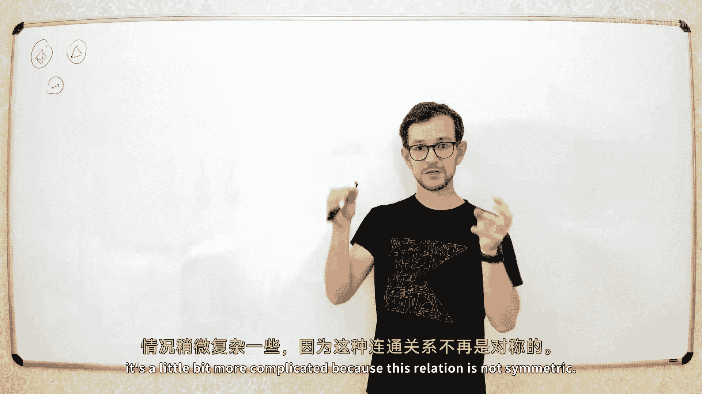
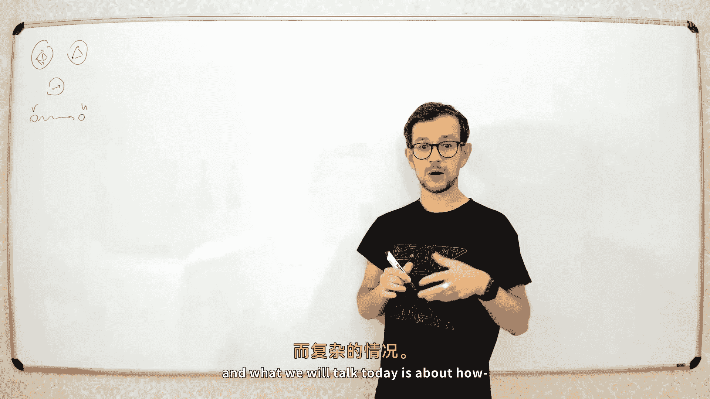
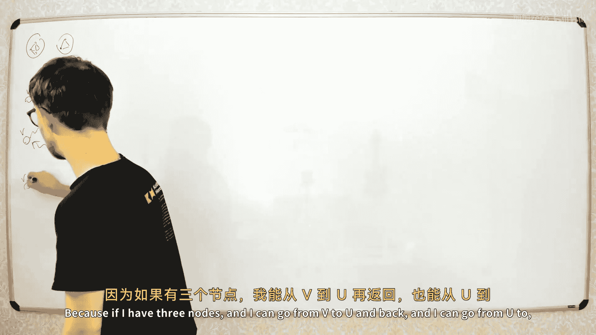
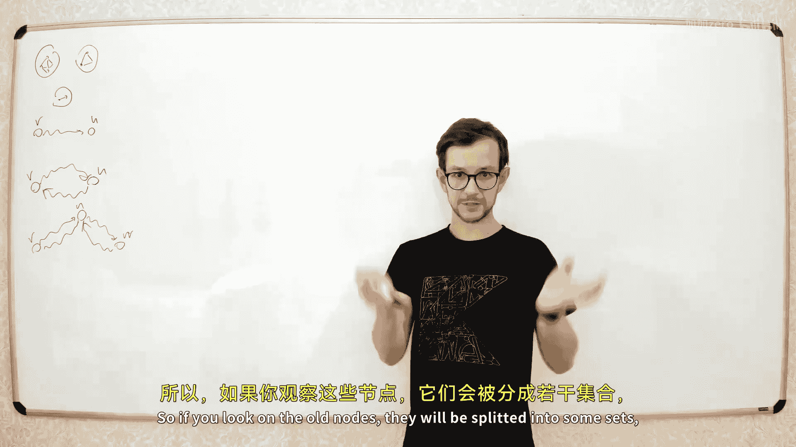
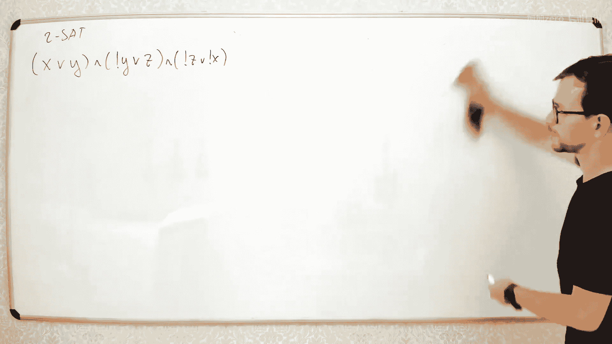
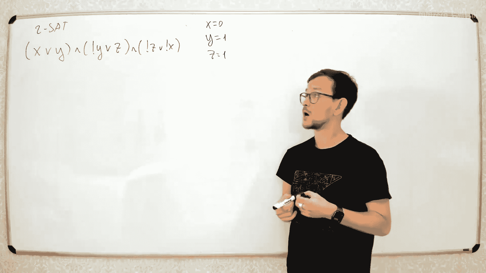
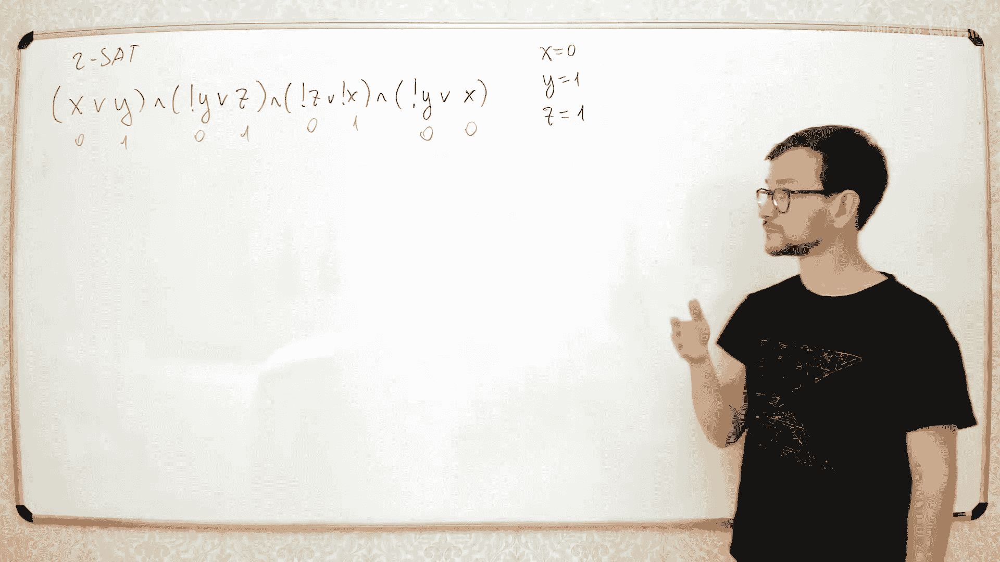

# 034：强连通分量与2-SAT问题

在本节课中，我们将继续讨论图论。我们将继续探讨深度优先搜索算法，并讨论该算法的另一个应用，这个应用比上一讲的内容更有趣。

今天我们要讨论的是有向图中的连通性。如果你还记得上一讲，我们讨论了无向图中的连通性。在无向图中，连通性非常简单：你有一些连通分量，如果两个顶点属于同一个连通分量，那么它们就是连通的。如果你从两个不同的连通分量中取顶点，它们就不连通。

然而，在有向图中，情况稍微复杂一些，因为这种关系不是对称的。你可能有一个节点 V 和一个节点 U，U 可以从 V 到达，但 V 不一定能从 U 到达。所以它不是对称的。

今天我们要讨论的是，如果你从宏观角度看有向图中的连通性是如何运作的。

## 强连通分量

让我们定义以下关系：我们说两个节点是**强连通**的，如果存在从 V 到 U 的路径，也存在从 U 到 V 的路径。

这个关系实际上是对称的，并且也是传递的。因此，它会形成一些等价类。所有节点将被分割成一些集合，在每个集合中，所有节点都彼此强连通。这些分量被称为**强连通分量**。

例如，考虑一个图。在这个图中，我们有一些节点集合，使得在每个集合中，所有节点都彼此强连通。例如，从这四个节点中的任何一个到其他节点都有路径。所以这四个节点构成一个强连通分量。很容易看出，所有其他节点与这些节点没有连接。所以这四个节点属于同一个强连通分量，而其他节点属于一些不同的强连通分量。

在这个图的另一部分，你有另外两个节点，它们之间可以双向到达，所以这两个节点是另一个强连通分量。你还有一个单独的节点，这个单独的节点是一个只有一个节点的强连通分量，这是可能的。

所以这个图被分割成三个强连通分量。

## 图的凝聚

你可以枚举这些强连通分量。例如，将它们标记为 A、B、C。现在，你可以构建另一个图，它由这些强连通分量组成。对于每个强连通分量，我们构建一个顶点。然后，如果这些连通分量之间有边，我们就构建边。

例如，如果有一条从属于分量 A 的节点 3 到属于分量 B 的节点 1 的边，那么我们在凝聚图中添加一条从 A 到 B 的边。

这个图被称为原图的**凝聚**。

关于这个图有趣的一点是，在任何图的凝聚中，它总是一个**有向无环图**。为什么？因为如果你在凝聚图中有一个环，那么这个环中的所有节点实际上应该属于同一个强连通分量。但在凝聚图中，每个强连通分量被压缩成一个节点，所以凝聚图中不能有任何环。

有向无环图对于许多算法来说更容易处理，因为你可以对其进行拓扑排序，然后运行一些算法。因此，在许多算法中，第一步就是找出图的强连通分量，构建凝聚图，然后在这个凝聚图上运行为有向无环图设计的特定算法。

## 寻找强连通分量的算法

现在我们需要构建一个算法，来找出图的所有强连通分量。找到所有强连通分量后，就很容易构建凝聚图。你只需要知道每个节点属于哪个分量，然后遍历所有边，如果边的两个节点属于不同的分量，就在凝聚图中添加一条边。

首先，让我们构建一个简单的算法。如果你不关心时间，只想找到所有强连通分量，你可以使用深度优先搜索。例如，取节点 1，运行深度优先搜索，找到所有从节点 1 可达的节点。然后，在反向边上运行另一个深度优先搜索，找到所有可以到达节点 1 的节点。然后，取这两个集合的交集。这个交集就是与节点 1 属于同一个强连通分量的节点。

然后，你取下一个尚未标记的节点，重复这个过程。

然而，这个算法的时间复杂度可能很高。在最坏情况下，你可能需要为每个节点运行两次深度优先搜索，导致时间复杂度为 O(N * M)，这对于大图来说太高了。

幸运的是，有更快的算法。主要有两种算法：Tarjan 算法和 Kosaraju 算法。今天我们将讨论 Kosaraju 算法。这是一个非常简单的算法，代码简洁，时间复杂度是线性的。

## Kosaraju 算法

以下是 Kosaraju 算法的步骤：

1.  对原图运行第一次深度优先搜索，并按退出顺序将节点加入列表。这与我们在构建拓扑排序时所做的类似。
2.  将得到的节点列表反转。
3.  在**反向图**上运行第二次深度优先搜索，但按照第一步得到的列表顺序（从最左边的节点开始）访问节点。
4.  第二次深度优先搜索每次启动所访问到的所有节点，就构成一个强连通分量。

让我们通过一个例子来说明。假设我们有一个图。首先，我们运行第一次深度优先搜索，并按退出顺序记录节点。然后反转这个列表。

现在，我们按照这个列表的顺序，在反向图上运行第二次深度优先搜索。我们从列表中最左边的节点开始。这次深度优先搜索将标记出该节点所属的整个强连通分量。然后，我们取下一个尚未标记的节点，再次在反向图上运行深度优先搜索。这次搜索将标记出另一个强连通分量。重复此过程，直到所有节点都被标记。

这个算法的时间复杂度是线性的，即 O(N + M)。

## 算法正确性证明

算法的证明基于对深度优先搜索顺序的一些观察。

**观察 1**：对于任何强连通分量，考虑在第一次深度优先搜索中**最先进入**该分量的节点 V。当退出节点 V 的递归时，该强连通分量中的所有节点都已被标记。因为从 V 可以到达分量中的所有节点。

**观察 2**：考虑两个不同的强连通分量 A 和 B，且存在从 A 到 B 的边。设 V 是分量 A 中第一个被访问的节点，U 是分量 B 中第一个被访问的节点。那么，在第一次深度优先搜索得到的顺序列表中，V 一定在 U 的左边。

基于这些观察，我们可以证明算法的正确性。在第二次深度优先搜索中，我们从列表最左边的节点开始。这个节点是其所在强连通分量中第一个被访问的节点，并且该分量在凝聚图中没有入边（否则会有一个节点在它左边）。因此，从该节点开始在反向图上进行深度优先搜索，只会访问该分量内部的节点，而不会跑到其他分量去。这就找到了一个完整的强连通分量。移除这些节点后，下一个最左边的未访问节点也具有类似的性质，以此类推。

## 2-SAT 问题

强连通分量的一个经典应用是解决 **2-SAT** 问题。

2-SAT 问题来自布尔逻辑。问题描述如下：你有 n 个布尔变量，和一个由多个子句组成的布尔公式。每个子句恰好有两个文字，每个文字是一个变量或其否定形式。例如：(X ∨ Y) ∧ (¬Y ∨ Z) ∧ (¬Z ∨ ¬X)。

问题是：是否存在对变量的赋值（真或假），使得整个公式为真？

有趣的是，许多问题都可以规约到 2-SAT 问题。另外，如果允许每个子句有三个文字（3-SAT），那么问题是 NP 完全的。但对于每个子句只有两个文字的 2-SAT，存在多项式时间算法，甚至是线性时间算法。

## 2-SAT 的图论建模

我们可以将 2-SAT 问题转化为图论问题。为每个变量创建两个节点：一个代表 `x`（真），一个代表 `¬x`（假）。

对于每个子句 `(a ∨ b)`，可以推导出两个逻辑蕴含关系：如果 `¬a` 为真，则 `b` 必须为真；如果 `¬b` 为真，则 `a` 必须为真。我们在图中添加两条有向边：`¬a -> b` 和 `¬b -> a`。

例如，子句 `(X ∨ Y)` 会添加边 `¬X -> Y` 和 `¬Y -> X`。

## 可满足性判定

在这个图中，如果某个变量 `x` 和它的否定 `¬x` 属于同一个**强连通分量**，那么公式是不可满足的。因为这意味着 `x` 为真会推出 `x` 为假，反之亦然，产生矛盾。

因此，算法步骤如下：
1.  根据 2-SAT 公式构建蕴含图。
2.  使用 Kosaraju 算法（或 Tarjan 算法）找出图的所有强连通分量。
3.  检查每个变量 `x` 和 `¬x` 是否在同一个强连通分量中。如果是，则公式**不可满足**。
4.  否则，公式**可满足**，并且我们可以构造出一个解。

## 构造解

如果公式可满足，我们需要构造出一个具体的赋值。

1.  构建原图的凝聚图（有向无环图）。
2.  对凝聚图进行拓扑排序。实际上，Kosaraju 算法输出的强连通分量顺序已经是逆拓扑序。
3.  按照拓扑顺序处理分量。对于每个分量（代表一组赋值），如果它尚未被赋值，则将其赋值为 **假**，并将其对称分量（所有文字取反的分量）赋值为 **真**。

可以证明，这样得到的赋值满足所有子句。

整个算法的时间复杂度是线性的 O(N + M)，其中 N 是变量数（节点数的两倍），M 是子句数（边数的两倍）。

## 总结

本节课我们一起学习了：
1.  **强连通分量**在有向图中的定义及其性质。
2.  使用 **Kosaraju 算法**在线性时间内寻找有向图的所有强连通分量。该算法包括两次深度优先搜索：第一次在原图上得到特定的节点顺序，第二次在反向图上按此顺序搜索以找出分量。
3.  强连通分量的一个重要应用：解决 **2-SAT 问题**。
4.  将 2-SAT 公式转化为蕴含图，并通过判断变量及其否定是否在同一个强连通分量中来判定公式的可满足性。
5.  在公式可满足时，通过对凝聚图进行拓扑排序，为分量赋值以构造出一个解。

理解强连通分量及其高效算法，是处理复杂有向图问题的基础，而 2-SAT 模型则展示了图论在逻辑和约束求解中的强大应用。